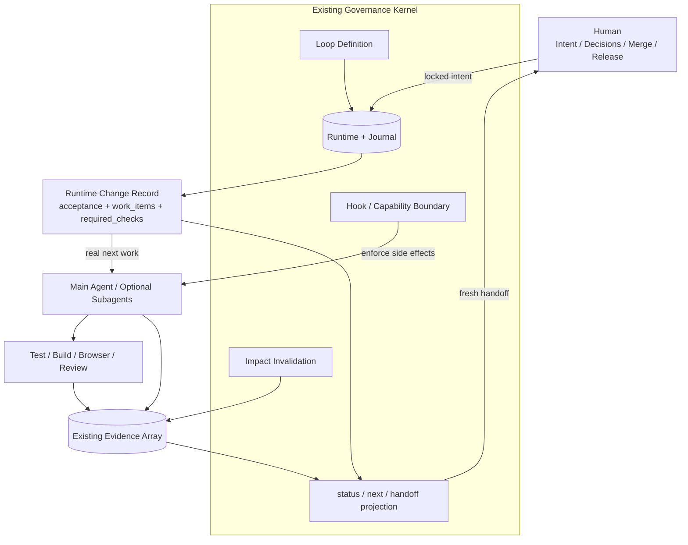
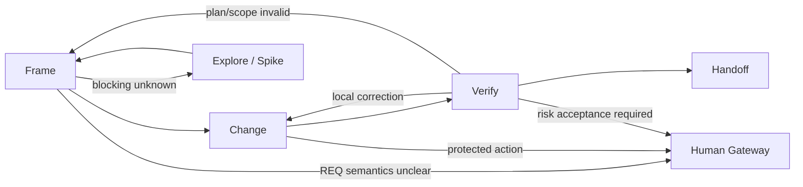

# 项目开发 Workflow 最终设计

> 状态：final analysis / recommended architecture candidate
> 版本：v1.0.0
> 日期：2026-07-18
> 权威说明：这是 `analysis/` 中工作流研究的唯一最终推荐版本。它仍不是 locked
> REQ，不替代当前 `docs/loop-definition.json`，不授权直接实施。
> 来源分析：`superpowers-workflow-improvement-layered-reqs.md`、
> `gate-design-friction-review.md`、`optimized-agentic-workflow-architecture.md`、
> `practical-project-workflow-architecture.md`。

## 1. 最终结论

本项目需要的不是一套更宏大的 Agent Workflow Platform，而是一条能每天用于真实
项目开发的薄主干：

```text
Frame：理解目标、影响和检查
→ Change：在边界内完成改动
→ Verify：运行风险真正需要的检查
→ Handoff：用新鲜证据交还人类
```

Harness 只负责三件事：

1. 保护人类意图、写入范围和不可逆动作；
2. 保存可恢复的当前事实；
3. 阻止没有当前 Evidence 的完成声明。

它不负责规定 Agent 必须创建几份文档、几个角色、几个状态或按什么组织顺序思考。

最终架构只增加一个小型 Runtime Change Record，并复用当前已有的 CAS、Journal、
REQ binding、tasks、bugs、evidence、impact analysis、Hooks 和 `status/next`。

不建设 AI Router、图数据库、Workflow DSL、Claim/Proof 微服务、Agent Broker、
新控制台或新的完整状态机。

## 2. 对全部分析的最终取舍

### 2.1 保留的结论

| 来源 | 最终保留 |
|:---|:---|
| Superpowers 对照 | Evidence before claims、系统化调试、task-scoped review、行为 Eval、判断工作不机械降级 |
| 本项目现状 | locked REQ、人类发布边界、Runtime CAS、Journal、fingerprint、impact invalidation、权威分层 |
| 门禁审查 | Gate 验证属性而非仪式；风险决定检查；同一事实只证明一次 |
| 概念架构 | 新证据可以推翻计划；验证围绕 Acceptance/Risk；生成型 status/ACC/handoff |
| 务实审查 | Frame→Change→Verify→Handoff；Change Record；确定性触发矩阵；最低复杂度优先 |

### 2.2 被否决的设计

以下内容不进入近期或默认目标架构：

- 为所有任务建设 Dynamic Work Graph Engine；
- 独立 Claim Registry 和 Proof Obligation Service；
- 图数据库式 Evidence Graph；
- AI 自动 Risk Router；
- 独立 Assignment Broker；
- 新的五状态 Runtime 替换当前状态机；
- universal Discovery Ledger；
- universal Convergence stage；
- 每责任一个 Agent；
- Delivery → QA → E2E 固定串行；
- 每个 Finding 都进入完整 Canonical BUG；
- 每次修复都重启完整 full review；
- 所有改动都创建 Architecture、FE、BE、SYNC、TASK、ACC 和 Release Audit。

这些设计有一定理论价值，但当前没有证据证明收益覆盖建设、迁移、维护和 Agent
认知成本。

### 2.3 后置而非承诺的能力

只有真实数据证明简单结构不足时，才重新评估：

- 复杂 task dependency graph；
- 自动风险模型；
- 跨项目 Discovery Memory；
- 独立 Evidence query store；
- 全量 Gate telemetry 平台；
- Graph-native Runtime；
- 自动 Agent capability broker。

“后置”不等于 roadmap 承诺。

## 3. 最终架构



没有新增服务。Change Record 是 Runtime 内的一个对象；Projection 是 Harness 内的
确定性函数；检查触发矩阵是普通代码和测试。

## 4. 权威边界

| 关注点 | 唯一权威 | 最终规则 |
|:---|:---|:---|
| 用户意图 | human-locked REQ | 自动化不能修改；低风险维护使用精简 REQ 内容，不新增 intent 类型 |
| 合法状态变化 | Loop Definition | 当前继续使用；先修漂移，不立即重写 |
| 当前事实 | Runtime snapshot + Journal | transition engine 单写、CAS |
| 当前改动计划 | Runtime Change Record | 不再要求另写一份重复 Change Markdown |
| 方法 | Skills | advisory，不声明状态完成 |
| Agent 最大能力 | Agent Definition | 不包含每次任务事实 |
| 每次写入范围 | task/assignment activation | read-only 与 write 授权分开 |
| 完成证明 | Evidence array | 当前 snapshot、scope 和 check 必须匹配 |
| merge/release | human decision | 自动化 strong block |

Chat、生成报告和 Agent 自报都不是权威状态。

## 5. 操作工作流



这四步是 `status/next` 的操作视图，不是新 Runtime FSM。近期继续保留 S0–S11；
Harness 根据当前 state、open work 和 checks 投影 `frame/change/verify/handoff`。

只有监测数据证明当前状态机本身持续造成显著维护或恢复成本，才单独评估简化状态机。

### 5.1 Frame

目标：让 Agent 可以开始真实工作，而不是完成一套规划仪式。

必须得到：

- bound REQ 和具体 Acceptance 引用；
- change class 和 risk level；
- 预计 scope；
- 当前阻塞 unknown；
- 少量 work items；
- required checks。

若这些信息从用户请求和仓库现状已经明确，不创建额外设计文档。

### 5.2 Change

目标：在授权 scope 内实现最小完整改动。

- 默认由 Main Agent 完成；
- Agent 可以在 Acceptance 内调整内部实现、合并 work item 或删除无价值步骤；
- Plan 被新 Evidence 推翻时回到 Frame；
- 只有跨 Agent 稳定接口、高风险架构或真实未知项需要额外合同/Spike；
- 写入、安装、生成、迁移和保护动作按实际副作用强度授权。

### 5.3 Verify

目标：证明 Acceptance，而不是证明团队和报告都存在。

- 执行 `required_checks[]`；
- 同 snapshot、无依赖的只读检查并行；
- 已有当前有效测试 Evidence 不机械重跑；
- reviewer 有具体疑问时运行 focused check；
- Finding 只失效受影响检查；
- 高风险责任保持独立。

### 5.4 Handoff

目标：让人看到真实变更、Evidence 和剩余风险。

Harness 确定生成：

- 改动摘要和 changed paths；
- Acceptance coverage；
- checks PASS/N/A/FAIL；
- Evidence 指纹和 snapshot；
- open risks/findings；
- workspace branch/base/integration target；
- 需要人执行的动作。

不再要求 Agent 手工抄写 ACC、completion summary 和 Gateway Package 的重复字段。

## 6. 只有三个硬边界

### 6.1 Intent / Side-effect Boundary

以下行为必须 hard block：

- 修改 bound locked REQ；
- 未授权写入或 scope 外写入；
- Runtime integrity 不成立时执行状态性副作用；
- 未授权修改 Hook/Definition 等保护策略；
- 未批准的 destructive、migration 或 privileged action；
- protected branch、production、merge、deploy、formal release。

只读搜索、读取和 review 不需要 write activation。真正 hard invariant 必须返回 deny，
不能只 warn 后允许原操作继续。

### 6.2 Completion Evidence Boundary

系统不能进入 handoff-ready，除非：

- 所有 Acceptance 引用都有 passed Evidence；
- 所有 required checks 为 passed 或 evidence-backed N/A；
- Evidence 绑定当前 snapshot、baseline 和 scope；
- 没有 blocking Finding；
- 高风险 change 的独立 review、rollback 等检查已完成。

### 6.3 Human Action Boundary

merge、protected push、production data、deploy 和 formal release 只能由人执行或显式
授权。自动化进入 handoff 后停止。

Frame 完整性、文档存在、Agent 数量、reviewer 顺序等不成为新的通用 hard Gate。

## 7. 最小 Change Record

```yaml
change:
  id: CHG-001
  req_ref: REQ-001
  req_sha256: ...
  summary: fix timeout mapping
  class: bugfix
  risk: medium
  scope:
    include: [internal/client/**]
    exclude: [docs/requirements/**]
  acceptance:
    - ref: REQ-001#AC-2
  unknowns: []
  work_items:
    - id: W-1
      text: reproduce and correct timeout mapping
      status: open
      depends_on: []
      owner: main
      write_paths: [internal/client/**]
  required_checks:
    - id: CK-1
      kind: regression_test
      reason: bugfix
      command: go test ./internal/client/...
      independence: self
      acceptance_refs: [REQ-001#AC-2]
      scope_refs: [internal/client/**]
  findings: []
  workspace:
    branch: ...
    base_sha: ...
    integration_target: ...
```

约束：

- Change Record 存 Runtime，不要求手工同步 Markdown；
- Acceptance 只引用 REQ，不复制正文；
- Acceptance PASS/FAIL 由关联 checks 的 Evidence 计算，不手工写状态；
- work items 是简单列表，只有需要时使用 `depends_on`；
- checks 只声明验证合同，PASS/N/A/FAIL 从 Evidence 计算，不建设 Proof Engine；
- workspace 只记录本次实际需要的 lineage 字段，不建设 Workspace Service；
- 大体积命令输出放 Artifact 文件，Runtime 只保存 ID/hash/ref。

## 8. 确定性 Check 触发矩阵

第一版由纯函数根据 change class、risk tag 和 changed scope 增加 checks。Agent 可以
提出增加或 N/A，但删除默认 check 必须提供理由和 Evidence。

### 8.1 Change class

| Class | 默认 checks |
|:---|:---|
| docs-only | link/parser/build check |
| config | parse + affected startup/behavior check |
| behavior feature | acceptance + relevant unit/integration |
| bugfix | reproduce + regression + affected tests |
| refactor | characterization + affected regression |
| deletion | reference/dependency analysis + affected tests |
| performance | benchmark before/after |
| migration | rehearsal + validation + rollback |
| exploration | bounded observation；不能直接 handoff |

### 8.2 Risk trigger

| Trigger | 增加 checks / artifacts |
|:---|:---|
| UI 文案/样式，不改流程 | targeted screenshot/UI check |
| 新交互或用户流 | interaction design + browser flow |
| public API/schema | contract diff + compatibility/integration |
| cross-module boundary | interface note + integration |
| auth/permission/security | independent security review |
| database schema/data | migration rehearsal + rollback + data validation |
| concurrency/retry/queue | reliability/idempotency |
| performance path | benchmark |
| generated files | regeneration + drift |
| release-critical | applicable release audit topics + human boundary |

### 8.3 Risk level

- `low`：局部、可回滚、无公共边界和敏感数据；
- `medium`：普通行为、用户可见或跨一个边界；
- `high`：security、permission、migration、数据损失、跨模块、高回滚成本、
  release critical。

Risk 只增加 checks、独立性和授权强度，不直接决定 Agent 数量或固定 profile。

## 9. Artifact 触发规则

| Artifact | 必须创建的条件 |
|:---|:---|
| locked REQ | 每个 Loop；低风险维护使用精简内容，但仍作为人类 intent baseline |
| Change Record | 每个 Loop，Runtime 内保存 |
| Architecture / ADR | 稳定架构约束或重要取舍改变 |
| UI prototype/flow | 新交互、流程或信息架构 |
| FE/BE/SYNC contract | 公共接口或跨 Agent 稳定边界改变 |
| 多 TASK / DAG | 多 Agent、复杂依赖或独立回滚单元 |
| Team Manifest | 多 Agent 并行或 must-separate 关系 |
| Canonical BUG | systemic、复发、逃逸、高风险或发布阻断缺陷 |
| ACC/handoff | Harness projection，不手写重复内容 |
| Release Audit | release-bound 且命中实际风险 topic |

每份人工 Artifact 必须有明确下游消费者。仅用于证明“流程做过”的 Artifact 不创建。

## 10. Agent 与 Review

### 10.1 默认 Main Agent

新 Agent 只在以下情况使用：

- 工作项可独立并行；
- 必须避免自我验证；
- security/migration 等需要专业独立判断；
- 上下文规模已经影响正确性；
- 隔离 Spike 可以避免污染正式实现。

责任名称不同、文件数量超过经验阈值或“流程规定需要 Team”都不是充分理由。

### 10.2 授权

| 工作 | 授权方式 |
|:---|:---|
| read/search/review | read-only assignment，无 write activation |
| 普通源码/测试写入 | scoped write activation |
| install/generator/migration/policy | elevated local approval |
| locked REQ/protected branch/production/release | human only |

scope 仍由 Agent Definition maximum、Change Record、work item 和 activation 交集决定，
但只保留一个权威 scope 记录，其他消息引用其 ID/hash。

### 10.3 Review

| Risk | 默认 review |
|:---|:---|
| low docs/config | machine checks；不强制 Subagent |
| low local code | focused tests；是否独立 review 由行为影响决定 |
| medium | 一个独立 reviewer，可同时给 behavior/quality/test verdict |
| high | 对应领域独立 reviewer；security/migration/release 与 Builder 分离 |

reviewer 首先判断 Acceptance/Plan 是否仍有效，再判断实现是否合规。符合错误 Plan
不是 PASS。

## 11. Evidence 与 Ready 判定

扩展当前 Evidence item，而不是引入新存储：

```yaml
id: EV-001
check_id: CK-1
kind: command_result | observation | review_verdict | human_decision
snapshot: ...
scope_refs: []
producer: harness | agent | human
result: pass | fail | finding | n_a
status: valid | invalid | superseded
created_at: ...
raw_output_ref: ...
```

Harness 的 Ready evaluator 只做：

```text
for each acceptance:
  require valid supporting check/evidence

for each required check:
  require pass or justified N/A

require no blocking finding
require snapshot and scope freshness
```

这是一段纯函数，不是新的 Proof Service。

## 12. Finding 与修复

| Finding 类别 | 条件 | 路径 |
|:---|:---|:---|
| local | 当前 work item 内、原因明确、合同不变、有直接 regression | reopen item → fix → affected checks |
| systemic | 跨范围、复发、原因不明或已逃逸 | RCA → Canonical BUG → scoped repair/review |
| high-risk | security/data/migration/release blocker | BUG + independent review + targeted proof |
| plan invalid | 新 Evidence 推翻设计/合同 | 回 Frame，更新影响和 checks |
| intent conflict | 需要改变 locked REQ 语义 | Human Gateway |

所有缺陷都需要因果说明和回归 Evidence，但不都需要完整 BUG lifecycle。

选择性失效：

1. scope overlap 的 Evidence invalid；
2. 公共接口和依赖关联 checks reopen；
3. 无关联且 snapshot-compatible 的 Evidence 保留；
4. 影响未知时保守扩大到 affected module；
5. 只有 baseline、跨切面架构、高风险升级或 release policy 触发 full review。

## 13. `status` / `next` / handoff

### status

```yaml
activity: change
stage_compat: S6
change: CHG-001
risk: medium
acceptance: 1/2 passed
work_items: {active: 1, open: 1}
checks: {passed: 0, open: 3}
blocking_findings: 0
human_required: false
```

### next

```yaml
action: implement W-1 and run CK-1
why: W-1 is dependency-ready; CK-1 is the bugfix regression requirement
read: [REQ-001#AC-2, internal/client/**]
write_scope: [internal/client/**]
done_when:
  - W-1 done
  - CK-1 evidence recorded for current snapshot
human_required: false
```

`next` 优先返回真实工作，不返回“推进 transition”或“补流程报告”。Gate 失败时一次
返回完整 missing checks，不让 Agent 逐个来回碰门。

### handoff

从 Runtime 和 Evidence 确定生成，不再要求手写重复 ACC。

## 14. 新机制准入

默认不引入新机制。候选机制必须证明：

1. 解决已经发生或单次损失很高的真实问题；
2. 现有能力不能低成本解决；
3. 预期收益可测量；
4. 收益覆盖实施、迁移、维护、Agent 认知、误阻塞和删除成本；
5. 可以 experimental pilot，并可低成本撤回。

复杂度顺序：

```text
接受风险
→ 修改现有文案/Skill
→ 复用命令或增加确定性检查
→ 扩展 schema 字段
→ 增加模块内纯函数
→ 增加 entity/transition
→ 独立组件/服务/存储
```

上一层足够就停止。沉没成本不是保留低价值机制的理由。

## 15. 最终准入的增量机制

| 机制 | 是否准入 | 复杂度 | 直接收益 |
|:---|:---:|:---:|:---|
| 修复 Manual/CLI/Skill/Guard/Hook 真值漂移 | 是，P0 | 低—中 | 没有它任何优化都不可信 |
| Runtime Change Record | 是，pilot | 中 | 为 `status/next` 和 checks 提供单一当前事实 |
| 确定性 check trigger matrix | 是，pilot | 低 | 替代固定 Team，风险路径可解释 |
| command Evidence 自动记录 | 是，pilot | 低—中 | 减少报告复制，提升 freshness |
| ready/handoff projection | 是，pilot | 低—中 | 删除 ACC/Gateway 重复劳动 |
| read-only assignment | 是，pilot | 低 | 直接减少 reviewer activation ceremony |
| selective check invalidation | 是，后续 pilot | 中 | 避免局部修复重跑全流程 |
| local/systemic Finding 分级 | 是，后续 pilot | 中 | 避免每个 Finding 都支付 BUG 全流程 |
| AI Router / Graph DB /新 FSM /独立服务 | 否 | 高 | 当前无成比例收益 Evidence |

## 16. 实施顺序

### Phase 0：Truth Contract

范围：

- Manual SHA drift；
- `status/next` schema 与真实输出；
- Planning Skill / Definition drift；
- Guard `hard/computed/advisory` 语义；
- Hook warn/block 与真实不变量对齐；
- conformance tests。

退出标准：文档、CLI、Skill、Definition 和执行语义一致。

### Phase 1：Change Record Overlay

- 不改变当前 S0–S11 路径；
- 扩展现有 Runtime/task/evidence schema；
- 对 docs-only、普通 bugfix、高风险 migration 三类任务旁路生成 Change Record；
- `status/next` 同时显示当前 stage 和真实 open work/checks。

退出标准：Change Record 没有要求额外手工同步文档，且 resume 不重复工作。

### Phase 2：删除重复产出

- command Evidence 由 Harness 记录；
- completion、ACC、handoff 改为 projection；
- 只读 reviewer 通过结构化结果提交，不为写报告获取 write scope。

退出标准：可从 Runtime 重建 handoff，删除生成文件不丢权威事实。

### Phase 3：低风险 Pilot

- docs/config/local bugfix 使用 change-triggered checks；
- non-UI 使用 impact result 证明 E2E N/A；
- compatible review 合并；
- 同 snapshot checks 并行。

退出标准：真实任务成本显著下降，planted-defect 检出率不低于 current baseline。

### Phase 4：Correction Pilot

- local Finding reopen work item；
- systemic/high-risk 才升级 BUG；
- scope-based invalidation 和 affected checks 重跑。

退出标准：局部修复不重跑无关 checks，且没有新增 escaped defects。

Phase 4 之后没有预设 Graph-native roadmap。是否继续抽象由运行数据重新决策。

## 17. 最终候选需求

这些是从全部分析收敛后的唯一候选集合，仍需分别起草和锁定：

### FWR-001 Governance Truth

文档、Definition、Runtime projection、Guard、Hook 和 Skill 必须表达同一真实语义。

### FWR-002 Single Change Record

每个活动 Loop 必须有一个 Runtime Change Record，承载 Acceptance 引用、scope、
work items、required checks 和 findings，不要求重复人工文档。

### FWR-003 Triggered Verification

checks 必须由 change class 和 risk facts 确定性触发；N/A 必须有依据，不能以空白
代替；risk 不能静默降低 Acceptance。

### FWR-004 Proportional Agent Use

Main Agent 默认执行；Subagent、独立 reviewer 和 write activation 只在并行、独立性、
专业风险或副作用边界需要时使用。

### FWR-005 Fresh Evidence Handoff

完成和 handoff 必须由当前 snapshot 的有效 Evidence 计算；重复报告必须生成而不是
手工维护。

### FWR-006 Proportional Correction

Finding 必须按 local/systemic/high-risk/plan-invalid/intent-conflict 路由，并只失效
受影响 checks；full review 需要明确触发事实。

### FWR-007 Mechanism Economics

任何新增 Gate、state、entity、Agent role、Artifact 或服务必须证明净收益为正，
从最低复杂度方案开始，并具有 experimental/sunset 条件。

## 18. 真实任务验收

最终 Workflow 只有在以下场景成立时才算成功：

1. 新 Agent 能从 `status/next` 直接找到真实下一步；
2. docs-only change 只产生 Change Record 和必要 command Evidence；
3. 普通 bugfix 不需要完整 Architecture/Contracts/Team/E2E/BUG/ACC 套件；
4. 新用户流仍触发浏览器验证；
5. security/migration 仍触发独立 review、rehearsal 和 rollback；
6. Plan 错误时 Agent 能回 Frame，不因“符合计划”继续；
7. local correction 只重跑 affected checks；
8. compact/resume 不重复 dispatch 或丢失 Evidence；
9. handoff 可从 Runtime 确定重建；
10. planted-defect 检出率不低于 current full-depth baseline；
11. turns、token、wall time、重复 Evidence 和人工介入显著下降；
12. 新机制没有独立收益时能被删除。

## 19. 明确不做

- 不立即修改全部 S0–S11；
- 不立即创建新的顶层状态机；
- 不建设 AI Router、Graph Engine 或 Evidence Database；
- 不把 Profile 变成四条新固定流水线；
- 不新增更多 mandatory Team 和 Artifact；
- 不把所有 warn 一次性改成 block；只对真实不变量 hard block；
- 不把行为 Eval 做成大型平台；先使用小型真实任务 corpus；
- 不以 schema 更复杂、文档更多或状态更多作为成功。

## 20. 正式化前仅剩的决策

1. Change Record 是扩展 Runtime 顶层还是复用/扩展 `entities.tasks[]`；
2. snapshot 第一版使用 Git tree SHA、workspace fingerprint 还是二者组合；
3. low local code 独立 review 的精确触发条件；
4. 精简 REQ 对 docs/config/maintenance 的最小必填字段；
5. Phase 1 pilot 的三到五个真实任务和 planted defects；
6. Phase 0 Truth Contract 拆成一个还是多个正式 REQ。

除这六项外，不应在正式实施前继续扩展概念架构。下一步应从 FWR-001 开始，
而不是继续设计新的 Workflow 层。
