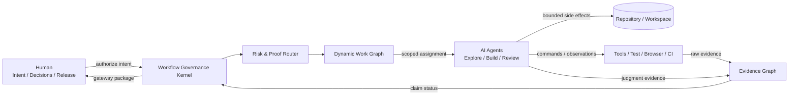
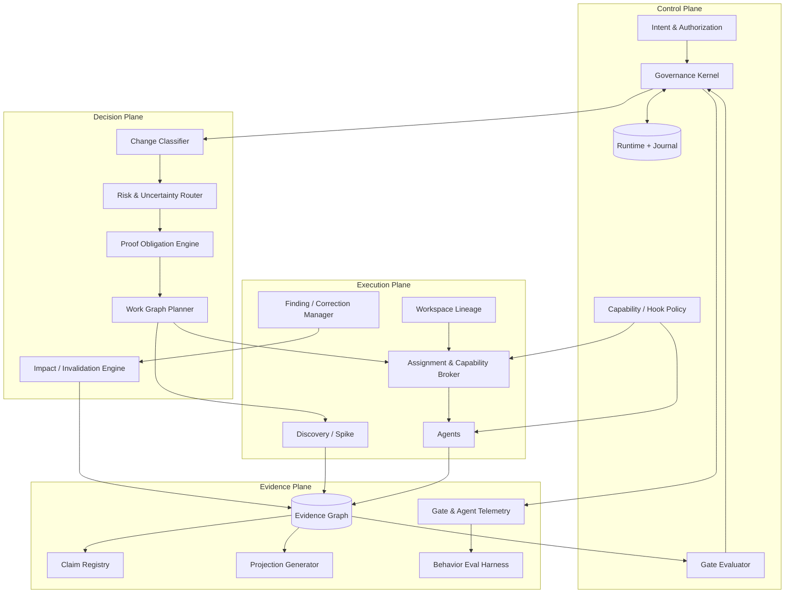
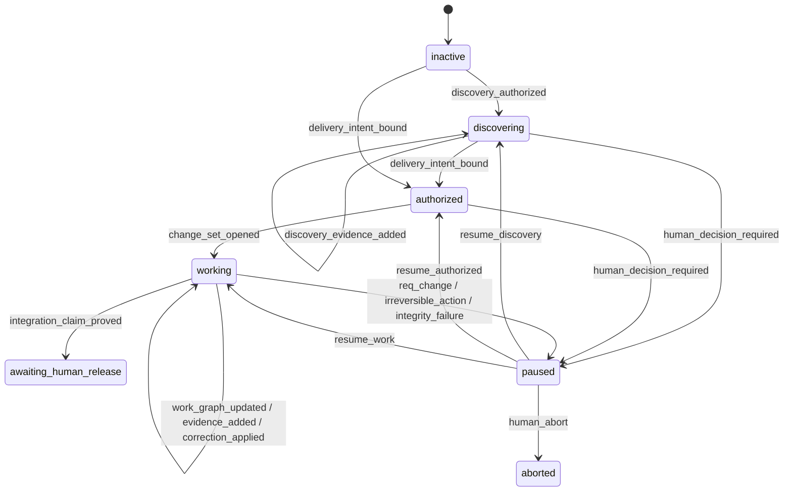
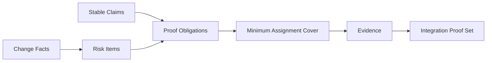
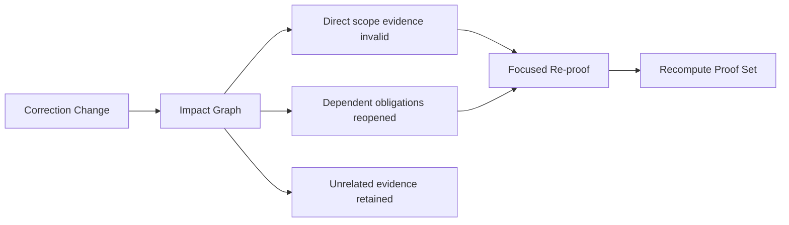

# 优化后的 Agentic Workflow 总体架构设计

> 状态：discovery / architecture candidate
> 版本：v0.1.0
> 日期：2026-07-18
> 范围：Loop Engineering 目标工作流架构
> 关联分析：`analysis/superpowers-workflow-improvement-layered-reqs.md`、
> `analysis/gate-design-friction-review.md`
> 说明：本文描述目标架构，不替代当前 `docs/loop-definition.json`，不授权实现、
> Runtime 迁移或正式发布。
> 最终定位：本文只作为长期概念地图；唯一最终推荐版本为
> `analysis/final-project-development-workflow.md`。

> 落地审查：本文保留为概念架构和长期能力地图，不应按组件清单一次性实现。
> 经过项目开发路径反推后的可落地基线，见
> `analysis/practical-project-workflow-architecture.md`。若两者发生冲突，近期实施
> 以可落地基线为准。

## 1. 架构结论

目标工作流不再是一条固定的阶段流水线，而是一个风险自适应的治理系统：

```text
Human Intent Boundary
        ↓
Reliable Governance Kernel
        ↓
Risk / Uncertainty Router
        ↓
Claims + Proof Obligations
        ↓
Dynamic Work Graph
        ↓
Scoped Agents + Evidence Graph
        ↓
Integration Claim
        ↓
Human Release Boundary
```

核心变化有五项：

1. 顶层状态机只表达治理状态，不表达固定工程步骤；
2. Router 根据变化事实、风险和不确定性计算工作与验证义务；
3. TASK、Review、Spike、BUG 都成为统一 Work Graph 中的不同节点；
4. 完成条件从“阶段全部走过”改为“当前 snapshot 的适用 Claim 全部有 Evidence”；
5. Markdown 报告从权威输入降为人工判断或机器 projection，避免重复证明。

一句话定义：

> Workflow Kernel 保护人类边界和事实一致性，Agent 在边界内自主寻找最小充分
> 路径，Proof Engine 决定什么必须被证明，Evidence Graph 决定是否真的完成。

## 2. 目标与非目标

### 2.1 架构目标

| 目标 | 说明 | 验证方式 |
|:---|:---|:---|
| 保留人类控制边界 | REQ 语义、不可逆动作和发布仍由人控制 | hard-gate conformance tests |
| 降低固定流程成本 | 小任务不创建无关设计、团队和报告 | targeted task behavior eval |
| 提高 Agent 探索能力 | 未知项可先 Spike，计划可被新证据推翻 | discovery / invalid-plan eval |
| 保证完成声明可信 | Claim 必须映射到当前 snapshot 的有效 Evidence | proof-set evaluator tests |
| 按风险分配验证 | security/migration 等保持深度，低风险路径可收窄 | planted-defect eval |
| 支持恢复和审计 | compact、崩溃、并发写入后仍能从 Runtime 恢复 | journal/reconcile scenarios |
| 主动消除低价值门禁 | Gate 有成本与独立检出 telemetry | gate sunset review |

### 2.2 非目标

- 不追求“Agent 完全不受约束”；
- 不以最少 Agent、最少 token 或最短时间作为唯一目标；
- 不允许 profile 改变锁定 REQ 的用户价值和 Acceptance；
- 不把所有判断自动化；高判断密度和不可逆决策仍可升级给人类；
- 不要求一次性重写当前 Harness；目标架构必须允许渐进迁移；
- 不把 Superpowers 的固定流程变成新的权威状态机。

## 3. 设计原则

### 3.1 约束副作用，不约束思考路径

Harness 强制写入范围、受保护路径、不可逆动作、Runtime 一致性和完成声明；
Agent 如何探索、拆解、实现和复核，只要满足稳定边界和 Proof Obligations，允许
自主调整。

### 3.2 Gate 验证属性，不验证仪式

Gate 可以要求“接口兼容性已证明”，不能无条件要求“必须创建 SYNC 文档并由
独立 Agent 填写某张表”。文档和 Agent 组织方式是证明策略，不是被证明属性。

### 3.3 风险决定深度，Evidence 质量不降级

短路径减少的是不适用的工作，不是 Evidence 的真实性、新鲜度和可追溯性。
targeted profile 仍不能使用 `should pass`、历史运行或 Agent 自报作为 PASS。

### 3.4 新证据可以推翻计划

Plan、Contract 和 TASK 是当前最佳假设。只要不改变锁定 REQ 语义，新发现可以
触发重规划、合同调整、任务合并或删除；系统必须记录影响和 Evidence 失效。

### 3.5 一项事实只存一份权威记录

Runtime 保存事实，Evidence Graph 保存证明，人工文档保存意图与判断。status、
TASK brief、ACC、release package 等视图应从权威数据生成。

### 3.6 独立性由冲突决定

不同责任不天然需要不同 Agent。只有自我验证、权限冲突、利益冲突、不同高风险
判断或共享写入等情况才产生 `must_separate` edge。

## 4. 系统上下文



Human 控制两端；Kernel 自动化中间过程，但中间过程不再被一条固定阶段序列表达。

## 5. 总体逻辑架构



## 6. 权威模型

现有 Definition / Runtime / Evidence 分层保留，并扩展为以下权威边界：

| 抽象 | 回答的问题 | 权威来源 | 写入者 |
|:---|:---|:---|:---|
| Intent Baseline | 人真正要求什么 | locked REQ / discovery authorization | human |
| Workflow Definition | 哪些治理转换合法 | machine-readable definition | human-approved design |
| Runtime | 当前治理事实是什么 | atomic snapshot + journal | transition engine |
| Change Set | 这次实际改变什么 | runtime entity + workspace manifest | Kernel |
| Risk Assessment | 为什么走这条路径 | versioned router result | Router，经 Kernel 提交 |
| Claim Registry | 哪些稳定结果必须成立 | REQ + contracts + derived claims | Kernel / approved planning |
| Proof Plan | 每个 Claim 如何证明 | proof obligations | Proof Engine |
| Assignment Contract | Agent 此刻能做什么 | fingerprinted capability contract | Assignment Broker |
| Evidence Graph | 什么已经被当前事实证明 | immutable evidence nodes + edges | Harness adapters / activated owners |
| Human Decisions | 哪些边界被批准或拒绝 | decision record | human |

Skills 仍是方法建议，不拥有状态；Agent 报告仍不是 Runtime；生成文档不成为新的
权威源。

## 7. 顶层治理状态机

### 7.1 设计原则

顶层状态只回答“系统获得了什么授权、能否声明完成”，不回答“现在正在写设计
还是测试”。工程步骤由 Work Graph 表达。

### 7.2 状态定义

| 状态 | 含义 |
|:---|:---|
| `inactive` | 没有活动授权 |
| `discovering` | 在隔离范围内探索未知项，不能形成正式集成声明 |
| `authorized` | 人类意图已绑定，Change Set 尚未开始或正在准备 |
| `working` | 动态 Work Graph 正在执行、验证或修正 |
| `awaiting_human_release` | 当前 Integration Claim 已证明，自动化停止 |
| `paused` | 等待人类决定、外部权限或完整性恢复 |
| `aborted` | 人类终止 |

### 7.3 状态图



`working → working` 不是无约束自循环；每次 mutation 仍需 CAS、合法 event、
有效 actor、作用域和 Evidence。它只是不把方法步骤全部提升为顶层 state。

## 8. 四个真正的 Blocking Moments

### G0 Intent / Discovery Authorization

保护：人类意图和探索边界。

- Discovery Authorization 允许只读探索、隔离 Spike、测量和原型；
- Delivery Authorization 锁定用户价值、范围、Acceptance 和 human-only 边界；
- Agent 不能把 Discovery 结果自动升级为正式需求；
- REQ 语义改变必须回到 Human Gateway。

### G1 Side-effect Authorization

保护：写入、权限、不可逆动作和 workspace ownership。

该 Gate 是持续执行的 policy boundary，不是一个固定阶段：

| Capability tier | 例子 | 授权 |
|:---|:---|:---|
| C0 read | 搜索、读取、review | assignment token |
| C1 workspace write | 普通源码、测试、文档写入 | scope-bound activation |
| C2 privileged local | install、generator、migration、policy file | explicit elevated activation |
| C3 human-only | locked REQ、protected branch、production、release | deny + Human Gateway |

如果某一行为被称为 hard invariant，Hook 必须 deny；若只能提醒，应诚实标注
advisory，不能同时支付完整仪式成本并提供弱保护。

### G2 Integration Claim Gate

保护：虚假完成声明和高风险缺陷进入集成。

通过条件：

- frozen Change Set snapshot 存在；
- 所有 applicable Claims 都有满足 freshness 和 scope 的 Evidence；
- 所有 applicable Proof Obligations 状态为 `satisfied` 或有有效 N/A decision；
- 没有 blocking Finding；
- risk/uncertainty 没有未处理升级；
- required convergence/cleanup 已完成；
- Workspace Lineage 和 integration target 明确。

该 Gate 不关心验证由几支 Team、什么顺序或几份 Markdown 完成。

### G3 Human Release Gate

保护：合并、发布、部署及其他不可逆业务动作。

Kernel 生成当前 Integration Proof Set 和差异摘要后进入
`awaiting_human_release`；自动化不能自行 merge、push protected branch、deploy
或 release。

## 9. Risk / Uncertainty Router

### 9.1 输入

- change type；
- changed / intended paths 与模块；
- stable Claims；
- risk tags；
- requirement、architecture、dependency、data、environment uncertainty；
- historical BUG、ownership 和 workspace lineage；
- rollback difficulty 和 blast radius；
-当前 Evidence coverage。

### 9.2 输出

Router 不输出一条固定流程，而输出：

```text
profile_hint
risk_items[]
uncertainty_items[]
required_claims[]
proof_obligations[]
mandatory_separation_edges[]
capability_ceiling
escalation_triggers[]
convergence_required
release_audit_topics[]
```

### 9.3 Profile 只作为默认策略包

| Profile | 默认场景 | 默认图形 |
|:---|:---|:---|
| `exploratory` | 未知依赖、架构探索、可行性不明 | Discovery → checkpoint |
| `targeted` | 小型、低风险、局部变化 | bounded change → focused proof |
| `standard` | 普通功能、bugfix、refactor | contract → build → selected review |
| `full_depth` | 安全、迁移、跨模块、高回滚成本 | architecture + independent proofs + convergence |

Profile 不能直接决定 PASS；最终以具体 Proof Obligations 为准。Router 置信度低时
应增加 Discovery，而不是永久以保守为由启动全部流程。

### 9.4 路由更新

Router 在以下事件后重新计算：

- Discovery 产生新事实；
- Contract 或 Change Set 扩大；
- Agent 报告 scope deviation；
- Finding 暴露新风险；
- 依赖、baseline 或 workspace fingerprint 变化；
- 人类接受或拒绝某项风险。

升级可以自动发生；降级必须有正面 Evidence，且不能撤销已触发的人类边界。

## 10. Claim 与 Proof Obligation 模型

### 10.1 Claim 类型

| Claim | 例子 |
|:---|:---|
| requirement | 用户可以完成目标操作 |
| behavior | 输入、输出、错误语义符合预期 |
| compatibility | API/schema/历史行为兼容 |
| architecture | 依赖方向、事务、状态不变量成立 |
| security | 权限、数据暴露、审计边界成立 |
| reliability | retry、idempotency、failure handling 成立 |
| performance | 指标未回退或达到目标 |
| migration | 数据迁移可验证、可恢复 |
| user_flow | 浏览器真实路径成立 |
| release | rollout、rollback、操作准备充分 |

### 10.2 Proof Obligation

Proof Obligation 是“Claim 在当前 Change Set 下必须如何被证明”，至少包含：

```yaml
id: PO-...
claim_id: CL-...
applicability: required | not_applicable
trigger: risk/change fact
evidence_contract:
  kinds: [test_run, static_analysis, review_verdict]
  freshness: current_snapshot
  independence: self | independent | human
  environment: local | browser | staging | production_like
scope_refs: []
status: open | active | satisfied | invalidated | blocked
```

### 10.3 验证责任由义务生成



不再预设 Delivery、QA、E2E 三个完整团队。它们可以继续作为 assignment role
family，但是否创建、如何组合和是否独立由 obligations 与 conflict graph 决定。

## 11. Dynamic Work Graph

### 11.1 Node 类型

| Node type | 作用 |
|:---|:---|
| `discovery` | 消除未知项、否定假设 |
| `decision` | 形成 ADR、风险或 contract checkpoint |
| `contract` | 定义稳定外部边界 |
| `implementation` | 修改产品、测试、配置或文档 |
| `verification` | 满足一个或多个 Proof Obligations |
| `convergence` | 删除 provisional、重复和无稳定价值复杂度 |
| `correction` | 处理 Finding 或 BUG |
| `projection` | 生成 ACC、status、release package 等视图 |

### 11.2 Node 生命周期

统一生命周期：

```text
proposed → ready → active → satisfied
                  ↘ blocked
satisfied → invalidated → ready
proposed/ready → cancelled
```

TASK、BUG、Review 不再分别复制相近的状态机。不同 Node type 使用不同 schema，
但共享生命周期、fingerprint、dependency、assignment 和 Evidence 机制。

### 11.3 Edge 类型

- `depends_on`：前置结果；
- `proves`：节点满足某个 Proof Obligation；
- `invalidates`：变化使既有结果失效；
- `must_separate`：不能由同一 Agent 承担；
- `shares_interface`：共享稳定接口；
- `replaces`：新节点替代 provisional/旧节点；
- `derived_from`：由 Discovery、Finding 或 Decision 生成。

### 11.4 任务粒度

Implementation Node 是“拥有独立变更结果和测试循环、值得被单独回滚或拒绝”的
最小单元。setup、formatter、简单配置等不因为动作不同就自动拆 Node。

## 12. Discovery 与 Contract 演化

### 12.1 Discovery Ledger

Discovery Node 输出结构化事实，而不是生产完成声明：

- observed constraint；
- source / reproduction；
- confidence；
- applicable scope；
- invalidation condition；
- failed approaches；
- reusable helper / prior art；
- contract impact；
- next checkpoint。

Ledger 条目带 fingerprint，被 Assignment Contract 按 scope 引用。Fresh Agent 获得
相关发现，而不是继承整个聊天历史。

### 12.2 Stable / Provisional / Free

规划结果分为：

| 类别 | 示例 | 变更权限 |
|:---|:---|:---|
| stable behavior | 用户行为、Acceptance、公共兼容性 | REQ 语义变化需人类 |
| architecture constraint | 事务、权限、依赖方向 | 影响分析后可重规划 |
| provisional decision | 尚待实现/Spike 验证的选择 | 新 Evidence 可推翻 |
| implementation freedom | 私有函数、文件布局、内部 helper | Agent 自主决定 |

### 12.3 Contract Change Proposal

新事实证明旧 Contract 不足时，生成：original contract、new discovery、
insufficiency、proposed change、REQ semantic impact、Evidence invalidation、cleanup。

- 不改变 REQ 语义：Kernel 更新 Work Graph 并局部失效；
- 改变 REQ 语义：暂停并提交 Human Gateway。

## 13. Agent 编排与授权

### 13.1 Assignment Contract

每次 Agent 工作只有一个 scope 权威：

```yaml
assignment_id: ASG-...
work_node_ids: []
responsibilities: []
claim_and_obligation_refs: []
context_refs: []
allowed_read_paths: []
allowed_write_paths: []
allowed_tools: []
allowed_command_classes: []
capability_tier: C0 | C1 | C2
expected_evidence: []
stop_and_escalation: []
expires_on: snapshot_or_event
```

readback、activation、progress 和 completion 只引用该合同 ID/hash，避免多份消息
重复 scope 字段。

### 13.2 最小 Assignment Cover

Planner 对 Work Nodes 和 Proof Obligations 做 cover：

- 兼容上下文、工具、权限和 verdict 的责任可以合并；
- 自我验证、security/release、original implementation conflict 等生成
  `must_separate`；
- 共享写入或有序 dependency 强制串行；
- 只读且同 snapshot 的独立验证可以并行；
- Fresh Agent 获得直接规格 + 相关 Discovery，不读取无关完整计划。

### 13.3 模型选择

| 判断密度 | 工作 | 策略 |
|:---|:---|:---|
| 低 | 机械实现、格式化、schema conversion | 可用低成本模型 |
| 中 | 普通实现、focused tests | 标准模型 |
| 高 | architecture、severity、plan invalidity、security、Gateway | 高判断能力模型或人类 |

低能力 Agent 遇到 `BLOCKED`、plan conflict、cannot verify 或 suspected false
positive 必须升级，不能自行吸收判断。

## 14. Evidence Graph

### 14.1 Node

Evidence 至少记录：

```yaml
evidence_id: EV-...
kind: command_result | observation | review_verdict | human_decision | discovery
producer: agent | harness | human
claim_refs: []
proof_obligation_refs: []
scope_refs: []
snapshot_id: SNAP-...
baseline_generation: 1
environment_fingerprint: ...
artifact_fingerprints: []
result: pass | fail | finding | n_a
status: valid | invalid | superseded
created_at: ...
raw_output_ref: ...
```

### 14.2 Edge

- `supports` Claim/Obligation；
- `derived_from` command、artifact 或 decision；
- `invalidated_by` change/finding；
- `supersedes` 旧 Evidence；
- `contradicts` 既有 Evidence；
- `scoped_to` snapshot/environment/path。

### 14.3 Integration Proof Set

原 Clean Round 的核心保留，但改写为：

> 对一个 frozen snapshot，所有 applicable Proof Obligations 都由当前、有效、
> scope-compatible 的 Evidence 满足，且没有 blocking Finding。

Proof Set 不要求相同组织结构或串行 round。独立 reviewer 可以并行，只要绑定
同一 snapshot；中途变化由 Impact Engine 精确失效受影响 Evidence。

### 14.4 生成型产出

| 产出 | 目标形态 |
|:---|:---|
| `status/next` | Runtime + Work Graph projection |
| TASK brief | Work Node + Assignment Contract projection |
| Team Manifest | assignment cover projection，仅需要时持久化 |
| Completion Report | Evidence + node status projection |
| ACC | Claim → Evidence projection |
| Release Audit | risk-triggered topic projection +人工判断 |
| Gateway Package | current proof set + unresolved human decision projection |

删除生成文件不应丢失权威事实；重新生成必须确定性一致。

## 15. Verification 架构

### 15.1 Change type 到证明策略

| Change type | 默认证明策略 |
|:---|:---|
| behavior feature | acceptance-first / TDD + observable behavior |
| bugfix | reproduce + causal hypothesis + regression-first |
| refactor | characterization + structural review + regression |
| exploration | Spike measurement，不要求 production TDD |
| config/docs | targeted parser/build/link validation |
| deletion | dependency analysis + regression |
| performance | benchmark before/after |
| migration | production-like rehearsal + rollback |
| security/permission | independent threat/authorization proof |

### 15.2 Reviewer 不再按固定部门切分

普通变更可由一个高能力 reviewer 同时给出：

- requirement/spec validity verdict；
- implementation quality verdict；
- test adequacy verdict。

以下责任默认独立：

- reviewer 不验证自己的实现；
- security / authorization；
- migration / destructive data；
- release boundary；
- 高争议 architecture；
- 用户明确要求独立审计。

### 15.3 并行与复用

- 对同一 snapshot、无依赖、只读的 proof nodes 并行；
- Builder 已对当前 snapshot 提供有效 test Evidence 时，reviewer 不机械重跑；
- reviewer 发现具体疑问时运行 focused verification；
- N/A 由 Applicability Engine 产生依据，不创建空 Agent 或空报告。

## 16. Finding 与 Correction

### 16.1 Finding 分类

| 类别 | 条件 | 路径 |
|:---|:---|:---|
| local correction | task-local、显然、未越过 integration gate | reopen node → fix → focused proof |
| systemic defect | 跨责任、原因不明、重复或已逃逸 | investigation → Canonical BUG node |
| high-risk defect | security、data、migration、release blocker | BUG + independent approval/reverify |
| spec invalid | Contract/Plan 被新 Evidence 推翻 | contract checkpoint / replan |
| intent conflict | 需要改变 REQ 语义 | Human Gateway |
| environment issue | 产品无需变化 | evidence disposition / retry policy |

所有产品缺陷都需要因果说明和回归 Evidence，但不都需要完整 BUG Artifact。

### 16.2 Selective Invalidation



只有以下情况要求 full-depth proof recomputation：

- REQ/baseline 变化；
- 跨切面接口或 architecture constraint 变化；
- 风险升级到 full-depth；
- 无法可靠计算影响；
- release policy 明确要求完整复核。

原发现责任优先复验；不可用时允许等价独立责任使用相同 Finding Contract。

## 17. Convergence 与 Deletion

Convergence 不是所有任务的固定阶段，而是以下条件触发的 Proof Obligation：

- exploratory / provisional 工作进入正式集成；
- 大型或跨模块变更；
- 引入 compatibility layer、adapter、helper 或新抽象；
- 同一范围发生多轮 correction；
- complexity telemetry 超过阈值。

检查：Spike 遗留、重复 helper、过时 adapter、临时兼容层、dead/debug code、
过度 mock、失效测试、重复文档和 provisional decisions。

新增复杂度必须映射到 stable Claim、risk mitigation 或 architecture constraint；
无映射复杂度默认删除。

## 18. Workspace 与 Branch Lineage

Workspace Manifest 持久化：

```yaml
workspace_id: WS-...
owner: harness | platform | human
provenance: ...
branch: ...
base_ref: ...
base_sha: ...
integration_target: ...
worktree_path: ...
runtime_id: ...
status: active | retained | cleanup_authorized
```

规则：

- 创建前 detect existing workspace，优先 defer 给平台能力；
- start point 必须显式并解析 immutable SHA；
- finish 读取 Manifest，不从 cwd、HEAD 或 merge-base 猜目标；
- 只有 owner 或人类可以授权清理；
- pre-existing baseline failure 单独记录，不能与新 Change Set 混淆。

## 19. Runtime 数据模型

建议 Runtime 顶层结构：

```yaml
runtime_id: LOOP-...
revision: 42
governance_state: working
baseline:
  intent_ref: REQ-...
  generation: 1
authorization:
  type: delivery
  human_decision_ref: HD-...
change_set:
  id: CHG-...
  snapshot_id: SNAP-...
  workspace_ref: WS-...
routing:
  assessment_id: RA-...
  profile_hint: standard
  risk_items: []
  uncertainty_items: []
claims: []
proof_obligations: []
work_graph:
  nodes: []
  edges: []
assignments: []
findings: []
evidence_refs: []
gate_status:
  intent: passed
  side_effect: active
  integration_claim: open
  human_release: closed
human_gateways: []
telemetry_ref: ...
```

Snapshot 仍通过 CAS 和 Journal 更新；大体积 raw Evidence、日志和生成 projection
保存在外部 Artifact Store，由 Runtime 引用 ID/hash。

## 20. Driver 算法

```text
1. Load Runtime + reconcile Journal.
2. Validate intent fingerprint and workspace lineage.
3. If no authorization:
     request Discovery or Delivery authorization.
4. Recompute change facts, risk and uncertainty when triggers changed.
5. Reconcile Claims and Proof Obligations.
6. Build/update Work Graph; invalidate affected nodes/evidence.
7. Select ready nodes:
     - batch machine checks;
     - assign compatible Agent work;
     - enforce capability tier.
8. Ingest Evidence and Findings.
9. Route Findings to local correction, BUG, replan or Human Gateway.
10. Recompute Integration Proof Set.
11. If complete, generate handoff and enter awaiting_human_release.
12. Otherwise continue with the highest-value unblocked node.
```

`next` 不再返回固定阶段文案，而返回：

```yaml
ready_nodes: []
blocked_nodes: []
missing_obligations: []
recommended_batch: []
required_capability: C0|C1|C2|C3
human_required: false
reasoning_refs: [risk_assessment, graph_revision]
```

## 21. 四条典型路径

### 21.1 Targeted：非规范文档修正

```text
Delivery Intent
→ impact classification: docs-only
→ Claim: links/build remain valid
→ machine checks
→ Integration Claim
→ Human handoff
```

不创建 Architecture、Contract、TASK Team、E2E 或 Release Audit。

### 21.2 Standard：普通行为功能

```text
Delivery Intent
→ bounded behavior contract
→ implementation node
→ unit/acceptance evidence
→ combined independent reviewer
→ applicable integration proof
→ Integration Claim
```

如果没有 UI、migration、安全或跨组件风险，不创建对应 specialist reviewer。

### 21.3 Exploratory：未知第三方 API

```text
Discovery Authorization
→ isolated Spike
→ Discovery Ledger
→ contract checkpoint
→ Delivery Intent
→ implementation + proofs
```

Spike 代码默认不能直接进入 Integration Proof Set；必须 promote 或删除。

### 21.4 Full-depth：权限 + 数据迁移

```text
Delivery Intent
→ architecture / security / migration contracts
→ production-like rehearsal + rollback proof
→ scoped implementation agents
→ independent security and migration reviewers
→ regression / integration / operational proofs in parallel
→ convergence
→ Integration Claim
→ Human Release Gate
```

高风险路径仍然很深，但深度来自具体风险，不是所有任务共享的默认成本。

## 22. 当前 S0–S11 到目标架构的映射

| 当前阶段 | 目标表达 |
|:---|:---|
| S0/S1 REQ + init | Intent Authorization + Runtime initialization |
| S2 design | conditional decision/contract nodes |
| S3 contracts | stable Claim / Contract nodes |
| S4 tasks | Work Graph planning |
| S5 document verification | spec-validity Proof Obligations |
| S6 build | implementation nodes + scoped assignments |
| S7 full verification | risk-derived proof nodes + Integration Proof Set |
| S8/S9 BUG | finding classification + correction/BUG nodes |
| S10 acceptance/audit | generated projections + release-triggered obligations |
| S11 release gateway | awaiting_human_release |

迁移过程中可以保留 S-cursor 作为兼容 projection，但它不再是目标 Runtime 的
核心状态；不能再通过“存在某类文件”推断真实治理进度。

## 23. 渐进迁移方案

### Phase 0：Truth Before Flexibility

- 修复 Manual、CLI projection、Skill、Guard 和 Hook 的声明—执行差距；
- Gate 增加 `hard / computed / advisory` 类型；
- 建立 conformance tests 和 behavior eval baseline。

### Phase 1：Shadow Router

- 保持当前 S0–S11 执行；
- Router 只旁路计算 profile、risk、obligations 和预期成本；
- 比较固定流程实际发现与 Router 预测。

### Phase 2：Proof Obligation Overlay

- 在当前 Team/Clean Round 旁建立 Claim/Obligation/Evidence 映射；
- ACC 先改为 projection；
- N/A 由 Impact Evidence 计算；
- 不改变当前 release boundary。

### Phase 3：低风险路径放松

- targeted docs/config 不启动完整 Team；
- 只读 reviewer 使用 C0 assignment；
- 合并兼容 reviewer responsibilities；
- 同 snapshot verifier 并行。

### Phase 4：Selective Correction

- task-local correction 不强制 Canonical BUG；
- dependency-aware invalidation；
- targeted proof 后按影响决定是否 full-depth recompute。

### Phase 5：Graph-native Runtime

- Dynamic Work Graph 成为核心；
- S0–S11 降为兼容 projection；
- 删除重复 lifecycle 和不再有独立价值的 Artifact/Gate。

每个 Phase 必须用 planted-defect、真实任务和 no-guidance control 证明没有质量
回退，不能只通过 schema/unit tests 判断成功。

## 24. Telemetry 与行为 Eval

### 24.1 运行指标

- Gate 触发、独立发现、误报、绕过和恢复次数；
- Agent turns、token/cost、wall time；
- 重复读取、重复 Evidence 和重复 test run；
- review loop、correction loop 和 full recompute 次数；
- compact/resume 后重复 dispatch 或状态丢失；
- escaped defect 和 human override；
- profile 升降级准确率；
- reused discovery / existing helper 命中率；
- 删除代码与新增复杂度比例。

### 24.2 Eval 分层

| 层 | 证明什么 |
|:---|:---|
| mechanism tests | schema、CAS、Hook、CLI、invalidation、projection 正确 |
| behavior evals | Agent 是否按预期探索、路由、停下、挑战 Plan、验证 |
| planted-defect evals | Gate/reviewer 是否能发现真实缺陷 |
| cost evals | 在质量不回退时是否减少摩擦 |
| longitudinal telemetry | Gate 长期是否仍有独立价值 |

Gate 和 Skill 都必须有 sunset 条件；长期零独立发现且成本显著时进入删除审查。

## 25. 关键设计决策

| 决策 | 选择 | 原因 |
|:---|:---|:---|
| 顶层控制模型 | governance FSM + dynamic work graph | 同时保留可恢复性和路径自由 |
| 完成模型 | Claim / Proof Obligation / Evidence | 从流程完成转向结果证明 |
| Profile | 默认策略包，不是固定流水线 | 避免四条新固定流程 |
| Agent 拆分 | minimum cover + conflict graph | 独立性按真实冲突决定 |
| Activation | capability tier | 授权成本与副作用风险匹配 |
| Clean Round | snapshot-scoped Integration Proof Set | 保留新鲜度，取消组织/顺序耦合 |
| BUG | 分级 correction | 根因纪律与修复成本匹配 |
| ACC/report | 生成 projection | 消除重复权威和漂移 |
| 迁移 | shadow → overlay → relax → graph-native | 先测量，再减少门禁 |

## 26. 风险与缓解

| 风险 | 缓解 |
|:---|:---|
| Router 漏掉风险 | conservative fallback + uncertainty-triggered Discovery + planted defects |
| targeted path 被滥用 | profile 只提示，Proof Obligations 才决定 PASS |
| Graph 比固定 FSM 难理解 | typed nodes/edges、deterministic projection、可视化 `next` |
| Evidence Graph 过度复杂 | 小型核心 schema，大体积输出外置，projection 自动生成 |
| Agent 自主调整导致 scope creep | stable Claim + capability boundary + impact recomputation |
| 合并 reviewer 降低独立性 | must-separate policy + judgment-density routing |
| selective invalidation 漏传播 | dependency conformance tests + unknown impact fails conservative |
| 迁移期双模型漂移 | shadow comparison、单向 projection、明确 cutover owner |

## 27. 尚待决策

1. Discovery Authorization 是否必须每次由人显式批准，还是可由项目级 policy
   预授权 C0/隔离 C1 Spike；
2. Change Set snapshot 使用 Git tree、workspace hash 还是复合 fingerprint；
3. Risk Router 的确定性规则与模型判断各占多大比例；
4. Evidence Graph 存储采用 Runtime 内嵌、JSONL 索引还是独立数据库；
5. 哪些 C1 assignment 可由 Kernel 自动批准，哪些仍需要 main-session judgment；
6. Integration Claim 对 docs-only、library、application 和 release repo 是否使用
   不同 proof catalog；
7. targeted → standard → full-depth 的自动升级阈值；
8. Gate sunset 的最低样本数和 escaped-defect 观察窗口；
9. 人工风险接受如何影响 Proof Obligation，而不变成静默 bypass；
10. 何时删除 S-cursor 兼容层和旧 Artifact templates。

## 28. 推荐的第一个正式设计切片

不要先实现完整 Dynamic Work Graph。第一个正式切片建议只包含：

```text
Gate semantic types
+ Claim / Proof Obligation 最小 schema
+ shadow Risk Router
+ snapshot-scoped Evidence mapping
+ generated status/ACC projection
```

它可以在不改变当前 release boundary 和大部分状态机的情况下验证三件关键事实：

1. 当前固定流程中哪些 Gate 真正产生独立 Evidence；
2. 哪些责任可以安全 N/A、合并或并行；
3. Claim/Evidence 模型能否替代重复报告而不降低可审计性。

只有这个切片通过行为 Eval 后，才进入低风险路径放松和 Graph-native Runtime。
