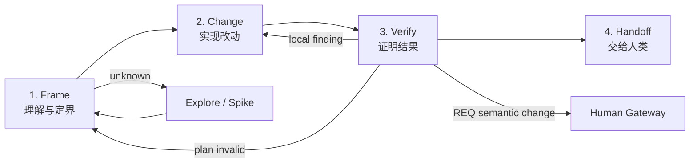
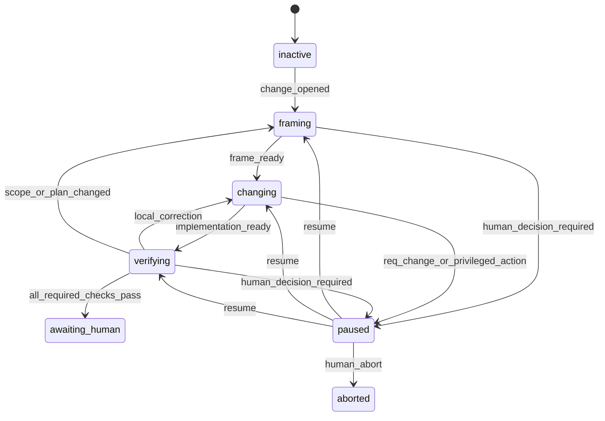

# 可融入项目开发的务实 Workflow 架构

> 状态：discovery / practical architecture candidate
> 版本：v0.1.0
> 日期：2026-07-18
> 说明：本文是对 `optimized-agentic-workflow-architecture.md` 的落地审查与收敛。
> 它不替代当前 Loop Definition，也不授权实现。
> 历史定位：本文是务实收敛过程；唯一最终推荐版本为
> `analysis/final-project-development-workflow.md`。

## 1. 审查结论

上一版方向正确，但实现形态过重。若同时建设以下组件：

- Risk Router；
- Claim Registry；
- Proof Obligation Engine；
- Dynamic Work Graph Planner；
- Assignment Broker；
- Evidence Graph；
- Gate Telemetry Platform；
- Behavior Eval Platform；

我们会重新得到一套需要 Agent 学习、填充、同步和维护的工作流平台。这与“减少
门禁和无效产出”的目标矛盾。

真正可落地的版本应只保留四个已有概念：

```text
用户意图和验收标准
当前工作项
当前必须运行的检查
检查产生的证据和发现
```

对应 Runtime 中四组简单字段：

```text
acceptance[]
work_items[]
required_checks[]
evidence[] / findings[]
```

所谓 Claim，就是 `acceptance[]` 中的一项；所谓 Proof Obligation，就是
`required_checks[]` 中的一项；所谓 Work Graph，就是带可选 `depends_on` 的
`work_items[]`；所谓 Evidence Graph，就是 Evidence 对 acceptance/check/scope 的
引用。第一阶段不需要独立服务、图数据库或新的 DSL。

### 1.1 概念架构组件去留

| 概念组件 | 近期处理 | 原因 |
|:---|:---|:---|
| Governance Kernel | 保留 | 当前 Harness 已存在，负责 CAS、Journal、Hook、transition |
| Change Record | 新增一个 Runtime entity | 直接服务每次开发改动 |
| Risk Router | 内嵌为确定性触发矩阵 | 暂无必要建设 AI Router 服务 |
| Claim Registry | 合并进 `acceptance[]` | REQ Acceptance 已经是权威来源 |
| Proof Obligation Engine | 合并进 `required_checks[]` | 第一版规则数量可以由普通代码维护 |
| Dynamic Work Graph | 降为 `work_items[] + depends_on` | 当前任务规模不证明需要图引擎 |
| Assignment Broker | 复用 task/agent activation | 只调整 C0/C1/C2 授权强度 |
| Evidence Graph | 复用 Evidence array + refs | 当前 JSON 数据足以表达关系 |
| Projection Generator | 保留为 Harness 函数 | 直接消除手写 ACC/status 重复 |
| Gate Telemetry | 先记录少量 counters | 没有必要先建 telemetry 平台 |
| Behavior Eval | 保留小型真实任务 corpus | 它是删 Gate 时的质量护栏，不应删除 |

任何被“合并”或“降级”的组件，只有在真实项目数据证明简单结构已经无法表达时，
才允许重新独立建设。

### 1.2 新机制准入原则

默认决策是**不引入**。一个新机制只有同时满足以下条件才进入实施：

1. 它解决的是已经发生的真实问题，而不是想象中的未来问题；
2. 问题会重复发生，或单次失败损失足够高；
3. 现有字段、规则、检查、Skill 或人工判断不能以更低成本解决；
4. 收益可以通过缺陷减少、耗时下降、重复工作下降或恢复能力提升来衡量；
5. 实施、迁移、维护、Agent 学习、误阻塞和删除成本已被计算；
6. 可以先小范围试运行，并在收益不成立时低成本撤回。

使用一个简单判断式，不建设复杂评分平台：

```text
预期净收益
= 使用频率 × 单次节省
 + 避免的缺陷/事故损失
 - 实施成本
 - 迁移与兼容成本
 - 长期维护成本
 - Agent 认知与上下文成本
 - 误报、误阻塞和恢复成本
```

只有净收益有明确正向 Evidence，才正式保留机制。无法估计收益时，先做一次性
脚本、局部规则或人工实验，不进入 Runtime Constitution。

### 1.3 最低复杂度优先

解决同一问题时，按以下顺序选择；上一层已经足够就停止：

```text
0. 不处理 / 接受风险
1. 改清楚现有文案或 Skill
2. 复用现有命令或增加一条确定性检查
3. 扩展一个现有 schema 字段
4. 增加一个现有模块内的纯函数
5. 增加 Runtime entity / transition
6. 增加独立组件、服务或存储
```

新增 state、entity、Gate、Agent role、Artifact template 或服务时，必须说明为什么
第 1–4 级方案不足。不得因为“未来可能扩展”直接选择第 5–6 级。

### 1.4 机制保留与删除

新机制先标记 `experimental`，只在代表性真实任务中启用。观察：

- 是否产生已有机制发现不了的问题；
- 是否减少总 turns、wall time、重复 Evidence 或人工介入；
- 是否增加误阻塞、状态同步和恢复负担；
- 使用者是否必须理解额外概念才能完成普通任务。

如果机制没有稳定的独立收益，应删除或降级为 advisory。沉没的实现成本不是继续
保留它的理由。

## 2. 真实开发工作流

开发者和 Agent 每次改动只需要理解四步：



这四步是开发导航，不是四套文档 Gate。每一步只要求产生下一步真正会消费的
信息。

### 2.1 Frame：理解与定界

Agent 首先读项目和用户请求，然后形成一个紧凑 Change Record：

- 用户希望发生什么；
- 哪些结果可以证明完成；
- 预计影响哪些范围；
- 有哪些未知项和高风险项；
- 需要哪些工作项；
- 完成前必须运行哪些检查。

如果信息已经清楚，直接进入 Change。只有以下情况需要额外设计产出：

- 公共接口、数据模型、状态机或跨模块边界变化；
- 新交互或用户流需要先确认；
- migration、permission、安全、可靠性或回滚决策；
- 多个 Agent 需要依赖同一个稳定合同；
- 未知项足以让实现计划不可信。

### 2.2 Change：实现改动

- 默认由当前 Agent 完成一个聚焦工作项；
- 只有可以并行、需要独立判断或上下文明显不同才派 Subagent；
- Agent 可以在 Acceptance 和 scope 内调整内部实现、合并任务或删除原计划步骤；
- 新发现推翻计划时回到 Frame，不把错误计划硬执行到底；
- 每次写入仍受 workspace、path、tool 和 protected action 边界约束。

### 2.3 Verify：证明结果

Verify 不固定创建 Delivery、QA、E2E 三支 Team，而是执行 Change Record 中的
`required_checks[]`：

- Harness 可以直接运行的检查直接运行并记录；
- 普通代码 review 可以由一个独立 reviewer 合并检查行为、质量和测试充分性；
- security、migration、release 等高风险判断保持独立 reviewer；
- UI/user-flow 变化才运行浏览器；
- 当前 snapshot 已有有效测试结果时，不无理由重复运行；
- Finding 只失效受影响检查。

### 2.4 Handoff：交给人类

Harness 从 Runtime 生成：

- 改了什么；
- Acceptance 是否全部满足；
- 实际运行了哪些检查；
- 哪些检查 N/A，以及为什么；
- 仍有什么风险；
- workspace/branch/integration target；
- 需要人执行的 merge/release/deploy 动作。

Agent 不再手工维护一份内容重复的 ACC 和 Gateway Package。

## 3. 最小顶层状态

Runtime 只需要五个主要状态：

| 状态 | 含义 |
|:---|:---|
| `inactive` | 没有活动 Change |
| `framing` | 正在理解、探索和确定 checks |
| `changing` | 正在修改工作区 |
| `verifying` | 正在运行适用检查或修正 Finding |
| `awaiting_human` | Acceptance 已证明，等待 merge/release 等人类动作 |

另保留：

- `paused`：确实需要人类业务决定、外部权限或完整性恢复；
- `aborted`：人类终止。

状态图：



这些状态只服务于恢复和 `next`，不能因为进入某状态就要求生成固定文档。

## 4. 三个机器 Gate 和一个人类边界

### G1 Frame Ready

进入写入前只检查：

- 用户意图或绑定 REQ 清楚；
- Acceptance 可被验证；
- scope 和明确未知项已记录；
- change class / risk level 已选择；
- `required_checks[]` 已计算；
- 若存在阻塞未知项，先做 Spike。

它不检查 Architecture、Contract、TASK 文件是否都存在；这些文件由触发条件决定。

### G2 Side-effect Boundary

持续检查：

- 写入路径在当前 work item scope 内；
- protected REQ、policy、branch、release action 没有越权；
- Runtime 和 assignment fingerprint 当前有效；
- destructive/privileged action 具有对应批准。

真正的不变量必须 `deny`，普通恢复提示才使用 `warn`。

### G3 Ready for Handoff

只检查：

- 所有 Acceptance 状态为 passed；
- 所有 `required_checks` 为 passed 或 evidence-backed N/A；
- Evidence 绑定当前 snapshot；
- 没有 blocking Finding；
- workspace lineage 明确；
- 高风险改动所需 rollback/independent review 已完成。

### Human Boundary

merge、protected push、deploy、production data 和 formal release 仍由人类决定。

## 5. Change Record：唯一的工作入口

不引入 Claim Registry、Proof Plan 和 Work Graph 三份新文档。一个 Change Record
足够承载一次开发所需信息。

建议 Runtime 结构：

```yaml
change:
  id: CHG-001
  intent_ref: REQ-001
  intent_sha256: ...
  summary: fix timeout handling
  class: bugfix
  risk: low | medium | high
  uncertainty: low | medium | high
  scope:
    include: []
    exclude: []
  acceptance:
    - id: AC-1
      text: timed-out requests return the stable timeout error
      status: open | passed
  unknowns: []
  work_items:
    - id: W-1
      text: reproduce and correct timeout mapping
      status: open | active | done | blocked | cancelled
      depends_on: []
      owner: main | agent-id
      write_paths: []
  required_checks:
    - id: CK-1
      kind: regression_test
      reason: bugfix
      command: go test ./internal/...
      scope_refs: []
      independence: self | independent | human
      status: open | passed | failed | n_a | invalid
      evidence_ref: null
  findings: []
  workspace_ref: WS-...
```

Change Record 可以存入 Runtime；只有需要人阅读或跨会话讨论时才生成简短 Markdown
projection。不要让 Agent 同时手工维护 JSON 和 Markdown。

## 6. Change Class 与检查触发矩阵

第一版不需要 AI Router 服务。使用确定性规则提供默认 checks，Agent 只能增加、
不能无证据删除；分类冲突或置信度低时升级 risk 或记录 unknown。

### 6.1 基础分类

| Change class | 默认要求 |
|:---|:---|
| docs-only | link/build/parser check |
| config | config parse + affected startup/behavior check |
| behavior feature | acceptance test + relevant unit/integration |
| bugfix | reproduce + regression test + affected tests |
| refactor | characterization + affected regression |
| deletion | reference/dependency search + affected tests |
| performance | benchmark before/after |
| migration | rehearsal + data validation + rollback |
| exploration | bounded Spike + discovery conclusion，不可直接 handoff |

### 6.2 风险触发

| 触发事实 | 增加的必要工作/检查 |
|:---|:---|
| UI 文案/样式，不改变流程 | screenshot/targeted UI check；不要求完整 prototype set |
| 新交互或用户流 | interaction design + browser flow |
| public API/schema | contract diff + compatibility/integration |
| cross-module boundary | interface note + integration check |
| auth/permission/security | independent security review |
| database schema/data | migration rehearsal + rollback + data validation |
| concurrency/retry/queue | reliability/idempotency check |
| performance-sensitive path | benchmark |
| generated artifacts | regeneration and drift check |
| protected release behavior | release audit topic + human boundary |

### 6.3 Risk Level

- `low`：局部、可回滚、无公共边界、无敏感数据；
- `medium`：普通行为功能、跨一个边界或有用户可见影响；
- `high`：security、permission、migration、数据损失、跨模块、高回滚成本、
  production/release critical。

Risk Level 只增加检查和独立性，不决定 Agent 数量。

## 7. 文档按触发生成

| Artifact | 何时需要 | 何时不需要 |
|:---|:---|:---|
| locked REQ | 新功能、行为语义或明确项目目标 | 单纯实现既有 REQ 的局部维护可引用原 REQ |
| Change Record | 每次受治理改动 | 无 |
| Architecture / ADR | 稳定架构约束或重要取舍变化 | 普通局部实现 |
| UI prototype/flow | 新交互、流程、信息架构 | 文案、颜色、局部样式修正 |
| FE/BE/SYNC contract | 公共或跨 Agent 接口变化 | 私有实现细节 |
| 多 TASK 文档 | 多 Agent、复杂依赖、独立回滚单元 | 单一聚焦改动 |
| Team Manifest | 多 Agent 并行或 independence 必须证明 | main Agent 单独完成 |
| Canonical BUG | systemic、复发、逃逸、高风险缺陷 | task-local review finding |
| ACC | 默认机器生成 projection | 不再要求手写重复映射 |
| Release Audit | release-bound 且命中风险 topic | 普通中间 change batch |

文档的存在必须有下游消费者。没有人或机器会读取并据此决策的 Artifact 不创建。

## 8. Agent 使用规则

### 8.1 默认不派 Agent

主 Agent 已经拥有用户上下文和仓库理解。以下情况才派新 Agent：

- 两个工作项确实可以独立并行；
- 需要独立 review，不能验证自己的实现；
- 专业风险需要不同能力，如 security/migration；
- 单一上下文已经明显过大；
- 隔离实验有助于避免污染正式实现。

“有多个 responsibility 名称”不构成派多个 Agent 的理由。

### 8.2 授权强度

| 工作 | 授权 |
|:---|:---|
| 读取、搜索、review | C0 read assignment；不做 phase-two write activation |
| 普通源码/测试写入 | C1 scoped write |
| install/generator/migration/policy | C2 elevated local approval |
| REQ/protected branch/production/release | C3 human only |

只读 reviewer 通过结构化结果通道提交 verdict，由 Harness 生成报告，不需要为了写
Markdown 获得仓库写权限。

### 8.3 Context 包

Assignment 只携带：

- Acceptance 和相关约束；
- 当前 work item；
-必要 source paths；
- 相关设计/合同；
- 已知 discovery / failed approaches；
- required check 或 verdict contract；
- scope 和 stop conditions。

不复制整份 REQ、所有规则、完整计划和通用方法论。

## 9. Review 与验证

### 9.1 默认 Review 规模

| Risk | Review |
|:---|:---|
| low | 可由主 Agent自检 + targeted machine checks；代码变更可选一次轻量独立 review |
| medium | 一个独立 reviewer，可合并 behavior/quality/test 三个 verdict |
| high | 领域 reviewer 独立；security/migration/release 不与 Builder 合并 |

### 9.2 同一 Snapshot 并行

无依赖的只读 checks 可以并行。Ready Gate 只要求它们绑定相同 snapshot，不要求
Delivery → QA → E2E 固定顺序。

### 9.3 Evidence

最小 Evidence 记录：

```yaml
id: EV-001
check_id: CK-1
snapshot: git-tree-or-workspace-fingerprint
producer: harness | agent | human
command_or_method: ...
result: pass | fail | finding | n_a
scope_refs: []
created_at: ...
raw_output_ref: ...
status: valid | invalid | superseded
```

不要第一阶段构建通用图数据库。`check_id + scope_refs + snapshot` 足以支持当前
Claim/Evidence 映射和选择性失效。

## 10. Finding 与修复

### 10.1 三级路径

| Finding | 路径 |
|:---|:---|
| local | reopen work item → fix → affected checks |
| systemic | investigate root cause → Canonical BUG → scoped fix/review |
| human-boundary | pause → human decision |

Local 的判断条件：

- 没有越过 ready/human boundary；
- 影响局限在当前 work item；
- 原因明确且修复不会改变合同；
- 有直接 regression check。

不满足任一条件则升级 systemic。

### 10.2 选择性失效

变化发生后：

1. 直接 overlap scope 的 checks 设为 invalid；
2. 与公共接口、risk tag 或 dependency 关联的 checks 重新打开；
3. 无关联且 snapshot-compatible 的 Evidence 保留；
4. 无法计算影响时保守重跑 affected module，不默认重跑全项目所有 Team。

## 11. `status` 与 `next` 的真实用户体验

### 11.1 status

```yaml
state: changing
change: CHG-001
summary: fix timeout handling
risk: low
acceptance: 1/2 passed
work_items: 1 active, 1 open
checks: 0/2 passed
blocking_findings: 0
human_required: false
```

### 11.2 next

```yaml
action: implement W-1 and record affected files
why: W-1 is the first dependency-ready work item
read: [REQ-001#AC-2, internal/client/...]
write_scope: [internal/client/**, internal/client/**/*_test.go]
done_when:
  - W-1 implementation complete
  - CK-1 regression test recorded
human_required: false
```

`next` 必须告诉 Agent 做真实工作，而不是“请求某个 transition”或“补一份流程
报告”。只有确实没有可执行工作时才返回 Gate/人类动作。

## 12. 与现有 Harness 的最小集成

第一阶段复用现有能力：

| 现有能力 | 继续使用 |
|:---|:---|
| Runtime CAS + Journal + reconcile | 是 |
| REQ human lock | 是 |
| Hook protected action | 是，但修正 warn/block 语义 |
| fingerprint / impact invalidation | 是，扩展到 check scope |
| `status/next` | 是，修复 projection contract |
| Agent Definitions / Skills | 是，减少重复 inlined methodology |
| current S-cursor | 作为兼容 projection 暂时保留 |

当前 schema 已经提供 `entities.tasks[]`、`entities.bugs[]`、`evidence[]`、
`blockers[]`、`scope_refs`、Evidence validity、baseline generation、CAS 和 Journal。
近期实现只需要增量调整：

| 目标字段 | 当前可复用 | 最小变化 |
|:---|:---|:---|
| `work_items[]` | `entities.tasks[]` | 先扩展 task metadata，不新建 Graph Store |
| `findings[]` | `entities.bugs[]` + blockers | 增加 local finding，避免所有 Finding 都升级 BUG |
| `evidence[]` | 现有 Evidence array | 增加 `check_id`、snapshot 和 command/observation kind |
| selective invalidation | `scope_refs` + impact package | 从 artifact kind 扩展到 check scope |
| `acceptance[]` | bound REQ Acceptance | Runtime 保存 ID/status/ref，不复制正文 |
| `required_checks[]` | 当前 responsibility/evidence contract | 改为 change-triggered check list |

因此第一版可以继续使用 JSON snapshot + JSONL Journal；没有证据表明需要数据库、
事件总线或独立服务。

第一阶段不建设：

- 图数据库；
- 通用 Workflow DSL；
- AI 自动 Router 服务；
- 新的 Agent marketplace/broker；
- 独立 Claim/Proof 微服务；
- 新的 Web 控制台；
- 全量历史 telemetry 平台。

## 13. 三个真实任务示例

### 13.1 修正文档链接

```text
Frame
  class=docs-only, risk=low
  acceptance: link resolves
  checks: markdown/link check
Change
  main Agent 修改一处
Verify
  run link check
Handoff
```

产出：Change Record + command Evidence。无 Architecture、Contract、TASK Team、
E2E、BUG、ACC 手写文档。

### 13.2 修复后端 timeout bug

```text
Frame
  class=bugfix, risk=medium
  acceptance: stable timeout error returned
  checks: reproduce, regression, affected package tests, independent review
Change
  main Agent 写 regression test 并修复
Verify
  Harness 记录 test；一个 reviewer 审 behavior/quality/test
  local finding 直接修正并重跑 affected check
Handoff
```

只有原因跨组件、重复出现或合同错误时升级 Canonical BUG。

### 13.3 权限模型 + migration

```text
Frame
  class=behavior+permission+migration, risk=high
  触发 ADR、authorization contract、migration/rollback plan
Change
  按写入边界拆 Builder
Verify
  integration、security、migration rehearsal、rollback 独立检查并行
  convergence check
Handoff
  生成 release audit topics，进入 human boundary
```

高风险任务仍然完整，但所有深度都能映射到实际风险。

## 14. 落地顺序

### Step 0：先修真值

- Manual/Definition drift；
- `status/next` schema；
- Skill transition drift；
- Guard stub semantic typing；
- Hook warn/block 与不变量对齐。

### Step 1：引入 Change Record，不改主流程

- 在 Runtime 增加 `acceptance/work_items/required_checks/findings`；
- 当前 S0–S11 继续运行；
- 对真实任务观察哪些阶段没有新增信息。

### Step 2：先移除纯重复产出

- ACC 和 completion summary 改为 projection；
- Harness 自动记录 command Evidence；
- 只读 reviewer 不为写报告获取 C1 权限。

### Step 3：放松低风险路径

- docs/config/local bugfix 使用薄主干；
- non-UI 自动 E2E N/A；
- compatible review responsibilities 合并；
- 同 snapshot checks 并行。

### Step 4：改造 correction

- local finding reopen work item；
- systemic/high-risk 才进入 Canonical BUG；
- scope-based check invalidation。

### Step 5：用数据决定是否继续抽象

只有出现以下真实痛点，才考虑把简单字段抽成独立 Engine：

- checks 触发规则多到无法维护；
- task dependency 数量使列表无法表达；
- Evidence 查询性能或关系复杂度确实需要图结构；
- 多平台 Agent 授权无法由 Assignment Record 表达；
- 手工分类在 Eval 中持续不稳定。

即使满足上述痛点，也必须从最低复杂度方案开始，并比较预期净收益；“有痛点”
不自动授权建设新 Engine。

## 15. 如何判断这套 Workflow 是否真的落地

必须用项目真实改动而不是框架单元测试验收：

1. 新 Agent 能在 5 分钟内从 `status/next` 找到真实下一步；
2. docs-only 任务只产生一条 Change Record 和相关 Evidence；
3. 普通 bugfix 不需要创建 Architecture、FE/BE/SYNC、Team Manifest、E2E 和
   Canonical BUG 全套产物；
4. 高风险 migration 仍会触发 rollback、rehearsal 和独立 review；
5. local finding 修复只重跑 affected checks；
6. compact/resume 不重复工作或丢失 Evidence；
7. Agent 没有因为满足模板而实现明显错误的计划；
8. 最终 handoff 可以从 Runtime 确定生成；
9. planted defects 检出率不低于当前 full-depth baseline；
10. turns、token、wall time 和人工干预显著下降。

如果只能证明 schema 更完整、状态更多、文档更漂亮，而不能证明真实任务更顺畅、
缺陷没有增加，这套 Workflow 就没有成功。

## 16. 最终取舍

近期目标不是构建“最先进的 Agent Workflow Engine”，而是让项目开发形成一条
可以每天使用的薄主干：

```text
Frame clearly
→ Change within scope
→ Verify what risk requires
→ Hand off with fresh evidence
```

现有 Harness 负责把这条主干做诚实、可恢复、可审计；它不负责规定 Agent 每一步
应该写几份文档、创建几个角色或按照什么组织顺序思考。
