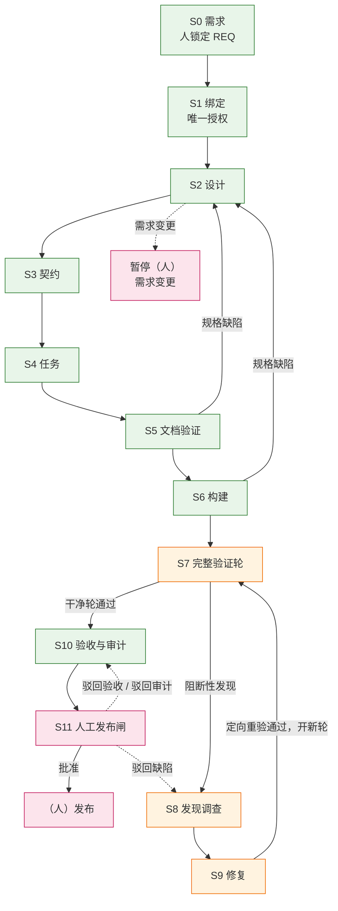
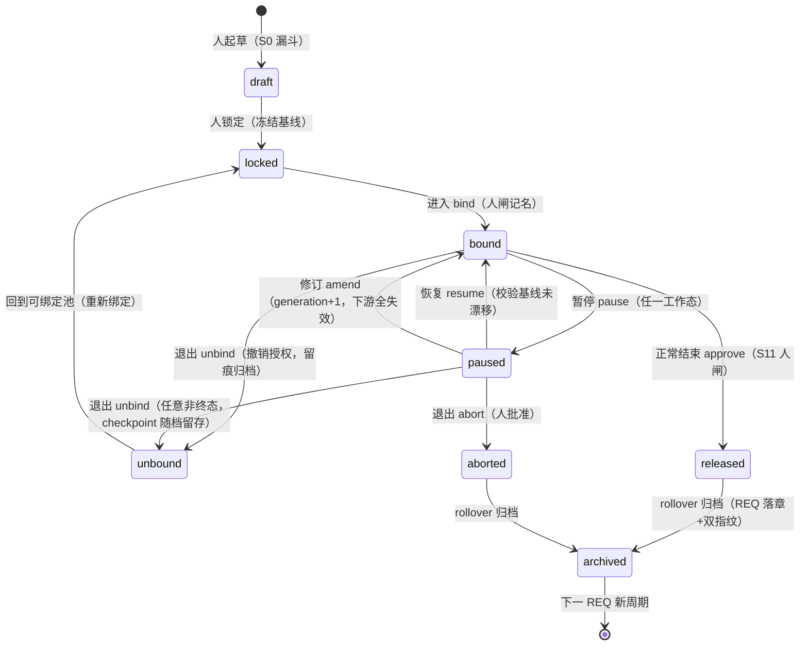

# 生命周期规划 — 第二层：从设计蓝图到确定的实战目标

> 定位：把第一层蓝图（`L1-design-principles.md` 的 D1-D7 与公理）翻译为整个交付生命周期的**确定实战目标**——每个阶段做什么、把控什么、从哪进、从哪出、失败了去哪。
> 层结构（以第一层 §六 的唯一权威定义为准）：第一层 = 工程哲学与设计蓝图；**本文 = 第二层 = 生命周期整体规划（实战目标层）**；第三层 = 各 Stage 详细设计（L3-S0…L3-S11，含工具承载）；第四层 = 跨 Stage 工具机制与治理设计；第五层 = 实现规格与实现；第六层 = 实战运营回灌。
> 本文不涉及任何具体工具与文件——那是第三层的事。每个阶段条目标注它承载的第一层决策（D1-D7）。
> 理论扩充（world-map 蒸馏，双向可追溯）：风险驱动架构（每个控制手段必须对应一个被识别的风险——"没用到的风格=不需要的风险"）、测试作为设计工具（先写测试=先想清楚接口）、Code Review 本质是知识共享而非抓虫、技术债管理（债必须可视、有息、可排期）、自镇定与自适应（无精确模型时的稳定——Lyapunov 单调性）、V&V 双重验证。
> 修订：随第一层演化协议联动修订。

---

## 总览：主干与纠错回路

**失败路由说明**：S5/S6 的规格缺陷回 S2/S3 重做；任何阶段触及需求变更 → 暂停（人）。**S11 的驳回是回滚路**：驳回缺陷直接进 S8 发现调查（修复后仍须全新完整验证轮才能再回 S11，不允许跳轮）；驳回验收/驳回审计回 S10 重做对应环节。图中主干为绿色、纠错回路为橙色、人闸为粉色。

**三条全局铁律**（D6 + C4 + 公理三的流程投影）：
1. **只有干净轮能通向验收**：干净轮的**唯一完整定义以 S7 出口为准**（全部必需维度同轮通过、或带经独立背书理由的不适用 + 无未关闭阻断缺陷 + 无失效证据；沉默不是不适用）。局部重验只能关闭单个缺陷，永远不能代替完整轮（扰动后必须重证全局）。
2. **自动化止步于发布**：发布是不可逆的价值判断，永远由人批准。
3. **每个环节的存在必须对应一个被识别的风险**（风险驱动=消费公理的流程投影）：本层任何阶段若说不出"去掉它会放进来什么失效"，它就是不需要的环节，应当被合并或删除——生命周期设计与架构设计遵守同一条纪律。为此每个阶段设"风险对应"行，答不出该行的环节不配存在。

**本生命周期的能量函数（D7 / Lyapunov 视角）**：定义"未满足的必需验证维度数"为本系统的能量函数。必需维度集合的权威定义归第四层门禁语义设计（第三/四层承接，本文只声明其存在与用途）；验证尚未开始的阶段（S0-S6 主干段）该量取上界（未定义满足项），故单调性观测在进入验证后生效。主干每前进一步它单调不增；任何修复若使它不降反升（修复制造新缺陷），纠错回路立即生效。**收敛性是可观测的**：连续重入同一阶段而不下降 = 振荡信号 = 触发终止保障（见全局规则），而非继续烧算力——"还在修"不等于"在收敛"。

---

## S0 需求设计

| 维度 | 内容 |
|:--|:--|
| 任务 | 把人的意图固化为一份可锁定、可指纹的需求基线：价值、范围、流程、验收标准、UI 影响、未知项 |
| 把控 | **方向**——需求基线的创建与任何修改都是人-only；未经锁定的需求不授权任何下游工作（D6：意图进口） |
| 风险对应 | 去掉 S0 会放进来的失效：意图即兴漂移 → 全部下游在移动靶上工作；agent 自创/自改需求 → 控制对象反客为主 |
| 入口 | 人提出意图 |
| 出口 | 需求被人显式锁定：内容完整（每模块有输入/输出/状态/异常/权限/验收）、优先级确认、UI 影响三值明确、未决问题不阻塞范围 |
| 失败路由 | 停留在本阶段直到锁定；已锁但有缺陷 → 仅经人的修订流程 |

## S1 绑定

| 维度 | 内容 |
|:--|:--|
| 任务 | 将一份人锁定的需求登记为唯一授权对象，建立本轮生命周期的权威起点 |
| 把控 | **授权唯一性**——一个生命周期只绑一个需求；绑定是唯一的授权入口，绑定后权威状态开始记录（D1：权威外置自此生效） |
| 风险对应 | 去掉 S1 会放进来的失效：多个需求并行共享一个状态 → 指纹链互相污染；无显式授权 → 下游工作合法性无从审计 |
| 入口 | 一份锁定需求 + 完整性自检通过 |
| 出口 | 需求指纹入册；授权记录成立；当前阶段被持久投影为"设计" |
| 失败路由 | 完整性不通过 → 回 S0 补需求；已有绑定在身 → 走需求变更（人） |

## S2 设计

| 维度 | 内容 |
|:--|:--|
| 任务 | 产出架构决策，以及（UI 影响存在时）覆盖模块全量的场景模型与原型真相包 |
| 把控 | **深度与全量性**——场景模型必须覆盖模块完整行为（含拒绝路径），不允许"只做本次改动相关"的私有副本；UI 影响为"未知"时禁止继续（D4：设计产物字段即思考逼问；防 Eroding Goals） |
| 风险对应 | 去掉 S2 会放进来的失效：契约没有共同事实来源（各自想象系统）→ 集成爆炸；场景不全 → 拒绝路径全靠运行期发现 |
| 理论根据 | **风险驱动架构**：每个架构决策必须对应一个被识别的风险并记录决策-风险-后果-备选（决策记录纪律）；"没用到的风格=不需要的风险"反向适用于本层——设计环节本身也要能指认其风险 |
| 入口 | 已绑定的需求 |
| 出口 | 架构决策覆盖契约所需的全部决定（每项决策有对应被识别的风险与后果记录）；UI 影响为"有"时模块真相包齐备：全量场景均有结果、覆盖矩阵每用例可指认结果、拒绝路径非空 |
| 失败路由 | 设计触及需求语义 → 需求变更（人）；否则迭代本阶段产物 |

## S3 契约

| 维度 | 内容 |
|:--|:--|
| 任务 | 把需求+设计翻译为分端的执行契约（前端/后端/同步），与验收标准双向可追溯 |
| 把控 | **追溯完备性**——每条验收标准至少映射到一条契约条款；UI 相关契约必须引用模块真相包（锁定指纹）；UI 门未过不得锁契约（D1：契约是后续一切指纹链的一环） |
| 风险对应 | 去掉 S3 会放进来的失效：需求直拆任务 → 前后端各自想象接口 → 集成爆炸；无追溯映射 → 验收标准被静默丢失 |
| 理论根据 | **接口即契约**：分端执行的前提是双方对同一事实源（需求+设计）有共同且锁定的理解；契约就是防"各自想象"的共同事实声明 |
| 入口 | 设计出口达成 |
| 出口 | 契约集覆盖全部需求；条款↔验收映射完整；每份契约带稳定性元数据 |
| 失败路由 | 发现需求缺口 → 回 S2 或需求变更（人） |

## S4 任务拆分

| 维度 | 内容 |
|:--|:--|
| 任务 | 把契约拆为单职责、可独立验证的任务：读序、允许/禁止路径、完成判据（可执行的收尾契约）、依赖关系 |
| 把控 | **单职责与可验证性**——每个任务必须有可判定的完成判据（声明"什么证据存在即算完成"，含修复前失败/修复后通过的测试要求）；写路径重叠必须有显式串行归属；依赖图无环（D4：收尾契约字段逼出"完成"的可判定定义） |
| 风险对应 | 去掉 S4 会放进来的失效：任务含混多职责 → 验证无法定位责任；无完成判据 → "差不多完成"混过门 |
| 理论根据 | **测试作为设计工具**：收尾契约（先声明"什么测试存在即完成"）就是 TDD 纪律在任务层的投影——先想清楚判据再动手；小而专的任务优于大而全（<400 行式拆分纪律） |
| 入口 | 契约出口达成 |
| 出口 | 三项均可机械判定：依赖图无环 + 每条款被至少一任务覆盖 + 每任务有收尾契约 |
| 失败路由 | 发现契约缺口 → 回 S3 |

## S5 文档验证（进入实现前的最后闸）

| 维度 | 内容 |
|:--|:--|
| 任务 | 独立审查整条规格链：需求↔设计↔契约↔场景的一致性 + 任务批次的可执行性；通过后原子锁定执行批次 |
| 把控 | **独立性与原子性**——审查者不得是产出者；一致性（每条验收→条款→任务）与可执行性（收尾契约可行、链接在指纹上有效）**并行独立**审查；锁定必须原子（不允许半锁状态）（D6：自己不能给自己签收；防"错误进代码"——纸上修复成本≈0） |
| 风险对应 | 去掉 S5 会放进来的失效：规格链自相矛盾 → 全部下游实现作废；半锁批次 → 实现与证据引用不同版本 |
| 理论根据 | **Code Review 本质是知识共享而非抓虫**：S5 的最大价值不止拦截矛盾，而是让独立审查者建立对规格链的心智模型——这份理解直接转化为后续验证轮的判断力（审查即培训，被同步的心智模型会在 S7 复利） |
| 入口 | 任务批次出口达成 |
| 出口 | 两路独立审查通过 + 无未处理发现 + 规格链在精确指纹上原子锁定 |
| 失败路由 | 发现 → 修复对应层产物后仅重审受影响职责；触及需求歧义 → 需求变更（人） |

## S6 构建

| 维度 | 内容 |
|:--|:--|
| 任务 | 按锁定批次实现：专职构建者完成各自任务、运行自有测试、如实报告 |
| 把控 | **权限与如实性**——理解验证通过之前不授予写权限（读回批准是授权前提）；授权范围=多重边界交集；报告必须如实区分"完成/受阻/失败"，范围偏差为零才算完成（D2+权限把控；D4：收尾契约在实现时被逐条兑现） |
| 风险对应 | 去掉 S6 把控会放进来的失效：未理解即授权 → 大规模返工；范围蔓延 → 验证面失控；报告美化 → 半成品混过门 |
| 理论根据 | **测试作为设计工具**：任务的收尾契约在此被逐条兑现（测试=接口的第一次调用，先于实现存在）；**报告纪律**（why>what、如实的受阻/失败）——"看起来跑通"不算完成 |
| 入口 | 原子锁定的执行批次 |
| 出口 | 每个锁定任务有完成报告；每条收尾契约断言有可指认的兑现证据（由任务声明的判据给出）；单元与集成测试通过 |
| 失败路由 | 规格缺口 → 回 S5（再路由 S2/S3）；实现受阻 → 记录阻塞继续其余；**实现后发现的缺陷一律走 S8，禁止顺手修** |

## S7 完整验证轮

| 维度 | 内容 |
|:--|:--|
| 任务 | 同一轮内的完整发现：交付符合性（对照规格）、工程质量（代码/测试/安全等）、真实用户行为（真实浏览器走全量场景）三组正交验证 |
| 把控 | **真值与覆盖完备**——按用例计数而非按职责计数（场景包声明的每个用例必须有当轮结果，沉默不是不适用）；真实交互证据（拒绝 URL 直跳/直写数据/直调接口的替代路径）；每个"完成"结论由机器可公证事实 + 独立背书支撑；证据同轮同代际且未失效（D6 全量落地；C3 的主战场） |
| 风险对应 | 去掉 S7 会放进来的失效：自信但错误的实现直接进发布（C3 的直接后果）；三组缺任一 → 单一视角盲区（符合规格≠质量达标≠用户可用） |
| 理论根据 | **V&V 分离**：交付验证=Verification（对照规格），E2E=Validation（对照用户真实行为）；**测试金字塔经济学**：廉价机械核对（存在/指纹/预期事实匹配）大量做在先，昂贵对抗性判断（独立佐证）少量做在后，且机械不过者不进入判断——每份算力买更多确定性；**Code Review=知识共享**：审查者不是格式检查器，是活的对抗面 |
| 入口 | S6 出口或 S9 定向重验通过后的新轮 |
| 出口 | 干净轮：全部必需维度同轮通过（或带理由的不适用）+ 无未关闭阻断缺陷 + 无失效证据；或产出阻断性发现进 S8 |
| 失败路由 | 阻断发现 → S8；证据不完整/过期 → 本轮重开；触及需求 → 暂停（人） |

## S8 发现调查

| 维度 | 内容 |
|:--|:--|
| 任务 | 把验证发现转化为证据支撑的规范缺陷报告：先复现，再深查根因（命名错误**类别**）、影响范围、同类合并、修改边界，最后形成带收尾契约的修复计划 |
| 把控 | **深度**——禁止"看一眼就派修"：确定性复现是归因前提；根因必须是**类别**（可据此搜同类）而非一行描述；影响范围决定重验宽度；同根因不同表现必须合并；修复边界（允许/禁止）先行；同一边界内的失败重演触发根因重查而非重试（D4 深查字段；Fixes that Fail 的解药） |
| 风险对应 | 去掉 S8 深度会放进来的失效：浅修 → 同机制反复复发（bug 越修越多）；一因多果被拆成 N 个缺陷 → N 次修复 N 次风险；无边界修复 → 修复制造新缺陷 |
| 理论根据 | **Fixes that Fail 系统原型**：症状缓解强化了对治标的依赖（负担转移）；**Postmortem 纪律**：无指责、影响范围、时间线、根因、可行动的后续——缺陷报告即小型 postmortem |
| 入口 | S7/S10 的阻断性发现 |
| 出口 | 每个发现被处置为：被接受的规范缺陷（含根因类别+范围+边界+收尾契约）/最终否决（附无产品变更理由）/重复关联/规格重做/需求变更（人） |
| 失败路由 | 根因存疑 → 留在本阶段；规格层问题 → 回 S2；需求问题 → 暂停（人） |

## S9 修复

| 维度 | 内容 |
|:--|:--|
| 任务 | 按缺陷报告的边界修复：受边界约束的授权、落地修复、失效受污染的历史通过证据、原发现职责定向重验 |
| 把控 | **边界与证据诚实**——授权范围按缺陷边界（非原构建范围）；实际改动必须落在声明的允许范围内且不触禁止范围（越界即拒绝）；修复使受影响的历史"通过"失效并换新证据；定向重验只证明该缺陷关闭（D6；D5：失效证据是门禁诚实性的前提） |
| 风险对应 | 去掉 S9 把控会放进来的失效：修复越界扩散 → 修一个坏两个；陈旧"通过"证据继续被门引用 → 门给谎言盖戳 |
| 入口 | 被接受的缺陷报告 |
| 出口 | 修复落地 + 定向重验通过 + 受污染证据已失效；持久记录"仅差完整轮" |
| 失败路由 | 定向重验失败 → 回 S8 重查（同缺陷）或开新缺陷（根因不同）；修复触及规格 → 回 S2 |

## S10 验收与发布审计

| 维度 | 内容 |
|:--|:--|
| 任务 | 汇编验收材料（需求覆盖、证据地图、迁移与回滚），执行系统级发布审计（不变量：状态机、事务、并发、数据模型、调用点、可观测性） |
| 把控 | **系统级不变量**——审计不是又一次代码审查：它检查跨变更的系统性质（迁移进发布路径、并发安全、无出口状态等）；审计发现缺陷同样走 S8→S9（D6：验收对照需求，审计对照系统不变量） |
| 风险对应 | 去掉 S10 审计会放进来的失效：单轮全绿但系统级不变量被本次变更破坏（迁移缺失、并发窗口）——干净轮测的是"这次改动对不对"，审计测的是"系统还站得住吗" |
| 理论根据 | **技术债管理**：验收材料必须显式登记本次引入的已知妥协（债务可视化：类型/影响/修复成本/负责人），而非只报喜——"承认债、量化债"的团队才是健康的；发布节奏即还债节奏（每轮允许小比例还债） |
| 入口 | 干净轮记录 |
| 出口 | 验收材料与权威状态一致 + 审计通过（或带非阻断风险）+ 发布就绪包成立（含技术债登记） |
| 失败路由 | 审计阻断发现 → S8；构建报告不完整（非缺陷）→ 回 S6；需求缺口 → 暂停（人） |

## S11 人工发布闸

| 维度 | 内容 |
|:--|:--|
| 任务 | 向人提交发布就绪包（已完成工作、唯一未决事实、影响、建议、恢复点），自动化全部停止 |
| 把控 | **人的终局判断**——这是不可默认的决策闸：人必须给出唯一明确处置（批准/搁置/驳回缺陷/驳回验收/驳回审计/中止），每个处置映射到固定去向；任何默认、缺席、或自动化推断都不构成批准（C4；负空间的执行点） |
| 风险对应 | 去掉 S11 会放进来的失效：不可逆发布被自动化执行 → 错误无法回滚；门绿被误当授权 → "没人拦"≠"有人批" |
| 入口 | S10 出口 |
| 出口 | 人的显式处置；批准 = 本轮生命周期的授权终点（发布动作本身仍由人执行） |
| 失败路由 | 驳回缺陷 → S8；驳回验收 → S10；驳回审计 → S10；搁置 → 挂起待人再议（不推进不回退）；中止 → 终态，经人授权归档 |

---

## REQ 授权生命周期（跨阶段控制面——七动词全图）

> 本节是原"暂停语义/基线变更/单需求单周期"三行的正式化与扩展。REQ 的授权生命周期**不属于任何单一 stage，属于控制面**：各 stage 只拥有自己的暂停触发器与失败路由，控制面承载动词本身。REQ 文件状态只回答"这份文件是什么"（draft=草稿 / locked=冻结基线——不是"进行中" / changed=修订中 / archived=生命周期已关闭）；"这个需求走到哪了"的唯一权威是 runtime（活跃）与 runtime-archive（终态）——D1。人闸是七个动词的共同形态：机器公证事实（检查点/指纹/journal），人做授权决策（C4）。

> 图注：本图混排两台状态机——REQ **文件**状态（draft/locked/archived）与 **runtime** 状态（bound/paused/unbound/released）。权威是 runtime（D1）；文件状态只回答"这份文件是什么"，bindable 判定以 runtime 归档扫描为准。

| 动词 | 语义 | 人闸 | 失败路由 / 约束 |
|:--|:--|:--|:--|
| 进入 bind | 人锁定的 REQ 经显式命令登记为唯一授权对象 | 人（记名） | 一 runtime 一活需求；绑定是唯一授权入口 |
| 暂停 pause | 七个工作态任一可暂停；检查点快照游标+指纹+generation+round（单次捕获不变式） | 人或机制触发 | 暂停不丢状态；恢复前一切下游工作静默（投影指路） |
| 恢复 resume | 人批准 → 逐文件核对暂停时刻指纹 → 回原位置 | 人 | 漂移即拒（防移动靶）；漂移了走修订 |
| 修订 amend | 周期内换基线：generation+1、下游证据全失效、新 REQ 入册且旧 REQ 保持锁定 | 人 | 与重绑的边界：周期不关、runtime 不换 |
| 退出 unbind | 非终态任意时刻撤销授权：runtime 归档（disposition=unbound）+ 新 inactive + REQ 回可绑定池 | 人（记名+理由） | 撤销≠抹除：弃周期全程可审计；在飞实体软门 |
| 退出 abort | paused 或 S11 处终止：aborted 终态 → 归档 | 人 | 与 unbind 的边界：abort 是终态语义（周期关闭） |
| 正常结束 approve→rollover | 发布授权（终态）→ 归档 runtime、REQ 文件落章 archived（双指纹入 journal） | 人 | 自动化止步于发布；落章只在 rollover（周期正式关闭点，统一覆盖 approve/abort 两终态） |
| 重新绑定 rebind | unbind 后 REQ 回池可再绑；rollover 后新周期可绑任意 locked；amend 是周期内换基线不是重绑 | 人 | 同 REQ 终态后立即重绑无冷却护栏（如实记录，待实战观测） |

**三条裁决**（承接 owner 2026-08-15 拍板链）：① locked 语义收窄为文件级事实，生命周期权威归 runtime；② archived 落章在 rollover 时刻，只改状态行、基线内容永不变，journal 记 from-sha/to-sha 双指纹——第一原则精化为"基线内容永不变，生命周期元数据只在人闸点由 harness 迁移且留双指纹"；③ unbind 从任何非终态可用（人闸+留痕+在飞软门），与 abort（终态语义）分立。**终批状态（2026-08-15 owner 已批，按工程建议执行）**：①②③ 全部生效——② 落章时刻定为 **rollover**；L3-S1 §5.2 已按此固化控制面语义。另：REQ 文件的 archived 是**可读性镜像**（消费者=浏览 docs/requirements/ 的人），bindable 判定的权威是 runtime-archive 扫描，不以文件状态为准。

---

## 跨阶段全局规则

| 规则 | 内容 | 承载 |
|:--|:--|:--|
| 暂停语义 | 任何阶段可暂停（人的决策或完整性故障）；恢复时校验基线未漂移，漂移则失效全部下游证据重来 | D1 + D5 |
| 基线变更 | 基线代际变更 → 失效全部下游证据；修复后必须完整重证。变更经人批准后自 S1 重新绑定，并按漂移范围重定入口阶段（仅规格层漂移可直入 S2） | D6 |
| 终止保障 | 单缺陷修复次数、同判据失败、完整轮总数均有上限，超限暂停交人——纠错回路不许无限振荡 | C4 + 防发散 |
| 阶段推进 | 推进由"产物齐备 + 门判定"驱动，禁止人工拨表；人的手动仅限初始化/恢复/闸门 | D2 + D3 |
| 单需求单周期 | 一个生命周期绑一个需求；终态后经人授权归档重启新周期 | 授权唯一性 |
| 收敛性观测 | 连续重入同一阶段而未满足维度数不降 = 振荡信号 → 触发终止保障而非继续投入（D7：能量函数不单调下降即失稳） | D7 + C5 |
| 债务登记 | 每个周期验收时登记已知妥协（类型/影响/成本/负责人）；债可累积但必须可视、可排期。**向后兼容态度：非必须，不兼容**——向后兼容不是默认美德，是必须辩护的技术债：每次选择兼容（而非干净断裂）都须记录决策理由、影响面与移除路径（责任人+条件），随债务登记一并入册；无登记的兼容即无声负债 | 技术债管理 + owner 裁定（2026-08-18） |
| 单一验证分母 | S2 场景包的 `case.id` 是 S2→S7 验证链的唯一分母；REQ 验收标准（AC）与 CASE 必须双向可达（每条 AC 至少一条 CASE 或经背书的不适用）——分段手抄不成链 | D1 + D6 |

---

## 层间校验清单（本文对第一层的忠实性）

- 每个阶段的"把控"列都能指认 D1-D7 中的至少一条 ✔（已逐条标注）
- 公理经由主干决策落地（公理不是独立条目，是 D 的根据）：公理一→D4/D6 的所有落点；公理二→S5 独立审查/S7 机器公证与独立背书分离；公理三→铁律 3 风险对应行；公理四→终止保障上限与验证投入定价；公理五→各失败路由均为"说清缺什么的正向路由"而非裸拒绝 ✔
- 六项把控全覆盖：方向(S0/S1)、真值(S7/S10)、深度(S8/S9)、状态(全局规则)、权限(S5/S6/S9)、节奏(S7/S11/终止保障) ✔
- 五条物理约束各有落点：C1→权威外置(S1 起生效)、C2→自然路径推进+边界授权、C3→S7 三重背书、C4→S0/S11 人闸+保险定价、C5→失败路由均为显式回路而非死路 ✔
- 未出现任何具体工具/文件/协议名 ✔（留给第三层）

## 变更记录

| 日期 | 版本 | 变更 | 依据 |
|:--|:--|:--|:--|
| 2026-08-14 | v1.0.0 | 初版：S0-S11 实战目标规划（任务/把控/入口/出口/失败路由 + 全局规则 + 层间校验），由第一层蓝图 D1-D6 推导 | owner 层次指示：第二层 = 哲学 → 确定实战目标，工具留第三层 |
| 2026-08-14 | v1.1.0 | world-map 理论扩充：①全局铁律增第三条**风险驱动**（每个阶段必须指认其对应风险，新增"风险对应"行）；②总览增**能量函数/收敛性观测**（Lyapunov 视角，振荡=终止保障触发）；③S2 风险驱动架构、S4/S6 测试作为设计工具、S5 Code Review=知识共享、S7 V&V+金字塔经济学、S8 Fixes that Fail+Postmortem、S10 技术债管理；④全局规则增"收敛性观测""债务登记" | world-map 深读（risk-driven-architecture / testing-as-design / code-review-purpose / tech-debt / self-stabilizing-adaptive） |
| 2026-08-14 | v1.2.0 | 联合复审修正：①铁律 3 承载指认为**公理三的流程投影**（原"风险驱动"悬空引用）；②能量函数/收敛性观测挂靠第一层新增的 **D7**（原悬空）；③层间校验扩至 D1-D7。层声明与第一层 §六 的六层权威定义对齐 | 第一/二层联合复审 |
| 2026-08-14 | v1.3.0 | 对抗性终审修正：①头部 D1-D6 过期引用改 D1-D7；②**S3 补"风险对应"行**（原违反铁律 3）+S3 补理论根据；③干净轮双定义合一（铁律 1 声明 S7 出口为唯一完整定义，"不适用"须独立背书）；④能量函数补权威指派（维度清单归第四层）与前半段取值约定；⑤S2/S4 出口判据收紧为可判定；S6 出口去实现术语；⑥S11"非终态决策闸"→"不可默认的决策闸"，搁置/中止语义分离；⑦基线变更补恢复路径；⑧层间校验补公理落点映射 | 对抗性审查（sub-agent 终审） |
| 2026-08-14 | v1.3.1 | 总览流程图从 ASCII 改为 mermaid（主干/纠错回路/人闸三色区分），语义不变 | owner 指示 |
| 2026-08-14 | v1.3.2 | 总览图补 S11 驳回回滚路（原图缺失）：驳回缺陷 → S8、驳回验收/审计 → S10；注明驳回缺陷经修复后须全新完整验证轮回 S11、不允许跳轮。表格路由本已含此路径，本修为图-表对齐 | owner 复核：S11 不通过须有回滚路 |
| 2026-08-14 | v1.3.3 | 头部层声明与 L1 v2.3.0 对齐（第三层=各 Stage 详细设计） | L1 层定义升级 |
| 2026-08-15 | v1.4.0 | 新增「REQ 授权生命周期」节：七动词全图（进入/暂停/恢复/修订/退出 unbind/退出 abort/正常结束/重新绑定）+ 状态图 + 三条裁决（locked=冻结基线语义收窄；archived 落章在 rollover 双指纹；unbind 任意非终态人闸）。原全局规则表的"暂停语义/基线变更/单需求单周期"三行由本节正式化承接 | owner 指示：必须考虑完整生命周期——REQ 可退出、正常结束、暂停、恢复、重新绑定；L1 经映射纪律核验无需修订 |
| 2026-08-15 | v1.4.1 | 全局规则表新增「单一验证分母」（case.id 为 S2→S7 唯一验证分母，AC↔CASE 双向可达）——S2 v4.0.0 联合审查的结构承接 | owner 指示：S2 与关联 stage 联合审查 |
| 2026-08-18 | v1.4.3 | 「债务登记」全局规则增向后兼容态度（owner 裁定）：非必须不兼容——兼容是必须辩护的技术债，须登记决策理由/影响面/移除路径，无登记即无声负债 | owner 提示（2026-08-18） |
| 2026-08-17 | v1.4.2 | 状态图补图注：图中混排两台状态机（REQ 文件状态 draft/locked/archived 与 runtime 状态 bound/paused/unbound/released），权威是 runtime（D1），文件状态只回答"这份文件是什么"；changelog 排序修正 | L1 价值观复审（sub-agent）×2：图-文一致性 |
| 2026-08-20 | v1.4.4 | 头部层声明与 L1 v2.4.0 对齐：L4 改为跨 Stage 工具机制与治理设计，具体实现规格与实现顺延至 L5 | owner 指示：建立横跨多个 L3 的抽象工具层 |
