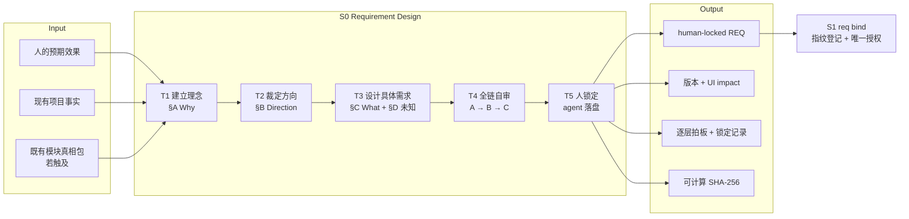
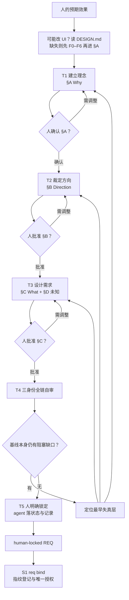

# L3-S0 — 需求设计（Requirement Design）

> 层：第三层 ｜ 上游：L2 §S0 ｜ 下游：S1 绑定 ｜ 机制事实经当前模板、skill、协议与实现核实
>
> 阅读顺序：先读 §1～§3 建立阶段主线；真正执行 S0 时再按 §4 逐步展开；§5～§8 供设计审计与遇错时查阅。本文先讲工作，再讲机制——工具只在它服务的步骤中出现。

## 1. 第一层：S0 的立意与目标

### 1.1 为什么需要 S0

人的一句意图不能直接成为下游授权。它通常同时混着价值诉求、口语歧义、隐含前提、实现偏好和未说出的边界；若直接进入设计，后面每一层都会在不同理解上继续放大偏差。

S0 要先解决三个根问题：

1. **意图是否被正确理解**：我们究竟想改变什么，为什么值得做，成功是什么样；
2. **方向与边界是否已经裁定**：做什么、不做什么、哪些约束真的是硬约束；
3. **需求是否足以成为共同基线**：流程、异常、权限、验收、非功能、迁移与 UI 影响能否被下游无歧义消费。

因此，S0 的本质不是“把需求写进模板”，而是完成一次从**人的预期效果**到**人锁定的需求基线**的收敛。这个基线是后续设计、契约、任务和证据链的语义根；S1 再把它登记成运行时的指纹根（D1、D6）。

### 1.2 阶段目标与完成定义

| 项目 | 定义 |
|:--|:--|
| 输入 | 人用自然语言表达的预期效果；现有项目事实；相关模块的既有真相包（若触及） |
| 要搞清楚 | Why（价值与负空间）→ Direction（方向与约束）→ What（可追溯的具体需求） |
| 核心工作 | agent 负责完整设计并逐层收敛；人只确认意图并裁定不可派生的价值判断 |
| 输出 | `docs/requirements/REQ-{id}.md`，顶部状态为 `locked`，有版本、UI impact、逐层拍板记录和最终锁定记录 |
| 完成 | §A/§B/§C 已逐层获人确认；不存在阻碍“基线本身成立”的未决项；剩余未知已标明影响与阻塞范围；锁定文件可计算 SHA-256 |
| 下一阶段 | S1 用 `req bind` 复核元数据、计算指纹、登记唯一授权对象并进入 S2 |

### 1.3 Overview：输入、主步骤与输出

这张图只表达阶段骨架：输入经过五项任务后收敛为一份可交给 S1 的 locked REQ。§3 的工作流图再展开每层拍板、返工和阻塞缺口的控制逻辑。

### 1.4 S0 的边界

S0 负责需求语义，不负责下游实现设计：

- **负责**：价值、范围、负空间、需求级方向、硬约束、FR/NFR、流程与拒绝路径、权限、验收标准、迁移范围、UI impact、Foundation 引用（版本 / Surface / inherit-extend-exception）、未知项、人的拍板与锁定记录；
- **不负责**：架构和 ADR 细化（S2）、场景真相包（S2）、FE/BE/SYNC 契约（S3）、任务拆分（S4）、实现与验证、重写 Project Design Foundation（Kernel/Grammar 住在 `docs/design/`，S0 只引用）；
- **不执行**：绑定 runtime。`locked` 是 S0 的需求语义冻结，`req bind` 是 S1 的生命周期授权，两者不能合并；
- **不保存**：人的逐字原话。REQ 保存的是 agent 消歧、补全前提后由人确认的权威整理稿；
- **不回填**：§F 只是下游索引骨架与权威居所说明，S0 不填、下游也不回写；S3 的 `CONTRACTS-{id}` 索引才是活矩阵唯一居所。

## 2. 第二层：S0 的任务分解

S0 只有五项主任务。§D“待澄清”不是独立阶段，而是贯穿 T1～T3 的旁路账本：能由事实和工程判断派生的，agent 当场解决；不能派生的价值判断，随当前层完整提案交人裁定；允许后置的未知，明确记录阻塞范围。

| 任务 | 要解决的问题 | 主要动作 | 阶段产出 |
|:--|:--|:--|:--|
| T1 建立理念 | 人真正想改变什么，成功和明确不做分别是什么 | 消歧、补隐含前提、识别利益相关者与术语，收敛 §A | 人确认的 Why 基线 |
| T2 裁定方向 | 有哪些可行方向，为什么选这一条，哪些“必须”确实不可打破 | 发散 2～3 个方向、剪枝、记录否决理由、检验硬约束，收敛 §B | 人批准的方向与边界 |
| T3 设计具体需求 | 下游究竟要满足哪些可判定事实 | 拆 FR/NFR、流程/异常/权限/验收、迁移范围和 UI impact，收敛 §C；未知入 §D | 人批准的 What 基线 |
| T4 全链自审 | A→B→C 是否一致、可实现、可判定、可维护 | 以实现者/用户/维护者三种身份攻击推理链，修复后形成锁定提案 | §E 的自审结论与完整锁定提案 |
| T5 人锁定并交接 | 这版需求能否正式成为唯一基线 | 人给出明确锁定手势；agent 写状态、版本和锁定记录；准备 S1 输入 | human-locked REQ |

这个拆分有一个不变量：**下一层只能从上一层已确认的结论推导**。T2 不能在 T1 未确认时先选方向，T3 不能在 T2 未裁定时先堆功能点；否则文档虽然填满，推理链仍是断的（D4）。

## 3. 从意图到锁定基线的完整工作流

每个 T1～T3 内部都使用同一个小漏斗：

> 充分发散 → 用上一层结论剪枝 → 自审 → 形成完整提案 → 最多上交 3 个真正的价值拍板点 → 人拍板 → 立即把拍板记录写入 §E

三条流程纪律：

1. **完整提案才上交**：推荐方案、理由、被否方案及代价缺一不可；不得把一组开放问题倒给人；
2. **拍板后才下钻**：等待人的 §A/§B/§C 拍板是正常流程，不是阻塞或失败；未落盘的拍板不构成权威事实（C1、D1）；
3. **发现矛盾回到来源层**：不要在 §C 用补丁掩盖 §A/§B 的冲突；定位到最早失真的层重新收敛。

## 4. 第三层：每项任务如何被引导和承载

这一层才讨论模板、skill、harness 和 hook。每个机制必须挂在一个明确任务上；没有任务消费者的机制不进入 S0（公理三）。

### 4.1 T1 — 建立理念：先确认我们为什么做

| 维度 | 设计 |
|:--|:--|
| 要搞清楚 | 预期效果、背景痛点、成功状态、明确不做、利益冲突、统一术语 |
| agent 怎么做 | 过滤口语歧义并补出隐含前提，把人的表述整理为 A1；再推导 A2～A4、利益相关者和术语 |
| 如何引导 | `requirement-funnel` 要求先发散可能解释，再用人的原意剪枝；上交完整 §A 提案而不是逐题访谈 |
| 模板承载 | REQ §A：A1 预期效果、A2 背景与痛点、A3 成功状态、A4 负空间、利益相关者、术语表 |
| 谁判定 | agent 判断表达是否完整；人只确认 A1 是否忠实，并裁定范围/价值冲突 |
| 完成产出 | 获人确认的 §A；拍板记录立即进入 §E |

关键设计：A1 不是对话抄录。抄原话会把歧义写进基线；agent 的职责是给出自己愿意负责的结构化理解，再让人确认（D4、D6）。

### 4.2 T2 — 裁定方向：把选择和约束说清楚

| 维度 | 设计 |
|:--|:--|
| 要搞清楚 | 可行方向、推荐方向、被否方向的代价、真正不可打破的约束、关键假设与风险 |
| agent 怎么做 | 设计 2～3 个可行方向，剪枝为一个推荐；逐条追问“打破这个必须的代价是什么”，答不出则降级为偏好 |
| 如何引导 | `requirement-funnel` 限制每层最多 3 个价值拍板点，逼 agent 先完成中度复杂度判断再上交 |
| 模板承载 | REQ §B：方向取舍表、硬约束表、关键假设与风险表 |
| 谁判定 | agent 负责方案与推荐；人裁定方向、风险容忍度和不可派生的硬约束 |
| 完成产出 | 获人批准的 §B；每个否决方向保留一句理由，供 S2 识别决策上下文 |

边界提醒：§B 只做到需求级方向和约束，不在这里写架构方案。需要数据模型、状态机、接口或部署设计时，记录为 S2 输入而不是越层完成。

### 4.3 T3 — 设计具体需求：让下游知道什么算对

| 维度 | 设计 |
|:--|:--|
| 要搞清楚 | FR/NFR、主流程和拒绝路径、输入输出与状态、权限、验收、迁移边界、UI 影响、未知项 |
| agent 怎么做 | 每条 FR 指回 §A；流程同时写正常与异常；AC 写成换一个人也能得到同样结论的判据；NFR 带指标或证据；迁移列出真实边界 |
| 如何引导 | `requirement-funnel` 以“不可追溯即范围蔓延”“不可判定即不能验收”逼问；可派生问题由 agent 自行解决，不把设计劳动转移给人 |
| 模板承载 | REQ §C 的需求点、流程与异常、AC、NFR、迁移范围、UI 影响；§D 记录仍需后置处理的未知及其阻塞范围 |
| 机器如何接力 | S1 `req bind` 只解析顶部 `UI impact` 三值并复核元数据；`unknown` 可锁定，但 S2 的 `ui_impact_resolved` guard 不允许它继续混入契约阶段 |
| 谁判定 | agent 对完整性、可实现性、可判定性负责；人只裁定范围、优先级、风险容忍和无法派生的业务取舍 |
| 完成产出 | 获人批准的 §C；§D 中不存在阻碍需求基线成立的未决项，后置未知都有明确消费者和阻塞点 |

UI impact 的唯一机器锚点是 REQ 顶部字段；§C 只回显，不产生第二份事实。`none / changed / unknown` 是风险路由，不是含糊措辞：`unknown` 的价值是如实登记不确定性，并把它停在正确的下游门口（D1、D3）。

### 4.3.1 消费 Project Design Foundation

S0 不建立、不重写项目级设计基础。权威定义在 [L4 项目级设计基础](L4-project-design-foundation.md)，实现与规则见 `docs/rules/design-foundation.md`。

前端相关 REQ 在 T3 只声明关系：

- Foundation reference（`DESIGN.md` 版本 / `pending-foundation` / `N/A`）；
- 受影响 Surface；
- inherit / extend / exception。

若预期效果可能改界面，**进入 §A 之前**读 `DESIGN.md`。Foundation 缺失或不足时先返回 F0～F6（`skills/design-foundation`）并由人发布，再开始漏斗、再锁定 REQ。不能用 §B 几句风格描述替代项目级基础。

**诚实缺口**：当前 Runtime 与 PTR 都不会机械阻断缺失的 Foundation；提示词与 `requirement-funnel` 的 0.5 步是默认行为，不是已接线硬门。

### 4.4 T4 — 全链自审：审推理，不审格式

| 维度 | 设计 |
|:--|:--|
| 要搞清楚 | A→B→C 是否一致；是否有不可实现、会被误读或难以维护的条目；负空间和约束是否互相打架 |
| agent 怎么做 | 实现者视角找“做不出来”的 AC；用户视角找歧义；维护者视角找长期冲突；发现后先修，不能派生的价值冲突才上交 |
| 如何引导 | `requirement-funnel` 在每层上交前轻审、锁定前全审；要求攻击推理链，而不是重新读一遍字段 |
| 模板承载 | §E 的一段自审结论：审过什么、修了什么、仍留了什么风险或旁注 |
| 为什么不用 checklist | 勾选只能证明“看过”，不能证明“想过”；结构字段已经承担可机械的完整性，身份互换承担语义深度（D4、公理四） |
| 完成产出 | 一份可上交的锁定提案，而不是“还有若干问题请人回答”的半成品 |

### 4.5 T5 — 人锁定与交接：把提案变成基线

| 维度 | 设计 |
|:--|:--|
| 锁定动作 | 人在对话中明确同意锁定；agent 依据该授权把顶部状态置为 `locked`，填写版本、操作人、日期和 §E 锁定记录 |
| S0 当场成立的事实 | 需求语义已冻结；根据 change-control，任何后续目标/范围/优先级/验收变化都必须走 human-only 修订，不能用聊天悄悄覆盖 |
| S1 才成立的事实 | `req bind` 复核 locked/版本/文件名/UI impact/SHA，把 REQ 写入 runtime `bound_req` 与 `documents[]`，建立 generation=1 和唯一授权 |
| 机械冻结何时生效 | bind 后进入 S2，REQ 已在 `documents[]`，hook 才能以登记指纹机械阻止对当前及旧代 REQ 的改写；S0 锁定到 S1 bind 之间依赖人锁定纪律，不虚称已有运行时拦截 |
| 路径口径 | 首次基线位于 `docs/requirements/REQ-{id}.md`；已绑定基线若修订，旧代不覆盖，新代走通用重做路径 `docs/req/versions/{REQ-ID}/g{N+1}/...` |
| 完成产出 | locked REQ + 锁定记录 + 可计算 SHA-256，交给 S1；S0 本身不执行 bind |

这里有两个连续但不同的人闸：S0 的锁定回答“这是不是我要的需求”，S1 的 bind 回答“是否授权这个生命周期以它为唯一对象”。前者管方向，后者管授权，不是重复审批（D6）。

## 5. 职责分布与覆盖审计

### 5.1 每项职能落在哪里

| 职能 | 主责 | 承载位置 | 消费者 | 是否与别处重叠 |
|:--|:--|:--|:--|:--|
| 理解人的意图 | agent 整理、人确认 | §A1 + T1 拍板 | §A2～§C、S2 | 不重叠：agent 形成判断，人校验忠实度 |
| 需求设计完整性 | agent | §A～§D 字段 + requirement-funnel 过程 | S2/S3/S4/S5 | 不交给机器猜语义；下游只复用或独立审查 |
| 价值取舍 | 人 | 每层 ≤3 个拍板点 + §E 记录 | 当前层与审计 | human-only，agent 必须先给推荐方案 |
| 字段结构与追溯锚 | REQ 模板 | 顶部元数据、§A～§E | agent、S1、下游检查 | 模板管形状，skill 管思考过程，职责正交 |
| UI 影响路由 | agent 声明、人确认 | 顶部 UI impact | S1 parser、S2 guard | 多机制串联同一事实，不是多份事实 |
| 项目级设计基础引用 | agent 检查并声明，人只确认方向级 Foundation（Loop 外） | REQ §C Foundation 字段；权威在 `docs/design/DESIGN.md` | S2 Derivation Note | S0 不复制 Kernel；Runtime 暂不机械检查 |
| 需求语义锁定 | 人授权、agent 落盘 | 顶部状态 + §E 锁定记录 | S1 bind | 与 bind 不重叠：锁方向，bind 授权 |
| 指纹与唯一授权 | S1 harness | `req bind` → runtime | hook、全部下游 gate | S0 不手算、不手写 runtime |
| 锁定后改写控制 | change-control + bind 后 hook | 人修订协议 + `documents[]` 指纹 | 所有写入动作 | 规则给语义，hook 给机械执行 |
| 后续覆盖矩阵 | S3 契约索引 | `CONTRACTS-{id}` | S4/S5/S7 | §F 只作指路，不回写 locked REQ |

### 5.2 重叠与缺口结论

- **agent 自审与人 review 不重复**：自审查“推理能否成立”，人 review 查“价值与意图是否正确”；少任一层都会留下不同风险；
- **模板与 skill 不重复**：模板提出必须回答的问题，skill 规定怎样发散、剪枝、自审和上交；把任一方承担的内容复制到另一方都会增加阅读税；
- **human lock 与 `req bind` 不重复**：一个冻结语义，一个建立生命周期授权与机器事实；
- **S5 不替代 S0**：S5 只能审查已锁需求与下游规格是否一致，不能替人创造或修改需求；
- **机器不判断需求好坏**：`validate --all` 不做 requirements 语义检查是有意边界。S0 的语义质量由 agent 设计、人拍板和 S5 独立审查分层承担；
- **诚实缺口**：未 bind 的 locked REQ 尚未进入 runtime，hook 无登记对象可拦。这个短窗口依赖 change-control 纪律，机械冻结从 S1 bind 后开始。

### 5.3 关键取舍

| 问题 | 采用 | 未采用及原因 |
|:--|:--|:--|
| 文档结构 | §A Why → §B Direction → §C What 的推导漏斗 | 扁平字段清单：填写顺序不等于推导关系，容易得到“都填了但不自洽”的需求 |
| 人机协作 | agent 给完整提案，人做少量价值拍板 | 访谈式连续提问：把设计责任和注意力成本转移给人，形成上瘾依赖 |
| 深度控制 | 字段逼问 + 三身份自审 | 21 项 checkbox：只能证明勾选动作，不能证明发生了推理 |
| UI 不确定性 | 三值显式登记，`unknown` 在 S2 门口停住 | 强迫 S0 猜 `none/changed`，或允许含糊状态继续进入契约 |
| 锁定后修订 | 新 generation，旧基线不覆盖 | 就地编辑再改版本号：会破坏全部下游指纹与审计链 |
| 机器检查范围 | S1 查状态、版本、路径、UI 三值和 SHA；不猜语义 | 再造 REQ 语义 validator：重复人闸成本，且会把语义判断伪装成确定性事实 |

## 6. L1 准则如何嵌入 S0

| L1 准则 | S0 中的落点 |
|:--|:--|
| D1 权威外置 | 拍板立即落 §E；锁定 REQ 成为语义基线；S1 bind 后以 SHA、generation、runtime 登记成为指纹基线 |
| D2 自然路径观测 | 分层拍板嵌在 A→B→C 推进路径；bind 是进入任何下游工作的唯一授权入口 |
| D3 门是顾问 | 未确认就继续完善当前层；`unknown` 被明确登记并在正确门口给出下一步，不用模糊拒绝迫使 agent 猜 |
| D4 引导性产物 | A4、否决理由、硬约束代价、异常/权限、AC/NFR/迁移等字段本身就是思考问题 |
| D5 三级强制 | skill 引导思考 → 模板形成结构 → S1/S2 只对可机械事实设校验与门；强制不抢语义判断 |
| D6 三方收敛 | agent 设计并判断，人把方向与锁定，机器在 S1 公证状态与指纹；任何一方不越权替代另一方 |
| D7 收敛可观测 | 全局验证能量尚未在 S0 启动；S0 只使用局部进度量：已拍板层数与“阻碍基线成立”的未决项数，避免无休止访谈 |
| 公理一 原型 | 对应真实产品发现流程：产品设计者形成方案，owner 做价值决策并签收基线 |
| 公理二 分工 | 人不填格式，机器不猜需求，agent 不替人决定价值 |
| 公理三 消费 | 每个字段都指向明确消费者；§F 活矩阵因不能回写 locked REQ，被移交 S3 索引 |
| 公理四 成本 | 不用机器重复语义 review，不保留无消费者 checklist；人的拍板每层最多 3 个 |
| 公理五 传达 | 模板行内说明字段理由；bind/guard/hook 在拒绝时指出缺什么和下一步去哪里 |

## 7. 产出、出口门槛与失败路由

### 7.1 S0 的正式产出

S0 只交付一份东西：**human-locked REQ**。它至少包含：

- 顶部元数据：状态、版本、Owner、日期、UI impact；
- §A：经人确认的理念、成功状态、负空间、利益相关者和术语；
- §B：推荐方向、否决理由、硬约束、假设与风险；
- §C：FR/NFR、流程/异常/权限、可判定 AC、迁移范围、UI 影响；
- §D：仍存在的未知、影响范围、阻塞范围和已知结论；
- §E：§A/§B/§C 拍板记录、agent 全链自审结论、最终锁定记录；
- §F：保留下游索引骨架与权威居所说明，不作为 S0 填写或后续回写对象。

### 7.2 出口判定

| 判定 | 必须满足 |
|:--|:--|
| 语义成立 | A→B→C 可追溯；范围、负空间、验收不互相矛盾 |
| 决策成立 | §A/§B/§C 均有人的明确拍板记录；最终有锁定手势 |
| 未知受控 | 没有阻碍基线成立的开放项；后置未知标明消费者与阻塞点 |
| 文件成立 | `docs/requirements/REQ-{id}.md` 顶部 `状态：locked`、版本和 UI impact 合法，§E 有锁定记录 |
| 可交接 | 文件 SHA-256 可计算，S1 `req bind` 能把它作为唯一候选基线消费 |

### 7.3 失败路由

| 情况 | 去向 |
|:--|:--|
| 当前层尚未获得人拍板 | 留在当前层，完善完整提案；不提前设计下一层 |
| A/B/C 之间出现矛盾 | 回最早产生矛盾的来源层重新收敛，后续层连带更新 |
| 意图存在多种不可派生解释 | agent 携推荐解释、理由和替代解释的代价上交人裁定 |
| 只有下游信息未知，如 UI impact=`unknown` | 可如实锁定，但 §D 写清楚；S2 guard 在解决前不推进 |
| locked 后发现目标/范围/优先级/验收有误 | 不就地编辑；走 human-only amendment，新 generation 重跑同一漏斗 |
| S1 bind 拒绝元数据或指纹 | 按拒绝信息处理；若需改 locked REQ，仍必须走 amendment，不把“格式修复”伪装成无授权改写 |

## 8. 易错点与渐进披露

### 8.1 最容易忽视的地方

| 易错点 | 为什么危险 | S0 的防线 |
|:--|:--|:--|
| 把 A1 写成人的逐字原话 | 把歧义永久写入基线 | agent 整理稿 + 人确认 |
| 只写正向范围，不写 A4 | 下游会默认扩大解释 | 负空间与 A1 同层、逐条给理由 |
| 把偏好写成硬约束 | 无谓收窄设计空间 | 每条“必须”都写打破代价 |
| §B 偷跑架构设计 | S0 与 S2 职责重叠，方向容易被实现细节绑架 | §B 只定需求级方向和约束 |
| FR 指不回 §A | 功能点已经发生范围蔓延 | “服务于 §A_”列强制追溯 |
| 只写成功流程 | 权限拒绝和异常只能在实现时补猜 | 流程表把异常、权限和验收并列 |
| AC 使用“体验好、响应快” | 下游无法形成一致判定 | AC/NFR 必须带指标或证据 |
| 漏掉迁移范围 | S4 无法拆出删除、兼容和清理任务 | §C 迁移清单作为任务边界输入 |
| 顶部 UI impact 与 §C 回显不一致 | 机器只认顶部字段，产生双事实 | 顶部为唯一机器锚，§C 仅回显 |
| 用 REQ 风格句替代 Foundation | 每个 REQ 重新猜品牌，事后横向返工 | 进 §A 前先读 `DESIGN.md`；缺失则 F0～F6 后再锁 `changed` REQ |
| 把 `unknown` 当作“以后再说” | 未知没有消费者和截止点 | §D 写影响、阻塞范围；S2 guard 消费 |
| 先问人一串问题再设计 | 人承担了本应由 agent 完成的推理 | 完整提案 + ≤3 个价值拍板点 |
| 把 human lock 当作已 bind | 误以为 runtime 和 hook 已建立保护 | §4.5 明确语义冻结与机械冻结的时序 |
| 在 locked REQ 里回填 §F | 破坏基线指纹，制造双矩阵 | 活矩阵唯一在 S3 CONTRACTS 索引 |

### 8.2 阅读预算

| 时机/角色 | 需要读 | 暂时不读 |
|:--|:--|:--|
| 进入 S0 的主会话 | 本文 §1～§3、`requirement-funnel`、REQ 模板头部与 §A | §B/§C 的字段细节、协议全文、下游 stage 文档 |
| §A 获批后 | REQ §B + project facts | §C、S2 架构方法论 |
| §B 获批后 | REQ §C/§D；触及既有模块时读对应真相包 | 契约、TASK、验证模板 |
| 锁定前 | 本文 §4.4、REQ §E、A→B→C 全链 | harness 内部实现 |
| 人 | 每层完整提案与最多 3 个价值拍板点；最终锁定提案 | 模板格式、指纹算法、runtime 结构和机器校验细节 |
| 审计/演化 | 本文 §5～§8 | 不需要重读逐层执行说明，除非定位具体失效 |

走完 S0 后，系统得到的不是“一份填完的需求文档”，而是一条已经由人和 agent 共同收敛、可以被机器登记、并能被所有下游稳定引用的需求基线。S1 从这条基线开始建立授权和指纹；在此之前，任何架构、契约或任务工作都没有合法起点。
