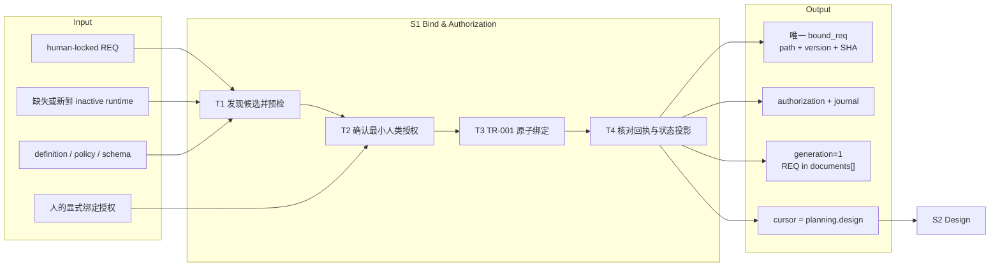
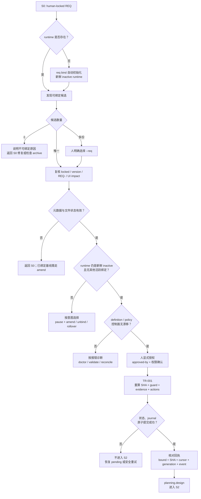
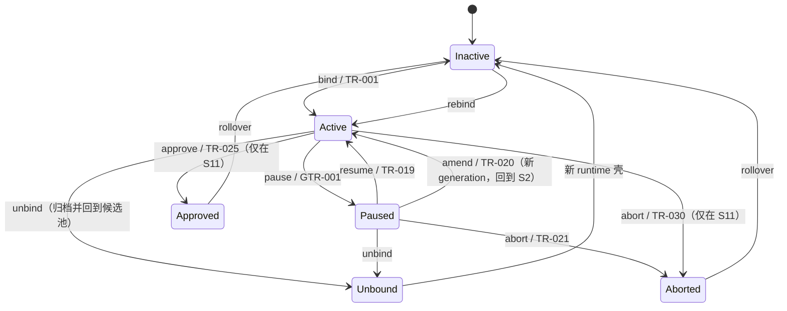

# L3-S1 — 绑定与授权（Bind & Authorization）

> 层：第三层 ｜ 上游：L2 §S1 + L2「REQ 授权生命周期」 ｜ 前置：S0 human-locked REQ ｜ 下游：S2 设计
>
> 阅读顺序：先读 §1～§3 理解一次绑定怎样成立；真正执行时按 §4 看每一步由谁和什么机制承载；§5 单独说明贯穿后续 stage 的授权控制面；§6～§8 供审计和遇错时查阅。S1 的主线是一笔一次性授权提交，不把暂停、修订、解绑等跨阶段动作混进正常绑定路径。

## 1. 第一层：S1 的立意与目标

### 1.1 为什么需要 S1

S0 产出的 locked REQ 只证明“这份需求语义已经被人锁定”。它还没有回答运行时必须知道的四个问题：

1. **这次生命周期唯一获准处理哪一份 REQ**；
2. **获准的是磁盘上的哪一个精确版本**，而不是同路径下后来被改写的内容；
3. **谁明确授权启动这次生命周期**；
4. **后续 hook、gate 和审计应从哪一份权威状态继续工作**。

S1 用一次显式的人类授权，把 locked REQ 的路径、版本和 SHA-256 登记为 runtime 唯一基线，同时建立 authorization、generation=1 和首条 journal 记录。其本质不是“选一个文件”，而是把**人的需求基线**转化为**机器可执行、可验证、可追溯的生命周期授权**（D1、D6）。

S1 也不是一个可驻留的工作阶段。TR-001 成功后 runtime 从 inactive 直接进入 `planning.design`，因此观察者不会看到一个停留中的 “S1 状态”；S1 是 S0 与 S2 之间的一次授权事务。

### 1.2 阶段目标与完成定义

| 项目 | 定义 |
|:--|:--|
| 输入 | 一份 human-locked REQ；缺失或新鲜 inactive runtime；当前 loop definition / policy / schema；人的显式绑定授权 |
| 要搞清楚 | 哪个候选可绑定、是否只有一个选择、授权是否明确、控制面是否无漂移、提交后能否形成唯一且完整的权威起点 |
| 核心工作 | 发现并复核候选 → 获取最小人类授权 → 通过 TR-001 原子登记 → 核对回执并把控制权交给 S2 |
| 输出 | `bound_req` 路径/版本/SHA/审批人；runtime authorization；generation=1；REQ 进入 `documents[]`；首条 journal；cursor=`planning.design` |
| 完成 | 状态、回执和 journal 对同一次 TR-001 给出一致答案；磁盘 REQ 指纹与登记值一致；下一步唯一指向 S2 |
| 下一阶段 | S2 从 runtime 投影读取唯一授权对象和当前 cursor，开始设计；不靠对话记忆或人工复制上下文 |

### 1.3 Overview：输入、主步骤与输出

这张图只表达 S1 的正常主线：输入经过四项任务形成一笔完整授权，并直接交给 S2。暂停、恢复、修订、解绑、终止和 rollover 是这笔授权在后续生命周期中的控制动作，统一放在 §5，不扩张这条主线。

### 1.4 S1 的边界

- **负责**：候选发现、可绑定性检查、显式授权、指纹登记、唯一性、原子提交、审计首条、下一阶段投影；
- **不负责**：重新评审需求内容。REQ 的语义质量属于 S0；S1 只复核可机械判定的 locked 状态、版本、命名、UI impact 和磁盘 SHA；
- **不负责**：设计、契约或任务拆分。绑定成功后直接把唯一基线交给 S2；
- **不要求**：每次先运行 `doctor` 或 `validate --all`。bind 自带初始化、候选发现和控制面预检；两者只在报错、漂移或仓库健康诊断时按需使用；
- **不允许**：人工编辑 loop-state 或 journal 来“补一次绑定”。失败必须由事务恢复、reconcile 或重新执行安全路径处理；
- **不等同**：locked 表示需求语义冻结，bound 表示当前 runtime 已获授权；文件状态不能替代 runtime 生命周期状态。

## 2. 第二层：S1 的任务分解

S1 只有四项顺序任务。前三项决定“能不能授权”，第四项证明“授权是否真的成立”。任何失败都必须在原层解决，不允许带着半绑定状态进入 S2。

| 任务 | 要解决的问题 | 主要动作 | 阶段产出 |
|:--|:--|:--|:--|
| T1 发现候选并预检 | 哪份 locked REQ 可绑定；是否存在歧义；runtime 是否允许首次绑定 | 缺失时自动 init；扫描候选；检查元数据、当前 runtime、控制面漂移；多候选时停下交人选择 | 唯一可提交的 REQ 路径，或带下一步的明确拒绝 |
| T2 确认最小人类授权 | 人是否明确同意以该 REQ 启动这次生命周期；审计记名是什么 | 人直接执行，或明确指令主会话代跑；提供 `--approved-by`；通过工具权限确认保留人在场边界 | 针对“绑定这个对象”的单次授权意图与记名 |
| T3 TR-001 原子绑定 | 能否把候选、授权和状态起点作为一笔事务写入 | 重算 SHA；验证 guard/evidence；执行 bind 与 authorization action；CAS + pending marker + journal 原子落盘 | 唯一 `bound_req`、authorization、generation=1、首条 journal |
| T4 核对回执与状态投影 | 人和后续系统能否得到同一个权威答案 | 读取命令回执；确认 event/cursor/generation/指纹；后续 hook 每次重读 runtime | 可见回执 + `planning.design` 权威投影，交给 S2 |

这四项任务之间不能重排：未选定唯一候选就不能请求授权；没有明确授权就不能提交 TR-001；没有完整事务就不能宣布进入 S2。

## 3. 从 locked REQ 到 S2 的完整工作流

工作流有四条纪律：

1. **机器可派生的参数由机器处理**：缺失 runtime 自动初始化，唯一候选自动选择，SHA 现场计算；不让人复制机器已经知道的值；
2. **只有真实选择才打断人**：多候选时必须由人指定 `--req`，不能让 agent 擅自挑选授权对象；
3. **授权与提交不可拆开补写**：TR-001 同时登记 REQ、authorization 和 journal；任何一部分失败都不能算完成；
4. **成功事实从 runtime 继续传播**：后续 hook 重读权威状态即可，不另造绑定广播或人工通知链。

## 4. 第三层：每项任务如何被引导和承载

### 4.1 T1 — 发现候选并预检：只检查“能否绑定”

| 维度 | 设计 |
|:--|:--|
| agent 怎么做 | 使用 `req bind` 的自动发现；需要先看全局候选及原因时使用 `req list`；不手工拼 runtime |
| 模板输入 | 不创建 S1 专属模板；只消费 S0 REQ 顶部的状态、版本、UI impact 与文件路径，正文语义不在本阶段重复填写 |
| 方法载体 | 正常路径依赖 hook/status 投影和 bind 回执；需要初始化、恢复或进入 pause/resume 控制动作时，才按需加载 `loop-orchestration` |
| 自动化承载 | runtime 缺失时自动 init；零候选列出原因；唯一候选自动选中；多候选拒绝猜测并要求显式 `--req` |
| 文件检查 | 顶部状态必须为 locked，版本非空，文件名符合 REQ- 前缀，UI impact 为合法三值；提交前由引擎重读磁盘并重算 SHA |
| runtime 检查 | 必须是新鲜 inactive、无其他活跃授权、TR-001 journal 为空；definition / policy 与 runtime 记录不能漂移 |
| 诊断工具 | `doctor`、`validate --all`、`runtime reconcile` 只在对应报错或健康诊断时加载，不成为成功路径阅读税 |
| 完成产出 | 唯一 REQ 路径和可提交快照；否则给出可行动的返回路径 |

“唯一候选自动选中”与“多候选必须人选”并不矛盾：前者消除无意义输入，后者保留授权对象不可由 agent 代判的边界（公理二、公理四）。

### 4.2 T2 — 确认最小人类授权：人只拍这一件事

| 维度 | 设计 |
|:--|:--|
| 授权手势 | 人直接执行 `req bind --approved-by <身份>`，或明确指令主会话代跑指定 REQ |
| 最小输入 | `--approved-by` 必填；`--req` 仅在多候选或人要覆盖自动选择时披露；`--json` 只服务机器消费者 |
| 人机分工 | agent 可解释候选、生成完整命令并代笔；没有人的显式指令时，不主动执行人闸命令 |
| 在场确认 | 主会话代跑时，以工具权限提示承接最终确认；对话手势、权限确认、journal 记名分别承担意图、在场和审计 |
| 信任边界 | `--approved-by` 是仓库内自我声明，不是密码学身份认证；当前威胁模型是防 agent 无授权越界，而不是防人冒充另一人 |
| 完成产出 | 对当前候选的一次明确绑定授权和可落盘的审批人 |

这里的人闸只回答“是否授权这个 runtime 以这份基线启动”，不重复 S0 对需求方向的锁定，也不预先授权未来的 pause、amend、unbind 或 approve。

### 4.3 T3 — TR-001 原子绑定：一次提交建立全部权威事实

| 维度 | 设计 |
|:--|:--|
| 转换 | TR-001：inactive → `planning.design`；`human_boundary=true`，不允许自动化自行跨越 |
| guard | `no_other_active_loop`；Store 同时要求 fresh inactive、空 journal 和预期 revision，形成结构性唯一性 |
| 证据 | `req_lock_record` 绑定 path@SHA；`loop_authorization_record` 绑定 approved-by |
| actions | `bind_loop_req` + `record_loop_authorization` |
| 写入事实 | runtime_id、bound_req 的 id/path/version/SHA/status/approved_by/approved_at/UI impact；authorization；generation=1；REQ 登记进 `documents[]` |
| 审计事实 | event=`req_bound`、last_transition 与 journal 首条同步记录 |
| 写入安全 | revision/CAS 防旧快照覆盖；pending marker → 状态写入 → journal append → marker 清理；崩溃后由恢复或 reconcile 对账 |
| 完成产出 | 一份不存在“双绑定”和“半绑定”的 runtime 起点 |

唯一性不是一句约定，而是多层同向约束：状态机只允许从 inactive 进入、首次绑定要求空 journal、Store 验证 fresh inactive、CAS 阻止并发旧写。多层都消费同一个事实，因此属于防御性覆盖，不是职责重复。

### 4.4 T4 — 核对回执与状态投影：让成功可见、可继续

成功后，人或主会话只需要核对命令回执中的五类事实：

| 回执事实 | 应得到的答案 |
|:--|:--|
| 绑定对象 | REQ id/path/version 与预期候选一致 |
| 指纹 | 回执 SHA 前缀对应 runtime 中完整 SHA，且与磁盘重算一致 |
| 授权 | approved-by 已写入 bound_req / authorization |
| 生命周期 | cursor=`planning.design`，generation=1，event=`req_bound` |
| 下一步 | 唯一指向 S2，而不是要求人工再改状态或再做一次迁移 |

回执是权威状态的可读投影，不是另一份事实。后续每次 hook 重新加载 runtime 的 bound_req 和 lifecycle，所以 S2 天然得到相同授权上下文；无需事件广播、聊天摘要或人工复制。

若提交中断，不能凭“命令似乎执行过”宣布成功：pending marker 和 journal/state 对账决定是完成恢复还是安全重试。人工不编辑 loop-state。

## 5. 授权生命周期控制面：属于 S1 的设计域，但不属于绑定主线

### 5.1 为什么单独成面

S1 建立的是后续所有工作的授权根，因此“这份授权怎样暂停、恢复、换基线、撤销和结束”必须有统一语义；但这些动作发生在 S2～S11，不应伪装成 S1 正常流程中的连续步骤。

因此本文采用两层结构：

- **数据面**：§1～§4 的一次 bind，成功后直接进入 S2；
- **控制面**：授权建立后的生命周期动词，按当前 runtime 状态和人的新决策触发。

### 5.2 控制面动词及语义边界

| 动词 | 何时使用 | 核心语义 | 结果与下一步 |
|:--|:--|:--|:--|
| bind | fresh inactive，有 locked REQ | 首次建立唯一授权 | generation=1，直接到 S2 |
| pause | 任意活跃工作态需要停住 | 捕获当前 revision、generation、round、文档指纹等 checkpoint | paused；等待同一基线恢复、修订或退出 |
| resume | paused 且基线未漂移 | 逐文件 re-hash，证明暂停前后基线不变 | 恢复 checkpoint 对应工作态；漂移则拒绝并指向 amend |
| amend | paused 且需求确实变化 | 绑定同一 REQ id 的更高版本；generation+1；全部下游证据失效 | 回到 `planning.design` 重做 |
| unbind | 任意非终态，决定撤销这次授权 | 以 disposition=unbound 归档；在飞实体需要显式 `--force` | REQ 回候选池，可换目标或重新绑定 |
| abort | paused，或 S11 人闸处 | 把本周期以 aborted 终结，保留完整审计 | 终态；后续 rollover |
| approve | S11 人闸处 | 批准当前周期结果，不等同于关闭周期 | approved；发布/关闭责任继续由后续动作承担 |
| rollover | approved / aborted 后 | 崩溃安全归档 runtime，REQ 状态落章 archived，创建新 inactive 壳 | 可开启下一周期 |
| rebind | unbind 回池后，或 rollover 后 | 重新执行一次新的 bind 授权 | 形成新的 runtime 审计起点 |

三个最容易混淆的分界：

1. **pause ≠ unbind ≠ abort**：pause 保留工作并准备继续；unbind 撤销授权但让 REQ 回池；abort 结束且保留终态；
2. **amend ≠ rebind**：amend 是同一周期、同一 REQ id 的新 generation，下游证据全部失效；rebind 是归档之后的新授权事务；
3. **approve ≠ rollover**：approve 只表达结果获批，rollover 才关闭并归档周期、给 REQ 落 archived 章。

### 5.3 职责分布与覆盖审计

| 职能 | 主责 | 承载位置 | 消费者 | 覆盖结论 |
|:--|:--|:--|:--|:--|
| 候选可绑定性 | harness | `req bind` / `req list` + archive 扫描 | 人、T2 | 文件状态只提供输入，runtime/archive 才判断是否进行中 |
| 授权对象选择 | 人 | 多候选时 `--req` | TR-001 | agent 不替人做真实选择 |
| 授权记名 | 人提供、harness 记录 | `--approved-by` → authorization/journal | 审计者、后续人闸 | 自我声明的边界如实保留 |
| 指纹与元数据复核 | harness | CLI 快检 + engine 重读/重算 | runtime、hook | 两次检查分属早失败与提交时防竞态，不是假重复 |
| 唯一性与原子性 | transition/store | guard、fresh check、空 journal、CAS、pending | 全生命周期 | 多层同向防御同一高风险事实 |
| 当前阶段投影 | runtime + hook | lifecycle/cursor 每事件重读 | S2～S11 | 命令回执只展示，不成为第二权威 |
| 生命周期操作引导 | 主会话 + `loop-orchestration` | 初始化/恢复/pause/resume 时按需加载；实际写入仍只走 harness | 人、当前 stage | skill 负责操作编排，不取得 runtime 写权 |
| 暂停/恢复 | 人决策 + runtime 命令 | checkpoint、TR-019、基线 re-hash | 当前 stage | stage failure route 触发，S1 统一定义语义 |
| 修订与证据失效 | 人决策 + TR-020 | 新 generation、旧 REQ 保留、证据 invalidation | S2～S11 | 不允许就地覆盖旧基线 |
| 撤销与终结 | 人决策 + archive | unbind / abort / approve / rollover | 候选发现、审计 | 每个动词独立 scope，批准不可串用 |

### 5.4 重叠、缺口与关键取舍

- **自动发现与人类选择不重叠**：唯一候选没有选择成本，多候选才触发人闸；
- **对话手势、权限确认和 journal 不重复**：分别证明意图、人在场和持久审计；
- **runtime、命令回执和 hook 投影不形成多权威**：runtime 是事实源，后两者只是面向不同消费者的投影；
- **CLI 快检与 engine 复核是必要覆盖**：前者尽早给人话错误，后者防止检查到提交之间的磁盘变化；
- **不增设绑定广播或 `/goal`**：hook 每次重读已足够；持续驱动器与一次性人在场授权语义不一致；
- **诚实缺口一**：`--approved-by` 不能密码学证明真实身份，安全仍依赖权限边界与协议纪律；
- **诚实缺口二**：同一终态 REQ 在 rollover 后可被显式重新绑定，当前没有 cooldown 或“禁止无变化重开”的机械门；先作为可观测风险保留，不凭想象加机制；
- **诚实缺口三**：GTR-004 桥当前无生产调用方，不把声明存在写成实际生效。

## 6. L1 准则如何嵌入 S1

| L1 准则 | S1 中的实际落点 |
|:--|:--|
| D1 权威外置 | REQ path/version/SHA、authorization、generation、cursor 和 journal 在一次事务中落入 runtime；后续不依赖聊天记忆 |
| D2 自然路径观测 | bind 是进入任何下游工作的唯一入口；hook 在自然工具事件中重读授权与状态 |
| D3 门是顾问 | 零候选、多候选、漂移、已绑定、基线变化等拒绝都指出原因和下一条合法路径 |
| D4 引导性产物 | 命令回执直接呈现对象、指纹、cursor、generation、event 和 next，而不是只说 success |
| D5 三级强制 | 人类授权是语义边界；CLI 提前引导；transition/store/hook 对可机械事实强制唯一性、原子性和指纹 |
| D6 三方收敛 | 人授权对象，agent 解释并代办可派生输入，机器公证并执行；三方不互相冒充 |
| D7 收敛可观测 | S1 只观察一次事务是否完整，不引入持续评分；成功即直接进入 S2 |
| 公理一 原型 | 对应真实系统中的审批后登记、版本指纹和事务提交 |
| 公理二 分工 | 人只做授权选择，agent 不手算状态，harness 不评审需求语义 |
| 公理三 消费 | 每个写入事实都有 hook、gate、审计或 archive 消费者；无消费者的广播被删去 |
| 公理四 成本 | 自动 init、唯一候选自动选中、按需诊断，减少人的输入和常驻阅读 |
| 公理五 传达 | 人话回执与错误路由让使用者知道发生了什么、为什么停、接下来做什么 |

## 7. 产出、出口门槛与失败路由

### 7.1 S1 的正式产出

S1 的交付物不是新文档，而是一组彼此一致的 runtime 事实：

- `bound_req`：REQ id、path、version、完整 SHA-256、status、approved_by、approved_at、UI impact；
- `authorization`：本周期的授权记录；
- `baseline.generation=1`，且 REQ 进入 `documents[]`，成为后续指纹保护对象；
- `last_transition` 与 journal 首条：TR-001 / `req_bound`；
- lifecycle/cursor：`planning.design`；
- 人话或 JSON 回执：上述事实的可验证投影及唯一 next。

### 7.2 出口判定

| 判定 | 必须满足 |
|:--|:--|
| 对象唯一 | runtime 只有一个 active bound_req，候选与人的授权对象一致 |
| 基线精确 | 登记 path/version/SHA 与磁盘 locked REQ 一致，UI impact 合法 |
| 授权成立 | approved-by 与 authorization 已落盘，TR-001 的人边界得到满足 |
| 状态完整 | generation=1、REQ 已在 `documents[]`、cursor=`planning.design` |
| 审计完整 | state、last_transition、journal 和命令回执指向同一 `req_bound` |
| 可交接 | 下一次 hook 能从 runtime 投影相同对象和 S2 下一步 |

### 7.3 失败路由

| 情况 | 去向 |
|:--|:--|
| 没有可绑定候选 | 按 `req list` 原因返回 S0 完成/修复 locked REQ，或核对是否仍被 active/terminal archive 占用 |
| 有多个可绑定候选 | 停在 T1，由人显式指定 `--req`；agent 不猜 |
| REQ 元数据、命名或 UI impact 非法 | 未绑定对象返回 S0 修复并重新锁定；已绑定对象不得就地改，走 pause + amend |
| 已存在 active bound_req | 若目标变化，按语义选择 pause + amend 或 unbind；终态周期先 rollover |
| definition / policy / schema 漂移 | 按错误提示使用 `doctor`、`validate --all` 或 `runtime reconcile` 诊断；不绕过 preflight |
| revision 过期或并发冲突 | 重读权威 runtime 后重新判断，不用旧快照覆盖 |
| pending marker 或 state/journal 不一致 | 走 Store 恢复或 `runtime reconcile`；禁止手编状态 |
| TR-001 任一步失败 | 保持“不进入 S2”；确认未形成半绑定后再安全重试 |

## 8. 易错点与渐进披露

### 8.1 最容易误解的地方

- **S1 没有驻留状态**：bind 成功即 `planning.design`；不要等待“当前 stage=S1”的投影；
- **locked 不是 active**：locked 只描述 REQ 文件基线，是否正在处理必须看 runtime 与 runtime-archive；
- **绑定不是需求复审**：S1 查可机械事实，不重新讨论 S0 的 Why/Direction/What；
- **bind 不要求固定先跑 doctor**：正常路径自带必要 preflight；诊断命令只在异常时加载；
- **S0 锁定与 S1 授权是两个不同人闸**：前者确认需求正确，后者允许生命周期启动；
- **amend 必须先 pause**：新版本进入新 generation，旧 REQ 保持锁定，全部下游证据失效；
- **unbind 不要求先 pause**：它是独立的撤销授权动作；有在飞实体时用软门要求人显式 `--force`；
- **approve 不会自动 rollover**：获批和关闭归档是两个时刻；
- **所有 runtime 写入都走命令/transition/store**：人工编辑会破坏 revision、journal、pending 和指纹不变量。

### 8.2 阅读预算

| 角色 | 进入 S1 时只需知道 | 触发式加载 | 不需要背诵 |
|:--|:--|:--|:--|
| 人 | 当前候选、绑定含义、`--approved-by`、成功回执 | 多候选选择；后续 pause/amend/unbind/approve 的具体决策 | guard、CAS、pending、journal 写入顺序 |
| 主会话 | hook/status 投影给出的候选与完整命令；没有人指令不跨人闸 | 报错时加载 `req list`、doctor、validate、reconcile；生命周期变化时加载对应动词 | 手工解析 loop-state、手算 SHA、记忆全部转换表 |
| harness/hook | schema、definition、policy、runtime、archive 与当前命令参数 | pending 恢复、漂移和 archive 扫描 | 需求的业务语义与人的价值判断 |
| 审计者 | bound_req、authorization、generation、journal/transition 一致性 | unbind/abort/rollover manifest 与 human decision scope | 正常执行时的交互细节 |

渐进披露原则保持简单：正常绑定只暴露一个候选、一条授权命令和一份回执；出现歧义才暴露 `--req`，出现风险才暴露 `--force`，出现异常才加载 doctor/reconcile；机制已经保证的唯一性、原子性和恢复流程不转写成每次必读的操作清单。
