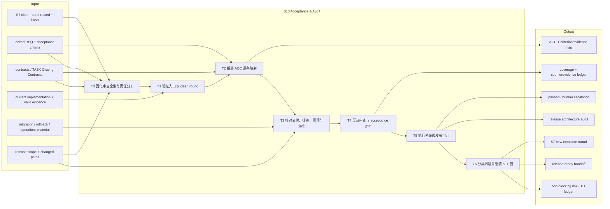
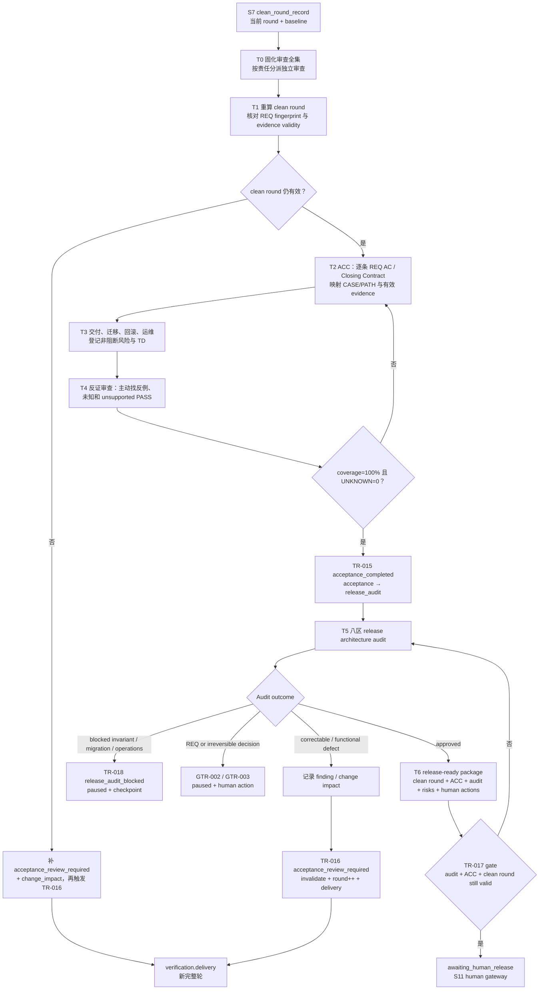

# L3-S10 — 验收与发布审计（Acceptance & Audit）

> 层：第三层 ｜ 上游：L2 §S10 ｜ 前置：S7 当前 review round 已形成有效 clean round ｜ 下游：S11 `awaiting_human_release`，或回 S7 / paused
>
> 阅读顺序：§1～§3 先回答“验收和审计各自要证明什么、为什么不能把 clean round 直接当 release”；§4 再按审查全集、反证审查、验收材料、审计八区、风险分流和 S11 handoff 展开；§5～§9 审计职责、Agent 协作、当前实现边界、出口和易错点。本文把目标工作流、Agent 引导和现有代码能力分开记录。

## 1. 第一层：S10 的立意与目标

### 1.1 为什么需要 S10

S7 的 clean round 只说明：当前 review round 的 Delivery、QA、E2E 和阻断 BUG 条件已经收敛。它还没有回答两个更高层的问题：

- **验收**：REQ 的每条 acceptance criterion、每条 TASK Closing Contract 是否都能落到本轮有效证据，交付和运维是否具备接管条件；
- **发布审计**：本次变更是否破坏了系统级不变量，例如状态机出口、事务边界、并发幂等、数据迁移、调用点、可观测性和发布回滚路径。

因此 S10 是一个“从验证事实到发布判断材料”的**反捷径审计阶段**。它不追求尽快把 Runtime 推进到 S11，而是主动证明“这个 REQ 是否真的被完整开发、审查、检验和准备接管”。验收对照用户/需求承诺，审计对照系统性质；二者都不是再次实现功能，也不是提前替人发布。

S10 的第一原则是：**最短路径永远不是工程上的最优路径**。Agent 不得因为已有一个 clean round、两份 evidence 或测试全绿，就想当然地认定可以交付。它必须先建立一个有限且可审计的审查全集，再逐项寻找支持证据和反证；凡是没有检查、没有证据或无法解释的项目，都只能是 `UNKNOWN`，不能伪装成 PASS、N/A 或非阻断风险。

### 1.2 阶段目标与完成定义

| 项目 | 定义 |
|:--|:--|
| 输入 | S7 当前 round 的 clean-round record 与 hash；locked REQ；当前 contracts/TASKs/module truth；所有有效 review/build/BUG/repair evidence；部署、迁移、回滚、运维资料 |
| 要搞清楚 | 每条 REQ AC 和 Closing Contract 的证据落点；基线与 evidence 是否仍有效；变更是否破坏系统级不变量；非阻断风险和技术债由谁跟踪；人到闸后要做什么 |
| 核心工作 | 固化审查全集与责任 → 复验 clean round → 组装 ACC 并逐条做 REQ/contract/CASE 映射 → 核对交付运维与回滚 → 逐项做反证审查 → 执行 8 个审计区 → 分类 audit finding → 组装 S11 handoff |
| 输出 | coverage inventory / responsibility matrix / counterevidence ledger；ACC 文档与 acceptance evidence；release architecture audit；风险/TD ledger；S11 release-ready package；必要的 change impact 或 pause/finding 路由 |
| 目标完成 | 审查全集已冻结且 100% disposition；ACC 的每条承诺均有当前有效证据并完成反证；审计无阻断（或明确 approved with non-blocking risks）；clean round 在到闸时仍有效；发布包、剩余风险和人类动作清晰 |
| 下一阶段 | TR-017 → S11 `awaiting_human_release`；验收差异 → TR-016 回 S7 新轮；审计阻断 → TR-018 paused；REQ/不可逆动作 → 相应人工闸 |

### 1.2.1 审查全集与客观完成指标

“穷举所有情况”不能解释成穷举无限输入组合，而要解释成：**穷举本次变更声明过的有限审查全集**。审查全集在 S10 一开始固化为 `coverage_inventory`，不得在最后为了让结论通过而临时缩小。

至少必须覆盖：

| 审查面 | 必须穷举的对象 |
|:--|:--|
| 需求 | 每条 REQ acceptance criterion、每条用户承诺 |
| 合同与任务 | 每条 FE/BE/SYNC/API/数据合同、每条 TASK Closing Contract |
| 行为场景 | 正常、异常、边界、空值、重复、权限、拒绝、恢复 |
| 系统不变量 | 状态机、事务/UoW、并发/幂等、数据/identity、迁移、调用拓扑、可观测性 |
| 证据链 | S7 当前 clean round、changed paths、baseline、hash、失效/替代证据 |
| 发布准备 | 部署顺序、兼容窗口、迁移执行、运行验证、回滚、运维接管 |
| 项目管理 | 范围外变更、技术债、剩余风险、owner、tracking artifact、恢复点 |

S10 不使用模糊加权评分。完成必须同时满足以下硬指标：

```text
REQ coverage = 100%
Contract / Closing Contract coverage = 100%
Declared changed-path disposition = 100%
Audit-area completion = 100% (release_audit only)
Unanswered UNKNOWN = 0
Unowned risk = 0
Untracked debt = 0
Unsupported PASS = 0
Blocking finding = 0
```

`N/A` 也必须有权威来源和理由；它不是降低分母的快捷方式。若审查全集本身不完整，S10 仍未完成。

指标按 manifest 类型解释，不把 release-audit 的审计区硬塞进 acceptance：
`acceptance` 必须满足 requirement、contract、changed_path 三类 coverage；
`release_audit` 在此基础上必须满足八个 `audit_area` 的 coverage。两类 manifest
都必须清零 UNKNOWN、unsupported PASS、unowned risk、untracked debt 和 blocking
finding。`docs/examples/s10/acceptance-manifest.json` 因此不包含
`audit_area_coverage`；只有 `release-audit-manifest.json` 需要该指标。

机器清单不能通过“空类别”伪造覆盖：`requirement`、`contract` 和
`changed_path` 必须各有至少一条显式审查行；release-audit manifest 还必须有
`audit_area` 行。若某个硬类别确实不适用，也要写成带 `source_refs`、证据和
`na_reason` 的 `not_applicable` 行，而不是把类别从清单中删除。

### 1.3 Overview：输入、主步骤与输出



### 1.4 S10 的边界与当前保证

- S10 包含两个连续的 top-level state：`acceptance` 与 `release_audit`；没有独立 phase machine，TR-015 是验收→审计，TR-017 是审计→S11；
- S10 不拥有发布权，也不执行 merge、publish、deploy 或 formal release；它只生成工程证据并把控制交给 S11；
- `clean_round_still_valid` 是真实语义 guard：会调用 `verification.EvaluateCleanRound` 重算当前状态，而不是只相信缓存的 `review.clean_round`；
- ACC 和 release audit 的**Markdown 正文仍没有领域 schema 消费者**；但二者现在必须配套一个机器可读的 S10 manifest。Gate 消费 `s10-audit-manifest.schema.json` 定义的 coverage inventory、counterevidence、硬指标和 release audit 八区，不把 Markdown 总体 PASS 当作逐项机检；
- `record_acc`、`record_release_audit` action 主要确认 transition evidence context 非空，不把正文内容转换进 Runtime；
- acceptance/release audit 的 requested routes 共用 selector。若同一时刻既有 `acceptance_completed` 又有 `acceptance_review_required`，或既有 audit approved 又有 audit blocked，Controller 应 fail closed，而不是猜优先级；
- `S9 → S10` 是非法路径。S9 的唯一出口是 TR-012/等价的 S7 新轮入口；只有该新轮重新形成 clean round 后，S10 才能开始；
- S10 对产品代码、REQ、合同和 TASK 是只读审查阶段。任何新的产品代码修改都意味着当前 clean round 不再是最新事实，必须回到 S7，而不是在 S10 内“顺手修完再继续”；
- S10 当前的“完整性”由 manifest 的结构/交叉项校验、Gate 的 runtime/baseline/round/hash 绑定，以及 ACC/审计正文的人工解释共同承载；不能把机器 manifest 通过描述成 Markdown 正文已自动理解，也不能反过来绕过 manifest。

## 2. 第二层：S10 的任务分解

| 任务 | 要解决的问题 | 主要动作 | 阶段产出 |
|:--|:--|:--|:--|
| T0 固化审查全集与责任分工 | Agent 是否明确本次要穷举什么、由谁独立检查、哪些结论不能互相代填 | 从 REQ/合同/TASK/changed paths/风险标签生成 coverage inventory，按独立责任分派审查者 | coverage inventory、responsibility matrix |
| T1 验证入口与 clean round | 进入 S10 的是不是当前代际、当前轮、仍有效的完整验证事实 | 复算 clean round；核对 REQ fingerprint、review round、validity、P0 BUG 与 targeted refs；发现漂移就回 S7 | clean-round anchor ledger、entry decision |
| T2 组装 ACC | “做了什么”能否逐条回到 REQ、CASE/PATH、contract 和 evidence | 逐条复制 REQ AC/source refs；映射期望、oracle、证据、结果；覆盖正/负分支与 module regression | ACC 文档、criterion→evidence map |
| T3 交付与运维准备 | 能不能接管、部署、迁移和回滚 | 写 deployment order、migration/data handling、runtime health、rollback、operations handoff、剩余风险/TD | release readiness ledger、risk/TD entries |
| T4 反证审查与 acceptance gate | ACC 是否真实完整，是否存在被“总体 PASS”掩盖的反例或未知项 | 对每条 coverage item 提出反证问题；清零 UNKNOWN/unsupported PASS；再登记 acceptance envelope 并触发 TR-015 | coverage + counterevidence ledger、acceptance evidence、`release_audit` cursor |
| T5 发布架构审计 | 本次改动是否破坏跨模块系统性质 | 按 state machine、transaction/UoW、concurrency/idempotency、data/migration、call sites/topology、observability、verification、docs/release scope 八区审计 | audit report、ARA findings、APPROVED/APPROVED_WITH_NON_BLOCKING_RISKS/BLOCKED |
| T6 风险分流与 S11 handoff | 审计结果如何转成唯一、可读、不可误解的人类决策包 | 证据/覆盖缺口 → S7；产品/架构缺陷 → S8；blocking → pause；REQ/不可逆 → human；通过则汇总 clean-round/ACC/audit hash、残余风险、建议和 automation-stops | release-ready package 或 correction/pause route |

T2 的逐条映射、T5 的系统级审计和 T6 的风险裁决必须分开。ACC PASS 不能替 audit PASS，audit APPROVED 也不能替 human release approval。

## 3. 从 clean round 到 S11 handoff 的完整工作流



注意：当前 TR-016 的失效 action 仍取触发迁移的 `AffectedPaths`，而不是从 ACC discrepancy 或 rich change-impact 文档自动推导完整受影响集合。进入回归轮前，主会话必须人工核对实际 changed paths 与 invalidation 结果。

## 4. 第三层：每项任务如何被引导和承载

### 4.0 T0 — 固化审查全集与责任分工

主会话在 S10 第一动作不是填模板，而是建立 `coverage_inventory` 和
`responsibility_matrix`：

1. 从 locked REQ、设计、合同、TASK Closing Contracts、S7 ReviewPlan/Claims、S9 ChangeImpact 和 changed paths 收集审查对象；
2. 把每个对象归入需求、行为、架构、数据、发布、运维或项目管理审查面；
3. 为每个审查面安排独立责任。一个 Agent 可以承担一个低风险小面，但不能因为方便把所有审查压给一个 Agent；
4. 明确哪些 Agent 不能审查自己编写或修复的内容；
5. 把每项的 `source`、`expected`、`oracle`、`owner`、`evidence slot`、`counterevidence question` 固化后再开始审查。

审查全集不是越大越好。只纳入受当前 REQ、合同、TASK、changed paths 和风险触发的对象；但一旦纳入，就必须完成。这样既避免“形式上穷举无限场景”的无效工作，也防止 Agent 通过缩小范围获取假完成。

### 4.1 T1 — clean-round 入口复验

S10 的第一问不是“ACC 模板填完了吗”，而是“支撑 ACC 的验证事实还是真的吗”。应依次核对：

- Runtime `review.round` 与 clean-round record 的 round、baseline generation、ID/hash；
- `clean_round` evidence 文件仍可读、指纹匹配、status=valid；
- REQ 和当前文档 fingerprint 没有漂移；
- Delivery、QA、E2E team/responsibility 的 current-round PASS/N/A 仍齐；
- P0 BUG 没有停在 investigating/pending_approval/accepted/assigned/fixing/retesting；closed P0 有 targeted evidence；
- 本轮相关 evidence 没有被 invalidated。

`verification.EvaluateCleanRound` 确实执行这些类别的复算，但它的分母仍有明确边界。当前实现已从「按 evidence kind 收集」演进为对 Claim 精确集的七项命名检查：

| 检查 | 当前实现 |
|:--|:--|
| `review_round_started` | 当前 review round ≥ 1 |
| `review_plan_clean` | 本轮已注册 ReviewPlan、与当前轮同轮且 status=clean（round consumer 只在最后一份 required Claim 落 pass 后写 clean） |
| `all_required_claims_pass` | 精确集求值：每条 required Claim 的 disposition=pass 且绑定已消费 Result；N/A Claim 保持 not_applicable——沉默不是不适用 |
| `no_findings_current_round` | 本轮存在已确认 Finding 即否决干净路径，后续补 pass 不救回 |
| `no_invalidated_pass_evidence` | 本轮 review_result / finding / observation_batch / clean_round 四类证据出现 status=invalid 即失败；planning/building 证据不影响，也不替 rich impact ledger 做反向推理 |
| `no_open_blocking_bugs` | 只把 severity=`P0` 作为 blocking；closed P0 必须有含该 BUG ID 的 current-round valid `targeted_reverification` |
| `clean_round_snapshot_registered` | 必须存在本轮 status=valid 的 `clean_round` 快照证据；TR-009 绑定机器快照，agent 手写聚合不算 |

机器分母里没有 angle 或 team-manifest responsibility 维度——早期按 evidence kind 收集的分母已被上述精确集检查取代。

因此 T1 的 ledger 必须补充机器没有表达的事实，尤其是 P1～P3 风险、每条 AC 的来源和真实 evidence 内容。

### 4.2 T2 — ACC 的逐条验收映射

`docs/reports/acceptance/ACC-template.md` 的核心结构是：

1. REQ、module current truth、contracts、tasks 的指纹化基线；
2. clean round 三组 manifest/round/result/validity 与 open blocking BUG 状态；
3. 每条 REQ source_ref、Rule/CASE/Story/PATH 的 expected、evidence、result；
4. module scenario 的 allow/reject branch、coverage profile 和 regression；
5. delivered scope、deployment order、migration/data handling、runtime verification、rollback、operations handoff；
6. 非阻断风险、owner、Tracking artifact 与最终 `passed/blocked`。

实际填写时，ACC 不应只复制“Delivery PASS”。每一条 AC 都要回答：

- 它的权威来源是什么；
- 它对应哪个 CASE/PATH/contract assertion；
- 哪个 evidence 直接观察了 expected behavior；
- 若 N/A，依据是哪个允许的 N/A 理由，而不是空白；
- 是否有负向分支、权限/异常/边界 oracle；
- 证据是不是 current round、current baseline、valid 且 subject/fingerprint 对齐。

当前 gate 的机器地板分成两层：`GATE-ACCEPTANCE-COMPLETE` 仍先要求一条 `acceptance_record`（responsibility=`Acceptance` 或 `Orchestrator`，conclusion=`pass`）和一条当前 round `clean_round_record`（`Clean Round Evaluator` 或 `Orchestrator`，conclusion=`pass`），随后还必须消费一个绑定当前 runtime/baseline/review round 的、哈希匹配且通过 `s10-audit-manifest.schema.json` 的 acceptance manifest。`GATE-RELEASE-AUDIT-APPROVED` 同样要求 acceptance、clean round、release-audit evidence 及其当前绑定的 release-audit manifest。quality-gate evaluator 会验证通用 envelope 的 runtime/baseline/producer/subject/fingerprint/conclusion，并消费 manifest 的 coverage、counterevidence、风险/债务/阻断指标和 release audit 八区；它仍不会解析 ACC criterion 表或 Markdown 正文，因此正文语义和逐条业务真实性仍由 S10 Agent/人审阅。

`counterevidence.outcome=unknown` 可以暂时没有 `evidence_refs`，因为它表达的是
“尚未找到足以判定的反证”，不是伪造一条证据；但该 UNKNOWN 仍会阻断通过，必须
在 S10 内补查并重新生成不可变 manifest。`pass`、`refuted` 等已判定结果必须带
证据引用。对 TR-018，`pause_record` 是 transition action 生成的后置证据，不是
进入 gate 前需要手工绑定的前置条件；Release Auditor 只需提交结构完整的 blocked
release-audit evidence，Controller 在满足条件时自动生成 pause checkpoint 并提交
TR-018。不要手工调用 `runtime transition` 伪造该记录。

`record_acc` action 也只把当前 transition 的 evidence context 作为已记录事实，不把 ACC 的映射写进 Runtime。因此 T2 的逐条完整性目前主要由模板、主会话复核和文件指纹共同承载。

### 4.3 T3 — 交付、迁移、回滚与运维准备

验收材料必须把“功能通过”翻译成“可以被接管”：

| 维度 | 至少要说明 |
|:--|:--|
| 交付范围 | 哪些 module/interface/config/data 被改，哪些被明确排除 |
| 部署顺序 | 前后端、配置、依赖、feature flag、兼容窗口的顺序 |
| 数据迁移 | 迁移脚本、前置条件、执行后校验、历史数据处理、重复执行策略 |
| 运行验证 | health、关键用户路径、指标/日志、告警观察窗口 |
| 回滚 | 代码回滚、数据补救/反向迁移、不可逆步骤的人工处理 |
| 运维接管 | runbook、on-call、manual control、owner、已知风险 |
| 技术债 | 类型、影响、成本、负责人、Tracking artifact；向后兼容选择要说明移除条件 |

`L2` 的“技术债登记”当前并没有独立 runtime/entity 结构；ACC 第 5 节的 non-blocking risk 表和 TD 链接是现有承载。不要在没有真实消费者的情况下再造一份 debt registry。

### 4.4 T4 — 反证审查、acceptance gate 与 TR-015

反证审查是 S10 的必经步骤，不是发生争议时才追加的补充工作。它必须在 acceptance evidence 登记前完成。

对每一条 coverage item，审查者至少回答：

- 什么事实会证明当前 PASS 是错的？
- 是否检查了拒绝、异常、权限、边界、重复和恢复路径？
- 当前证据是否真的观察了 expected/oracle，而不是只证明代码执行过？
- 是否存在只在 mock、happy path 或单实例下成立的假通过？
- 是否存在 changed path、配置、迁移、文档或调用点没有被任何 Claim/证据覆盖？
- 若结论是 N/A，权威来源、适用边界和理由是什么？

反证问题没有得到证据回答时，结果只能为 `UNKNOWN`。`UNKNOWN` 不能进入 acceptance PASS，也不能被改写成 `APPROVED_WITH_NON_BLOCKING_RISKS`。

要进入 `release_audit`，目标上需要：ACC 完整、clean round 仍有效、REQ baseline 未漂移。实际链路是：

- `GATE-ACCEPTANCE-COMPLETE`：`acceptance_record/pass` + current-round `clean_round_record/pass` + current-bound, hash-matched acceptance manifest；
- `GATE-RELEASE-AUDIT-APPROVED`：current-round clean-round evidence + current-bound acceptance manifest + release-audit manifest with all eight areas and zero blocking/unknown/unsupported-pass/unowned-risk/untracked-debt metrics；
- TR-015 guards：`acc_complete` + `clean_round_still_valid`；前者是 evidence-backed attestation，后者调用 `EvaluateCleanRound`；
- TR-015 action：`record_acc`；没有额外的 ACC 领域解析；
- 成功后 top-level state 进入 `release_audit`。

如果 ACC 发现需要补验收或重新验证，目标是形成 `acceptance_review_required` + `change_impact_record`，由 TR-016：

1. `invalidate_affected_evidence`；
2. `review.round++`、清空 `clean_round`；
3. 回到 `verification.delivery`。

当前 TR-016 没有语义 guard，且 action 的影响输入仍来自触发该 transition 的工具调用 paths。它可以记录“重做完整轮”，但不能证明 rich ACC discrepancy 中列出的每个旧 evidence 都已被准确失效。

### 4.5 T5 — release architecture audit

审计不是又一次 code review，而是沿 R-P05 的八个系统不变量区域逐项问“这次变更后系统还站得住吗”：

| 审计区 | 核心问题 | 常见证据 |
|:--|:--|:--|
| state machine | 新状态有进入/退出条件吗？retry/dependency 会不会卡死？ | loop-definition、transition tests、控制面输出 |
| transaction/UoW/session | 写入是否跨错 session？长 I/O 是否持有写事务？失败是否 rollback？ | service code、DB traces、failure recorder |
| concurrency/idempotency | 多 worker claim/lease 是否安全？重复事件/重启/重复创建是否幂等？ | DB constraint、integration/concurrency tests |
| data model/identity/migration | identity/default/enum 是否一致？历史数据是否满足新约束？migration 可验证/回滚吗？ | schema、migration、数据样本、dry-run/apply checks |
| call sites/runtime topology | 新参数、DI、共享/隔离状态是否在所有入口同步？ | grep call sites、后台 loop、admin API、真实路径测试 |
| observability/errors | 是否有稳定短错误码、上下文日志、指标和控制面可诊断状态？ | logs、metrics、diagnostic SQL、runbook |
| verification evidence | 是否验证真实 DB/migration/concurrency/runtime path，而非只测 mock？ | S7、Builder、integration/e2e evidence |
| docs/release scope | BUG/TD/REV/QA/ACC 与代码一致吗？范围外变更、部署顺序、回滚是否写清？ | diff、reports、ACC、runbook、release notes |

`docs/release_audits/TEMPLATE.md` 是 16 节的人类填写模板，R-P05 规定的是上述 8 个审计区和 8 类典型阻断原因。当前没有 parser 强制 16 节都填满，也没有 parser 强制阻断表逐项对应 R-P05；审计者仍需在报告中显式写 PASS/FAIL/NA、证据和处理要求。

阻断类型包括：状态无出口、迁移未进正式发布路径、raw SQL 未对真实 schema 验证、唯一键变更未查历史冲突、并发创建只靠 SELECT、关键 DB 行为只测 mock、范围外代码混入、failure recorder 使用无效 session。任何一项应 BLOCK，不以“本轮测试绿”抵消。

审计结论只能是 `APPROVED`、`APPROVED_WITH_NON_BLOCKING_RISKS` 或 `BLOCKED`。`approved_with_risk` 仍然只表示工程审计允许把风险交给 S11，不表示人已经批准发布。

### 4.6 T6 — 风险分流与 S11 package

| 发现类型 | 目标路由 | 说明 |
|:--|:--|:--|
| ACC 映射不足、功能/合同问题 | TR-016 → S7 新完整轮；若形成 blocking finding，进入 S8 | 不在 S10 直接改产品代码 |
| 证据/覆盖缺口（无产品缺陷） | 补齐 S10 事实；需要重新验证时 TR-016 → S7 新完整轮 | 不能用总体 PASS 覆盖缺口 |
| 产品/架构/数据缺陷 | 记录 finding 与 change impact → S8 → S9 → S7 新完整轮 | S10 不直接修改产品代码；S9 唯一出口是 S7 |
| 架构/迁移/运维阻断 | TR-018 → paused + checkpoint | 等待人工处理/恢复；不包装成 approved_with_risk |
| locked REQ 必须变化 | GTR-002 或对应 REQ gateway → paused | S10 不修改 REQ |
| 不可逆生产/安全/合规动作 | GTR-003 → paused | 先交人工，不把动作塞进 audit PASS |
| 无阻断，仅非阻断风险 | `APPROVED_WITH_NON_BLOCKING_RISKS` → S11 | 风险要有 owner、tracking 和建议处置 |
| 全部审计通过 | `APPROVED` → S11 | 仍只生成 handoff，不执行 release |

S11 package 至少包含：clean-round ID/hash、ACC ID/hash、release audit ID/hash、runtime ID/baseline/review round、已完成范围、唯一未决事实、影响/残余风险、建议处置、恢复点和明确的 `automation stops` 声明。它是给人做决策的压缩视图，不是把全部过程 evidence 再复制一遍。

### 4.7 主会话的 Agent Team 编排

S10 的 Agent 数量不设固定上限；数量由 `coverage_inventory` 的独立责任面、风险和工作量决定。Token 成本不是此阶段的首要优化目标，漏审和错误发布的返工成本才是。

推荐的最小责任面包括：

| 责任面 | 主要问题 | 独立性要求 |
|:--|:--|:--|
| Requirement Acceptance | 每条 REQ AC/合同/TASK 是否有当前证据 | 不由单纯实现者独自签结论 |
| Architecture / Code Audit | 系统不变量、设计模式、边界、可维护性和调用拓扑是否成立 | 不由本次修复 Builder 独自签结论 |
| Data / Migration / Operations | 历史数据、迁移、部署、回滚、监控和接管是否真实可行 | 需要对应运行/数据经验 |
| Evidence Integrity | round、baseline、hash、changed paths、失效关系是否一致 | 与内容审查分离 |
| Adversarial Review | 专门寻找为什么不能发布、哪里可能是假通过 | 不承担“帮忙凑 PASS”的目标 |

主会话负责：

1. 根据审查全集拆分责任，而不是按 Agent 数量反向设计任务；
2. 让无写冲突的独立审查并行，要求每个 Agent 先回报计划后连续执行；
3. 消费每个 Agent 的结构化结果、反证问题和缺口，不把多个 PASS 简单投票；
4. 解决审查冲突并保守处理未解决分歧；
5. 只有所有责任面都完成、`UNKNOWN=0`、阻断项清零，才组装 S11 package。

S10 Agent 的“完成”不是交一份看起来完整的 Markdown，而是让主会话可以沿
`coverage item → question → evidence → conclusion → owner/route` 逐条复核。

## 5. 职责分布与覆盖审计

### 5.1 职能落点

| 职能 | 主责 | 承载位置 | 当前消费者 |
|:--|:--|:--|:--|
| clean-round 事实 | S7 Clean Round Evaluator / Orchestrator | `clean_round` evidence + Runtime review state | T1、TR-015/TR-017 guards |
| 逐条需求验收 | Acceptance owner / Orchestrator | ACC 第 3 节、S10 acceptance manifest、scenario coverage、evidence map | Gate 校验 manifest；正文由人审阅 |
| 交付与运维接管 | Builder/Delivery/Operations owner | ACC 第 4 节、runbook、migration/rollback | S11 人类决策 |
| 系统级审计 | Architect / Release Auditor | release audit 8 区、S10 release-audit manifest、ARA findings、Final Decision | Gate 校验 manifest；TR-017/018 消费 envelope |
| 风险/TD 裁决 | Orchestrator + owner | ACC 风险表、TD、audit non-blocking table | 人与后续周期 |
| transition/gate | Controller + transition engine | generic envelope、journal、cursor | 自动推进一条 allowlisted transition |
| release authorization | Human | S11 human decision evidence | TR-025～TR-030 |

### 5.2 应有的分工与重叠控制

- S7 负责产生观察事实，S10 负责汇编和系统级判断；S10 不重写 S7 的 PASS，也不把 audit 变成普通 reviewer 的第四个角度；
- Acceptance owner 逐条回答“承诺是否满足”，Release Auditor 回答“系统性质是否仍成立”；两个角色的 evidence 和结论不能互相代填；
- Builder 可以提供 migration/check/runbook 事实，但不能独自把 release audit 标成 APPROVED；
- non-blocking risk 必须保留 owner 和 tracking artifact，不能因为不阻断就从 package 中删掉；
- S10 把人类需要的材料压缩成 package，S11 只做价值/风险/时机决策，不重新开展工程审计；
- 审计发现 defect 后沿 S8/S9/S7 链回去，不能在 S10 直接把修复写进当前 release package；任何 S10 新发现的产品或架构缺陷，都必须沿 S8 → S9 → S7 新完整轮返回。

### 5.3 当前实现与未闭合缺口

1. **ACC/审计 Markdown 正文由 manifest 渲染（RC-11）**：gate 仍不解析正文语义；机器完整性由配套 S10 manifest 单一来源承载，正文用 `loop-harness s10 manifest render` 从 manifest 生成，作为人类解释投影，不再是手工维护的第二载体（C-5 关闭：消除 Markdown/manifest 漂移面）；
2. **`record_acc`/`record_release_audit` 仍只确认 evidence context**：不会把 Markdown 正文摘要写进 Runtime；manifest 在 evidence 注册前和 Gate 消费时分别校验；
3. **acceptance gate 不再是单通用证据门**：除 acceptance + current clean-round 外，还要求绑定、哈希匹配且通过 S10 acceptance manifest 的 coverage/counterevidence/metrics；
4. **release-audit approval 同样显式要求 current clean-round**：`GATE-RELEASE-AUDIT-APPROVED` 同时消费当前轮 clean-round、acceptance 和 release-audit manifest；manifest 与当前 runtime、baseline、S7 round 绑定，并重新校验哈希；
5. **`release_audit_approved` 仍不解析 Markdown 三枚举或 ARA prose**：它消费结构化八区与 blocking/风险硬指标，Markdown 的解释和最终责任仍由 Release Auditor/人审阅；
7. **clean-round 分母有意偏窄**：只语义阻断 P0 BUG，P1～P3 不影响 clean-round guard；
8. **TR-016 影响失效输入错位**：使用当前工具 `AffectedPaths`，不消费 rich acceptance change-impact 内容；空/错 paths 可静默无失效；
9. **acceptance/release audit 没有独立业务 entity**：Runtime 只保留 evidence refs 与 top-level state，无法查询“哪条 AC 已验收”的结构化实体；
10. **requested route 可能冲突**：同一 cursor 同时满足 complete/review-required 或 approved/blocked 时 selector fail closed，没有自动优先级；
11. **审计阻断→paused 的 pause checkpoint 不携带领域级 ARA 条目**：仍需依赖 audit evidence/报告给人解释；
12. **技术债没有独立载体**：当前靠 ACC/audit 风险表 + TD reference，L2 若写成独立 debt registry 会超过实现；
13. **当前 policy 对 release commands 的硬边界不完整**：`protected_commands.json` 和 classifier 有发布命令表，但主 `policy.Engine.Evaluate` 实际硬处理的是 locked-artifact write 与 squash merge；其它命令的拦截不能仅凭表存在来宣称已生效。
14. **当前 S10 没有直接以工作树快照证明 CleanRound 之后没有新的产品代码修改**：正常 S9 路径由 TR-012 → 新 S7 → TR-009 保证；若有 S10 直接写代码的入口，必须将其视为流程缺口并回到 S7，而不是由 S10 自己消化。

### 5.4 关键取舍

| 问题 | 设计选择 | 原因与当前代价 |
|:--|:--|:--|
| clean round 与 acceptance | 保留两道门，入口复算 clean round，manifest 锁定逐条覆盖与反证，ACC 补人类语义 | 防止总体绿代替逐条验收；Markdown 解释仍不自动解析 |
| acceptance 与 audit | 两份产物、两个责任面 | 需求承诺与系统不变量不同分母；材料更长但结论更清楚 |
| 反证审查 | 每项增加一个反证问题和一次有证据的反向检查；复用同一 coverage ID，不新增 Runtime 状态 | 能识别总体 PASS、mock-only 和漏路径造成的假通过；成本由有限审查全集控制，不重复执行 S7 全部 Claim |
| approved_with_risk | 允许把非阻断风险交给 S11 | 风险可见且不伪装为 zero-risk；人决定是否接受时机 |
| audit block | paused，不自动猜修复顺序 | 架构/迁移/运维阻断可能需要跨团队或人决策 |
| S10 到 S11 | 只交 handoff，不执行 release | 永久分离工程判断与发布授权；S10 manifest 通过也不等于 S11 人类授权 |

## 6. L1 准则如何嵌入 S10

| L1 准则 | S10 中的实际落点 |
|:--|:--|
| D1 权威外置 | ACC、audit、S10 manifest、Runtime evidence、fingerprints、journal 与 risk/TD links 落盘；正文与 Runtime 仍不是完全同构 |
| D2 自然路径观测 | PreToolUse 评估 TR-015/016/017/018；clean-round guard 在 transition 时重新计算 |
| D3 门是顾问 | missing acceptance/audit/clean-round evidence 会给出下一步；coverage inventory、反证账本和当前责任面进一步指出哪条 AC、哪个审计区或哪个反证问题缺失 |
| D4 引导性产物 | coverage inventory、counterevidence ledger、ACC criterion map、migration/rollback 表、audit 八区和 sign-off questions 把抽象“可发布”变成可逐项回答的材料 |
| D5 三级强制 | Skill/template 引导；S10 manifest schema + envelope/hash 约束结构；Gate/guard 控制 state route；Markdown 正文语义仍主要靠人 |
| D6 三方收敛 | Acceptance owner、Release Auditor、Orchestrator/人类在不同层收敛；不得由 Builder 自己完成所有结论 |
| D7 收敛可观测 | clean round、manifest、ACC/audit refs、risk/TD、pause checkpoint、S11 package 形成可审计轨迹；Markdown 正文内容未进入 state machine |
| 公理一 原型 | 对应 release acceptance、architecture review、operational readiness、change control 与 human release gate |
| 公理二 分工 | 验收、审计、风险 owner、Controller、人类授权分开；当前 agent identity 仍不是本地认证 |
| 公理三 消费 | clean round 供 acceptance/audit，S10 manifest 供 Gate，ACC/audit 正文供审计/人，audit 供 S11；Gate 不消费 Markdown prose |
| 公理四 成本 | 不重复执行 S7 的逐 Claim 验证；只对当前 release scope 做系统审计，但对声明的审查全集不省略反证步骤 |
| 公理五 传达 | `acceptance pass`、`audit approved`、`approved_with_risk`、`awaiting_human_release`、`release_authorized` 用不同词和不同责任，不能合并成“已发布” |

## 7. 产出、出口门槛与失败路由

### 7.1 正式产出

- current clean-round revalidation ledger 与 REQ/baseline/round fingerprint 对账；
- coverage inventory、responsibility matrix 与 counterevidence ledger；
- ACC 文档：基线、clean round、逐条 REQ/CASE/PATH/contract 映射、scenario acceptance、交付运维、风险和结论；
- acceptance evidence envelope 与 TR-015 handoff；
- release architecture audit：changed paths、八区检查、证据、ARA findings、非阻断风险、三枚举结论；
- audit evidence envelope 与 TR-017/TR-018 route evidence；
- release-ready package：clean-round/ACC/audit IDs and hashes、impact、风险、建议、恢复点和 `automation stops`；
- 若需回归/暂停，记录 change impact、finding、pause checkpoint 和下一步 owner。

### 7.2 目标出口判定与当前机器地板

| 维度 | 目标判定 | 当前机器实际检查 |
|:--|:--|:--|
| Clean round | 当前基线/当前轮仍 valid，四项 clean-round checks 全 PASS | `EvaluateCleanRound` 复算；分母只含 verification relevant evidence、P0 BUG |
| ACC | 每条 AC/Closing Contract/CASE/PATH 都有 valid evidence 或有依据的 N/A | 一条 acceptance envelope + current clean-round envelope + valid bound S10 manifest；不解析 Markdown 正文 |
| Operations | 部署、迁移、运行验证、回滚、接管均有 owner 和 evidence | ACC 正文人工维护；无领域 gate |
| Audit | 八区均有结论，阻断项为零或被正确路由，非阻断风险有 owner | 一条 release-audit envelope + valid bound S10 manifest with all 8 areas; 不解析 Markdown prose |
| S10 handoff | 所有 refs/hashes/风险/建议/恢复点清晰且 automation stops | TR-017 需要 audit envelope + acceptance envelope + current clean-round evidence，package 正文不被 gate 读取 |
| Release authority | S10 只把决策交 S11，不产生授权 | `awaiting_human_release` 无自动候选；真正人闸由 TR-025～030 |
| Anti-shortcut | coverage=100%、UNKNOWN=0、unsupported PASS=0、所有风险有 owner/tracking | S10 manifest validator + acceptance/release Gate machine-check these ledger metrics; Markdown 解释与发布包仍需人工复核 |

### 7.3 失败路由

| 情况 | 去向 |
|:--|:--|
| clean round missing/stale/invalidated 或 REQ fingerprint drift | 留/回 S7，形成新完整轮；不组装旧事实的 ACC |
| 某条 AC/Closing Contract 无证据 | 留 acceptance，补映射或回 S7；不以一条 overall PASS 覆盖空洞 |
| ACC 发现功能缺陷 | 记录 finding → S8；accepted 后走 S9，修复后必须新完整轮 |
| acceptance 需要重新验证且 impact 已登记 | TR-016 → S7 `verification.delivery`；先核对失效范围 |
| migration/transaction/concurrency/state/observability 阻断 | TR-018 → paused，保留 audit report 和 checkpoint |
| locked REQ 必须改变 | GTR-002 / REQ amendment → paused，人修订后新 generation |
| 不可逆生产/安全/合规动作 | GTR-003 → paused，等待人批准 |
| audit approved with non-blocking risks | 进入 S11，package 必须突出风险和 owner |
| audit fully approved | TR-017 → S11；不执行 merge/publish/deploy/release |
| acceptance/release-audit route conflict | Controller fail closed；先清理互斥 requested evidence，不猜优先级 |

## 8. 易错点与渐进披露

### 8.1 易错点

1. 把 S7 clean round 当作 ACC，跳过逐条 REQ/Closing Contract 映射；
2. 只复制 Delivery/QA/E2E 的总体 PASS，不核对每条 AC 的 expected、oracle 和 evidence；
3. 用空白或 free-text 代替 N/A 理由；
4. 把 ACC PASS 当作 release audit PASS；两者的分母和责任不同；
5. 把 audit `APPROVED_WITH_NON_BLOCKING_RISKS` 写成无风险通过；风险必须进 owner/TD/package；
6. 认为 `record_acc` 会解析 ACC 正文；当前 action 只记录 evidence context，必须先用 `s10 manifest validate` 并在 envelope 中携带 manifest 引用；
7. 认为 release-audit envelope 会解析 Markdown 的 8 个审计区或 ARA 表；Gate 只消费结构化 manifest 的八区和硬指标，正文仍需人工审阅；
8. acceptance review 触发 TR-016 后，忘记核对当前工具 `AffectedPaths` 是否覆盖实际 discrepancy；
9. 同时留下 `acceptance_completed` 与 `acceptance_review_required`，让 selector conflict；
10. 把 paused 当作 audit 失败后自动可继续；需要人恢复、REQ amendment 或 abort；
11. 把 S10 的 `awaiting_human_release` 当作发布成功；它只是人工决策入口；
12. 因 `protected_commands.json` 存在，就假定所有 deploy/publish/formal-release 命令已被主 Hook 硬拦；当前 policy Evaluate 的实际接线更窄；
13. 在 S10 直接修代码或修改 locked REQ；正确路由是 S8/S9、planning 或 human amendment；
14. 只在 ACC/audit 写风险，不写 owner、tracking artifact、恢复点和人需要做的选择；
15. 把“已有 clean round”当作 S10 的全部工作，跳过需求逐条映射和系统级反证；
16. 把没有检查过的项目写成 N/A，或把 UNKNOWN 降级成非阻断风险；
17. 只让一个 Agent 同时承担验收、架构、运行和反证审查，然后把一份总体 PASS 当作独立结论；
18. S10 发现问题后直接修改代码，再回填一份 audit 说明；任何产品修改都必须回 S8/S9/S7；
19. 以“审查范围太大”为理由临时删除 coverage item；范围只能依据 REQ、changed paths 和风险触发规则调整，并留下理由。

### 8.2 阅读预算

- **只想理解 S10 主线**：读 §1.1～§1.3、§2、§3、§7.3；
- **正在写 ACC**：重点读 §4.1～§4.4，配合 `ACC-template.md`、REQ、contracts、TASK Closing Contracts 和 S7 clean-round evidence；
- **正在做发布审计**：重点读 §4.5～§4.6，配合 R-P05、`docs/release_audits/TEMPLATE.md` 和 changed paths；
- **正在组装 S11 包**：读 §4.6、§7.2，确保人只看到汇总事实、风险、建议和恢复点；
- **正在维护 harness**：必须读 §5.3，并对照 `verification.EvaluateCleanRound`、quality-gate registry/evaluator、TR-015～018 actions/guards、Controller selector 与 `AffectedPaths`；
- **S11 人类消费者**：只需读 package、ACC 结论、审计结论、风险和建议；不要把 S10 evidence envelope 本身当成发布授权。

## 9. S10 Agent 操作卡

每次进入 S10，主会话和审查 Agent 都按以下顺序工作：

```text
1. 确认这是 S7 新完整轮产生的 clean round；S9 不能直达 S10。
2. 固化 coverage_inventory 和 responsibility_matrix，不先填 PASS。
3. 逐条建立 source → expected → oracle → evidence → conclusion。
4. 对每条结论提出反证问题，并记录反证证据或显式 UNKNOWN。
5. 完成部署、迁移、回滚、运行和运维接管审查。
6. 完成八个系统不变量审计，并处理所有 finding、风险和技术债。
7. 复核 coverage=100%、UNKNOWN=0、unsupported PASS=0、unowned risk=0。
8. 组装带 hash、影响、风险、建议和 automation-stops 的 S11 package。
9. 让 Hook 自动推进；不要手推 transition，也不要执行发布动作。
```

若任何一步无法完成，正确动作是停在当前阶段补事实，或沿明确路由回
S7/S8/S9/paused；不是缩短流程来换取“已完成”。
