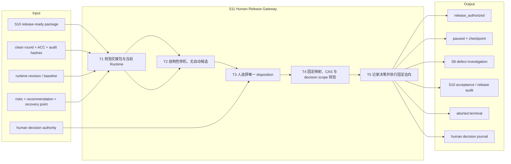
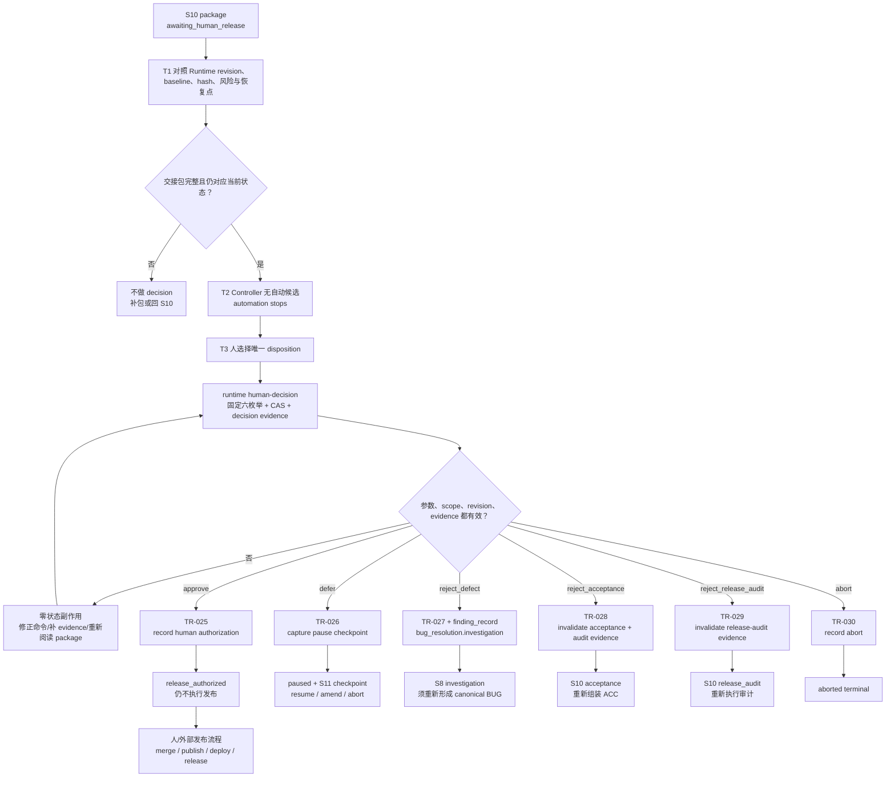

# L3-S11 — 人工发布闸（Human Release Gateway）

> 层：第三层 ｜ 上游：S10 release-ready package ｜ 状态：`awaiting_human_release` ｜ 下游：`release_authorized`、`paused`、S8、S10 或 `aborted`
>
> 阅读顺序：§1～§3 先回答“为什么必须停机等人、人的决策是什么、决策之后去哪里”；§4 再映射 package、固定命令、六条路由、暂停/归档和真实发布边界；§5～§8 审计分工、当前硬约束、出口和易错点。S6～S11 尚未完成机制优化，本文不把“有一条本地 decision 记录”表述成已完成身份认证或已执行发布。

## 1. 第一层：S11 的立意与目标

### 1.1 为什么需要 S11

S10 可以证明工程材料足够完整、clean round 仍有效、系统级发布审计通过或只剩已显式登记的非阻断风险，但它不能替项目负责人决定“现在是否承担这些风险并发布”。这个判断涉及时机、业务价值、合规、运营窗口和责任归属，不能由测试绿、audit PASS 或 Controller 的默认行为推断。

S11 的核心不是继续做工程工作，而是**结构性停机，把一个压缩后的 release-ready package 交给人，并要求人从有限且有固定去向的决策枚举中选一个**。没有决策、超时、沉默、命令缺参都不能当作 approve。

### 1.2 阶段目标与完成定义

| 项目 | 定义 |
|:--|:--|
| 输入 | S10 的 clean-round/ACC/release-audit IDs and hashes；runtime revision/baseline；已完成范围；唯一未决事实；影响、非阻断风险、建议、恢复点；`automation stops` 声明 |
| 要搞清楚 | 人是否批准当前 release 风险；若不批准，是暂缓、缺陷退回、验收退回、审计退回还是中止；下一步允许回到哪里；是否需要新一轮完整验证 |
| 核心工作 | 校验 package 与当前 Runtime → 停止自动候选 → 让人执行固定六枚举命令 → CAS/decision scope 校验 → 只提交对应的固定 transition → 留下可审计决策 |
| 输出 | `human_decision_record`；固定 TR-025～TR-030 的 state/journal 变化；必要的 pause checkpoint、finding evidence 或定向失效记录 |
| 目标完成 | 恰有一个显式 decision 被持久化；去向与 disposition 一一对应；approve 只表示 release authorization，实际 merge/publish/deploy/formal release 仍在 Harness 外由人执行 |
| 下一阶段 | approve → `release_authorized`；defer → paused；reject_defect → S8；reject_acceptance → S10 acceptance；reject_release_audit → S10 release_audit；abort → `aborted` |

### 1.3 Overview：输入、主步骤与输出



### 1.4 S11 的边界与当前保证

- `awaiting_human_release` 是**非终态的人类 Gateway**，但对 Loop 自动推进而言没有 automatic candidate；Controller 在该 cursor 不评估或提交任何 S11 decision；
- 六枚举与 transition ID 固定映射，CLI 不接受任意 target state 或 transition ID；这是 S11 最强的结构性约束；
- human decision 的 transition 有 `human_decision_scope=runtime_release`，校验 evidence 属于当前 runtime、当前 revision、当前 verb scope，配合 CAS 防止旧决定重放；
- TR-025 的 `release_authorized` 只记录授权，不执行 merge、publication、deployment 或 formal release；
- `--actor` 是命令参数和 evidence/Runtime 中的字符串，当前本地文件 Runtime 不负责认证这个字符串背后是否真为人；
- `docs/release_audits/protected_commands.json` 和 classifier 已描述多类发布命令，但主 `policy.Engine.Evaluate` 当前实际硬处理的是 locked-artifact write 与 squash merge；不能仅凭命令表存在就声称所有 deploy/publish/release 命令已被 S11 硬拦；
- 终态只有 `release_authorized` 和 `aborted`。后续 runtime rollover 是独立的、仍需 human `runtime_rollover` evidence 的归档/新周期操作，不是 S11 自动动作。

## 2. 第二层：S11 的任务分解

| 任务 | 要解决的问题 | 主要动作 | 阶段产出 |
|:--|:--|:--|:--|
| T1 校验交接包 | 人看到的材料是不是 S10 生成的当前事实 | 对照 runtime ID/revision/baseline、clean round、ACC、audit fingerprints、风险和恢复点；缺项则不进入决策 | package validation record |
| T2 结构性停机 | 是否存在默认推进、超时批准或 Agent 代替人选项 | Controller 对 awaiting cursor 返回空候选；禁止自动 S11 event；显式显示六选项 | human gateway state |
| T3 人做唯一决策 | 当前风险应批准、暂缓、退回哪一层或中止 | 人阅读压缩包并选择 `approve/defer/reject_defect/reject_acceptance/reject_release_audit/abort` | selected disposition |
| T4 固定映射与校验 | 决策是否只授权当前 runtime/current revision/current verb | CLI switch 映射固定 transition；检查 actor、revision、decision evidence；reject_defect 额外要求 finding evidence | validated transition request |
| T5 固定路由与留痕 | 决策之后的工程去向是否可恢复、不可歧义 | 提交 TR-025～TR-030；写 journal；必要时生成 pause、定向失效或 finding route | state/phase/checkpoint/decision record |
| T6 终态与下一周期 | approve 后是否被误解成已发布；终态如何归档 | 人在 Harness 外执行 release；若开始下一周期，再用独立 rollover approval/evidence | release operation or fresh inactive runtime |

S11 不重新审查 ACC 或 audit 的正文。若人需要补工程事实，应选择 reject_acceptance/reject_release_audit，回 S10 重做；若发现产品缺陷，应选择 reject_defect，回 S8，而不是在 S11 直接修改代码。

## 3. 从 release-ready package 到固定决策的完整工作流



六条路由不是六种“意见标签”，而是六个不同的状态恢复语义。尤其 `approve` 只写授权记录；`reject_defect` 只把 finding evidence 带回 BUG 调查入口，当前 transition 不自动把该 finding 转成 canonical BUG entity。

## 4. 第三层：每项任务如何被引导和承载

### 4.1 T1 — release-ready package 的最小交接结构

S10 交给人的不是整个 Runtime，而是一张可在短时间内完成判断的决策包。至少要有：

- **当前事实**：runtime ID、revision、baseline generation、REQ 版本/fingerprint、review round；
- **已完成什么**：交付范围、主要变更、clean-round ID/hash、ACC ID/hash、audit ID/hash；
- **为什么可信**：每个引用文件的当前指纹、validity、关键验证结论；
- **唯一未决事实**：人需要承担或决定的具体风险，不用“请审阅全部材料”代替；
- **影响与建议**：用户/数据/运维/合规影响，APPROVED 或 APPROVED_WITH_NON_BLOCKING_RISKS 的理由；
- **恢复点**：defer、reject 或重新启动时应回到哪个 state/phase，以及哪些 evidence 会失效；
- **停止声明**：明确 automation stops，Harness 不 merge/publish/deploy/release。

当前没有独立 `release_ready_package` Runtime entity 或专用 JSON schema。package 主要由 ACC、audit、generic evidence 和 S10/agent handoff 文档组成。S11 的 transition 只要求 `human_decision_record`，不会重新解析 S10 package 的所有 hash 和风险表；因此 T1 必须由人/主会话先做对账。

### 4.2 T2 — 结构性停机与无自动候选

结构性停机由两层共同实现：

1. `docs/loop-definition.json` 把 TR-025～TR-030 标为 `eligible=false`、`human_boundary=true`，并列出 `automated_s11_decision` forbidden event；
2. `internal/controller/cycle.go` 对 `awaiting_human_release`、`release_authorized`、`aborted` 返回空 automatic candidates，不会因为 evidence 恰好齐全而自行选 approve。

这意味着自然 `PreToolUse` 只会维持可用/等待状态，不会提交一个默认 S11 decision。若命令缺参、未知 disposition、旧 revision 或 evidence 不合格，CLI 返回失败且不写 state/journal。

但“无自动 transition”不等于“所有 shell 命令都被 S11 禁止”：

- Hook policy 的硬路径明确包含 locked-artifact write 和 squash merge；
- protected command JSON/classifier 能识别 `git push` protected branch、tag、`gh release`、`gh pr merge`、npm publish、terraform/kubectl/aws 等形状；
- 当前 `policy.Engine.Evaluate` 的主实现并没有调用 `MatchProtectedCommands` 来统一阻断这些命令。

所以 S11 的核心保证是“不会自动做决定、不会由 transition 执行 release”，而不是“任何 Agent 发出的发布命令都已被一条统一 Hook 规则拒绝”。

### 4.3 T3/T4 — 固定 human-decision 命令与 scope

唯一 CLI 入口是：

```bash
loop-harness runtime human-decision \
  --disposition <approve|defer|reject_defect|reject_acceptance|reject_release_audit|abort> \
  --expected-revision <N> \
  --actor <user-or-operator-id> \
  --decision-evidence <human-decision-reference>
```

额外规则：

- `reject_defect` 必须再提供 `--finding-evidence <finding-reference>`；
- `defer` 会绑定 `pause_record=generated:pause_checkpoint`，由 TR-026 的 action 生成实际 checkpoint；
- CLI 通过 `runtime.HumanReleaseTransitionID` 做固定 switch，不允许用户传 `--target-state` 或任意 transition ID；
- transition 层的 `human_decision_scope=runtime_release` 要求当前有效 `human_decision` evidence 的 scope 对应 `runtime_release:<runtime_id>@<current_revision>`；
- Runtime writer 使用 expected revision 做 CAS；旧 revision 的 decision 不会覆盖新状态；
- `record_human_release_decision` 只记录 evidence/transition event，不把 decision 内容扩写成 release operation。

当前本地信任边界仍有限：`--actor` 是字符串，transition scope 校验的是字符串和 evidence scope，不是外部身份认证、签名或组织权限校验。谁能写入当前项目的有效 human-decision evidence，谁就可能在本地模型中满足“由某 actor 产生”的形式；这属于已知设计边界，不能写成“已验证真人身份”。

### 4.4 T5 — 六种 disposition 的真实语义

| disposition | transition | 去向 | 当前 action/附加事实 | 不能误解为 |
|:--|:--|:--|:--|:--|
| `approve` | TR-025 | `release_authorized` | 记录 `human_release_approved` 与 human decision evidence | 已 merge、已发布、已部署 |
| `defer` | TR-026 | `paused` | 先 capture S11 pause checkpoint，再记录 decision；后续可 resume/amend/abort | 超时自动批准或自动 abort |
| `reject_defect` | TR-027 | `bug_resolution.investigation` | 记录 decision，并要求 `finding_record` | 已自动创建 canonical BUG；当前不会自动执行 S8 调查 |
| `reject_acceptance` | TR-028 | `acceptance` | 记录 decision；失效 acceptance、acceptance_record、release-audit 类 evidence | 全部 Runtime evidence 都作废 |
| `reject_release_audit` | TR-029 | `release_audit` | 记录 decision；只失效 release-audit 类 evidence，保留 acceptance evidence | 自动改代码或自动重跑审计 |
| `abort` | TR-030 | `aborted` | 记录 decision；有 `human_abort_approved` guard | 已发布或已归档新周期 |

#### reject_defect 的关键边界

TR-027 的 `required_evidence` 是 `human_decision_record` + `finding_record`，但 action 只是 `record_human_release_decision`。它不会调用 S8 的 `record_finding_batch`，不会核对 finding 内容，也不会创建 `entities.bugs[]`。因此进入 S8 后，主会话仍需把 finding evidence 纳入调查 ledger，并走现有 BUG 登记/调查流程；不能把 TR-027 成功当成 canonical BUG 已存在。

#### reject_acceptance / reject_release_audit 的失效范围

TR-028 的 action 会把当前 valid 的 `acceptance`、`acceptance_record`、`release_audit`、`release_audit_record` 全部标记 invalid；TR-029 只处理 `release_audit` 与 `release_audit_record`。两条 action 按 evidence `kind` 做粗粒度失效，不读取人写的 reject reason 或具体 criterion/audit section，也不会自动开始 review round。回到 S10 后，新的 acceptance/audit 仍需重新登记并通过对应 gate。

### 4.5 T6 — paused、terminal 与下一周期

`defer` 进入 paused 后，T6 的恢复路径是：

- `runtime resume` / TR-019：校验当前 pause checkpoint 和 baselines unchanged，恢复 pause 时保存的 state、phase、entities；
- REQ 必须改变：TR-020，人类重新锁定 REQ 后 bump baseline generation，并让下游 evidence 失效；
- abort：走 human decision `abort`，到 `aborted`。

`release_authorized` 和 `aborted` 才是 rollover 允许的终态。归档新周期需要独立 `runtime.Store.Rollover`：

- current runtime 必须处于这两个终态之一；
- fresh state 必须是合法 inactive Runtime；
- `ApprovedBy`、`EvidenceID` 必填；
- evidence 必须是 valid `human_decision`，由 approved actor 产生，并 scope 到 `runtime_rollover:<runtime_id>@<revision>`；
- rollover 会把旧 state/journal 归档，再替换为 fresh runtime。

Rollover 是外部周期管理动作，不是 S11 approve 的自动后续，也不代表 Harness 执行了发布。

## 5. 职责分布与覆盖审计

### 5.1 职能落点

| 职能 | 主责 | 承载位置 | 当前消费者 |
|:--|:--|:--|:--|
| package 汇编 | S10 Orchestrator/Acceptance/Auditor | ACC、audit、handoff package | 人、S11 context |
| package 当前性复核 | 人/主会话 | runtime ID/revision、hash、风险对账 | human decision |
| 自动停机 | Controller + Loop Definition | no automatic candidates、forbidden event | PreToolUse/Controller |
| 决策输入校验 | CLI + transition engine | disposition switch、CAS、human decision scope | TR-025～030 |
| 价值/风险决定 | Human | human_decision evidence | 固定 S11 route |
| 状态写入 | transition engine/runtime writer | state、journal、pause/entity checkpoint | recovery/rollover |
| 实际发布执行 | Human / external release system | Harness 外部 | 不属于 S11 transition |

### 5.2 应有的分工与重叠控制

- S10 提供工程事实，S11 人只决定是否承担当前风险和时机；人不应在 S11 通过命令参数重写工程结论；
- Controller 只执行人已经选择的固定 route，不替人选择 disposition；
- `approve` 的授权记录与 merge/publish/deploy 的执行必须分离，执行方仍需遵守组织发布流程；
- defect rejection 回 S8 后重新 canonicalize；不要在 S11 直接把 finding 当 repair ticket；
- acceptance rejection 与 audit rejection 有不同失效范围，不能用一个“重新验收”模糊处理；
- defer 保留可恢复 checkpoint，避免人暂不决定时丢失 S10 cursor、phase 和 entities；
- 每个 decision 只能作用于一个 runtime、一个 revision、一个 lifecycle verb，避免同一批准被复用到其他动作。

### 5.3 当前实现与未闭合缺口

1. **S11 package 无独立 schema/entity**：TR-025～030 不重新解析 S10 package 的 hash、风险和建议；
2. **本地 actor 未认证**：`--actor` 和 evidence producer 是字符串关系，不是外部身份/签名校验；
3. **protected command 表未完全接入主 policy**：classifier 能识别多类发布命令，但 `policy.Engine.Evaluate` 主路径当前只直接处理 locked-artifact write 与 squash merge；
4. **TR-025 不执行 release side effect**：这符合授权/执行分离，但需要外部流程消费 `release_authorized`，Runtime 不会自动确认发布结果；
5. **TR-027 不创建 BUG entity**：只记录 finding evidence，S8 入口需要后续人工/主会话补齐调查和 BUG mapping；
6. **TR-027 不自动将 phase 细节写入调查报告**：top-level state 进入 bug_resolution，具体 evidence/phase 由后续流程负责；
7. **TR-028/029 只按 evidence kind 粗粒度失效**：不按具体 AC、audit section 或人类理由精确失效；
8. **TR-028/029 不自动新开 review round**：返回 S10 后需由验收/审计自然路径决定是否重做，旧 invalid evidence 可能影响下一步检查；
9. **defer 的恢复依赖 checkpoint**：如果 package/decision evidence 没有在当前 revision 正确登记，恢复会停在人工修复；
10. **abort guard 本体是 evidence-backed**：真正 scope 校验来自 transition human-decision validation，不是 guard registry 的语义 body；
11. **rollover 是独立 API/流程**：S11 approve 不会自动 archive/reset，也不会自动进入下一 REQ；
12. **无自动超时语义**：Gateway 可以无限等待，这是避免默认批准的设计选择，但运营上需要外部提醒/owner，当前 Runtime 不负责提醒；
13. **“无自动候选”与“禁止所有 agent 命令”不是同一件事**：S11 的 transition 停机真实存在，命令层完整人闸仍需继续补强。

### 5.4 关键取舍

| 问题 | 设计选择 | 原因与当前代价 |
|:--|:--|:--|
| 如何防默认批准 | no automatic candidates + fixed six-value switch | 结构上没有默认 route；代价是等待没有自动提醒/超时策略 |
| 如何表达复杂人意见 | 六个固定语义，而非自由文本 target state | route 可审计、可恢复；细节理由仍在 decision evidence/package |
| approve 是否执行发布 | 永久分离授权和执行 | 防 Harness 越权；依赖外部流程读取授权状态 |
| reject 是否全部作废 | acceptance/audit 定向失效，defect 带 finding 回 S8 | 保留可复用的未受影响事实；当前失效粒度偏粗 |
| human 身份如何处理 | local actor + scoped evidence + CAS | 满足本地 runtime 的最小可审计模型；不宣称身份认证 |
| defer 如何处理 | paused + checkpoint，无自动 abort | 不让时间代替价值判断；需要外部 owner 提醒 |

## 6. L1 准则如何嵌入 S11

| L1 准则 | S11 中的实际落点 |
|:--|:--|
| D1 权威外置 | human decision、state/journal、pause checkpoint、rollover archive 落盘；package 正文与 Runtime 仍是两种载体 |
| D2 自然路径观测 | 人类命令通过 transition engine/CAS 写入，Controller 自然路径只负责发现等待状态，不自动代决策 |
| D3 门是顾问 | CLI 缺参/旧 revision/无 scope evidence 会拒绝并给出修复方向；不会把 package 内容缺口自动定位到某一节 |
| D4 引导性产物 | S10 package 的五要素、唯一未决事实、影响、建议、恢复点和 automation-stops 声明压缩人类判断成本 |
| D5 三级强制 | fixed CLI/transition schema、human scope/CAS、no-candidate/forbidden event 共同控制；本地身份认证和完整命令阻断仍弱 |
| D6 三方收敛 | S10 工程事实、S11 人的风险判断、Harness 的状态落盘分开；Harness 不替人做价值判断 |
| D7 收敛可观测 | 每个 disposition 有 event、revision、evidence、state/phase outcome；defer/abort/approve 成为明确终点或 checkpoint |
| 公理一 原型 | 对应真实 release approval、change deferral、defect rejection、acceptance/audit rework、abort 与 rollover |
| 公理二 分工 | 工程判断、人类授权、外部发布执行三者分离；actor 认证仍在系统边界外 |
| 公理三 消费 | 人消费 package，Controller 消费固定 disposition，recovery/rollover 消费 checkpoint/decision evidence；不把一条 approve 当作发布完成 |
| 公理四 成本 | S11 只读汇总包，不重复加载全套过程资料；需要工程事实时按 reject 路由回 S10/S8 |
| 公理五 传达 | 六枚举有固定词、固定去向和不同 evidence 需求；`release_authorized`、`paused`、`aborted` 不能互相替代 |

## 7. 产出、出口门槛与失败路由

### 7.1 正式产出

- 当前 revision 对齐的 release-ready package；
- valid `human_decision_record` 及其 runtime/verb/revision scope；
- TR-025～TR-030 对应的 transition journal event；
- defer 的 pause checkpoint，或 reject_defect 的 finding evidence；
- reject_acceptance/reject_release_audit 的 invalidation records；
- approve/abort 的 terminal state，或返回 S8/S10 的明确 cursor；
- 若进入下一周期，独立 rollover record、archive state/journal fingerprints 和 fresh inactive runtime。

### 7.2 目标出口判定与当前机器地板

| 维度 | 目标判定 | 当前机器实际检查 |
|:--|:--|:--|
| Package currentness | package refs/hashes 与 Runtime 当前 revision/baseline/round 一致 | transition 不解析 package；依赖人/主会话对账 |
| Human choice | 恰有一个六枚举 disposition，无默认/自由 target | CLI fixed switch，未知值/缺参 exit 2 |
| Decision freshness | evidence valid，scope=`runtime_release:<runtime>@<revision>`，CAS 成功 | transition scope + expected revision 真检查；actor 仍是字符串 |
| Route safety | 每个 disposition 只到声明的固定 state/phase | `HumanReleaseTransitionID` + catalog 固定 TR；无 arbitrary target |
| Release separation | approve 只记录授权，外部执行单独发生 | TR-025 只有 record action；Harness 不执行 release |
| Rework correctness | acceptance/audit rejection 只失效对应 evidence，defect 带 finding 回 S8 | TR-028/029 按 kind 粗粒度失效；TR-027 不创建 BUG |
| Pause/recovery | defer 保存可验证 checkpoint，resume 恢复原 state/phase/entities | TR-026/TR-019 有 checkpoint/restore；需有效 pause/decision evidence |
| New cycle | rollover 只从 release_authorized/aborted 开始且有人类 rollover approval | Store.Rollover 有终态、fresh inactive、scope/producer 检查；不是 S11 自动动作 |

### 7.3 失败路由

| 情况 | 去向 |
|:--|:--|
| package 缺 hash、风险、恢复点或与当前 Runtime 不一致 | 不做 decision，回 S10 补 package/重做相应证据 |
| CLI 缺 disposition/actor/revision/decision evidence | exit 2，零 state/journal 副作用；补齐后重新命令 |
| human decision evidence scope/revision 无效 | transition reject；重新创建当前 `runtime_release` scope 的 evidence |
| `approve` 后有人要求 Harness 自动 merge/deploy/publish | 拒绝越权；由外部人工发布流程执行并留组织审计 |
| `defer` | TR-026 → paused；等待 `runtime resume`、REQ amendment 或 abort |
| `reject_defect` | TR-027 → S8；主会话必须把 finding evidence 纳入调查并创建/核对 canonical BUG |
| `reject_acceptance` | TR-028 → S10 acceptance；旧 acceptance/audit evidence 已失效，重新组装 ACC |
| `reject_release_audit` | TR-029 → S10 release_audit；旧 audit evidence 已失效，重新审计 |
| `abort` | TR-030 → aborted；不执行发布，也不自动新开 Runtime |
| 需要新周期 | 仅在 release_authorized/aborted 后走独立 rollover，并提供 `runtime_rollover` human approval |
| protected command 未被主 policy 拦截 | 不把命令表存在当作成功；停止操作，走外部人工授权/组织发布流程并记录机制缺口 |

## 8. 易错点与渐进披露

### 8.1 易错点

1. 把 `awaiting_human_release` 当作 release success；它只是等待人；
2. 以为没有自动候选就等于所有发布/部署命令都被 Hook 硬拦；两者是不同控制面；
3. 用 `approve` 作为 Harness 自动 merge/publish/deploy 的授权；TR-025 明确不执行副作用；
4. 传入任意 target state 或 transition ID；CLI 只接受六个 disposition；
5. 重用旧 revision 的 human decision evidence；CAS 和 scope 会拒绝，不能绕过；
6. 认为 `--actor user` 已完成真人认证；当前只是本地字符串和 evidence scope；
7. `reject_defect` 后直接让 Builder 修复；TR-027 只带 finding evidence 回 S8，不是 accepted BUG；
8. `reject_acceptance`/`reject_release_audit` 后复用旧 invalid evidence；对应 evidence 已被 action 标 invalid；
9. 认为 reject acceptance 会自动开启新 review round；TR-028 只回 S10 并失效旧 acceptance/audit evidence；
10. defer 后直接改 `.claude/loop-state.json` 让系统继续；应通过 pause/resume/amend/abort 受控入口；
11. 把 `release_authorized` 当作下一 Runtime 已经 rollover；归档/新周期需要独立 rollover approval；
12. 认为超时会自动 abort 或 approve；当前没有 timeout transition；
13. 把人类 decision record 当作完整 package 内容的替代品；transition 不重新解析 S10 正文；
14. 在 S11 发现 REQ/架构问题仍继续包装 approve；正确动作是 reject_acceptance/reject_release_audit 或 REQ pause。

### 8.2 阅读预算

- **人只想做一次决策**：读 S10 package 的当前事实、唯一未决、影响、建议、恢复点和 automation-stops；再读 §4.4 的六路由表；
- **正在执行 human-decision CLI**：读 §4.3，确认 disposition、expected revision、actor、decision evidence 和 reject_defect 的 finding evidence；
- **发生 reject/defer**：读 §4.4～§4.5 与 §7.3 的对应路由，不重读全部 ACC/audit；
- **正在维护 harness**：必须读 §5.3，并对照 `runtime/s11_migration.go`、`cli/run.go`、`transition/engine.go` 的 human scope、Controller no-candidate、TR-025～030 actions 与 policy/classifier 接线；
- **准备下一周期**：额外读 §4.5 的 rollover 条件；不要把 S11 transition 与 Store.Rollover 混成一个阶段动作。
