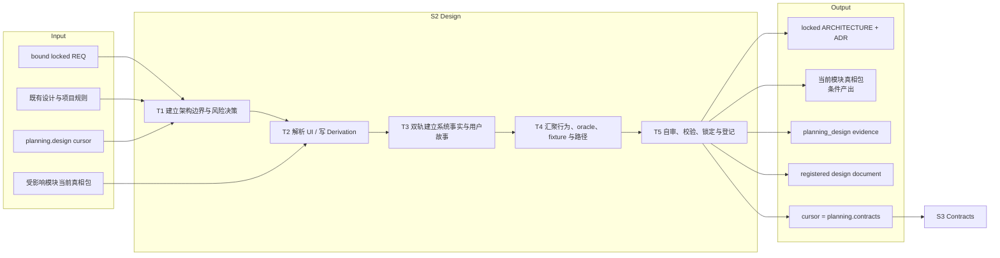
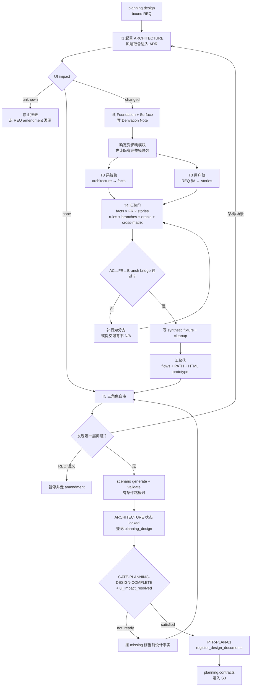

# L3-S2 — 设计（Design）

> 层：第三层 ｜ 上游：L2 §S2 + L2「单一验证分母」 ｜ 前置：S1 已绑定 REQ ｜ 下游：S3 契约
>
> 阅读顺序：§1～§3 先说明 S2 为什么存在、要完成哪些设计任务以及如何收敛；§4 再把模板、skill、harness、hook 挂到相应步骤；§5～§8 用于职责审计、准则映射、出口判定与遇错查阅。本文把“当前已经机械生效的能力”和“仍靠流程纪律或尚有接线缺口的能力”分开表述。

## 1. 第一层：S2 的立意与目标

### 1.1 为什么需要 S2

REQ 说明要实现什么，却不能直接替代实现各方共同依赖的设计事实。若没有 S2，前端、后端、测试和运维会分别补全组件边界、状态转换、错误恢复和用户路径，最终得到多套彼此合理却不能组合的系统。

S2 要解决四个根问题：

1. **系统应按什么边界和决策实现**：模块职责、数据流、状态机、数据模型、安全、性能、部署与回滚是否已经足以约束契约；
2. **哪些决策值得被长期保留**：风险、备选、后果和后续动作是否进入 ADR，而不是只留在聊天里；
3. **用户可见行为的全集是什么**：当 UI 行为变化时，模块事实、故事、规则分支、正反 oracle、数据 fixture、路径和原型是否形成同一份当前真相；
4. **后续验证以什么为分母**：每条 AC 能否到达 FR→Rule/Branch→CASE，或拥有可审计的 N/A，而不是被静默移出验证范围。

因此 S2 的本质不是“写架构文档和原型”，而是建立一套能被 S3 翻译、被 S4 拆分、被 S7 复验的**设计事实与验证分母**。

### 1.2 阶段目标与完成定义

| 项目 | 定义 |
|:--|:--|
| 输入 | 当前 bound REQ；既有 `docs/design/**`；受影响模块的现有真相包；项目规则；runtime 的 `planning.design` cursor |
| 要搞清楚 | 架构边界和风险决策；UI impact 路由；受影响模块的完整正反行为；AC 到 CASE/N/A 的可达性 |
| 核心工作 | 建立架构与 ADR → 解析 UI 分支 → 必要时双轨构造模块真相 → 自审、生成、校验、锁定并登记 |
| 输出 | locked ARCHITECTURE；必要 ADR；UI/行为变化时的当前模块真相包；planning_design 证据；runtime 中登记的 design 文档 |
| 完成 | 架构足以约束契约；UI impact 不为 unknown；应有的场景包通过 generate/validate/bridge；design gate 通过并提交 PTR-PLAN-01 |
| 下一阶段 | cursor 进入 `planning.contracts`，S3 只从 locked REQ、设计和模块真相翻译契约 |

### 1.3 Overview：输入、主步骤与输出

T3、T4 是条件路径：UI impact=`changed` 或行为模型确实变化时执行；`none` 只跳过 UI/场景包工作，不跳过架构决策和 S2 收口。

### 1.4 S2 的边界与现状结论

- **负责**：架构与风险决策、UI/行为影响路由、模块级场景事实、oracle、fixture、用户故事/动线/原型以及设计出口；
- **不负责**：FE/BE/SYNC 条款翻译（S3）、TASK 拆分（S4）、独立文档审查（S5）和实现；
- **事实源边界**：模块包是跨 REQ 演进的当前真相，不能为本 REQ 复制一份私有场景包；
- **验证边界**：`scenario-coverage.json` 的 100% 是设计分支已构造，不是 S7 的执行证据；
- **当前接线事实**：PTR-PLAN-01 的真实机械门要求 locked REQ、locked ARCHITECTURE、planning_design 证据和 `ui_impact_resolved`；它没有直接运行完整 UI package 校验，也不检查 Project Design Foundation 或 Derivation Note；
- **当前保护事实**：PTR-PLAN-01 只把 ARCHITECTURE 登记进 `documents[]`。stories/flows/JSON/HTML 真相包目前没有进入 runtime 的精确指纹集，也不受同等级 locked-artifact 保护；
- **当前方法事实**：`specification-planning` Step 0 在 `none` 时跳过 Foundation 推导与 UI 包，仍完成架构与 ADR；与 design gate 必须存在 locked ARCHITECTURE 对齐；
- **当前人闸事实**：ADR 方向签核是方法层约定，不是 loop-definition 中的 human-boundary transition，不能写成已被 runtime 强制。

## 2. 第二层：S2 的任务分解

| 任务 | 要解决的问题 | 主要动作 | 阶段产出 |
|:--|:--|:--|:--|
| T1 建立架构边界与风险决策 | 契约和实现依赖的技术决定是否齐全；为什么这样选 | 沿架构模板覆盖上下文、模块、数据流、状态/数据模型、安全、性能、部署回滚；实质取舍进入 ADR | 架构草案、风险—决策—后果链、ADR 集 |
| T2 解析 UI / 行为影响 | 是否需要新建或更新模块真相包；影响哪些既有模块 | 读取 bound REQ 顶部 UI impact 与模块绑定；unknown 停止；none/changed 分流；`changed` 先写 Derivation Note 再读模块包 | 明确的受影响模块清单、推导说明和条件工作范围 |
| T3 建立两条事实轨 | 系统词汇和用户意图如何在汇聚前各自完整 | 系统轨从架构落 facts/partitions；用户轨从 REQ §A 落 stories，复用稳定 S-NNN | 可汇聚的系统 facts 与用户 stories |
| T4 汇聚完整行为与可走查路径 | 每条规则的正反结果、数据和真实路径是否齐全 | facts × FR × stories 找 rules/branches；branch 同写 oracle；cross-matrix 查沉默格；再写 fixtures、flows、HTML 原型 | source package、生成前 bridge 结果、可执行路径和 fixture |
| T5 自审、校验、锁定与登记 | 设计是否可实现、可取证、可维护；机器事实能否进入 S3 | 三角色攻击；generate/validate；锁 ARCHITECTURE；登记 planning_design；由 gate 提交 PTR-PLAN-01 | 可审计设计出口与 `planning.contracts` cursor |

任务有两个关键顺序：stories 必须先于引用它的 branches；fixture 必须晚于行为分支定型。系统轨和用户轨可由同一 agent 自由交错，但不是把互相依赖的设计切给互不共享上下文的子代理。

## 3. 从绑定需求到契约输入的完整工作流

对 changed 路径，`scenario bridge` 应在汇聚①后先做源头检查，`scenario generate` / `scenario validate` 在收口时做全包检查。当前自然路径直到 PTR-PLAN-02 才机械执行 `scenario_bridge_checked`，所以 S2 主会话主动完成这两次校验仍是流程必要动作，而不是已经由本阶段出口门完整替代。

## 4. 第三层：每项任务如何被引导和承载

### 4.1 T1 — 架构边界与风险决策

| 维度 | 设计 |
|:--|:--|
| 模板 | `ARCHITECTURE-template.md` 的 12 节承担目标、上下文、容器、模块职责/排除、数据流、状态机、数据模型、接口、安全、性能、部署回滚和锁定记录 |
| 决策载体 | 有真实备选和长期后果的决定进入 `ADR-template.md`：背景、决策、备选、影响、后续动作 |
| 方法 | `specification-planning` 给出 planning 全流程；领域、状态机、API、安全等 skill 仅在对应风险出现时按需加载 |
| agent 判断 | 每个决定是否真的消除了一个被识别风险；哪些只是可逆实现细节，不值得造 ADR |
| 人的作用 | 只有架构方向与产品价值冲突、或需要改变 REQ 时才裁定；当前 runtime 不会自动强制 ADR 签核 |
| 完成产出 | 足以让 S3 不再猜模块、状态、数据、接口边界的架构草案与必要 ADR |

### 4.2 T2 — UI 与行为影响路由

| 情况 | 动作 | 不能做什么 |
|:--|:--|:--|
| `unknown` | 停止；指出 REQ §D 中要澄清的事实，走 human-only amendment | 猜成 none/changed 后继续 |
| `none` 且无行为包变化 | 保留 T1/T5，跳过 T3/T4 的 UI 包生产 | 跳过 ARCHITECTURE，或把“无 UI”误写成“无设计” |
| `changed` | 读已发布 Foundation 与 Surface Profile，写 Derivation Note，再从 REQ 绑定受影响模块并更新每个模块的当前真相包 | 跳过推导直接画 HTML；新建 REQ 私有副本 |
| 非 UI 但 AC→FR 仍需要 CASE | 按 AC bridge 的实际分母补模块行为包，或使用 NFR/§A4 的受控 N/A | 用 ui_impact=none 静默删除验收项 |

当前 `hasCompleteUIDesignPackageForREQ` 主要进入 status/next 投影；它会检查模块绑定、必需文件、HTML 头和 symlink 边界，但不是 PTR-PLAN-01 的 transition guard。此处必须如实把它称为**引导性检查**，不能称为已接线的硬门。

### 4.2.1 消费 Project Design Foundation

`changed` 路径在双轨之前读取已发布的 Kernel、Grammar 和当前 Surface Profile，并写 `docs/design/derivation/REQ-{id}.md`。先完成一张宏观构图和一个压力状态，再扩展其余 HTML / stories / flows。Derivation Note 迫使 Agent 说明“这个页面为什么这样长”，不复制整份 Foundation。

可复用发现按 [L4 §7.4](L4-project-design-foundation.md) 回灌：一次性构图留模块包；反复关系提修订提案；禁止静默改 `DESIGN.md`。

**诚实缺口**：Derivation Note 与 Foundation 引用目前不是 PTR-PLAN-01 谓词，也未进入 runtime `documents[]`。S2 主会话仍必须主动完成；S5 只做语义审查，不把它伪装成已接线硬门。

### 4.3 T3 — 系统轨与用户轨

| 轨道 | 输入 | 方法与载体 | 产出 |
|:--|:--|:--|:--|
| 系统轨 | ARCHITECTURE 的模块、状态、数据和规则词汇 | `scenario-model-design`；在 `scenario-model.json` 中写 facts/partitions | 稳定、可枚举的系统事实 |
| 用户轨 | REQ §A 的意图、利益相关者、成功/负空间 | `user-story-design` + `USER-STORY-template.md`；既有模块复用稳定 S-NNN | 成功、异常和边缘 stories |

两个轨道在汇聚前各自完整，在冲突时以显式 ADR 解决。不能让 architecture 静默压掉用户故事，也不能让故事无记录地改写架构约束。

### 4.4 T4 — 行为、oracle、fixture 与可走查路径

| 子步骤 | 载体 | 机器承担 | 人/agent 承担 |
|:--|:--|:--|:--|
| 行为汇聚 | `scenario-model.json` rules/branches + `cross-matrix.json` | 引用存在、fact/story 地板、branch 与 FR 真实关联、正反比例 | 找出哪些 facts×FR×stories 组合有意义；写忠实 oracle |
| 源头桥 | `scenario bridge` | AC→FR→Rule/Branch 可达；N/A 只认现存 NFR 或 §A4 指针 | 判断该 AC 应进入行为分母还是确属 N/A |
| 数据装配 | `fixture-contract.json` | schema、fixture 引用、synthetic/setup/cleanup 形状 | 设计不会污染真实数据且能复现分支的装配 |
| 可走查汇聚 | `flows.md`、PATH-*、模块 HTML、index | 引用和格式的一部分由 validate/projection 检查 | 真实入口、操作顺序、可见结果、恢复路径与页面设计 |
| 生成物 | `cases.json`、`scenario-coverage.json` | harness 原子生成、字节比对；禁止手改 | 只改 source package 后重新生成 |

oracle 正向至少表达 visible、terminal_state、persisted_effects、forbidden_side_effects；负向再表达 rejection、expected_state、recovery。结构完整可以机检，但“这个结果是否忠实于业务”仍是判断层责任。

### 4.5 T5 — 深度自审、校验、锁定与推进

收口前用三种身份攻击设计：

| 身份 | 必答问题 | 记录位置 |
|:--|:--|:--|
| implementer | 哪个 oracle 无法实现，或无法区分正确与错误实现 | ADR 的 Depth Self-Review |
| e2e-tester | 哪个负向 CASE 无法在七个结果维度上取证 | 同上 |
| maintainer | 哪条规则会与模块后续演进冲突 | 同上 |

changed 路径随后运行 `scenario generate` 和 `scenario validate`；所有路径都必须把 ARCHITECTURE 顶部状态改为 locked，并登记 kind=`planning_design`、responsibility=Architect/Orchestrator、conclusion=pass 的 JSON 证据信封。下一次 PreToolUse 由 gate 求值并通过 PTR-PLAN-01 登记 design 文档，agent 不手工拨 cursor。

## 5. 职责分布与覆盖审计

### 5.1 职能落点

| 职能 | 主责 | 承载位置 | 下游消费者 |
|:--|:--|:--|:--|
| 架构完整性 | Architect/main agent | ARCHITECTURE 12 节 | S3、S5、S6、S10 |
| 长期决策与风险 | agent 提案，必要时人裁定 | ADR | S3、S5、维护者 |
| 模块行为真相 | design agent | scenario source package | S3、S7、S8 |
| 正反结构与引用 | harness | scenario generate/validate/bridge | S3 gate、验证者 |
| 用户旅程 | design agent | stories/flows/PATH/HTML | FE 契约、E2E |
| 项目级设计推导 | design agent | `docs/design/derivation/REQ-*` + Foundation | 模块原型、S5 语义审查 |
| 设计登记与 cursor | gate + transition/store | planning_design evidence、documents[]、PTR-PLAN-01 | hook、S3 |
| UI 包完整性提示 | projection | status/next 的 missing 项 | 主会话 |
| 独立语义审查 | S5 两个 verifier | document_review | TR-003 |

### 5.2 重叠与诚实缺口

- ARCHITECTURE 与 ADR 正交：前者给当前系统全景，后者保存有备选的决策历史；
- scenario-model 与 cases 不双写：前者是源，后者是生成投影；
- stories、branches、flows 不是三份用户故事：分别表达意图、行为结果和可执行路径；
- `scenario bridge` 与 `contracts check` 不重复：前者管 AC→CASE，后者管 CASE→契约；
- **接线缺口**：完整 UI package 检查尚未挂到 PTR-PLAN-01；S2 可以在只有 locked architecture + evidence 时机械进入 S3；Project Design Foundation 与 Derivation Note 同样尚未成为机械门；
- **锁定缺口**：模块真相包未登记进 runtime `documents[]`，S5 的 exact subject 和后续 locked-artifact hook 不覆盖它；
- **方法缺口（已修）**：`specification-planning` Step 0 在 `none` 时不再跳过架构；仍跳过 Foundation 推导与 UI 包；
- **判断缺口**：oracle 语义、fact×story 组合和真实用户路径不能由 schema 证明正确；
- **分母边界**：AC bridge 对非 UI AC 也可能要求 CASE；不能把“只对 changed 强制”写成无条件现状。

### 5.3 关键取舍

| 问题 | 采用 | 未采用及原因 |
|:--|:--|:--|
| 真相包归属 | 模块级当前真相 | 每 REQ 私有副本会漂移并缩小回归分母 |
| 生产顺序 | 架构/facts 与 stories 双轨，stories 先于 branch，fixture 后于 branch | 六类产物平铺会形成大量回改 |
| oracle | 与 branch 同写、正反分支结构化 | 事后补测试期望会把设计责任推给 S7 |
| generated outputs | harness 生成并比对 | 手写 cases/coverage 可篡改分母 |
| N/A | NFR id 或 §A4 指针 | 自由文本理由会静默删除验收项 |
| 推进 | PreToolUse gate + PTR | 手工 transition 会制造 cursor 与事实脱节 |

## 6. L1 准则如何嵌入 S2

| L1 准则 | S2 中的实际落点 |
|:--|:--|
| D1 权威外置 | 架构/ADR/模块源包落盘；ARCHITECTURE 与 planning_design 进入 runtime。模块包尚未登记是明确缺口 |
| D2 自然路径观测 | design gate 随 PreToolUse 求值；AC bridge 当前在 S3 出口自然路径强制，S2 仅主动运行 |
| D3 门是顾问 | unknown、断链、引用缺失、比例不足等错误给出具体修复对象 |
| D4 引导性产物 | 架构 12 节、ADR 风险链、branch polarity/oracle、cross-matrix 沉默格都直接逼问设计 |
| D5 三级强制 | skill 引导汇聚，模板/schema 给结构，generate/validate/guard 强制机械事实；UI 包出口接线尚未达到完整强制 |
| D6 三方收敛 | agent 设计，人裁定不可派生方向，机器校验结构与登记；ADR 人闸目前仅程序性 |
| D7 收敛可观测 | missing token、bridge 计数、branch coverage 和 validate 结果显示剩余缺口 |
| 公理一 原型 | 对应风险驱动架构和可执行规格设计 |
| 公理二 分工 | 机器不判断业务 oracle，人不手算覆盖，agent 不把设计抛给 Builder |
| 公理三 消费 | 架构、CASE、PATH 均有 S3/S7 消费者；无消费者的 REQ 私有副本被禁止 |
| 公理四 成本 | UI/行为条件分流、方法 skill 按需加载、生成物不手抄 |
| 公理五 传达 | 模板字段、missing、bridge 报错和 ADR 理由让约束随设计事实传播 |

## 7. 产出、出口门槛与失败路由

### 7.1 正式产出

- `docs/design/architecture/ARCHITECTURE-*.md`，顶部状态 locked；
- 必要的 `docs/design/decisions/ADR-*.md`，含风险、备选、后果、Depth Self-Review 与 endorsed N/A；
- 条件产出的模块包：index、stories、flows、HTML、scenario-model、cross-matrix、fixture-contract，以及生成的 cases/coverage；
- valid planning_design 证据信封；
- PTR-PLAN-01 提交后 runtime 中的 design document 与 `planning.contracts` cursor。

### 7.2 出口判定

| 判定 | 必须满足 |
|:--|:--|
| 架构充分 | 契约需要的模块、状态、数据、接口、安全、性能和回滚决定不再留给 S3 猜 |
| 风险诚实 | 重大决策有风险、备选和后果；冲突没有被静默覆盖 |
| UI/行为受控 | unknown 不推进；changed/行为变化时模块包更新；none 不删除非 UI 验收分母 |
| 分母可达 | 每条 AC 到 CASE，或通过受控 N/A；source package 与生成物一致 |
| 机器出口 | locked REQ/design + valid planning_design + `ui_impact_resolved`；PTR-PLAN-01 成功登记 design |

### 7.3 失败路由

| 情况 | 去向 |
|:--|:--|
| UI impact=unknown 或设计触及目标/范围/AC 变化 | pause，走 human-only REQ amendment，回 S2 新 generation |
| 架构/故事/规则/路径互相冲突但 REQ 未变 | 留在 S2，定位最早失真的设计事实重做 |
| AC 无法到 CASE 且无可背书 N/A | 留在 S2；补 FR/branch，不能自由文本豁免 |
| generate/validate/bridge 失败 | 按报错修 source package，禁止手改生成物 |
| design gate missing evidence/document | 补 locked ARCHITECTURE 或新的 planning_design 信封 |
| S5/S6/S8 发现规格缺陷且 REQ 不变 | 通过 TR-004/007/013/023 回 `planning.design`，受影响设计与下游重新产出 |

## 8. 易错点与渐进披露

### 8.1 易错点

- UI impact=`none` 不等于“不做架构”；
- “模块全量”不是做 facts×stories 的机械笛卡尔积，而是每个有意义组合必须覆盖或说明；
- branches 必须引用已经存在的 stories；fixtures 在分支稳定后再写；
- oracle 是判定结果，不是实现步骤；
- cases/coverage 是生成物，任何手改都应被 validate 拒绝；
- design gate 当前不能证明完整 UI package 已完成，不能把 status 投影当硬门；
- Foundation / Derivation Note 是 S2 的语义入口，不是已接线硬门；
- 模块包尚未进入 runtime 精确锁定集，S5/S6 期间的保护不能虚称；
- ADR 签核目前是流程约定，不是机器 human boundary。

### 8.2 阅读预算

| 角色/时机 | 最小阅读集 | 按需加载 | 不需要背诵 |
|:--|:--|:--|:--|
| 进入 S2 | bound REQ、ARCHITECTURE 模板、既有设计；涉及既有模块时读其全包 | 对应领域规则 | loop-definition 全文 |
| 系统轨 | architecture/ADR + scenario-model-design | state-machine/domain/security 等具体 skill | 用户流方法 |
| 用户轨 | REQ §A + user-story-design | ui-prototyping | 存储/接口细节 |
| 汇聚① | scenario-model + cross-matrix + bridge 输出 | oracle 相关规则 | flows/HTML 全部细节 |
| 汇聚② | user-flow-design + ui-prototyping | 浏览器约束 | 状态机内部实现 |
| 收口 | 三角色自审、generate/validate 输出、planning evidence 格式 | 报错对应实现说明 | 比例、哈希、字节比对算法 |

正常路径只暴露当前任务所需模板与一条下一步；机器已检查的引用、比例和生成一致性不再要求 agent 逐条人工复算。
