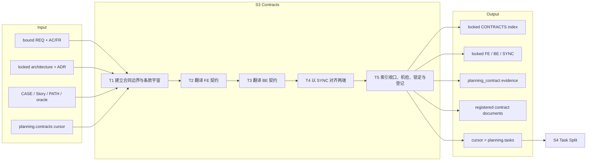
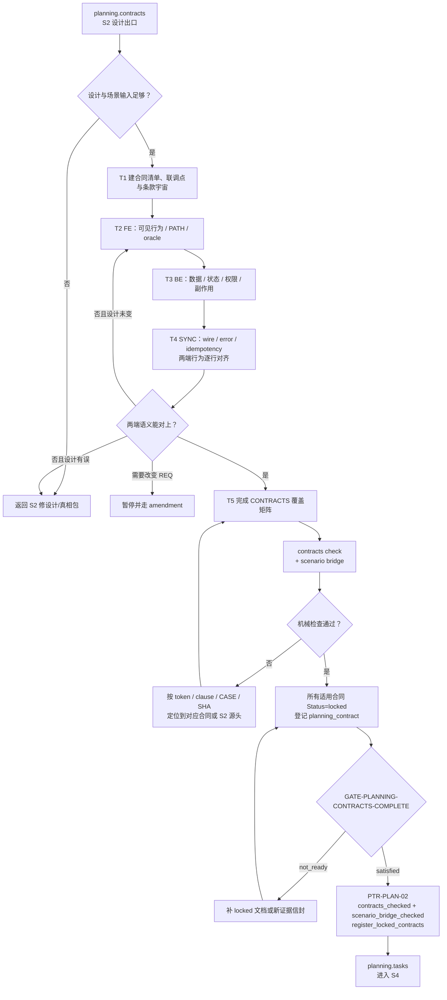

# L3-S3 — 契约（Contracts）

> 层：第三层 ｜ 上游：L2 §S3 + L2「单一验证分母」 ｜ 前置：S2 设计出口 ｜ 下游：S4 任务拆分
>
> 阅读顺序：§1～§3 先从“为什么需要共同执行边界”推导契约任务和工作流；§4 才展开各模板、skill 和机器检查；§5～§8 用于职责审计、L1 映射、出口与遇错查阅。本文以当前模板、semantic check、planning phase machine 和 runtime 登记事实为准，不把模板里尚无消费者的字段或宽松检查写成强保证。

## 1. 第一层：S3 的立意与目标

### 1.1 为什么需要 S3

S2 给出了系统和用户行为事实，但 Builder 不能直接从整套设计中各自推导接口。前端关心可见状态和交互，后端关心数据、状态与副作用，联调关心 wire shape、错误、幂等和兼容性；若三方分别解释同一设计，就会在字段含义、失败行为和状态转换上产生“各自正确”。

S3 要解决四个根问题：

1. **每个执行端到底承诺什么**：范围、排除、输入输出、状态、副作用和验收必须有明确条款；
2. **两端是否在说同一件事**：同一个字段、错误码、权限拒绝和状态转换的 FE/BE 行为必须在 SYNC 中并排对齐；
3. **需求和场景是否没有在翻译中丢失**：AC→CASE 的分母继续延伸到合同条款，并能反向证明每个 CASE 有条款消费者；
4. **后续变更以什么为边界**：锁定契约成为 Builder 的唯一接口语义来源，任何静默扩展都必须被视为规格变化。

S3 的本质是把设计事实翻译成**分端可执行、跨端可对照、上下游可追溯的共同承诺**，而不是重复描述架构。

### 1.2 阶段目标与完成定义

| 项目 | 定义 |
|:--|:--|
| 输入 | bound REQ；locked ARCHITECTURE/ADR；当前模块 scenario/story/flow/prototype；`planning.contracts` cursor |
| 要搞清楚 | FE、BE、SYNC 各自的边界；两端 wire/error/state/side-effect 是否一致；每个 CASE 与 AC 是否有条款落点 |
| 核心工作 | 建立条款宇宙 → FE 翻译 → BE 翻译 → SYNC 对齐 → 索引收口、机检、锁定和登记 |
| 输出 | locked CONTRACTS 索引与适用的 FE/BE/SYNC 契约；planning_contract 证据；runtime 登记的 contract documents |
| 完成 | contracts check 与 scenario bridge 均通过；至少一份 locked contract 存在；证据精确覆盖当前设计与 locked contract 集；PTR-PLAN-02 提交 |
| 下一阶段 | cursor 进入 `planning.tasks`，S4 以 CONTRACTS 索引中的条款宇宙拆任务 |

### 1.3 Overview：输入、主步骤与输出

顺序 FE→BE→SYNC 是当前 `specification-planning` 的工作口径：先把用户侧可见行为写清，再让后端承诺支撑它，最后用 SYNC 对照消除两端差异。若某次变更没有其中一端，仍需在索引和范围中明确 N/A，而不能省略边界说明。

### 1.4 S3 的边界与当前保证

- **负责**：合同范围、条款、两端接口语义、错误/状态/副作用、兼容性决策、需求—场景—条款追溯和契约登记；
- **不负责**：重新设计场景事实。发现 oracle、PATH 或架构错误时返回 S2；
- **不负责**：把条款拆成 TASK 或回填“派生任务”。任务覆盖的权威在 S4 的 TASK §3 与 `tasks check`；
- **机器能保证**：引用 token 存在、CASE 反向闭合、索引 clause cell 指向某个含同号 §n 的契约、部分 fingerprint 与磁盘一致、至少存在 contract、AC bridge 可达；
- **机器不能保证**：SYNC 两端语义真的等价、oracle 翻译忠实、条款粒度合理、兼容性取舍正确；
- **锁定时序**：PTR-PLAN-02 登记 exact contract 指纹，但阶段感知的写拦截到 S6 才激活；S4/S5 返工期仍可通过合法流程更新并重登记，不能写成“PTR 后立刻物理不可写”。

## 2. 第二层：S3 的任务分解

| 任务 | 要解决的问题 | 主要动作 | 阶段产出 |
|:--|:--|:--|:--|
| T1 建立合同边界与条款宇宙 | 哪些分端合同需要存在；每个需求/CASE 应由什么条款承担 | 从 REQ、设计与 CASE 清点合同集；在 CONTRACTS 索引建立合同清单、联调点和需求覆盖矩阵 | 合同结构、稳定 ID、条款宇宙草案 |
| T2 翻译 FE 契约 | 用户可见状态、组件行为、输入依赖和错误恢复如何成为前端承诺 | 将 Story/PATH/oracle 映射到 FE 条款、联调点与验收 | FE 范围、条款、场景与测试映射 |
| T3 翻译 BE 契约 | 数据、状态机、权限、副作用和技术约束如何成为后端承诺 | 将 architecture/rule/oracle 翻译为 BE 条款、数据模型和验收 | BE 范围、条款、数据/状态/副作用承诺 |
| T4 以 SYNC 对齐两端 | wire shape、错误码、幂等、限流、权限、状态转换是否逐项一致 | 在同一行并排写 FE/BE 行为；补 HTTP/JSON 样例和 CT 用例 | 可联调的 SYNC 契约及差异裁决 |
| T5 索引收口、机检、锁定与登记 | 追溯是否闭合；哪些事实能进入 runtime | 完成索引；运行 contracts check；修 scenario bridge；翻 locked；登记 planning_contract；PTR-PLAN-02 | registered contract set 与 S4 cursor |

T1 的条款宇宙先建立框架，T2～T4 才能用稳定编号填充；T5 再从两端反查。若先分别写三个合同、最后才想编号，索引和正文会形成三套局部真相。

## 3. 从设计事实到锁定合同集的完整工作流

机械检查负责找断链，语义对齐仍必须在 T2～T4 完成。不能因为 `contracts check` 绿色，就把“前端收到某错误后显示什么”与“后端实际返回什么”视为已经被机器证明。

## 4. 第三层：每项任务如何被引导和承载

### 4.1 T1 — 合同边界与条款宇宙

| 维度 | 设计 |
|:--|:--|
| 主模板 | `CONTRACTS-template.md`：合同清单、联调点矩阵、UI 设计包输入、需求覆盖矩阵 |
| 唯一事实 | CONTRACTS 需求覆盖矩阵的 `{contract-id} §{n}` cell 是条款宇宙；S4 只消费，不在别处再抄一份 |
| 输入链 | REQ source_ref → Rule/CASE/Story/PATH → 目标合同与条款 |
| agent 判断 | 什么是一个独立承诺；哪类行为属于 FE、BE、SYNC；哪些合同确实 N/A |
| 机器接力 | contracts check 后续验证 token、CASE 反向闭合和 clause number |
| 完成产出 | 一组稳定合同 ID、初步条款编号和每个 CASE 的责任去向 |

索引中的条款 cell 不是实现章节号，而是后续 TASK 覆盖的稳定语义单位。编号不能只有名字没有可判定承诺，也不能把整个合同压成一个巨型条款。

### 4.2 T2 — FE 契约：翻译用户可见行为

| 维度 | 设计 |
|:--|:--|
| 模板 | `FE-contract-template.md` 的范围/排除、输入依赖、需求条款映射、UI 包映射、场景与测试映射、技术约束、联调点和验收 |
| 方法 | `api-contracts` 只在 API/shared schema 变化时加载；UI 语义以 S2 当前模块包为准 |
| 核心翻译 | CASE/PATH 的 visible、terminal_state、rejection、recovery → 页面/组件/状态管理/错误呈现承诺 |
| 停止条件 | PATH、错误状态或字段含义在 S2 中不存在；不能由 FE 自行发明 |
| 完成产出 | 每个前端可见结果和联调点都有稳定 FE 条款 |

### 4.3 T3 — BE 契约：翻译系统状态与副作用

| 维度 | 设计 |
|:--|:--|
| 模板 | `BE-contract-template.md` 的范围/排除、输出契约、需求映射、UI 反推、Rule→CASE 链、技术约束、数据模型、规则与验收 |
| 核心翻译 | architecture/rule/oracle → 请求校验、状态转换、持久化副作用、禁止副作用、权限与错误 |
| 规则载体 | `api-design.md`、`naming.md`；涉及安全、状态机、数据库时按风险加载对应 skill/rule |
| 兼容性 | 可选新增与 breaking 变更必须明确；必填新增/删除需 ADR、版本和 change-control，不静默扩展 locked contract |
| 完成产出 | 后端可实现、可测试并能支撑 FE 承诺的条款 |

### 4.4 T4 — SYNC 契约：把两个实现世界并排

SYNC 是 S3 最深的语义工作，不是第三份摘要：

| 对齐对象 | SYNC 模板载体 | 必须回答 |
|:--|:--|:--|
| 上游条款 | 上游需求四列表 | SYNC 自己的条款号怎样连接 FE 与 BE |
| UI/场景事实 | 当前真相、字段/错误/状态/权限/副作用、FE 行为、BE 行为四列 | 两端面对的是不是同一事实 |
| wire shape | 请求、响应、原始 HTTP/JSON 样例 | 类型、缺省、时间/金额、分页、排序和空值是否一致 |
| 失败 | 错误码表 | 后端状态码/业务码对应什么前端行为和恢复 |
| 状态 | 状态机关联表 | 事件、前后状态和副作用是否一致 |
| 运行约束 | 幂等、限流、权限 | 重试与并发下是否仍满足承诺 |
| 验证 | 契约测试表 | 哪个 CT 证明哪条 wire/error/state 断言 |

机器目前只检查结构引用，四列的语义一致性由 S3 自审与 S5 独立审查承担。

### 4.5 T5 — 机检、锁定、登记与推进

`contracts check` 当前做五类机械工作：

1. CASE/S/F/PATH/FR token 是否存在；
2. scenario-model 的 CASE 分母与 generated cases 是否一致；
3. 每个 CASE 是否至少被一个合同引用；
4. 索引 cell 的目标合同是否存在，且目标文本中出现同号 §n；
5. 带 fingerprint 的模块包行是否与磁盘 SHA-256 一致。

PTR-PLAN-02 的自然路径还会执行 `scenario_bridge_checked`，把 bound REQ 的 AC→FR→Branch/CASE 或受控 N/A 再核一遍。完成后把所有适用合同顶部状态设为 locked，登记 kind=`planning_contract`、responsibility=Contract Planner/Orchestrator、conclusion=pass 的证据信封；PreToolUse 通过 PTR-PLAN-02 把 locked contracts 登记进 `documents[]` 并进入 S4。

## 5. 职责分布与覆盖审计

### 5.1 职能落点

| 职能 | 主责 | 承载位置 | 消费者 |
|:--|:--|:--|:--|
| 条款宇宙 | Contract Planner | CONTRACTS coverage matrix | S4 tasks check |
| FE 行为 | FE contract 作者 | FE 条款与场景映射 | frontend builder、S5/S7 |
| BE 行为 | BE contract 作者 | BE 条款、数据/状态/规则 | backend builder、S5/S7 |
| 两端一致性 | Contract Planner | SYNC 四列、wire 样例、error/CT | FE/BE、S5 |
| 引用与 CASE 闭合 | harness | contracts check + scenario bridge | planning gate |
| 语义忠实度 | S3 自审、S5 独立审查 | SYNC 与 oracle 抽查 | Builder、验收 |
| 合同指纹登记 | PTR-PLAN-02/store | runtime documents[] + journal | hook、S4/S5/S6 |
| 变更裁决 | agent 分析、人处理 REQ/breaking 决策 | ADR/change-control | 后续所有阶段 |

### 5.2 重叠、缺口与当前实现边界

- CONTRACTS 索引和 FE/BE/SYNC 不重复：索引拥有宇宙与关系，分端合同拥有语义正文；
- S2 bridge 和 S3 check 不重复：前者闭合 AC→CASE，后者闭合 CASE→contract；
- S3 自审和 S5 review 不重复：前者负责产出正确，后者以独立上下文攻击它；
- **状态过滤缺口**：`ContractsCheck` 扫描所有非模板 markdown，并不只扫描 locked contract；一个 draft 文档可能提供引用，而 gate 只要求至少一份 locked contract，存在“草稿帮助门变绿但未被注册”的口径缝隙；
- **REQ 作用域缺口**：FR token 检查当前接受“任意 REQ 中存在的 FR”，不严格限定当前 bound REQ；
- **条款检查宽松**：目标合同只要任意位置出现同号 `§n` 就算声明，不严格限定「本合同条款」列；它是防明显漂移的地板，不是条款结构证明；
- **语义缺口**：SYNC 四列、错误恢复、兼容性和 oracle 翻译没有机器 matcher；
- **模板死字段**：FE/BE/SYNC 均带“派生任务”章节，但合同在 S3 先 locked，S4 才产生 TASK；实际 task 覆盖权威不在这些章节。当前它们没有安全回填时序，应视为待删除/改为只读指路，而非要求 S3 猜未来任务；
- **锁定边界**：runtime 登记在 S3，物理写拦截从 S6 开始；S5 前的合法返工仍可能改变并重登记指纹。

### 5.3 关键取舍

| 问题 | 采用 | 未采用及原因 |
|:--|:--|:--|
| 两端对齐 | SYNC 同行四列 + raw example + CT | 自动 schema diff 无法判断用户行为和副作用语义 |
| 追溯 | 模板映射 + machine check + S5 semantic review | 全靠人工会重复算术；全靠机器会伪装语义判断 |
| 条款宇宙 | CONTRACTS 索引单一居所 | REQ §F/每份合同/索引多处维护必漂移 |
| 锁定事实 | status 声明 + transition 原子登记 | 事务外回填 lock hash 会破坏原子性 |
| 契约变更 | 兼容/破坏分类，breaking 走 ADR/change-control | 所有变化一刀切或静默扩展都不符合风险成本 |
| 孤儿条款 | 暂不虚构强检查 | 当前缺结构化 clause entity，做出来只能自证循环 |

## 6. L1 准则如何嵌入 S3

| L1 准则 | S3 中的实际落点 |
|:--|:--|
| D1 权威外置 | 条款宇宙在 CONTRACTS；分端语义在各合同；PTR 后 exact fingerprint 在 runtime |
| D2 自然路径观测 | contracts_checked 与 scenario_bridge_checked 挂在 PTR-PLAN-02，自然推进时必经 |
| D3 门是顾问 | token、CASE、clause、SHA 和 evidence 缺口均点名文件/对象 |
| D4 引导性产物 | 范围/排除、四列对照、错误行为、状态和 CT 表迫使作者完成翻译 |
| D5 三级强制 | skill/规则引导语义，模板固定结构，semantic guards 强制可机械闭合 |
| D6 三方收敛 | agent 翻译，人裁定 breaking/REQ 变化，机器登记与核引用 |
| D7 收敛可观测 | problems 列表、reverse closure 和 gate missing 显示剩余断点 |
| 公理一 原型 | 对应真实 API/事件契约和 consumer-provider 对齐 |
| 公理二 分工 | machine 查引用，S5 查语义，Builder 只实现 locked contract |
| 公理三 消费 | 每条条款进入 TASK/验证；无时序消费者的派生任务字段被标为缺口 |
| 公理四 成本 | 只在适用端建合同；机械对账不转交人重复 |
| 公理五 传达 | 合同与错误码表把原因、行为和恢复带给实现者 |

## 7. 产出、出口门槛与失败路由

### 7.1 正式产出

- `docs/contracts/CONTRACTS-*.md`：合同清单、联调点、设计输入和条款宇宙；
- 适用的 `FE-*.md`、`BE-*.md`、`SYNC-*.md`；
- 所有进入本批的合同状态为 locked，版本与稳定 ID 明确；
- valid planning_contract 证据信封；
- PTR-PLAN-02 后 runtime 中的 contract documents 与 `planning.tasks` cursor。

### 7.2 出口判定

| 判定 | 必须满足 |
|:--|:--|
| 分端明确 | FE/BE/SYNC 范围、排除和条款足以让实现者不再补语义 |
| 两端一致 | wire、error、state、idempotency、permission、side-effect 有同行对照与裁决 |
| 追溯闭合 | AC→CASE→contract 可达，每个 CASE 至少一个合同消费者 |
| 机械检查 | contracts check 无 problems；scenario bridge 通过；至少一份 locked contract |
| 登记完整 | planning_contract 证据覆盖当前 subjects；PTR-PLAN-02 登记 locked contracts |

### 7.3 失败路由

| 情况 | 去向 |
|:--|:--|
| 场景、oracle、PATH 或架构事实缺失/冲突 | 回 S2 修源事实，不在合同里发明 |
| 合同之间可在既有设计内对齐 | 留 S3，修 FE/BE/SYNC 与索引 |
| 必须改变目标、范围、AC 或硬约束 | pause，走 REQ amendment，从 S2 重做 |
| contracts check 断链 | 按 token/clause/CASE/SHA 定位；修正确权威源后重跑 |
| S5 判定 fix_required | TR-004 回 planning；修改后新指纹重签 planning/review evidence |
| S6/S8 发现规格缺陷且 REQ 不变 | TR-007/013/023 回 `planning.design`，S2→S4 重新收敛 |

## 8. 易错点与渐进披露

### 8.1 易错点

- 绿色 contracts check 只证明结构闭合，不证明 FE/BE 语义等价；
- SYNC 不是接口摘要，而是两端行为的裁决面；
- 条款号必须稳定且有语义，不能把章节号当条款；
- 所有 CASE 都要有合同消费者，不能只覆盖“本次最重要的几个”；
- FR 存在性检查当前不限定 bound REQ，作者仍必须人工确认 source_ref；
- draft 文档会被 ContractsCheck 扫描，收口前要移除/明确不属于批次的草稿，避免假绿；
- 合同内“派生任务”章节当前不应被当作活权威；
- registered 不等于 S3 当场物理不可写；真正执行冻结从 S6 生效。

### 8.2 阅读预算

| 角色/时机 | 最小阅读集 | 按需加载 | 不需要背诵 |
|:--|:--|:--|:--|
| 进入 S3 | CONTRACTS + 适用分端模板、S2 当前设计/场景包 | api-design/naming | transition 内部 |
| 写 FE | FE 模板、Story/PATH/oracle | UI/API 相关 skill | BE 实现细节 |
| 写 BE | BE 模板、architecture/rule/oracle | DB/state/security skill | FE 组件细节 |
| 对齐 SYNC | SYNC 模板、FE/BE 草案 | api-contracts | contracts check 算法 |
| 收口 | CONTRACTS matrix、contracts check/bridge 输出、planning evidence 格式 | 具体报错对应源码说明 | 手工 token/哈希对账 |
| S5 reviewer | SYNC 四列与 oracle 翻译 | 风险触发专项 | 机械引用重算 |

正常路径只要求作者理解当前合同语义；引用存在、CASE 反向闭合、条款号和指纹由 harness 报错驱动，不写成常读检查清单。
