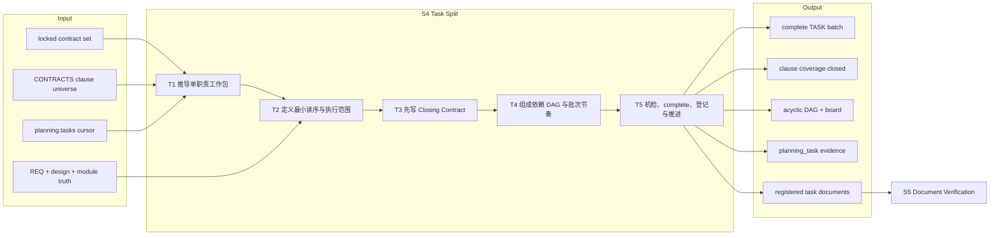
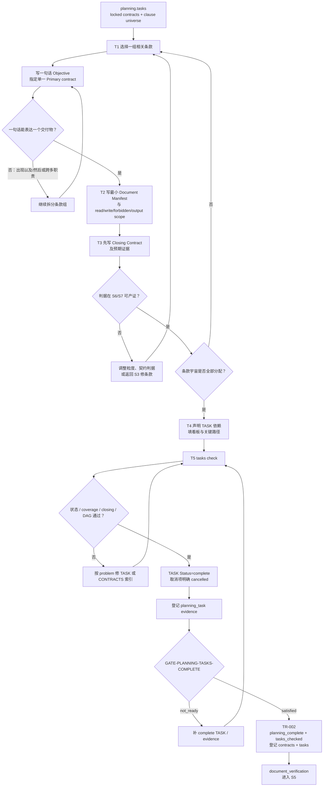

# L3-S4 — 任务拆分（Task Split）

> 层：第三层 ｜ 上游：L2 §S4 ｜ 前置：S3 locked contract set ｜ 下游：S5 文档验证
>
> 阅读顺序：§1～§3 先说明为什么要在动手前定义工作包与完成判据；§4 再映射 TASK 模板、planning skill、DAG 方法和 `tasks check`；§5～§8 审计职责、实际强制边界、出口和易错点。本文区分“任务文档 complete”与“代码实现 done”，也区分机器已检查的批次结构与仍待 S5 判断的可执行性。

## 1. 第一层：S4 的立意与目标

### 1.1 为什么需要 S4

locked contract 已经说明系统各端必须承诺什么，但还不能直接回答“谁在一个上下文内改哪些文件、依赖谁、用什么证据证明完成”。如果直接把整个合同交给 Builder：

- 一个 agent 会同时承担 FE、BE、SYNC 或迁移等多种职责；
- 依赖关系只存在于人的脑中，执行时才发现前置未完成；
- “完成”会在实现后才被重新解释；
- builder 必须重新探索整套文档和代码，既浪费上下文又容易越界。

S4 要把条款宇宙转换成一批**单职责、边界明确、判据先行、依赖可调度的工作包**。每个 TASK 在动手前就必须回答：交付什么、读什么、能改什么、依赖谁、如何证明完成。

### 1.2 阶段目标与完成定义

| 项目 | 定义 |
|:--|:--|
| 输入 | runtime 已登记的 locked contracts；CONTRACTS 条款宇宙；REQ/设计/模块真相；`planning.tasks` cursor |
| 要搞清楚 | 如何按交付物拆单职责；每项工作的最小上下文和写边界；每条条款由谁兑现；完成证据和依赖顺序 |
| 核心工作 | 推导原子工作包 → 定义上下文/范围 → 写 Closing Contract → 组成 DAG/看板 → 机检、complete、登记 |
| 输出 | complete/cancelled TASK 批次；无环依赖图；条款双向覆盖；planning_task 证据；runtime 登记的 task documents |
| 完成 | 至少一项 complete；所有非取消任务结构成立；条款无漏项/幽灵项；DAG 无环；TR-002 提交进入 document_verification |
| 下一阶段 | S5 用两个独立职责审查“规格链是否一致”和“这些 TASK 是否真的可执行”，通过后才锁执行批次 |

### 1.3 Overview：输入、主步骤与输出



这里的 complete 只表示 TASK 文档已经写完，可以交给 S5；它不表示实现完成。实现进度属于 S6 及 runtime entity/workgroup，不得借用同一个状态词。

### 1.4 S4 的边界与当前保证

- **负责**：任务粒度、条款覆盖、读序、scope、预期输出、Closing Contract、TASK 级依赖和批次看板；
- **不负责**：任命实际 Builder、生成 team manifest、激活 agent 或填写执行后证据；这些发生在 S6；
- **不锁执行**：S4 只声明 Status=complete 并在 TR-002 登记；S5 双 PASS 后的 TR-003 才建立 execution batch；
- **机器能保证**：批次非空、状态 complete/cancelled、Primary contract 文件存在、Closing Contract 标题和至少一条 assert 在场、条款双向覆盖、依赖引用存在/未取消/无环；
- **机器不能保证**：一句话目标真的单一、任务不会撞 compact、写路径划分合理、assert 可执行、依赖语义真实、FE/BE/SYNC 没混在一个任务；
- **当前模板时序问题**：TASK 头部的 Team manifest / Assignment ID / Builder Agent，以及 §9 生命周期证据，在 S4 尚不存在，S5 后 TASK 又将冻结；当前没有合法回填时序，不能要求 S4 填真实值，也不能在 S6 直接改 locked TASK。

## 2. 第二层：S4 的任务分解

| 任务 | 要解决的问题 | 主要动作 | 阶段产出 |
|:--|:--|:--|:--|
| T1 推导单职责工作包 | 条款如何组合成一个 agent 可独立交付的结果 | 按用户/系统交付物聚类；每任务只设一个 Primary contract；用一句话测试拆分“以及/然后” | TASK ID、Objective、Delivered Clauses 草案 |
| T2 定义最小读序与执行范围 | Builder 需要哪些精确上下文；能读/写/执行什么 | 写 Document Manifest、Module Impact、read/write/forbidden/output paths、command classes、skills | 自包含任务简报与 prospective scope |
| T3 先写 Closing Contract | 什么事实证明该任务完成；证据能否由 S6/S7 产出 | 在实现前写合同条款断言、验证命令、changed-path subset 和 scope deviations | 可复验 Closing Contract 与输出/证据预期 |
| T4 组成 DAG 与批次节奏 | 哪些地基必须先完成；哪些任务可并行；是否存在假依赖/环 | 写 TASK §8 依赖；类型/schema/迁移先于消费者；填 index 看板和关键路径 | 无环 TASK DAG、批次视图 |
| T5 机检、complete、登记与推进 | 批次是否覆盖全部条款并可交 S5 | 运行 tasks check；修漏项/幽灵/环；状态改 complete/cancelled；登记 planning_task；TR-002 | registered TASK batch 与 S5 cursor |

拆分不是按文件数量平均分配，而是按一个可判定交付物划边界。一个任务可以触碰多个文件，但不能同时拥有多个彼此独立的完成定义。

## 3. 从条款宇宙到可审查工作包的完整工作流



如果 `tasks check` 通过但 S5 判断任务过大、缺边或判据不可执行，说明失败发生在语义层，不应削弱 S5；应回 S4 重拆后用新指纹重新审查。

## 4. 第三层：每项任务如何被引导和承载

### 4.1 T1 — 推导单职责工作包

| 维度 | 设计 |
|:--|:--|
| 输入载体 | CONTRACTS 需求覆盖矩阵是 clause universe；各分端合同提供条款语义 |
| 模板逼问 | TASK §1 Objective、Primary contract、§3 Delivered Clauses |
| 方法 | `specification-planning` Step 11：一句话测试、FE/BE/SYNC 不混、地基先于依赖者；拿不准 DAG 设计时按需加载 `dag-design` |
| 判断标准 | 一句话说清用户/系统交付物；不存在两个可独立验收的“以及/然后”；任务切换的技术上下文有限 |
| 机器地板 | `tasks check` 验 Primary contract 文件存在、声明条款属于索引宇宙 |
| 完成产出 | 一组稳定 TASK ID，每个拥有单一目标和明确条款声明 |

`tasks check` 不会比较 Delivered Clauses 是否只属于 Primary contract；“一个任务一个主合同、避免跨端混装”目前仍由拆分者与 S5 审查者判断。

### 4.2 T2 — 最小读序与执行范围

TASK §2～§6 分别承担：

| 模板位置 | 作用 | 当前机器消费 |
|:--|:--|:--|
| §2 Document Manifest | 按 TASK→contract→REQ→module/design→rules 给 Builder 最小读序 | `tasks check` 读取 Path 估算 required-reading bytes |
| §3.1 Module Impact | 声明触及模块与全模块回归责任 | 当前无专门 gate |
| §4 Scope | read/write/forbidden/output paths 与 command classes | `tasks check` 只统计 prospective write path 数，不检查交叉重叠 |
| §5 Selected Skills | 按风险和职责选择方法 | team manifest/role 在 S6 才会做部分 skill 校验 |
| §6 Outputs And Evidence | 预先列实现、测试、报告和 S7 证据形态 | 当前 S4 gate 不核语义 |

规模锚（约 30KB 必读、8 个写路径、400 行改动）只用于提醒“会不会在一个上下文区间内撞 compact”，不是硬阈值。目录路径当前可能按 0 bytes 计，输出只能作参考。

### 4.3 T3 — Closing Contract：先定义完成，再允许实现

模板提供四个基础断言：

```text
assert {contract clause} == satisfied
assert {verification command} == pass
assert changed_paths subset_of activated_write_paths
assert scope_deviations == []
```

四行分别约束语义兑现、可执行验证、写入授权和偏差诚实度。任务可增加与自身交付物直接相关的断言，但每条都必须说明 S6 怎样产生证据、S7怎样复验。

当前 `tasks check` 的实现只检查文档包含 “Closing Contract” 和至少一个 `assert `，不会验证恰好四类断言、命令可运行或条款语义。因此“判据先行”的真质量仍由模板逼问和 S5 的 TASK-EXECUTABILITY 审查承担，不能虚称已机械保证。

### 4.4 T4 — 依赖 DAG 与批次节奏

| 层次 | 权威 | 当前检查 |
|:--|:--|:--|
| TASK 间语义依赖 | TASK §8 的 TASK-* 引用 | 目标存在、目标未 cancelled、无环并报告 cycle path |
| 批次总览 | `index-template.md` 的任务矩阵与关键路径 | 人向视图，无自动同步 |
| S6 assignment 依赖 | 后续 team manifest | manifest 内引用和无环；不是 S4 TASK DAG 的替代 |

只有 TASK-* 会进入当前 DAG。非 TASK 值会被明确报错而不是静默丢边。机器能发现环和悬空引用，却不能发现缺失边、假边或本应先做的 schema/迁移地基；这些由 S4 自审与 S5 半问判断。

### 4.5 T5 — 机检、状态、证据与 TR-002

`tasks check` 当前实际覆盖：

1. 批次至少一项 complete，draft 拒绝，cancelled 退出覆盖聚合；
2. Primary contract 文件存在；
3. Closing Contract 标题与至少一条 assert 在场；
4. CONTRACTS universe ↔ TASK §3 双向覆盖，无 phantom clause，且每个 FE/BE/SYNC 文件在索引至少有一个 cell；
5. dependency 引用存在、目标未取消、DAG 无环；
6. 输出每任务 required-reading KB 与 write-path 数，仅供参考。

通过后把本批 TASK 状态设为 complete（或明确 cancelled），登记 kind=`planning_task`、responsibility=Task Planner/Orchestrator、conclusion=pass 的证据信封。GATE-PLANNING-TASKS-COMPLETE 与 TR-002 会重新运行 `planning_complete` / `tasks_checked`，并原子登记 locked contracts 与 complete tasks，进入 S5。

## 5. 职责分布与覆盖审计

### 5.1 职能落点

| 职能 | 主责 | 承载位置 | 消费者 |
|:--|:--|:--|:--|
| 条款→任务归属 | Task Planner | TASK §3 + CONTRACTS universe | tasks check、S5 |
| 单职责与上下文粒度 | Task Planner | Objective、Primary contract、Document Manifest | S5、Builder |
| 写入与命令边界 | Task Planner | TASK §4 | S6 activation/hook |
| 完成判据 | Task Planner | TASK §6/§7 | Builder report、S7 |
| 依赖与调度 | Task Planner | TASK §8 + index | tasks check、S6 team planning |
| 结构对账 | harness | semantic.TasksCheck | TR-002 |
| 可执行性判断 | S5 verifier | 五问+半问 | TR-003 |
| 实际任命/激活 | S6 orchestrator/harness | workgroup manifest、agent-event | Builder/hook |
| 文档指纹登记 | TR-002/store | documents[] + journal | S5/hook |

### 5.2 重叠、缺口与当前实现边界

- TASK §3 和 CONTRACTS index 不双写同一事实：index 是 universe，TASK 是 coverage declaration；
- TASK DAG 和 S6 assignment DAG 不等价：前者表达交付物依赖，后者表达一次派发内部的调度；
- TASK 文档 Status 和 index 看板进度正交：complete 是“任务书完成”，pending/in-progress/done 是“执行进度”；
- **Closing Contract 强度缺口**：机器只查一条 assert 在场，不查四类断言及可执行性；
- **scope 缺口**：当前 `tasks check` 不做任务间 write-path overlap 检测；旧文档关于“有 overlap problem”的说法不符合实现；
- **作用域缺口**：clause universe 聚合所有 `CONTRACTS-*.md`，Primary contract 只要文件存在即可，不验证属于当前 generation 或 status=locked；
- **粒度缺口**：单职责、跨端混装、compact 风险、缺边/假边都是判断层；
- **时序缺口**：Team manifest、Assignment、Builder、§9 Lifecycle Evidence 只有 S6 之后才存在，但 TASK 在 S5 后不可写；这些字段应改为期望/外部索引或移出静态 TASK；
- **版本缺口**：注册动作在缺 Version 时会写 `unversioned`，所以版本完整性当前依赖模板与 S5，不是 registration 硬门。

### 5.3 关键取舍

| 问题 | 采用 | 未采用及原因 |
|:--|:--|:--|
| 拆分单位 | 一个可判定交付物 + 一个 Primary contract | 按文件/目录平均切割不能保证语义闭合 |
| 完成定义 | 实现前写 Closing Contract | 事后补判据会让“完成”随实现漂移 |
| 任务规模 | 语义审查 + info-only load | 硬行数/token 阈值误伤不同类型工作并诱导指标优化 |
| 覆盖对账 | universe 与 declarations 双向机检 | 人工逐条数会重复且易漏 |
| DAG | TASK §8 + DFS | 依赖只写看板无法被自然出口检查 |
| 执行锁 | 延后 S5 双审通过 | S4 先锁会挡住审查返工 |

## 6. L1 准则如何嵌入 S4

| L1 准则 | S4 中的实际落点 |
|:--|:--|
| D1 权威外置 | 条款 universe、TASK coverage、DAG 和 Closing Contract 落盘；TR-002 登记指纹 |
| D2 自然路径观测 | tasks_checked 挂 TR-002，批次推进必经 |
| D3 门是顾问 | 漏条款、幽灵条款、悬空依赖、取消目标和环均给具体对象 |
| D4 引导性产物 | 一句话 Objective、最小读序、scope 和 assert 先行逼拆分者思考 |
| D5 三级强制 | skill/模板引导语义，TasksCheck 强制算术，S5 补判断层 |
| D6 三方收敛 | agent 设计任务，人只在 REQ/风险决策出现，机器登记与对账 |
| D7 收敛可观测 | clauses covered/total、problem 列表、reference load 和 DAG 结果显示剩余工作 |
| 公理一 原型 | 对应真实 work package、Definition of Done 与依赖计划 |
| 公理二 分工 | planner 拆、machine 算、S5 审、Builder 实现 |
| 公理三 消费 | 每个静态字段应服务派发/验证；无合法回填时序的生命周期字段被明确列为缺口 |
| 公理四 成本 | 最小 manifest、info-only 规模锚、取消项自动退出聚合 |
| 公理五 传达 | TASK 本身就是 Builder 的局部真相，错误指向具体 clause/dependency |

## 7. 产出、出口门槛与失败路由

### 7.1 正式产出

- `docs/tasks/TASK-*.md`：至少一项 complete，取消项明确 cancelled；
- 每项 complete TASK 的 Objective、Primary contract、Delivered Clauses、Module Impact、Scope、Skills、Outputs/Evidence、Closing Contract 和 Dependencies；
- `docs/tasks/index-*.md` 或当前看板：任务矩阵、关键路径和人向进度视图；
- valid planning_task 证据信封；
- TR-002 后 runtime 中的 contract/task documents 与 `document_verification` cursor。

### 7.2 出口判定

| 判定 | 必须满足 |
|:--|:--|
| 单职责 | 每个 TASK 一个可表述交付物、一个主合同，不把独立工作混装 |
| 自包含 | 最小读序和 scope 足以让 Builder 不重新探索全仓 |
| 判据先行 | Closing Contract 的每条断言可在 S6 产证、S7 复验 |
| 覆盖完整 | universe 每条 clause 至少一个 complete TASK；无 phantom declaration |
| 依赖可执行 | 目标存在、无取消依赖、无环；缺边/假边经人工审查 |
| 机器出口 | tasks check 绿、planning_task valid、TR-002 成功登记 |

### 7.3 失败路由

| 情况 | 去向 |
|:--|:--|
| Objective 不能表达单一交付物或上下文过大 | 留 S4 继续拆 |
| 条款本身不可实现/不可判定 | 回 S3；若设计事实有误再回 S2 |
| 需要改变 REQ | pause，走 amendment 后从 S2 重做 |
| tasks check 漏覆盖/phantom/环/悬空 | 修 TASK 或正确的 CONTRACTS universe 后重跑 |
| S5 判不可执行或写路径归属冲突 | TR-004 回 planning，重拆相关 TASK |
| S6 实现发现规格缺陷 | TR-007 回 planning.design，而不是在 Builder 中改 TASK/合同 |

## 8. 易错点与渐进披露

### 8.1 易错点

- TASK Status=complete 不是实现 done；
- 一个 Primary contract 是设计纪律，机器目前不会阻止 §3 覆盖多合同；
- support TASK 可无条款，但不能拿它填补 universe 覆盖；
- cancelled TASK 的条款退出聚合，依赖它的任务会报错；
- `tasks check` 不判断写路径 overlap，也不证明 assert 可运行；
- read-size 是参考，目录路径可能记为 0，不能当容量证明；
- S6 才出现的 manifest/agent/evidence 不能伪造后写进 S4 静态任务；
- index 的进程状态可更新，locked TASK 的内容不能在 S6 直接回填。

### 8.2 阅读预算

| 角色/时机 | 最小阅读集 | 按需加载 | 不需要背诵 |
|:--|:--|:--|:--|
| 进入 S4 | CONTRACTS universe、TASK 模板、planning Step 11 | dag-design | transition/store 实现 |
| 单任务拆分 | 该条款切片、相关 REQ/设计/模块真相 | 对应工程 skill | 全合同集 |
| DAG 收口 | 所有 TASK §8 + index | 复杂图方法 | DFS 算法 |
| 机器收口 | tasks check 输出、planning evidence 格式 | 报错对应源码说明 | 手工覆盖/查环 |
| S5 reviewer | TASK 批次、reference load、contracts | 风险触发专项 | 机器已经完成的覆盖算术 |

机器算术已承载的覆盖和环不要求 planner 复算；人的注意力集中在单职责、自包含、语义依赖和可测性。
