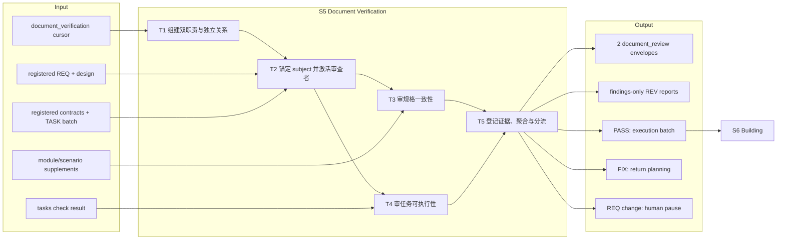
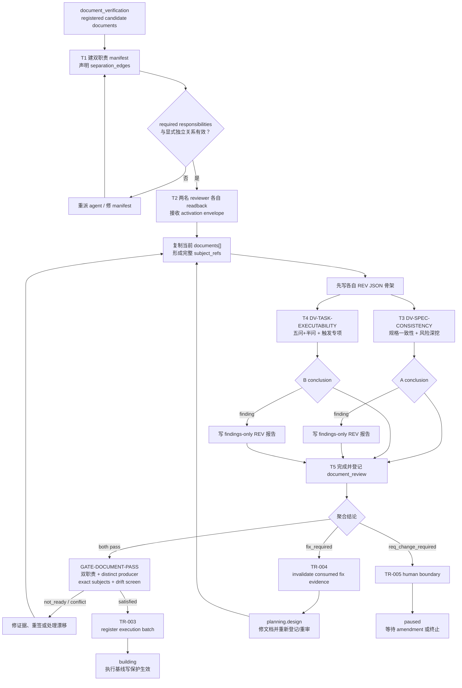

# L3-S5 — 文档验证（Document Verification）

> 层：第三层 ｜ 上游：L2 §S5 ｜ 前置：S4 registered TASK batch ｜ 下游：S6 构建
>
> 阅读顺序：§1～§3 先建立“为什么审、审什么、如何分流”的完整漏斗；§4 再映射 reviewer、REV 信封、quality gate 和 transition；§5～§8 审计职责、真实强制边界、出口和易错点。本文把“审查者应做的判断”与“当前代码已经强制的事实”分开表述。

## 1. 第一层：S5 的立意与目标

### 1.1 为什么需要 S5

S2～S4 已经形成设计、契约和任务链，但这些文档大多来自同一轮规划过程。作者很容易把自己的默认前提当成已写明事实；结构检查也只能证明字段、覆盖和 DAG 成立，不能证明规格真的自洽、Builder 拿到 TASK 真的做得完。

S5 因而不是再写一层规格，而是在写第一行实现代码前，用两个相互分离的职责回答两个问题：

1. **规格链是否一致**：REQ、设计、FE/BE/SYNC 契约与 TASK 是否指向同一件事；
2. **任务是否可执行**：范围、依赖、完成判据和证据要求是否足以让 Builder 在一个受控上下文内交付。

只有两个问题都得到当前版本的 PASS，系统才允许建立 execution batch 并进入 S6。S5 的价值是把纸面缺陷留在仍可低成本修改的阶段，并为后续锁定建立可追溯签字。

### 1.2 阶段目标与完成定义

| 项目 | 定义 |
|:--|:--|
| 输入 | runtime `documents[]` 中当前登记的 REQ、design、contracts、TASK 指纹；S2 模块场景包等补充材料；S4 `tasks check` 结果；`document_verification` cursor |
| 要搞清楚 | 规格链有没有断裂/矛盾；TASK 能否按声明范围完成；哪些风险专项被触发；两份结论签的是不是同一批当前文档 |
| 核心工作 | 组建双职责 → 锚定被审对象 → 两路独立审查 → 写 REV 证据/必要 findings → gate 聚合并分流 |
| 输出 | 两条 `document_review` 证据；有 finding 时的 REV 报告；PASS 时建立的 execution batch，或明确的修文档/改需求路由 |
| 完成 | `DV-SPEC-CONSISTENCY` 与 `DV-TASK-EXECUTABILITY` 均由不同 producer 给出当前轮 PASS；subject 精确匹配且已登记文档无漂移；TR-003 进入 building |
| 下一阶段 | S6 只在已签收的执行基线上任命 Builder、激活 scope 并产出实现证据 |

### 1.3 Overview：输入、主步骤与输出

这里有一个必须保留的现实边界：模块场景包可以被 reviewer 阅读，却尚未登记进 runtime `documents[]`。因此它不在 `subject_refs` 精确集合和 registered-document drift 检查中，不能把“审查时参考过”写成“已被机器精确签署”。

### 1.4 S5 的边界与当前保证

- **负责**：独立文档审查、风险触发深挖、当前指纹签收、结论证据和失败分流；
- **不负责**：改文档、改 REQ、实现代码或在审查中顺手修复；发现问题只定位并选择路由；
- **机器能保证**：两个规定职责都存在；显式 separation edge 不允许同一 agent 承担两职；两条 PASS 的 producer 不同；`subject_refs` 精确匹配当前登记文档；登记文档磁盘指纹未漂移；
- **机器不能保证**：两名 reviewer 的判断在认识论上独立；真实作者没有参与自审；finding 深度足够；触发式专项全部被执行；未登记的模块场景包没有漂移；
- **锁定时序**：S5 仍允许通过 TR-004 返回规划修文档；TR-003 进入 building 后，当前执行基线的阶段感知写保护才生效。

## 2. 第二层：S5 的任务分解

| 任务 | 要解决的问题 | 主要动作 | 阶段产出 |
|:--|:--|:--|:--|
| T1 组建双职责与独立关系 | 谁分别回答“一致吗”和“做得完吗”；如何避免同人双签 | 建 team manifest；任命两个 document-verifier；声明 independence separation edge；按文档特征标记触发专项 | 两个不同 agent 的职责分配 |
| T2 锚定 subject 并激活审查者 | 每个人究竟签哪一版；是否读懂职责和交付 | readback；activation envelope；从 runtime 当前 `documents[]` 形成完整 `subject_refs`；先落 REV JSON 骨架 | 可追踪的审查上下文与证据骨架 |
| T3 审规格一致性 | REQ→设计→合同→TASK 是否语义闭合 | 核验引用和版本；走查 AC/NFR/错误路径；对账 FE/BE/SYNC 边界；参考场景包 | `DV-SPEC-CONSISTENCY` 结论与 findings |
| T4 审任务可执行性 | Builder 是否能在范围、依赖和证据约束下完成 | 消费 `tasks check`；逐 TASK 做五问+半问；执行迁移、集成、critical 风险等触发审查 | `DV-TASK-EXECUTABILITY` 结论与 findings |
| T5 登记证据、聚合与分流 | 两个结论能否共同授权构建；失败回哪里 | 完成并登记 REV envelope；运行 document gate；按 PASS/FIX/REQ-change 走 TR-003/004/005 | execution batch，或受控返工/人闸 |

这五项任务形成一个漏斗：先确定谁审，再固定审查对象，然后各自回答正交问题，最后才聚合结论。不能先看结果再补 `subject_refs`，也不能让一个 reviewer 代另一个 reviewer 签字。

## 3. 从候选规格链到执行基线的完整工作流

正常路径不要求 reviewer 手工调用 transition。证据登记后，后续自然工具调用触发 gate 和 transition。若文档修复改变任一登记指纹，两份旧 PASS 都不再精确覆盖当前 subject 集，因此不能只让“发现问题的人”沿用旧签字；应按当前指纹重新签收。

## 4. 第三层：每项任务如何被引导和承载

### 4.1 T1 — 组建双职责与独立关系

| 维度 | 设计 |
|:--|:--|
| 固定职责 | `DV-SPEC-CONSISTENCY` 与 `DV-TASK-EXECUTABILITY` |
| 角色卡 | `agents/document-verifier.md`；两者使用相同角色类型、不同 assignment 与上下文 |
| 编排方法 | `team-planning` 生成 manifest；为两职责声明 reason=`independence` 的 separation edge |
| 事前检查 | team validator 检查 required responsibilities、agent 绑定、显式 separation edge 和内部依赖合法性 |
| 事后检查 | GATE-DOCUMENT-PASS 再检查两条证据 producer 不同 |
| 触发信息 | 主会话根据 REQ/契约特征把 NFR、迁移、外部集成、critical risk 等专项写入 activation envelope |

两层检查证明“不是同一个 agent ID 双签”，并不证明两个 agent 没有共享模型偏差，也不证明它们真的独立完成了全部思考。当前 team validator 也没有检查 workgroup 成员的 prospective write-path overlap；S5 依靠两个 reviewer 写各自证据路径的任务约定，而不是这项尚不存在的机器能力。

### 4.2 T2 — 锚定 subject 与两阶段激活

每名 reviewer 先 readback 自己的责任、被审对象、允许输出和 stop condition，再接收 activation envelope。激活后第一件事是复制 `docs/reports/review/REV-template.md` 的 JSON envelope 骨架，而不是先自由审查、最后凭记忆补记录。

关键字段的分工是：

| 字段 | 回答的问题 |
|:--|:--|
| `producer_agent_id` / `producer_responsibility` | 谁以哪个职责签字 |
| `conclusion` | `pass`、`fix_required`、`req_change_required` 三选一 |
| `subject_refs` | 实际审查的登记路径、version、sha256 是否完整对应当前 runtime 文档 |
| `requested_event` | fix 时请求 `document_fix_required`；REQ 变更人闸不在此伪造自动事件 |
| evidence ID / path | 当前这次签字的唯一身份；重签使用新 ID，如 `-r2` |

S5 的 review round 是 0，模板不要求显式填写 `review_round`。`subject_refs` 当前按流程从 runtime 手动复制；这能迫使 reviewer 面对具体版本，但也带来抄漏/抄错成本，最终由 exact-subject gate 兜底。

`agent-dispatch`（L4 plan_checkpoint 派发）提供的是计划回执（PLAN_REPORT）、信封和主会话派发纪律；旧 `two-phase-activation` 两阶段 skill 已由其取代并删除。当前实现对未激活或越界写入主要呈现 `not_ready`/流程阻断，并非覆盖所有路径的强制文件锁；不要把这一层描述成与 S6 scope hook 等价的硬隔离。

### 4.3 T3 — 规格一致性审查

`DV-SPEC-CONSISTENCY` 沿整条规格链回答以下问题：

1. REQ 的 AC 能否沿设计决策、合同条款和 TASK Closing Contract 走到可验证事实；
2. NFR 是否真正进入架构、合同或任务，而非停留在需求表；
3. FE、BE、SYNC 对同一字段、错误码、状态和外部边界的表述是否一致；
4. 负向路径、权限拒绝、异常状态是否在 REQ、场景与契约之间对得上；
5. 引用的路径、版本和 clause 是否是当前登记对象。

建议从 TASK 向上反查到合同和 REQ，再从关键 AC 向下抽样到 Closing Contract，避免只做单向“存在性浏览”。NFR、权限/API 负向分支是恒常或条件深挖；场景包用于发现矛盾，但由于未进入 `documents[]`，其版本目前不受 S5 gate 精确保护。

### 4.4 T4 — 任务可执行性审查

`DV-TASK-EXECUTABILITY` 先消费 S4 `tasks check` 的结构结果，不重复手算 coverage 和 DAG；注意当前 TasksCheck 只证明结构地板。每个 TASK 继续回答五问+半问：

| 问题 | 判定焦点 | 当前机器帮助 |
|:--|:--|:--|
| 1. 单一职责 | 能否用一句话说完交付物；是否混装 FE/BE/SYNC 或多个独立结果 | 无语义检查 |
| 2. 单窗口可行 | 必读、触碰路径和预计改动会不会使 Builder 中途丢失任务上下文 | required-reading KB、write-path count 仅供参考 |
| 3. 依赖语义 | 地基是否先于消费者；有没有缺失边、假边或单链瓶颈 | 只查引用/取消目标/环 |
| 4. 自包含 | 路径、条款、scope 是否足够精确，不要求 Builder 重做全仓探索 | 无语义检查 |
| 5. 可测性前向 | Closing Contract 的命令和证据能否在 S6 产出、S7 复验 | 只查出现 Closing Contract 和至少一条 `assert` |
| 半问：批次节奏 | 可并行项是否被假依赖串行；关键路径是否不必要地过长 | DAG 结构可见，节奏靠判断 |

按条件增加三类专项：数据模型变化时检查迁移/破坏性决策；存在 SYNC/外部依赖时检查 timeout、retry、degrade 与错误翻译；critical coverage 时检查 S7 风险维度是否已有落点。这些专项目前由信封指名和 reviewer 自查触发，没有 machine gate 证明“命中条件就一定审过”。

### 4.5 T5 — REV 证据、聚合 gate 与三路分流

每名 reviewer 必须产出一份 JSON evidence envelope；只有存在 finding 时才另写 Markdown REV 报告。PASS 不要求“无问题报告”，因为它没有后续修复消费者。

信封完成后运行 `runtime evidence add --kind document_review` 登记。未登记文件不会进入 gate；同一 evidence ID 不能覆盖，重审必须创建新 ID。随后：

| 结论 | 当前机制 | 去向 |
|:--|:--|:--|
| 双 PASS | GATE-DOCUMENT-PASS 查两职责、当前轮、distinct producer、exact subjects、registered-document drift；TR-003 登记 execution batch | S6 building |
| 任一 `fix_required` | 对应 envelope 请求 `document_fix_required`；TR-004 使已消费的 fix evidence 失效并回 planning | 修文档、更新登记指纹、两路重新签收 |
| 任一 `req_change_required` | 不伪造自动修文档事件；TR-005 是 human boundary | paused，等待 amendment/终止 |

gate 中存在 reviewer-vs-author 检查逻辑，但当前有机登记普遍把 `author_agent_id` 记为 `hook_controller`，而不是真实文档作者；因此这项检查实际上休眠。真正能工作的独立性保障是 assignment separation、producer distinct 和 reviewer 自觉上浮利益冲突。

## 5. 职责分布与覆盖审计

### 5.1 职能落点

| 职能 | 主责 | 承载位置 | 消费者 |
|:--|:--|:--|:--|
| 双职责组队与触发项识别 | Orchestrator | team manifest + activation envelope | team validator、reviewer |
| 规格链语义审查 | DV-SPEC-CONSISTENCY | REV envelope / findings report | document gate、修复者 |
| TASK 可执行性审查 | DV-TASK-EXECUTABILITY | REV envelope / findings report | document gate、S4 planner |
| 结构覆盖与 DAG 算术 | harness | `tasks check` | task reviewer、TR-002 |
| subject 精确签收与漂移检查 | quality gate | evidence index + runtime documents | TR-003 |
| 失败分类与路由 | reviewer + protocol | conclusion / requested event / TR-004/005 | planner、人 |
| 执行批次建立与写保护切换 | protocol/store/policy | TR-003 + building state | S6 Builder/hook |

### 5.2 重叠是怎样被控制的

- 两名 reviewer 故意读取同一条规格链，但问题不同：A 判断“语义一致”，B 判断“照单可做”；同读不是职责重复；
- `tasks check` 与 B 的审查也不重复：前者算存在性、覆盖和无环，后者判断粒度、语义依赖、自包含与可测性；
- Orchestrator 只组队、指名触发项和等待结论，不代写 reviewer 的判断；
- REV JSON 是机器签字，REV Markdown 是 finding 的修复说明；二者消费者不同，不应把同一长报告复制两份；
- subject exactness 与 drift screen 分别回答“签了哪些登记对象”和“登记后磁盘是否变过”，两道检查互补。

### 5.3 如实现状与未闭合缺口

1. **场景包未进入签署集合**：S2 模块真相/场景包可被审阅，但未注册为 runtime document，S5 无法对其 exact subject 或 drift 给机器承诺；
2. **作者独立性校验休眠**：`author_agent_id=hook_controller` 不能代表真实作者，reviewer-vs-author check 当前没有实际区分力；
3. **独立性仅是程序性的**：不同 agent ID、上下文和职责透镜优于自审，但不是双盲，也不能消除同模型偏差；
4. **manifest 不检查写路径重叠**：team validator 检查职责、separation、skill 和内部依赖，不检查 prospective write-path overlap；
5. **两阶段激活不是全面硬锁**：其主要力量来自 readback、信封和编排纪律，不应虚称所有 phase-one 越界写都由 hook 拒绝；
6. **专项深挖是流程要求**：目前没有结构化字段或 gate 证明 NFR/迁移/外部集成/critical risk 的触发项逐项完成；
7. **手工 subject 有摩擦**：精确 gate 能发现抄错，却不能消除人工复制成本；这是当前设计取舍，不是自动化事实；
8. **TasksCheck 能力有限**：没有 TASK write-path overlap 检查，也不验证 Closing Contract 四类语义；S5 必须如实补判断层。

### 5.4 关键取舍

| 问题 | 当前选择 | 代价与边界 |
|:--|:--|:--|
| reviewer 数量 | 两人两职责 | 控制时滞；没有第三方仲裁，分歧只能转 fix/人闸 |
| 审查对象 | 对 runtime 当前 `documents[]` 做精确全量签收 | 未登记补充物落在保护外 |
| PASS 报告 | 只写 JSON，不写空洞 Markdown | 机器证据紧凑；人向过程只在 finding 时存在 |
| subject 构造 | reviewer 手动复制，gate 精确校验 | 强化版本意识，但增加操作摩擦 |
| 任务规模 | info-only 数字 + 人工五问 | 避免硬阈值诱导，却保留判断差异 |
| 失败路由 | 文档问题自动回 planning；REQ 问题停在人闸 | 不允许 reviewer 越权改需求 |
| 写保护 | PASS 进入 S6 后生效 | S5 可修复；同时要求所有重签指纹真实更新 |

## 6. L1 准则如何嵌入 S5

| L1 准则 | S5 中的实际落点 |
|:--|:--|
| D1 权威外置 | 两个结论、producer、subject 指纹和 findings 落盘并登记 evidence index |
| D2 自然路径观测 | 证据登记后的正常工具调用触发 gate/transition；不依赖人工口头宣布 PASS |
| D3 门是顾问 | 缺职责、producer 重合、subject 不匹配、document drift 分别给出可定位原因 |
| D4 引导性产物 | REV 骨架先行；字段迫使 reviewer 明确身份、对象、结论和路由 |
| D5 三级强制 | skill/五问引导判断；manifest/gate 强制可算事实；REQ 变化交人裁决 |
| D6 三方收敛 | agent 审查、机器验签和分流、人只处理需求级决策 |
| D7 收敛可观测 | 两个责任槽、每条 evidence 状态和 gate conflict 显示离出口还缺什么 |
| 公理一 原型 | 对应真实的独立设计审查、签字和 baseline freeze |
| 公理二 分工 | planner/author 不自证；两个 reviewer 问正交问题；machine 不伪装语义判断 |
| 公理三 消费 | JSON 被 gate 消费；Markdown 只在 finding 时被修复者消费 |
| 公理四 成本 | 两路并行、结构算术复用 S4 结果、风险专项按触发升级 |
| 公理五 传达 | findings 指向文档/条款/观察与预期；failure route 与问题层级一致 |

## 7. 产出、出口门槛与失败路由

### 7.1 正式产出

- 两份不同 producer 的 `document_review` JSON envelope，分别承担两个固定职责；
- 有 finding 时，对应 `docs/reports/review/REV-*.md` 定位报告；
- exact `subject_refs`：对当前 runtime 登记文档逐项给出 path、version、sha256；
- 双 PASS 时由 TR-003 建立 execution batch 并进入 building；
- 非 PASS 时留下可追溯的 fix 或 req-change 证据与路由。

### 7.2 出口判定

| 判定 | 必须满足 |
|:--|:--|
| 职责完整 | 当前 review round 同时存在 SPEC-CONSISTENCY 与 TASK-EXECUTABILITY PASS |
| 程序独立 | 两职责 assignment 分离，最终 evidence producer 不同 |
| 版本精确 | 两条 evidence 的 subject 集精确等于当前 `documents[]` |
| 无登记漂移 | 当前登记路径的磁盘 sha 与 runtime sha 一致 |
| 语义签收 | A 认为规格链一致；B 认为 TASK 可执行；触发风险已被说明 |
| protocol 出口 | GATE-DOCUMENT-PASS satisfied，TR-003 成功登记非空 execution batch |

### 7.3 失败路由

| 情况 | 去向 |
|:--|:--|
| 缺一职责、同 producer、证据未登记 | 留 S5，补正确 reviewer/evidence |
| subject 漏项、旧指纹或 registered document drift | 不得 PASS；更新/恢复文档登记后两路按当前版本重签 |
| 规格或 TASK 可修复，但不改变需求立意 | `fix_required` → TR-004 → planning.design，按影响回 S2/S3/S4 |
| 只有任务粒度/依赖/判据问题 | 回 S4 修 TASK；仍需完整重签当前 subject |
| 合同/设计矛盾 | 回 S3/S2 修正确层级，不在 REV 中发明新规则 |
| 必须改变 REQ | `req_change_required` → TR-005 → paused → amendment/终止 |
| execution batch 为空或 TR-003 失败 | 留 S5/回 S4 修登记事实，不绕 gate 直接进 S6 |

## 8. 易错点与渐进披露

### 8.1 易错点

- “两个 agent”只证明程序分离，不等于双盲或真实作者隔离；
- `documents[]` 之外的场景包不会因 reviewer 阅读过就自动获得指纹保护；
- PASS 也必须写并登记 JSON envelope；只有 Markdown findings report 可以省略；
- evidence 文件写盘但未 `evidence add`，gate 等同于看不见；
- 不能复用 evidence ID 覆盖旧签字，重审应新建 `-r2` 等记录；
- `fix_required` 与 `req_change_required` 不可混用：前者回规划，后者必须停在人闸；
- 一份文档改动会改变当前 subject 集，两条旧 PASS 都不能代表新版本；
- `tasks check` 绿不代表单职责、无 overlap、assert 可执行或依赖语义正确；
- reviewer 发现问题不能顺手改受审文档，否则审查与作者职责重新混合；
- author machine check 当前休眠，不能把它写成第三层有效防线。

### 8.2 阅读预算

| 角色/时机 | 最小阅读集 | 按需加载 | 不需要背诵 |
|:--|:--|:--|:--|
| Orchestrator 组队 | 两个职责定义、team-planning、触发表、当前 documents | 复杂 team/DAG 方法 | 审查细节全文 |
| 两名 reviewer 激活 | assignment、agent-dispatch、REV template、当前 subject 集 | 被指名的专项规则 | transition 实现 |
| 规格 reviewer | REQ、design、contracts、TASK coverage；相关场景包 | NFR/权限/API 深挖 | S4 覆盖算法 |
| TASK reviewer | TASK、contracts、tasks check 输出 | 迁移、外部集成、critical 风险规则 | 全仓实现代码 |
| gate 收口 | 两条 evidence、runtime documents、drift/conflict | 对应错误诊断 | 人工重做语义审查 |

S5 的最小心智模型应始终是：**两个正交问题、同一批精确对象、两份独立签字、三种明确去向**。其余深挖只在文档特征触发时展开。
