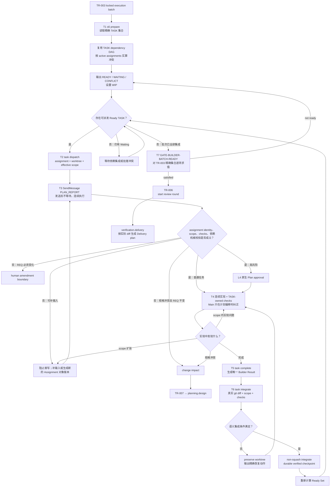

# L3-S6 — 构建（Build）

> 层：第三层 ｜ 上游：L2 §S6 ｜ 前置：S5 TR-003 已锁定 execution batch ｜ 下游：S7 完整验证轮
>
> 本文定义 S6 机制优化后的目标态，同时单独标出当前代码已经具备的能力与迁移缺口。目标态不得被描述成既成事实。
>
> 跨 Stage 的 Sub-agent / Agent Team 拓扑、计划回执、等待、Hook、恢复和 Result 消费统一引用 [L4 Agent 调度与治理机制](L4-agent-dispatch-governance.md)。本文只定义 S6 如何消费该机制；若本文的迁移审计仍出现 approval/activation，那是在描述现状债务，不是目标协议。
>
> 阅读顺序：§1～§3 理解 S6 的价值流和机制取舍；§4～§7 理解目标工作流、任务调度、状态与数据闭环；§8～§9 理解引导如何进入工具必经之路；§10～§12 对照当前实现、出口和迁移顺序。

> **Revision 口径**：Runtime revision 和 Assignment revision 都由对应 Writer/API 生成。Builder/主会话只消费 Assignment ID、当前 scope、checks、checkpoint 和 `next`；不手工编号、计算或复制 revision。Runtime 的锁、原子写和内部提交序号见 [L4 Runtime revision 使用与命令协调](L4-revision-usage.md)。

## 1. 第一层：S6 的立意、边界与完成定义

### 1.1 为什么需要 S6

S5 结束时，系统已经锁定“要实现什么、允许改变什么、完成时应证明什么”，但这些仍是文档事实。S6 的职责是把每个锁定 TASK 转换为三类可以交给独立验证者的事实：

1. **实现事实**：代码、测试、配置或迁移已经进入统一集成基线；
2. **执行事实**：正确的 Builder 在明确 assignment 下实施，实际差异、检查、风险和偏差均有记录；
3. **可复验事实**：每条 Closing Contract 都有 S7 能独立运行或检查的入口。

S6 不是“把代码写出来就算完成”，也不负责证明产品最终正确。它完成的是**受控实现与诚实交接**：Builder 负责产出和 owned checks，S7 负责独立复验，二者不能合并成 Builder 自证。

### 1.2 S6 的最小价值流

S6 应收敛成一条短而硬的执行流水线：

> S5 精确任务批次 → 自动生成调度板 → 派发 → 计划回执后连续执行 → 唯一完成结果 → 语义集成 → 精确批次 Gate → S7

每个额外机制都必须缩短反馈时间、降低漏项或阻止一种具体失败。协议更完整、消息更多、状态更细，不自动等于控制更强。

### 1.3 阶段目标与目标完成定义

| 项目 | 目标定义 |
|:--|:--|
| 输入 | 当前 generation 下由 TR-003 锁定的精确 TASK 集合、TASK DAG、scope、Closing Contract、当前登记文档指纹、源代码基线 |
| 要搞清楚 | 哪些 TASK 已 Ready；谁拥有唯一写入权；哪些任务因依赖或写冲突必须等待；实际实现和检查改变了什么；S7 如何复验 |
| 核心工作 | 生成调度板 → 原子派发 → 计划回执与首写屏障 → 连续实现和 owned checks → 唯一完成交接 → worktree 语义集成 → 批次出口 |
| 正式输出 | 已集成实现；每 TASK 唯一 Builder Result；实际 diff；检查结果与原始引用；integration checkpoint；S7 可消费的构建批次索引 |
| 目标完成 | TR-003 精确批次中的每个 TASK 均满足唯一 Owner、当前 Assignment 对象版本、有效 Result、无 scope 偏差、已集成、Required Checks 通过 |
| 下一阶段 | TR-006 启动新 review round 并进入 verification.delivery；S7 根据实际集成差异和锁定真相生成 Delivery 验证计划 |

### 1.4 S6 的职责边界

- **负责**：执行规划、写所有权、依赖和冲突调度、上下文确认、实现、owned checks、真实完成报告、worktree 集成、构建期规格冲突路由；
- **不负责**：给出最终交付结论、修改 locked 规格、替代 Delivery/QA/E2E、直接处理 S7 finding、发布或部署；
- **规格边界**：非 REQ 规格无法成立时走 TR-007 返回 planning；REQ 目标或 AC 必须变化时走 human amendment；
- **强制边界**：locked artifact 和不可恢复动作应在工具前硬阻断；普通 scope 是否合规则以集成时真实 diff 为最终事实；
- **独立性边界**：Builder Result 是交接声明，不是 S7 PASS。

## 2. 第二层：机制设计的收益门槛

### 2.1 每个机制必须回答五个问题

任何要进入 S6 正常路径的机制都必须具有：

1. **唯一失败对象**：明确防止哪种故障，不能只说“提高规范性”；
2. **唯一事实生产者**：同一事实不要求 Agent 手工写两到三份；
3. **明确机器消费者**：字段必须影响调度、授权、集成、Gate 或恢复；
4. **可操作失败反馈**：失败时返回缺失事实和下一条恢复动作；
5. **可观测收益**：能够通过反馈时间、漏项、冲突或返工指标证明价值。

若一个字段没有机器消费者，应删除或降级为说明；若一个 Guard 只检查 evidence 非空，名称不应承诺更强的语义；若同一事实被多个载体重复表达，应选择一个权威记录，其余由工具派生。

### 2.2 强制力分层

| 层级 | 适用对象 | 目标形态 |
|:--|:--|:--|
| Hard deny | locked artifact、禁用 merge 方式、明确不可恢复动作 | PreToolUse 或底层工具直接拒绝 |
| Semantic gate | Owner、Assignment 对象版本/plan、实际 diff scope、Required Checks、精确 TASK 覆盖 | dispatch、completion、integration、TR-006 中实算；对象版本由工具生成 |
| Guidance | 阅读顺序、实现方法、风险 Skill、建议命令 | 当前工具上下文、生成模板、失败恢复信息 |

不应把所有指导都升级为文件级硬锁，也不应把本可机器计算的约束降级为长文档提醒。

### 2.3 保留、合并、删除和迁移

| 类别 | 机制 | 处理原则 |
|:--|:--|:--|
| 保留 | TR-003 精确批次与文档指纹 | 是 S6 的输入边界和 Gate 的量化集合 |
| 保留 | 一 TASK 一写 Owner | 派发前和集成时双重实算 |
| 保留 | TASK DAG、按需冲突计算、Worktree | 控制并发、隔离差异、保留失败现场；不维护第二份冲突图 |
| 保留 | 精简 PLAN_REPORT + 首写屏障 | 只保留需要 Agent 判断且有消费者的内容；发送后连续执行 |
| 保留 | owned checks + S7 独立复验 | 前者提供快速反馈，后者提供独立结论 |
| 合并 | team manifest、assignment、worktree sidecar | 收敛成一个权威 Assignment Record |
| 删除 | 普通任务的回读批准、activation_sent | 不改变授权边界却制造第二轮等待；高风险任务改用 L4 原生 Plan approval |
| 合并 | completion message、evidence envelope、task event | 变成一个 Builder Result 登记命令 |
| 合并 | 多个 S6 evidence-attestation Guard | 变成一个真实 S6 batch evaluator |
| 内收 | integration acknowledge、cleanup 状态 | 作为 Integrator 内部幂等步骤，不暴露给 Agent |
| 删除 | 正常路径上的长消息哈希链手工维护 | 指纹和关联 ID 由工具生成并审计 |
| 删除 | Builder 默认全量 Skill 预载 | 改为按任务表面、风险和失败类型按需加载 |
| 删除 | 未接入执行器的“Required Checks 已验证”叙事 | 要么真正接线，要么不宣称已验证 |
| 迁移 | S7 Delivery Manifest 前置 | 移到 TR-006 后的 S7 入口 |
| 迁移 | 普通 scope 全路径 policing | 以 dispatch 生成 scope、integration 实际 diff 校验为主 |

## 3. 第三层：S6 目标任务分解

| 任务 | 要解决的问题 | 主要动作 | 阶段产出 |
|:--|:--|:--|:--|
| T1 准备精确批次与调度板 | 这次必须完成哪些 TASK；谁 Ready；哪里冲突 | 从 TR-003 批次读取 TASK DAG；按 active assignments 实算冲突；计算 Ready/Waiting/Conflict；设置 WIP | S6 Board、批次指纹、调度顺序 |
| T2 原子派发 | 谁拥有任务；允许改什么；使用哪个 worktree | 生成 Assignment Record；校验一 TASK 一 Owner、role/path、写重叠；创建 worktree；生成 PLAN_REPORT 请求 | assignment、worktree、effective scope |
| T3 计划检查点 | Builder 是否理解当前任务；依赖和证据计划是否成立 | 运行中发送 PLAN_REPORT；机器校验 assignment identity/scope/checks；普通任务立即继续，高风险进入 L4 Plan approval | plan checkpoint / approval ref |
| T4 实现与 owned checks | 如何快速兑现 Closing Contract 并尽早发现错误 | 在 scope 内实现；运行任务级测试/lint/build；按需加载 Skill；问题分类 | 实现、测试、原始检查结果 |
| T5 唯一完成交接 | Builder 实际做了什么；后续工具如何消费 | 登记 Builder Result；自动提取 diff、checks、Owner、Assignment 对象版本；校验结果 | canonical builder result |
| T6 语义集成 | 真实差异是否安全、在 scope 内且可复验 | Inspect diff、locked paths、merge conflict、Required Checks；非 squash 集成；写 checkpoint | integrated implementation、checkpoint |
| T7 精确批次出口 | 是否每个锁定 TASK 都真实完成；能否进入独立验证 | 对 TR-003 精确集合逐项求值；TR-006；S7 入口生成验证计划 | review round、verification.delivery |

T2～T6 针对每个 TASK 重复；T7 只在精确批次全部收口时执行。并行度由 Ready Set 和 WIP 控制，而不是一次性把所有任务都派出去。

## 4. 目标工作流：从锁定任务到独立验证



正常路径不要求 Agent 手工维护多条 agent/task event。工具在派发、PLAN_REPORT、首次写入、完成和集成的自然动作中原子更新权威记录。异常和审计事件仍可保留，但不能成为每个 TASK 的必做仪式。

## 5. 调度与 Sub-agent 派发

### 5.1 TASK DAG 与即时冲突集决定能否并行

S6 调度器复用一份权威 TASK DAG，并在每次调度时计算一个即时冲突集：

1. **依赖条件**：TASK 声明的前置结果，只有依赖已经集成才能释放下游；
2. **即时冲突**：候选 TASK 与 active assignments 在路径重叠、共享 schema、migration、生成文件、公共契约实现等表面是否不能安全并行。

不持久化第二份完整写冲突图；真实冲突只记录在对应 Assignment/Blocker 中，避免 TASK DAG 与冲突图双重同步。

TASK 进入 Ready Set 的目标条件为：

- 属于 TR-003 锁定的精确批次；
- 所有依赖 TASK 已进入 integrated；
- 与当前 active/reported TASK 没有未解决写冲突；
- assignment 所需输入和文档指纹当前；
- 没有未处理的规格冲突或人工边界。

### 5.2 优先级和 WIP

Ready TASK 的默认优先顺序：

1. 位于关键路径；
2. 完成后能解锁最多后续 TASK；
3. 具有较高技术或集成风险，越早获得反馈越有价值；
4. 在同一表面可以复用已有上下文；
5. 其余任务按稳定 TASK ID 排序，保证可复现。

WIP 应使用小而明确的上限，初值为 2，并根据 Main/Integrator 的结果消费积压、隔离面和冲突率调整；只有实战指标证明消费者不积压时才提高。不得使用“模块数 × 合约数 × 风险系数”一类不可稳定复算的 Agent 数量公式。

### 5.3 一 TASK 一写 Owner

- 一个 execution TASK 在任一时刻只能有一个有效写 Owner；
- 多角色协作应先拆 TASK 或声明串行 handoff，不允许共享模糊写权限；
- role 根据主要写表面和 Primary Contract 选择，不根据 Agent 名称猜测；
- 同一 Agent 可以在前一 TASK 已集成后顺序复用，尤其适用于相同角色和相邻代码表面；
- Reviewer、QA、E2E 不在 S6 获得产品写权限。

### 5.4 调度板是 Main Agent 的决策界面

T1 和每次集成后都应生成：

```text
READY
- TASK-12 / backend-builder / 解锁 3 个后续任务
  scope: internal/order/**
  checks: go test ./internal/order/...
  skills: transaction, migration

WAITING
- TASK-18 等待 TASK-12 integrated

CONFLICT
- TASK-16 与 TASK-12 同时修改 migration，必须串行

ACTIVE
- TASK-15 / frontend-builder / plan reported / executing

NEXT
- TASK-12 集成后释放 TASK-18、TASK-19、TASK-21
```

Main Agent 负责处理异常、优先级和人工边界，不再手工拼装每个 Sub-agent 的完整协议 Prompt。

## 6. Assignment、计划回执和渐进式上下文

### 6.1 一个权威 Assignment Record

Assignment 的跨 Stage 最小字段、两条状态线、对象版本和 canonical Result 契约以 L4 §5 为权威。S6 不复制一套独立 Schema，只增加以下阶段引用：

| S6 引用 | 内容 | 生产方式 |
|:--|:--|:--|
| task_ref | task_id、batch_id、generation、当前 TASK/文档指纹 | 从 TR-003/TASK 引用，不复制内容 |
| authority | effective_scope、role maximum、forbidden actions | role maximum ∩ TASK scope，由 dispatch 实算 |
| build context | Closing Contract/Required Checks refs、最小文档集、风险 Skills | 从 TASK 和风险路由器引用 |
| integration | worktree_path、source branch、target branch | dispatch 原子生成；真实 topology 同步回 Assignment |

Team Manifest 可继续作为规划输入或审计视图，但不能与 Assignment、sidecar、checkpoint 各自维护不同版本的 Owner、scope 和 worktree 坐标。

### 6.2 精简 PLAN_REPORT

Builder 只需回答五个需要真实判断的问题：

1. 用一句话说明本 TASK 的目标；
2. 列出准备修改的具体代码表面；
3. 说明依赖是否已经满足，若未满足缺什么；
4. 说明每条关键 assertion 将由什么检查证明；
5. 指出发现的冲突、缺失信息或必须成立的假设。

身份、文档哈希、禁止路径、角色上限、Skill 名称、worktree 坐标、关联 message ID 等由工具填充。计划回执的价值是暴露误解，不是要求 Agent 机械复述机器已经知道的字段。

### 6.3 计划回执后连续执行

S6 默认使用 L4 `plan_checkpoint`：

- Worker 在仍运行时通过 SendMessage 提交 PLAN_REPORT，不能把计划作为 final response；
- PostToolUse 校验 PLAN_REPORT 对应当前 Assignment 对象版本；
- 校验文档和 TASK 指纹仍然当前；
- 校验依赖已 integrated；
- 校验 Owner 唯一且没有 active 写冲突；
- 校验 planned paths 在 effective scope 内且 Required Checks 未漏；
- 校验通过后，Worker 不等待 Main 第二次授意，直接实现；
- Main 只在语义偏移、阻塞或完成时 SendMessage；
- 首次 mutation 的 PreToolUse 只检查计划已记录，不要求普通任务 approved。

只有命中 L4 高风险分类时，派发器才选择 `plan_approval_required` 并进入 teammate 原生 Plan mode。普通路径删除 understanding_approved、activation_sent、work_started；首次有效写入只是执行事实，不新增一个必须人工推进的持久状态。

### 6.4 Skill 按风险加载

Skill 的选择由任务事实驱动：

- Go/API/domain 任务加载直接相关的 Go 或后端实践；
- Vue/UI 任务加载当前组件、状态或路由所需实践；
- migration/security/concurrency/error-handling 等仅在风险被触发时加载；
- 测试失败后可以按失败类别追加 Skill；
- 正常 assignment 默认只注入 2～4 个最相关 Skill。

角色卡应保持短小，只定义不可变边界；技术方法通过 assignment 风险路由渐进披露。

## 7. 实现、完成与集成闭环

### 7.1 Builder 的实现顺序

Builder 直接由 Closing Contract 驱动：

1. 将 assertion 映射到实现表面；
2. 对行为变化先建立能暴露错误的测试或复现；
3. 在 effective scope 内实现；
4. 运行 TASK-owned 快速检查；
5. 记录真实结果、未验证项、风险和偏差；
6. 完成时提交唯一 Builder Result。

测试成本分层：

- Builder：每 TASK 运行快速、精确、owned checks；
- Integrator：每 wave 或 batch 运行编译、冒烟、受影响集成检查，捕捉合并交互；
- S7：独立运行完整 Delivery/QA/E2E 验证。

同一昂贵检查不应在每个 Builder 和每次集成都无差别重复，但任何层都不能借下一层存在而跳过自己独有的反馈责任。

### 7.2 问题分类

| 发现 | 路由 |
|:--|:--|
| scope 内普通实现错误 | 留在原 assignment 修复并重跑 owned checks |
| 外部环境或权限暂缺 | assignment=blocked，保留 worktree；继续可独立完成的工作 |
| 需要扩大写 scope，但规格不变 | 由工具生成新的 Assignment 对象版本；重新计算冲突；普通计划重新回执，高风险 approval 不继承 |
| TASK/contract/design 无法共同成立，REQ 不变 | change impact → TR-007 → planning.design |
| 必须改变 REQ 目标或 AC | human amendment，不得借 TR-007 静默推进 |
| 发现邻近但不属于 assignment 的缺陷 | 记录 finding，不顺手扩大修复 |

### 7.3 唯一 Builder Result

每个 TASK 的完成事实只生产一次。Builder Result 至少包含：

- task_id、assignment_id、Assignment 对象版本、owner（版本由工具生成）；
- completion status 和摘要；
- 实际 changed paths，由工具从 git diff 生成；
- reviewed paths；
- Required Checks 的 command、exit/result、原始输出引用；
- Closing Contract assertion 到检查的映射；
- finding/evidence refs；
- 风险、未验证项和 scope deviations；
- 当前 generation 和文档指纹。

目标 task complete 命令应原子执行：

1. 校验 Result schema；
2. 校验 Owner、Assignment 对象版本当前；
3. 自动提取并核对真实 diff；
4. 写入 Result 和 evidence index；
5. 把 assignment 从 running 置为 result_submitted；
6. 触发或提示下一步 integrate。

旧的 completion message、gate evidence envelope 和 task lifecycle event 可以在迁移期由适配器派生，但 Agent 不再手工提交三份相同事实。

### 7.4 集成是普通 scope 的最终事实门

目标 task integrate 必须检查：

1. Builder Result 可解析且绑定当前 Owner/Assignment 对象版本/TASK；
2. worktree clean，source 有 commit，target 存在；
3. merge-tree 无冲突；
4. 实际 changed paths 是 effective scope 的子集；
5. 没有触碰 locked artifacts 或禁止路径；
6. Result 中没有未批准 scope deviation；
7. TASK-owned checks 已通过且结果当前；
8. 配置的 wave/batch checks 已实际运行通过。

成功后 non-squash 集成并写 durable verified checkpoint；失败时 preserve worktree 和 branch，不销毁现场，并输出：

- 哪个条件失败；
- 观察到的真实值；
- 期望值；
- 可执行的恢复动作；
- 修复后应重试的命令。

跨 Stage Assignment 主状态沿用 L4：result_submitted → consumed 或 result_submitted → blocked。S6 的 `integrated` 是 consumer checkpoint 和 runtime TASK 聚合视图，不再成为第二条需要 Worker 推进的 Assignment 状态线。prepared、merged、verified、acknowledged、cleanup_pending 等是 Integrator 内部幂等状态。

## 8. 状态、证据与 Gate 的闭环

### 8.1 Assignment-centric 生命周期

正常持久状态收敛为：

| 状态 | 含义 | 进入方式 |
|:--|:--|:--|
| ready | 输入齐全，可派发 | s6 prepare |
| dispatched/running | 当前 Owner 已收到 Assignment；普通任务计划回执后连续执行，高风险计划已批准 | dispatch / PLAN_REPORT / approval |
| result_submitted | Builder Result 有效，等待 Integrator 消费 | task complete |
| consumed | 实现已进入目标基线并有 verified checkpoint | task integrate |
| blocked | 存在依赖、环境、冲突、scope 或规格阻塞 | 任一工具登记 blocker |

旧的 reading、readback_submitted、approved、activated、work_started、completion_acknowledged、cleanup 只可作为迁移审计事件，不再形成另一条必须手工驱动的业务状态机。

runtime task state 应成为 Assignment/TASK 聚合状态的派生视图：

- 无 assignment：locked；
- 至少一个 running：in_progress；
- Builder Result 有效但未集成：review/result_submitted；
- checkpoint verified：integrated；
- 任一阻断：blocked。

不允许 agent lifecycle 和 task lifecycle 各自依赖独立手工命令维护同一事实。

### 8.2 TR-006 的精确量化

GATE-BUILDER-BATCH-READY 必须以 TR-003 锁定的 TASK ID 精确集合为输入，而不是扫描“当前有哪些 evidence”：

对每个 TASK 必须同时证明：

- 恰有一个当前写 Owner；
- Assignment 对象版本当前，且所需 plan checkpoint/approval 有效；
- Builder Result 存在、schema-valid 且 producer=Owner；
- 实际 changed paths ⊆ effective scope；
- scope deviations 为空或已由新 Assignment 对象版本批准；
- Required Checks 全部通过；
- integration checkpoint 已 verified；
- generation 和消费的文档指纹当前。

只有对精确集合逐项全称量化通过，TR-006 才能启动 review round。

### 8.3 S7 团队不再是 S6 Gate 条件

S6 的出口只证明“构建批次已经完整、真实、可复验地集成”。它不要求在 building 状态正式登记 Delivery workgroup，也不接受占位 team-manifest evidence 作为替代。

TR-006 后，S7 入口工具根据以下事实生成 Delivery 计划：

- 锁定 REQ/design/contracts/TASK；
- 实际集成 diff；
- Builder Result 和未验证风险；
- 受影响模块、集成边和回归表面。

这样验证范围基于真实实现，而不是 S6 完成前的预测。S6 可以预计算风险提示，但它不是 Gate evidence。

## 9. 把指引放进 Agent 的必经之路

### 9.1 不做“提示词撒点”，做决策点契约

指引进入工具不等于在每个 Hook 重复长提示。每个决策点只提供四类信息：

1. 当前事实；
2. 允许动作；
3. 完成条件；
4. 失败后的下一步。

提示内容必须由当前 Assignment、状态和真实工具结果生成，不能复制一段容易过期的协议正文。

### 9.2 工具落点

| 必经点 | 工具应自动提供 | 工具应强制 |
|:--|:--|:--|
| TR-003 进入 building | 精确 batch、缺失输入、初始 S6 Board | batch 与指纹来源唯一 |
| s6 prepare | Ready/Waiting/Conflict、关键路径、WIP 建议 | TASK DAG、即时冲突、一 TASK 一候选 Owner |
| task dispatch | 任务上下文、effective scope、checks、Skills、PLAN_REPORT 模板 | 真实 topology、worktree、Owner、role/path、无写冲突 |
| PLAN_REPORT / PostToolUse | 五项判断和当前文档切片 | Assignment 对象版本、planned paths、checks 和依赖一致 |
| 首次写入/PreToolUse | 一行当前 TASK、scope、Closing Contract、下一检查 | 计划已记录；高风险计划已批准；locked artifact/不可恢复动作硬阻断 |
| test wrapper | 当前 assertion、建议命令、失败分类 | 保存真实 command/result |
| TeammateIdle/SubagentStop | 当前缺计划、缺 Result、阻塞或可交卷事实 | 未完成时继续同一 Worker，不自动派下一 TASK |
| task complete | 自动 diff、缺失字段、下一步 integrate | canonical Result、Owner/Assignment 对象版本/Checks |
| task integrate | scope 差集、冲突、检查和恢复动作 | 真实 diff、locked path、merge/checkpoint |
| batch gate | 每 TASK 的 exact missing matrix | 对 TR-003 精确集合全称量化 |
| S7 entry | 基于真实 diff 的 Delivery plan | verification phase 与 review round 当前 |

### 9.3 错误消息也是流程编排

工具不得只返回 not_ready。推荐统一错误结构：

| 字段 | 说明 |
|:--|:--|
| code | 稳定的机器错误码 |
| failed_condition | 哪条前置或完成条件失败 |
| observed | 当前真实观察值 |
| expected | 需要达到的值 |
| owner | 谁负责恢复 |
| next_action | 一个明确动作或命令 |
| preserves | 哪些 worktree/evidence/checkpoint 已被保留 |

Agent 应顺着错误消息继续，而不是返回长协议文档中自行搜索恢复方法。

## 10. agent-protocol.md 的新职责

agent-protocol.md 应缩减为“宪法与路由表”，只保留：

- 全局不可破坏的不变量；
- 简化状态图；
- 每种场景对应的工具入口；
- 人工边界和异常升级条件；
- 权威数据源的位置。

详细约束按职责分布：

| 信息 | 权威位置 |
|:--|:--|
| 为什么需要某条原则 | agent-protocol.md / Blueprint |
| 字段和结构约束 | Schema |
| 当前任务允许做什么 | Assignment Record |
| 当前动作怎么做 | CLI help / generated form |
| 失败后如何恢复 | 工具错误和 checkpoint |
| 是否允许过阶段 | semantic Gate |
| 当前该读哪些 Skill | risk-based context router |

文档负责解释“为什么”，工具负责决定“现在能不能做、下一步做什么”。协议不应是唯一执行真相，也不应要求 Agent 在每次任务前阅读全文。

## 11. 当前实现审计：目标态尚未闭合的地方

本节描述当前仓库事实，防止把上述目标态误写成已有能力。

### 11.1 当前已经具备的地板

- TR-003 能把已验证文档批次带入 building；
- minimal policy 能阻断可识别 locked-artifact 写入和 squash merge；
- team/agent/task、evidence、message、integration checkpoint 已有落盘基础；
- worktree Integrator 能检查 clean/commit/target/conflict，进行 non-squash merge，并在失败时 preserve；
- TR-006、TR-007 和 GATE-BUILDER-BATCH-READY 已有定义；
- S7 verification.delivery 及后续相位状态机已存在。

2026-08-20 P0+P1 起步整改后新增：

- GATE-BUILDER-BATCH-READY 以 TR-003 注册的精确 TASK 集合求值：逐 TASK 实算 completion envelope、checks 全 pass、无未批准 scope deviation、durable integration checkpoint 达到 verified；空批次本身判 not_ready；
- Inspect 增加写域审计：真实 changed paths 必须是 assignment WritePaths 的子集，越界即 preserve（LOOP_SCOPE_VIOLATION）；
- Required Checks 真实接线：workgroup manifest `required_checks` 经 AssignmentContext 进入 Inspect/Integrate，由 shell CommandCheckRunner 实际执行——无检查配置时 verified 不再默认达成；
- integration checkpoint 持久化 task_id 与 worktree_path，controller milestone 同步记录 assignment_id/task_id；
- TR-006 不再要求 team_manifest_record（S7 前置矛盾消除），三个 evidence-attestation stub guard 已删除；
- `req_baseline_unchanged`（TR-004/TR-007/TR-023）改为真实指纹比较：bound_req 登记的 sha256 必须与磁盘 REQ 文件一致；
- `runtime task-complete` 提供原子 Builder Result 登记：一条命令完成消息校验、completion evidence envelope 派生、Agent reported、TASK review、evidence 索引；由 Writer 内部记录提交 revision，Agent 不传递它。

同日复杂度整改（引导层对齐）追加：

- protocol #s6 重写为可照敲操作序列（含 worktree 纪律、12 事件真名表、missing token 词表）；README 序列图/verb 列表、two-phase-activation skill 词汇与运行时对齐；
- not_ready 恢复包与 `explain TR-006` 携带 missing-token 图例（token → 含义 → 下一步），未知 token 显式露出而非沉默；
- activation 哈希链由"必填不校验"转为实校验：approved_readback_sha256/message_id 对已登记 readback 文件 fail-closed（example 的 6666… 占位哈希同步修正为可复算真值）；
- `agent-event activation_sent` 成功输出附 worktree 创建/坐标登记/下一事件提示；manual 恢复协议补 task-complete 条目；
- task-complete 支持修复后重提交：evidence id 升级 -r2/-r3…，Gate 取每 TASK 最新 envelope，旧结果保留为历史；
- example manifest 补 required_checks 与 worktree 坐标字段（schema 增对应可选属性）。

复审追加（同日 N1/N2/N3 批次）：

- `runtime task-integrate` 显式集成动词落地：不依赖平台 SubagentStop payload 的 agent_id 识别，显式命令直驱 Inspect → non-squash merge → required checks → verified checkpoint（保留 preserve 语义与 milestone 持久化）；未知 assignment 报错时列出当前已知 assignment id；
- 集成触达契约文档化：protocol #s6 新增 Integration contract 小节（payload 识别字段 + 显式命令 + 前置条件）；图例 `integration_checkpoint:<TASK>` 的 next_action 指向 task-integrate；automation 白名单（buildGuidance）消除与图例的矛盾；
- manifest `scope` 兜底进 WritePaths（旧 manifest 只带 scope 时写域审计不再沉默跳过）；
- activation 哈希计算命令（`shasum -a 256` / `sha256sum`）写进 protocol、skill 与 schema description；
- envelope 替代链（失败→修复→Gate 转绿）有端到端测试钉住（newer envelope supersedes）；
- Milestone 投影词汇（builder_completion_reports / verified_integration_checkpoints）在 protocol token 简表中与 Gate 词汇建立对应。

认知负荷优化（同日第二轮复审后）：

- `loop-harness s6 status` 只读批次板：读注册的 TR-003 批次 + 各 TASK 的完成信封（checks/scope_deviations）与 verified 检查点，回答"还剩什么没做"，不产生写操作；
- manifest 三字段（`depends_on` / `reuse_decision` / `grouping_rationale`）在 protocol #s6 操作序列步骤 2 里逐一解释；
- `task-complete` 必填字段的 null 策略表（`bug_id`/`team_id` 可为 null）与哈希计算顺序（先登记 readback，再算哈希）写进 protocol #s6 与 skill；
- `agent_id` 识别契约在 protocol #s6 明确写出（停止时携带同一 agent_id 以便集成定位）。

### 11.2 当前高风险缺口

下表为 2026-08-20 P0+P1 起步整改后的现状。标”已闭合”的行有对应机器实现与回归测试；其余仍是目标态。

| 缺口 | 当前事实 | 风险 | 状态 |
|:--|:--|:--|:--|
| Builder manifest 校验不足 | team validator 仍只做形状校验（职责覆盖、数量、separation edges），不强制 BUILD-WORK-PACKAGE、一 TASK 一 Owner、role/path、write overlap | 错派和并发写冲突 | 未闭合（P2 dispatch 实算） |
| S4 DAG 未进入 runtime | task entity/manifest 仍无法表达跨任务 DAG，runtime 零消费 | 调度靠 Main Agent 记忆 | 未闭合（P2 s6 prepare） |
| 双生命周期未闭合 | agent event 与 task event 仍分离；task-complete 提供了一条原子正常入口，但 12 事件手工面仍在 | 状态漂移和漏推进 | 部分闭合（P1） |
| 回读消息过重 | readback_response 仍要求 32 个必填字段；哈希链字段已从"必填不校验"转为实校验（approved_readback_sha256/message_id fail-closed） | 手工成本高、形式化回读 | 部分闭合（哈希链已实真；字段瘦身待 P3 PLAN_REPORT 五问） |
| Completion 双格式 | `runtime task-complete` 已提供 canonical Builder Result 单命令（支持修复后 -r2 重提交）；旧 agent-event + evidence add 双写路径仍可用，但 protocol/manual/README/skill 已统一教学 canonical 路径 | 重复写、字段漂移 | 部分闭合（P1 起步；旧路径待迁移期后降级） |
| Completion 内容弱消费 | Gate 逐 TASK 实算 envelope checks（非 pass 即阻断）、scope deviations、verified checkpoint | 假绿 | 已闭合（P0-1） |
| Guard 空心（S6 批次侧） | TR-006 三个 stub 已删除，语义移入 GATE-BUILDER-BATCH-READY 实算 | 名称强于保证 | 已闭合；但 agent/task 生命周期侧 stub 仍在（随 P3 处理） |
| reviewed TASK 可漏计 | Gate 以 TR-003 注册的精确集合求值，reviewed/candidate 实体状态不再影响分母 | 批次漏项 | 已闭合（P0-1） |
| Integration 不审 scope | Inspect 计算 changed paths ⊆ WritePaths，越界 preserve + LOOP_SCOPE_VIOLATION | 越界变更进入基线 | 已闭合（P0-3） |
| Integration checks 未接线 | controller 已传 CommandCheckRunner + manifest required_checks 进 Inspect/Integrate | “已验证”叙事不真实 | 已闭合（P0-2） |
| Worktree 元数据分裂 | checkpoint 现持久化 worktree_path + task_id（loader 第三跳不再必然为空）；但派发侧仍无原子 Assignment Record 写入 | SubagentStop 找不到坐标 | 部分闭合（P1 canonical Assignment Record 待做） |
| S7 manifest 前置矛盾 | TR-006 已不再要求 verification_team_manifest_complete / team_manifest_record；S7 计划生成仍未接线到 S7 entry | 占位证据和流程倒置 | 部分闭合（矛盾已消除；S7 entry 计划生成待 P3） |
| Skill 预载过宽 | launch 仍整套合并 role defaults | Token 成本和注意力稀释 | 未闭合（P3 风险路由） |
| 补充真相未锁 | scenario 仍不在 documentKind 枚举内 | Builder 输入漂移 | 未闭合 |
| TR-007 unchanged 弱 | guard 现比较 bound_req sha256 与磁盘 REQ 文件 | 规格返工误触需求边界 | 已闭合（P0-4） |

### 11.3 当前机器保证不得被夸大

- 工具没有拒绝一次普通写入，不代表该写入位于 effective scope（写域审计在集成时才实算）；
- completion 中写了 PASS，不代表 Gate 或 Integrator 重跑过（Integrator 只运行 manifest 声明的 required_checks；未声明的 assignment 仍无检查执行）；
- worktree merge success 不代表 changed paths 合规（合规由 Inspect 写域审计判定，未声明 WritePaths 的 assignment 不审计）；
- 有一条 team-manifest evidence 不代表 S7 responsibilities 已完整覆盖；
- agent=reported 不代表 task=review，也不代表实现已 integrated；
- Guard 名称表达的是设计意图，只有 Guard body 的真实计算才是机器保证。

## 12. 出口、失败路由与迁移计划

### 12.1 S6 正式产出

- TR-003 精确 execution batch 的 S6 Board；
- 每个 TASK 的权威 Assignment Record；
- 当前 Assignment 对象版本和 plan checkpoint/approval ref（由工具生成并回执）；
- 已集成的实现、owned tests、迁移或 fixture；
- 每个 TASK 唯一 Builder Result；
- commands/checks 的原始输出引用；
- 实际 diff 和 scope 审计结果；
- durable integration checkpoint；
- TR-006 后的新 review round 和 verification.delivery cursor；
- 或 TR-007 / human amendment 的受控返工记录。

### 12.2 失败路由

| 情况 | 去向 |
|:--|:--|
| PLAN_REPORT 缺输入、文档指纹不明 | 留 S6，补输入并由工具生成新的 Assignment 对象版本 |
| 普通实现或测试失败且规格明确 | 留原 assignment 修复，保留失败结果 |
| 依赖未集成 | Waiting，不派发；由调度板显示解锁条件 |
| 写路径冲突 | Conflict，串行化或拆 TASK |
| 外部环境/权限阻塞 | blocked + preserve worktree；穷尽其余可做项 |
| 需要扩大 scope | 生成新的 Assignment 对象版本，重新校验冲突并重新提交计划；高风险重新批准 |
| contract/design/TASK 冲突，REQ 不变 | change impact → TR-007 → planning.design |
| 必须改变 REQ | human amendment |
| dirty worktree、merge conflict、检查失败 | preserve，修复后重试 integrate |
| Result/Gate 缺字段 | 补真实事实，不伪造 envelope |
| TR-003 批次有 TASK 未集成 | 留 S6，由 exact missing matrix 指向具体 TASK |

### 12.3 迁移顺序

#### P0 — 先消除假闭环（已落地，2026-08-20）

1. ✅ 让 Gate 以 TR-003 exact TASK set 为输入；
2. ✅ 实算 Owner 侧的 Builder Result、真实 diff scope 和 checkpoint（Assignment 对象版本消费随 P1 canonical Result 收口）；
3. ✅ 将 Required Checks 真正接入 Integrator（manifest `required_checks` + CommandCheckRunner）；
4. ✅ 删除没有真实语义的 S6 批次 Guard（TR-006 三个 stub）；`req_baseline_unchanged` 同批改为真实指纹比较。

#### P1 — 收敛事实和状态（起步已落地）

1. 引入 canonical Assignment Record（未做）；
2. ✅ 引入 canonical Builder Result（`runtime task-complete` 单命令原子登记：消息校验 + envelope 派生 + Agent/TASK 推进 + evidence 索引）；
3. 合并 completion/evidence/task event 的正常写路径（task-complete 即正常路径；旧双写路径待迁移期后降级为兼容入口）；
4. 对齐 L4 主状态，S6 只派生 integrated TASK/checkpoint 视图（未做）；
5. 迁移期由适配器生成旧 message/evidence/state，禁止 Agent 双写（task-complete 已满足；旧路径尚未加阻断）。

#### P2 — 建立顺滑调度

1. 实现 s6 prepare；
2. 投影 TASK DAG 并按 active assignments 实算冲突；
3. 实现 Ready Set、优先级、WIP；
4. dispatch 原子创建 worktree 和 assignment；
5. 输出稳定的 READY/WAITING/CONFLICT/NEXT 调度板。

#### P3 — 渐进披露和协议瘦身

1. dispatch 按 L4 选择隔离 Sub-agent / teammate 和 dispatch_mode；
2. 精简 PLAN_REPORT 字段并改为发送后连续执行；
3. 接入 PostToolUse(SendMessage)、首写屏障、TeammateIdle/SubagentStop；
4. 按任务风险选择 Skills；
5. 将恢复指引写进工具错误；
6. 将 S7 计划生成移到 S7 entry；
7. 把 agent-protocol.md 缩减为不变量和路由表，并链接 L4。

### 12.4 机制收益指标

至少跟踪：

- dispatch 到首次有效写入的时间；
- PLAN_REPORT 因真实误解被纠偏的比例；
- 每 TASK 需要 Agent 手工维护的字段数和命令数；
- scope violation 在 integration 被捕获的数量；
- merge conflict 率和平均恢复时间；
- Gate 假绿、漏报和误报；
- 因规格缺口导致的返工率；
- TASK cycle time、批次 lead time 和平均 WIP；
- 默认注入 Skill 的数量和上下文成本。

如果一个机制连续多个批次没有捕获独有失败、没有唯一消费者，却持续增加手工步骤，应删除或降级。

### 12.5 S6 机制优化的 Definition of Done

S6 机制优化不能以“文档写完”判定完成。只有以下条件全部成立，才算真正闭环：

- Main Agent 不读长协议也能从工具输出得到下一步；
- Sub-agent 只收到自己的最小任务上下文和风险 Skill；
- 普通 Builder 用 SendMessage 回报计划后连续执行，Main 无偏移时不回复；
- 只有命中高风险分类的 Builder 才进入原生 Plan approval；
- 一个 TASK 的 Owner、scope、worktree 和状态只有一个权威来源；
- Builder 只提交一次完成事实；
- Integration 使用真实 diff 和真实 checks 做语义校验；
- TR-006 对 TR-003 精确集合逐项求值；
- S7 计划由实际集成结果生成；
- 每个失败都能保留现场并给出可执行恢复动作；
- 目标态和当前机器能力在文档、Schema、CLI、Gate 与测试中保持一致。

最终原则是：

> 每个事实只生产一次，每个约束必须有机器消费者，每次失败必须给出下一步，每个正常 TASK 最多经过四个显式阶段。
