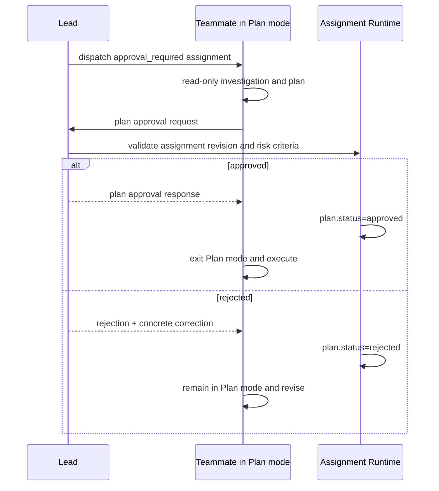

# L4 — Agent 调度与治理机制（Sub-agent / Agent Team Dispatch Governance）

> 层：第四层｜机制域：跨 Stage Agent 调度、执行连续性与治理｜平台基线：Claude Code 2.1.218
>
> 上游：L1 D1～D7 与五公理、L2 生命周期目标、所有需要委派职责的 L3 Stage
>
> 下游：L5 中的 Skill、Agent Definition、Schema、Harness、Hook、Assignment Record、测试和迁移任务
>
> 状态：v0.2.0 目标设计。本文定义机制应达到的统一行为；§13 单独列出现有实现与目标的差距，不把设计意图写成既成事实。

## 0. L4 的位置：为什么这不是另一份 L3

L3 按 Stage 回答：

- 这个阶段为什么存在；
- 需要完成什么；
- 哪些角色、产物和门共同形成阶段闭环；
- 失败时回到哪个生命周期位置。

L4 按跨阶段机制回答：

- 同一类工具机制在多个 Stage 中如何保持一致；
- Claude Code 平台对象、项目 Runtime 与持久化记录如何对齐；
- 派发、消息、等待、idle、stop、恢复和收口的精确语义是什么；
- Hook、Harness、Schema 和 Skill 各自承担哪一段责任；
- 哪些 L3 只引用机制，不能各写一套变体。

因此，Agent 调度不属于 S6 私有能力。S5 的独立文档审查、S6 的 Builder、S7 的 Delivery/QA/E2E、S8 的并行假设调查、S9 的修复与定向复验，都消费同一套调度治理机制。

本 L4 是第一份跨 Stage 工具机制设计。L3 只声明“此处需要哪种派发模式和阶段特有完成条件”；派发细节以本文为唯一目标态设计。

## 1. 问题定义与机制目标

### 1.1 当前要解决的根问题

Agent 委派不是一次 API 调用，而是一条跨多个控制面的执行链：

1. Main Agent 判断是否值得委派；
2. 选择普通 Sub-agent 还是 Agent Team teammate；
3. 固定 TASK、责任、scope、依赖和完成条件；
4. Worker 阅读真实项目文档并形成计划；
5. Worker 持续执行并向 Main Agent 回报；
6. Hook 识别过早 idle、过早 stop、缺计划、缺报告和越界；
7. Runtime 记录持久事实；
8. 结果被集成、验证或阶段 Gate 消费；
9. 中断后能够恢复同一责任，而不是重新猜测上下文。

任何一段没有闭合，都会产生典型失效：

- 第一轮回读后 Worker 进入 idle，Main Agent 来不及第二轮授意；
- 项目 Runtime 把 Agent 改回 active，但 Claude Code 平台会话没有被唤醒；
- Main Agent 以为自己在等结果，实际 Worker 已停止或隐藏；
- Worker 报告了计划，却没有继续执行；
- Main Agent 没收到计划就自行接管已委派责任；
- teammate idle 时被自动分配下一项任务，但上一项尚未集成或消费；
- 同一事实分别存在于 Team task、Runtime agent、TASK state、message 和 evidence 中，彼此漂移；
- Hook 只输出提醒，没有使用 Claude Code 的真实 decision control。

### 1.2 目标

本机制要实现：

- **统一选择**：Main Agent 能确定何时自执行、何时用普通 Sub-agent、何时用 Agent Team；
- **连续执行**：默认 Worker 回报计划后不停顿，直接完成 assignment；
- **风险分层**：普通任务使用计划检查点，高风险任务使用原生 Plan approval；
- **单一权威**：Assignment 是责任、scope、计划状态和结果状态的权威来源；
- **真实控制**：Hook 使用平台支持的 continue/block/exit 语义，不用 Runtime 文案模拟唤醒；
- **最少打断**：Main Agent 只在计划缺失、计划偏移、执行偏移、阻塞或完成时介入；
- **可恢复**：同一 Agent 可继续时继续同一 Agent；不可继续时从持久 Assignment 和 checkpoint 重派；
- **可观测收敛**：每个 assignment 能回答“当前在哪、还差什么、下一步由谁做”。
- **容量不裁责任**：L3 可声明 `bounded_flow` 或 `coverage_complete`；物理并发容量只决定启动顺序，不得让 coverage-critical Stage 删除 required Assignment。

### 1.3 非目标

- 不用 Agent 数量制造“团队感”；但当独立 coverage/context 确实存在时，不以少 Agent 为优化目标；
- 不要求所有任务都经过人工或 Main Agent 的计划批准；
- 不把聊天记录当作需求、scope 或完成状态的权威来源；
- 不让 Hook 判断业务设计优劣；
- 不允许 teammate 自己扩大任务、创建需求或越过人闸；
- 不用长协议弥补工具没有接线的问题；
- 不为 Claude Code 2.1.218 以前的行为保留第二套协议；环境不满足时升级或修复环境。

### 1.4 复杂度—收益减法审计

| 现有/候选机制 | 工程判断 | 处置 |
|:--|:--|:--|
| 所有 Worker 固定 readback → approval → activation | 协调、idle 和上下文切换成本高；普通可回滚任务没有等量风险收益 | 删除为默认，只在高风险任务保留原生 Plan approval |
| 把 PLAN_REPORT 当第一轮 final response | 直接终止 Sub-agent 本轮，制造恢复/重派和“第二次授意” | 禁止；改为运行中 SendMessage，发送后连续执行 |
| Main 对每份正常计划回复“批准开工” | 不改变 scope、权限或风险，只增加消息和等待 | 删除；计划无偏移时静默 |
| 大而全的 readback 字段复制 TASK/契约 | 重复真相、增加 token、字段无人消费 | 收缩为 objective/paths/steps/checks/dependencies/risks |
| Runtime 把状态改成 active 来模拟平台唤醒 | 两个控制面语义不相等，形成假恢复 | 删除；只用 SendMessage、exit 2 或平台 resume |
| TeammateIdle 自动领取/分配下一 TASK | 上一结果可能未消费，绕过依赖、冲突和 WIP 重算 | 删除；idle 只处理当前 Assignment |
| Team task、Runtime agent、消息、evidence 各存一份完成事实 | 多写者导致漂移，Gate 无法知道该信谁 | Assignment/Result 为工程权威，其他只投影 |
| 用自造 hook 字段和 systemMessage 假装控制 | 测试通过但真实 Claude Code 不会继续 Worker | 删除；使用官方 payload 与 exit/decision control |
| 每个 Stage 各写一套派发协议 | 漂移成本随 L3 数量线性增长，修一处不能全局生效 | 上移 L4；L3 只声明消费模式和阶段完成条件 |
| 所有任务都建 Agent Team | Team token、冲突与收口成本对小任务收益不足 | 按 one-shot / Sub-agent / teammate 三路选择 |
| 所有 Stage 固定 WIP=2/token budget | 容量易预测，但会让 S7 等 coverage-critical Stage 用漏检换短期成本 | 增加 stage capacity policy；默认 `bounded_flow`，S7 使用 `coverage_complete`，排队不裁 required coverage |
| 强制周期性 PROGRESS 消息 | 常态噪声高，Main 注意力收益低 | 默认可选；只有长任务或超时诊断启用 |
| 继续扩写 agent-protocol 长文 | 依赖模型读完、记住并自觉执行，不在自然路径上 | 协议只保留入口/不变量；细则埋入 Skill、Assignment、Hook、Result 和报错反馈 |

### 1.5 机制准入规则

候选机制只有满足以下至少一项，才进入持久化控制面：

1. 能阻止一个确定性非法转换或越权动作；
2. 能产生下游必须消费的事实；
3. 能减少 Main/Reviewer 的重复判断或重复取证。

只用于解释、统计或展示的内容必须是计算视图，不新增 ID、生命周期和审批门。S7 的 Claims、Assignment 和 Result 是事实；静态/E2E/Discovery coverage、Ready/Queued/Dispatchable、Case ledger 和 dashboard 都是视图。`coverage_complete` 只保证 required work 不因平台容量被裁剪，不授权 Agent 无来源地递归扩大任务范围。

## 2. Claude Code 对象模型与项目权威

### 2.1 平台对象

| 对象 | 平台语义 | 适合承担 |
|:--|:--|:--|
| Main session / lead | 当前会话的编排者和结果消费者 | 调度、例外判断、计划偏移判断、结果收口 |
| 普通 Sub-agent | 一次独立执行上下文，最终结果返回调用者；实际可前台或后台运行 | 自包含的一次性研究、检查、隔离写入任务 |
| 可寻址自定义 Sub-agent | 有稳定名称/ID，可在运行中通过 SendMessage 回报/纠偏，结束后可恢复 | 需要计划回执、worktree 隔离或中途指导的一次性责任 |
| Agent Team teammate | 独立 Claude Code 会话，共享 Team task 视图，可直接 SendMessage | 持续执行、并行责任、计划回执、跨任务协作 |
| Agent Definition | 角色静态边界、工具、模型和最大能力 | 定义“这个角色最多能做什么” |
| Plan mode / Plan approval | teammate 只读规划并向 lead 请求批准 | 高风险任务的执行前审批 |
| Task list | Claude Code 的协作和依赖视图 | 可视化 Ready/Pending/In Progress/Completed |
| Worktree | 隔离修改和保留失败现场 | Builder/repair 等写入责任 |
| SendMessage | Agent 间消息与运行中纠偏通道 | PLAN_REPORT、BLOCKER、CORRECTION、状态通知 |

### 2.2 项目权威分工

| 事实 | 唯一权威 | 平台对象的地位 |
|:--|:--|:--|
| 当前生命周期 Stage | .claude/loop-state.json | Team task 不决定 Stage |
| assignment 身份、Owner、scope、revision | Assignment Record | spawn prompt 和 Team task 是投影 |
| TASK/规格真相 | 已登记文档及指纹 | 消息只引用，不复制为新真相 |
| plan 是否已回报 | Assignment Record 的 plan checkpoint | mailbox/transcript 是传输和审计来源 |
| Worker 是否正在平台运行 | Claude Code teammate/subagent 状态 | Runtime 不能凭空唤醒平台 |
| assignment 是否完成 | canonical Result + 消费检查 | Agent final text 不是完成状态 |
| 写入是否可接受 | 实际 diff + integration/consumer gate | planned_paths 不是实际 diff |
| Stage 是否可推进 | 对应 Quality Gate | teammate/task completed 不自动推进 Stage |

核心原则：

> Runtime 记录工程事实，Claude Code 管理活会话；两者互相投影，但任何一方都不能伪装成另一方。

跨 worktree 还有一条硬边界：

> 产品写入面可以按 worktree 隔离；Assignment、plan、Result、checkpoint 等调度控制面必须解析到同一个项目级共享存储，并使用 CAS/revision 写入。它们不能跟随 Worker 当前 cwd 各写一份，也不能靠 git merge 汇总运行态。

L4 只规定这个一致性契约；共享存储的具体路径、锁和事务格式由 L5 决定。PostToolUse/PreToolUse/Harness 若无法定位共享控制面必须失败并给出恢复动作，不得退化为写 Worker worktree 中的“本地真相”。

### 2.3 平台基线

本设计以 Claude Code 2.1.218 为最低能力基线，要求：

- Agent Teams 已启用；
- Agent/Task/SendMessage 能力可用；
- teammate 支持计划批准；
- SubagentStop 和 TeammateIdle 的真实 continue/block 能力必须由 doctor/system test 确认；若平台不支持，使用共享 checkpoint + 原 Assignment 重派，不模拟唤醒；
- PostToolUse 能观察 SendMessage；
- Hook 输入保留官方字段；
- named Agent 可被 Main Agent 定向消息和恢复。

平台拓扑还必须通过 doctor/系统测试确认以下行为，而不能靠名字猜测：

- 交互会话开启 Agent Teams 后，带 `name` 的 Agent 调用通常生成 teammate；使用调用级 `isolation` 或 fork 时仍是 Sub-agent；
- `isolation: worktree` 写在 Agent Definition 中，不保证该 Definition 作为 teammate 运行时仍有隔离；
- 自定义 Sub-agent 可被 SendMessage 寻址和恢复；内建 Explore/Plan 是 one-shot，不能作为需要恢复的 Worker；
- 交互环境的 fork mode 可能让 Sub-agent 实际在后台运行，Skill 必须读取调用返回的真实拓扑，不能假设“我要求 foreground 就一定阻塞”。

doctor 应检查这些能力。缺失时的处理是升级 Claude Code、启用配置或修复安装，不是切换到一套弱化的旧版流程。

官方能力来源：

- [Agent Teams](https://code.claude.com/docs/en/agent-teams)
- [Sub-agents](https://code.claude.com/docs/en/sub-agents)
- [Hooks reference](https://code.claude.com/docs/en/hooks)
- [Tools reference](https://code.claude.com/docs/en/tools-reference)

## 3. 派发前决策：先选执行拓扑，再写 Prompt

### 3.1 是否委派

Main Agent 按以下顺序判断：

1. 责任是否足够独立，能由一个明确的产物或结论收口；
2. 是否能给出真实文档入口、scope、依赖和 done_when；
3. 委派是否带来上下文隔离、专业化、并行或独立性收益；
4. 对普通 `bounded_flow` 责任，协调和回收成本是否低于 Main Agent 自执行成本；对 `coverage_complete` required responsibility，成本只影响拓扑和排队，不否决委派；
5. 是否存在必须由不同 Agent 背书的独立性要求。

以下情况默认不委派：

- 只需一次很小的局部修改；
- 责任与 Main Agent 当前工作高度交织，需要频繁来回；
- TASK 尚未自包含；
- 多人必须同时编辑同一表面；
- 仅为了满足“使用了 Sub-agent”的形式要求。

### 3.2 执行拓扑选择

| 场景 | 选择 |
|:--|:--|
| 单次、自包含、只需最终结果 | 普通 Sub-agent |
| 多个互相独立的一次性调查 | 多个后台 Sub-agent |
| 需要计划中间回执、持续执行、直接纠偏，且必须 worktree 隔离 | 可寻址自定义 Sub-agent + 调用级 `isolation: worktree` |
| 需要计划中间回执、持续执行、直接纠偏，且可按只读/路径分区 | Agent Team teammate |
| 多责任共享 Task DAG、需要团队消息 | Agent Team |
| 高风险且需要 lead 原生批准计划 | Agent Team teammate + Plan mode |
| 需要独立审查/背书 | 不同 teammate 或不同 Sub-agent |
| 高频来回、上下文不可拆 | Main Agent 自执行 |

普通 Sub-agent 的 final response 是本轮结束。若业务需要“回计划后继续做”，PLAN_REPORT 必须在 Worker 仍运行时通过 SendMessage 发给 Main Agent，不能把计划写成 final response。若已错误结束，则用返回的 agent ID/name 恢复同一自定义 Sub-agent；恢复是异常路径，不是默认调度。

Agent Teams 打开时，`name`、fork 和调用级 `isolation` 会影响 Agent 调用最终落成 Sub-agent 还是 teammate。派发器必须记录平台返回的真实 topology。需要原生 worktree 隔离时优先 Sub-agent；需要共享 Task DAG/原生 Plan approval 时优先 teammate。两者都需要时，不能假装平台自动同时提供：应拆分写表面、让 Main session 自身运行在隔离 worktree，或选择更重要的约束并在 Assignment 中明示。

### 3.3 三种标准派发模式

| dispatch_mode | 语义 | 默认用途 |
|:--|:--|:--|
| one_shot | Worker 完成全部责任后一次返回结果 | 自包含研究、轻量检查、无需中间治理 |
| plan_checkpoint | Worker 先发送计划回执，不等批准，继续执行并最终交卷 | 默认 Builder、Verifier、QA、调查和修复任务 |
| plan_approval_required | Worker 进入原生 Plan mode，lead 批准后才能实施 | 高风险、难回滚、scope 尚需确认的任务 |

不得再用“所有 specialized Agent 都走硬两阶段”作为统一规则。

派发身份是另一条低复杂度硬边界：manifest-draft 可以输出
`TODO(planner):agent-id-...` 作为 authoring 草稿，但该值不是 Agent identity。
readback 请求生成、`register-workgroup`、activation envelope、`runtime agent-event`、
PostToolUse sender binding、auto-chain 和 `runtime agent-begin` 只接受非空、无控制字符且非占位符的真实平台 ID；不强制
`agent-` 前缀。观察到非法可选身份时，PostToolUse 继续尝试已验证的
`teammate_name`，找不到则 fail-open 且不伪造绑定。

## 4. 风险分类：什么时候必须批准计划

### 4.1 默认采用 plan_checkpoint 的条件

以下条件同时成立时，计划是观测点而不是审批门：

- assignment scope 已由上游 TASK/责任固定；
- 修改发生在隔离 worktree；
- 改动可回滚；
- 不修改 locked truth；
- 不执行发布、部署或外部不可恢复动作；
- 实际 diff 会在集成时再次校验；
- Required Checks 已知；
- Main Agent 能在收到计划后通过 SendMessage 纠偏。

这种情况下，让 Worker 等待批准的收益低于 idle、kill、上下文切换和调度停顿成本。

### 4.2 触发 plan_approval_required

任一条件成立就使用原生 Plan approval：

- 数据库 migration、数据回填、不可逆数据变化；
- 公共 API、共享 schema、事件协议或跨模块核心接口变化；
- 权限、安全、密钥、支付、审计或合规边界；
- 会影响多个 active assignment 的共享写表面；
- 大范围删除、移动、生成或机械改写；
- 需要扩大已锁定 TASK 的 prospective scope；
- 任务定义仍有多个高成本解释；
- worktree 不能提供足够隔离；
- 失败后恢复成本显著高于一次计划审批等待。

### 4.3 风险决定由谁做

- 机械触发项由 dispatch planner 根据 TASK risk、路径和命令类型实算；
- Main Agent 可以升级为 approval_required；
- Worker 发现新风险时发送 BLOCKER/PLAN_ESCALATION，不得自降风险；
- 降级 approval_required 必须产生新的 Assignment revision；
- 人只在 REQ 变化、外部授权和不可派生业务决策上介入。

## 5. Assignment：调度治理的唯一工程记录

### 5.1 Assignment Record

每次派发必须有一个权威 Assignment Record：

| 字段组 | 必须表达 |
|:--|:--|
| identity | assignment_id、revision、task/responsibility ref、owner_agent_id、role |
| topology | dispatch_mode、实际 agent/team identity、foreground/background/team、resume address |
| authority | effective_scope、worktree/source/target；其他权限引用 Role/TASK，不复制全文 |
| plan | status、reported_at、digest、planned_paths、approval ref（若适用） |
| result | assignment status、result_ref、blocker_ref、integration/consumption ref |
| recovery | last checkpoint、replacement provenance |

Stage、generation、依赖、优先级、文档指纹、Closing Contract、Required Checks 和 expected outputs 已属于 TASK/责任的事实，Assignment 只保存引用或派发时指纹，不复制第二份可独立修改的内容。`dispatch_capacity_policy` 属于 Stage/ReviewPlan 权威；冲突、Ready/Queued/Dispatchable 和 active capacity 是调度器实算视图，不作为 Assignment 的第二套长期配置维护。

### 5.2 一个事实只维护一次

- Team task 从 TASK + Assignment 投影 subject、dependency、owner 和平台状态；
- spawn prompt 从 Assignment 生成；
- Agent Role 只提供静态最大能力；
- PLAN_REPORT 更新 Assignment 的 plan checkpoint；
- Completion Result 更新 result 状态；
- Runtime task/agent 列表是聚合视图；
- Gate 读取 Assignment/Result，不要求 Agent 手写重复 envelope。

所有更新以 `assignment_id + revision` 做 CAS；Worker worktree 只承载产品差异和必要的工作产物，不承载可被 merge 的活调度状态。

### 5.3 revision 规则

以下变化必须生成新 revision：

- Owner 变化；
- dispatch_mode 变化；
- effective_scope 扩大；
- TASK/规格指纹变化；
- Required Checks 实质变化；
- worktree/target 变化；
- 计划被判定为与 assignment 语义冲突。

纯文字澄清、顺序调整或不改变授权边界的纠偏可以使用 SendMessage，不必制造 revision。

### 5.4 两条正交状态线

Assignment 主状态只表达责任是否向消费闭合：

```text
draft -> ready -> dispatched -> running -> result_submitted -> consumed
                     |             |             |
                     +----------> blocked <------+--> cancelled / replaced
```

计划状态是正交属性，不再膨胀成 reading/approved/activated/working 等第二套主生命周期：

```text
not_required
missing -> reported -> drifted
missing -> approval_pending -> approved
                            -> rejected -> approval_pending
```

- `plan_checkpoint`：reported 即满足首写屏障；drifted 只阻止首次写入或触发纠偏；
- `plan_approval_required`：approved 才满足写入屏障；
- 平台的 running/idle/stopped 是活会话事实，不回写成 Assignment 的同名伪状态；
- Team task 只有在 Result 被 stage consumer 接受后才由 Main/scheduler 标 completed，从而让原生依赖解锁与 `consumed` 对齐。

### 5.5 Canonical Result

每个执行型 Assignment 只交一份最小 Result：

| 字段 | 目的 |
|:--|:--|
| assignment_id / revision | 防止结果投错责任或消费过期结果 |
| outcome | completed / blocked / failed |
| output_refs | 指向代码、报告、finding、证据或其他真实产物 |
| actual_changed_paths | 与 effective_scope 做实际差异校验 |
| checks | 命令/用例、退出状态、evidence refs；不复制日志全文 |
| deviations / residual_risks | 暴露计划与实际差异及剩余不确定性 |
| handoff | 下一消费者需要执行的一个明确动作 |

Worker 提交 Result 不等于完成：Main/Stage consumer 验证、集成或吸收成功后才写 `consumed`。失败和阻塞也必须产出 Result/Blocker 引用，不能靠最后一条聊天猜测现场。

## 6. 调度模型：复用 TASK DAG，分离覆盖承诺与物理容量

### 6.1 一张权威图、一个即时冲突视图

统一调度器复用已有 TASK 依赖 DAG，不另建第二份依赖图。每次调度时只计算：

1. **依赖是否满足**：上游 Result 已 consumed，而不只是 Worker 声称完成；
2. **即时冲突集**：当前候选与 active assignment 是否在写路径、共享 schema、migration、生成文件、独立性或稀缺工具上冲突。

不持久化完整冲突图；只有真实冲突才在对应 Assignment/Blocker 上记录原因。这样保留可判定调度，又不引入需要持续同步的第二套项目图。

### 6.2 Ready 条件

assignment 只有同时满足以下条件才能进入 Ready Set：

- 上游 L3 已产生该责任所需的权威输入；
- 依赖已 consumed，而不只是 Worker 声称完成；
- 没有与 active assignment 的未解决冲突；
- Owner 和角色合法；
- dispatch_mode 已确定；
- worktree/只读边界可建立；
- 没有必须先由人裁决的问题。

满足这些语义条件即进入 Ready Set。平台并发槽是否空闲不改变 Ready，也不能使 Assignment 消失；调度器另计算 Dispatchable Set，槽位不足的 Ready Assignment 显示为 queued。

### 6.3 优先级

Ready assignment 默认按以下顺序：

1. 关键路径；
2. 解锁最多后续责任；
3. 高不确定性、早反馈价值高；
4. 可复用同一 Agent 当前上下文；
5. 稳定 ID 顺序，保证调度可复现。

### 6.4 Stage capacity policy

Stage/ReviewPlan 必须从两个策略中选择一个：

| policy | 适用 | 调度语义 |
|:--|:--|:--|
| `bounded_flow` | 普通 Builder、修复或协调成本可能高于并行收益的工作 | active slot 上限由 Main 可消费结果数、隔离面和风险决定，模板初值可为 2；超出者保持 Ready/queued |
| `coverage_complete` | S7 等“漏掉一个独立验证面会制造后续返工”的质量发现工作 | required Assignment 的逻辑数量、Ready/queued 集合和 token 支出不设上限；所有独立 scope 必须保留，平台槽位释放后持续补位 |

两种策略都遵守：

- 同一即时写冲突集默认只允许一个 Assignment active；冲突改变顺序，不取消责任；
- 真实 platform capacity、账号、端口、数据集和 worktree 决定 Dispatchable Set；
- `coverage_complete` 下禁止通过 token budget、`max_reviewers` 或固定 WIP 把 required Assignment 改成 N/A/cancelled，或合并成认知过载 scope；
- `coverage_complete` 下仍须由初始 ReviewPlan 和一次受控 revision 闭合 required set；它不意味着每个 Result 都能继续产生新的 Assignment；
- `bounded_flow` 的 WIP 也是 active concurrency 上限，不是 Backlog/Ready coverage 上限；
- idle 不等于可以 self-claim 下一项，只有 scheduler 重新计算 Ready/Dispatchable 后才能派发。

资源锁释放时，Assignment 状态、Claim disposition 与 queued Agent 的唤醒必须在同一消费事务内完成：Assignment 从 `planned/queued` 变为 `dispatched` 后，Agent 从 `queued` 进入 `reading`，再由正常 PLAN_REPORT/activation 必经路径继续。queued Agent 在尚未释放前不应被 stop/idle 门要求提交计划；释放后也不能直接跳过计划检查。

## 7. 默认协议：双回执、单次连续执行

### 7.1 现实原型

该机制的现实原型不是“两次开工许可”，而是教师收两次材料：

1. 第一次收计划，确认学生理解题目和答题路线；
2. 第二次收最终试卷，检查实际结果。

学生交完计划后继续答题。只有计划跑题、漏题或遇到阻塞时，教师才打断。

### 7.2 正常时序

```mermaid
sequenceDiagram
    autonumber
    participant Main as Main Agent / Lead
    participant Tool as Dispatch + Runtime
    participant Worker as Addressable Sub-agent / Teammate
    participant Hook as Claude Hooks
    participant Consumer as Integrator / Reviewer / Gate

    Main->>Tool: dispatch ready assignment
    Tool-->>Worker: spawn prompt + Assignment ref
    Worker->>Worker: read TASK/responsibility -> contracts -> REQ -> design/rules
    Worker->>Main: SendMessage PLAN_REPORT (not final response)
    Hook->>Tool: PostToolUse records plan checkpoint
    Worker->>Worker: continue immediately; no approval wait
    Worker->>Worker: implement/review/test
    Worker->>Main: SendMessage BLOCKER/CORRECTION only when needed
    Main-->>Worker: SendMessage correction only on drift
    Worker->>Tool: submit canonical Result
    Worker->>Main: SendMessage COMPLETION
    Tool->>Consumer: integrate or consume Result
    Consumer-->>Tool: accepted/blocked
```

### 7.3 Worker 的硬指令

plan_checkpoint 模式的 spawn instruction 必须明确：

```text
Read the assigned authoritative documents before the first mutation.
Send one PLAN_REPORT to main/lead with the assignment ID/revision,
objective, planned paths, implementation/review steps, required checks,
dependencies, risks, and blockers.

PLAN_REPORT is a checkpoint sent through SendMessage, not your final response
and not the end of your turn.
Do not wait for approval. Continue the assignment immediately after sending it.
Stop only for a real blocker, an authority/scope conflict, or completion.
```

不能只写“先汇报计划”，否则模型很容易把汇报解释成 final response。

### 7.4 PLAN_REPORT 最小结构

| 字段 | 作用 | 消费者 |
|:--|:--|:--|
| assignment_id / revision | 防止计划投错责任或过期 | PostToolUse、Main Agent |
| objective | 暴露任务理解偏差 | Main Agent |
| planned_paths | 与 effective_scope 做机械子集检查 | Harness/Hook |
| steps | 让 Main Agent看见实现顺序和关键决策 | Main Agent |
| assertion_checks | 防止只写代码不证明 Closing Contract | Main Agent、Result validator |
| dependencies | 暴露错误 Ready 判断 | scheduler |
| risks / blockers | 触发纠偏、审批升级或 blocked | Main Agent |

计划不复制整份 assignment，不重复机器已经知道的 allowed/forbidden 列表。

### 7.5 计划检查

计划收到后分两层检查：

- **机器立即检查**：assignment/revision 当前、planned_paths 在 scope 内、Required Checks 未缺失、依赖声明一致；
- **Main Agent 异步判断**：目标理解、步骤是否偏题、是否漏关键集成边、是否触发高风险审批。

机器检查失败时不允许第一次写入。Main Agent 语义判断正常时不回复；发现偏移时通过 SendMessage 发送 CORRECTION。

### 7.6 一次性首写屏障

计划检查点应埋在第一次写入的必经之路：

1. Worker 通过 SendMessage 发送稳定类型的 PLAN_REPORT；
2. PostToolUse(SendMessage) 验证目标是 main/lead、assignment/revision 正确；
3. Harness 将 digest 和 reported_at 原子写入 Assignment；
4. Worker 首次调用 Write/Edit/NotebookEdit/写入型 Bash；
5. PreToolUse 读取 Assignment；
6. plan_checkpoint 模式且 plan.status != reported 时，拒绝本次写入并告诉 Worker先发送计划；
7. plan 已记录后不再重复打扰。

这是“先形成计划”的自助屏障，不是“等 Main Agent 批准”的停工门。

## 8. 高风险协议：原生 Plan approval

### 8.1 时序



### 8.2 与默认模式的区别

| 维度 | plan_checkpoint | plan_approval_required |
|:--|:--|:--|
| 计划作用 | 早期观测 | 执行授权 |
| 发送后 | 立即继续 | 等待 lead 批准 |
| 写入屏障 | 只要求计划已发送 | 要求计划已 approved |
| Main Agent 正常动作 | 静默 | approve/reject |
| 适用成本 | 低 | 高，但由高风险定价 |

### 8.3 禁止伪造批准

- teammate 或其他 Agent 的消息不能充当用户权限批准；
- Main Agent 只能在 assignment 授权边界内批准计划；
- REQ 变化和外部不可派生授权仍交人；
- approval 绑定 assignment revision，revision 变化后自动失效。

## 9. 等待、消息和执行连续性的精确语义

### 9.1 普通 Sub-agent

| 运行方式 | Main Agent 行为 | 结果语义 |
|:--|:--|:--|
| 实际 foreground | Agent 调用阻塞到 Sub-agent 本轮完成 | 只适合必须先拿最终结果再继续；交互 fork mode 下不能假定一定 foreground |
| 实际 background | Main 继续其他工作，最终结果通过 completion notification 到达 | 适合独立并行任务，不轮询 transcript/task row |
| running addressable agent | Main/Worker 可通过 SendMessage 交换 PLAN_REPORT/CORRECTION | plan_checkpoint 的正常中间回执链 |
| stopped addressable agent | Main 用 SendMessage(agent ID/name) 恢复同一上下文，平台在后台继续 | 仅用于误停、追加责任或纠偏，不作为正常计划链 |

Sub-agent 的 canonical final result 仍通过 Agent completion 返回，但计划可以在运行中通过 SendMessage 到达 Main Agent。需要中途计划回执时必须使用可寻址的自定义 Sub-agent；内建 Explore/Plan 不返回可恢复 ID，不适用。若 Sub-agent 只把计划作为 final response，SubagentStop 应先阻止结束；已经结束时恢复同一 agent，不能新建一个“第二轮 Agent”。

### 9.2 Agent Team teammate

- teammate 通过 SendMessage 主动回报计划、blocker 和完成；
- 消息自动到达 lead，lead 不轮询 mailbox；
- teammate 发送 PLAN_REPORT 后继续当前 turn；
- lead 可在 Worker 运行中发送 CORRECTION；
- teammate idle 仍可被定向消息唤醒，但正常路径不依赖先 idle 再唤醒；
- Team task 是调度视图，不是完成权威。

### 9.3 Main Agent 如何等待

Main Agent 不进入“等待计划后第二次授意”的 activation barrier。

它遵循：

1. 派发后继续调度其他 Ready responsibility；
2. 不自执行已经委派的同一责任；
3. 收到 PLAN_REPORT 时快速做偏移判断；
4. 正常计划不回复；
5. 没有其他 Ready 工作时，明确等待 teammate 完成，而不是宣布结束；
6. 收到 completion 后进入消费/集成；
7. 只有 blocker、drift、approval request 或 completion 需要产生响应。

Plan mode 属于 approval_required Worker，不属于 lead 的普通等待状态。

把“需要收到什么”直接映射到平台等待方式：

| Main 需要收到 | 派发/等待方式 | 禁止做法 |
|:--|:--|:--|
| 同步最终结果 | 实际 foreground Sub-agent；Agent 调用本身阻塞 | 再造一层轮询 |
| 并行最终结果 | background Sub-agent；等待 completion notification | 读 transcript 猜完成、因 UI row 消失而重派 |
| 计划 + 最终结果，计划不需批准 | 可寻址 Sub-agent 或 teammate；PLAN_REPORT 用 SendMessage，Main 继续调度，最终结果走 completion/COMPLETION | 把计划当 final、收到计划后再发“可以开始” |
| 必须批准计划后执行 | teammate Plan mode；等待自动送达的 PLAN_APPROVAL_REQUEST | 用普通文本假装 approval protocol |
| 已误停 Sub-agent 的第二次授意 | SendMessage 到原 agent ID/name，自动恢复后台执行 | 再次 Agent 调用创建新上下文 |

因此不存在一个通用的“主会话等待模式”。foreground 的调用本身就是等待；background completion 和 teammate message 都由平台投递。调度 Skill 要做的是保持 assignment 未收口、继续处理其他 Ready 工作，并在没有本地工作时等待平台通知，而不是轮询、结束总任务或让 Worker 先 idle。

### 9.4 消息类型

统一使用：

| 类型 | 方向 | 是否终止当前工作 |
|:--|:--|:--|
| PLAN_REPORT | Worker → Main | 否 |
| PLAN_APPROVAL_REQUEST | Worker → Main | 是，停在 Plan mode |
| PLAN_APPROVAL_RESPONSE | Main → Worker | 否，批准后继续 |
| CORRECTION | Main → Worker | 否 |
| BLOCKER | Worker → Main | 取决于是否仍有可做工作 |
| PROGRESS | Worker → Main | 否，默认不强制 |
| COMPLETION | Worker → Main | 是，进入 Result 消费 |
| SHUTDOWN_REQUEST | Main → Worker | 是，仅团队收口 |

不得为每个生命周期微状态创建一条强制消息。

## 10. Hook 与 Harness 的真实控制契约

### 10.1 Hook 事件地图

| 事件 | 真实责任 |
|:--|:--|
| PreToolUse(Agent/Task) | 派发前检查 Assignment、dispatch_mode、worktree、stage capacity policy、Dispatchable slot、冲突和角色；不得因槽满删除 queued responsibility |
| SubagentStart | 注入唯一匹配 Assignment 的真实 scope、`done_when`、Required Checks、连续执行语义和最小上下文 |
| PostToolUse(SendMessage) | 捕获 PLAN_REPORT/BLOCKER/COMPLETION，更新 Assignment checkpoint |
| PreToolUse(Write/Edit/Bash...) | 首写计划屏障、locked artifact、不可逆动作、scope 前置诊断 |
| PreToolUse(TaskUpdate) | owner/status 变化必须对应有效 Assignment 和 scheduler 决策；阻止 teammate 擅自 self-claim 下一责任 |
| TeammateIdle | 在平台支持真实 continue/block 控制且 doctor 已确认时，阻止未完成 teammate 进入 idle；只处理当前 assignment |
| SubagentStop | 在平台支持真实 stop decision 且 doctor 已确认时，阻止普通 Sub-agent 以计划代替完成，或缺 Result 时停止 |
| TaskCompleted | 防止 Team task 在 canonical Result 被消费前标 completed |
| SessionStart | 从 Assignment/Result 重建调度板，识别失联 Worker |
| PreCompact | 确保 Assignment、plan、result 和 resume address 已持久化 |

### 10.2 TeammateIdle 决策矩阵

Hook 必须使用官方 teammate_name、team_name、transcript_path 定位对象，不依赖平台不会提供的自造 agent_id。

| 当前事实 | Hook 行为 |
|:--|:--|
| 无匹配 Assignment | 允许 idle，记录诊断；不得猜第一个 idle Agent |
| plan_checkpoint 且计划未报告 | exit 2：要求发送 PLAN_REPORT 后继续 |
| plan_approval_required 且等待批准 | 允许保持平台 Plan waiting；不得改成普通 active |
| 计划已报告、assignment 未完成、无 blocker | exit 2：继续当前 assignment |
| blocked 但没有 BLOCKER | exit 2：先提交 blocker |
| blocked 且 BLOCKER 有效 | 允许 idle |
| Result 缺失但 Worker 声称完成 | exit 2：提交 canonical Result |
| Result 有效、等待消费 | 允许 idle；不自动分配下一项 |
| assignment consumed | 允许 idle；scheduler 可另行派发 |

exit 2 的 stderr 必须是给 teammate 的一条具体下一步，不能只输出 LOOP RECOVERY 长文。

`exit 2` 和 `decision=block` 是目标平台控制，不得通过自造字段模拟。落地前必须用 Claude Code 2.1.218 的官方 payload 做 doctor/system test，确认反馈会回到同一活会话。若平台能力缺失或 payload 无法定位原 Agent，Hook 不得假装完成唤醒：持久化 Assignment checkpoint，报告一个可恢复 blocker，并由 scheduler 依据原 Assignment 重派。禁止因为一个未验证的平台假设再增加一套“虚拟 active”状态。

### 10.3 SubagentStop 决策矩阵

| 当前事实 | Hook 行为 |
|:--|:--|
| final response 只有计划，assignment 要求执行 | decision=block：计划不是完成，请继续 |
| assignment 未完成且无 blocker | decision=block：继续当前责任 |
| blocked 但无 BLOCKER | decision=block：先报告 blocker |
| canonical Result 缺失 | decision=block：提交 Result |
| Result 有效 | 允许 stop，父会话进入消费 |

必须使用 stop_hook_active 避免 Hook 自身造成无限停止循环。

### 10.4 Hook 输出纪律

- 要让 teammate 继续，必须使用 Claude Code 支持的 exit 2 或 decision=block；
- systemMessage 只提供上下文，不等于阻止 idle/stop；
- exit 2/decision=block 只有在官方 payload doctor 通过后才作为强制控制；未通过时走 checkpoint + replacement，不制造假唤醒；
- Runtime 状态变化不等于平台会话已唤醒；
- Hook 只判机械事实和控制下一步，不判断计划的业务质量；
- 所有官方输入字段必须无损进入 adapter；
- 测试必须使用官方 payload，禁止靠额外 agent_id 让测试通过。

### 10.5 指引应埋在哪里

`agent-protocol.md` 只保留调度入口、三种 dispatch_mode 和“哪里查权威”的短索引。持续执行所需指引分布在 Worker 的必经路径：

| 载体/时机 | 埋入的唯一内容 | 为什么在这里 |
|:--|:--|:--|
| TASK / Closing Contract | responsibility、输入、done_when、Required Checks | 没有它就无法完成任务 |
| Assignment generator | owner、真实 topology、scope、dispatch_mode、revision | 派发时必须生成，避免 Prompt 自由发挥 |
| Agent Definition | 角色最大工具/写路径/专业方法边界 | 定义长期稳定能力，不复制单任务事实 |
| dispatch Skill | 拓扑选择、风险分类、等待语义、异常恢复 | 只在 Main 准备委派时加载 |
| spawn prompt | Assignment ref、最小读序、“PLAN_REPORT 不是 final，发送后继续” | Worker 第一轮必然接收 |
| PLAN_REPORT schema | objective/paths/steps/checks/dependencies/risks | 填写动作本身暴露理解偏差 |
| PostToolUse(SendMessage) | 记录计划/阻塞/完成 checkpoint | 消息发送必经路径 |
| 首次 mutation 的 PreToolUse | 缺计划、revision 过期、approval 缺失的一个下一步 | 开工必经路径，只触发一次 |
| PreToolUse(TaskUpdate) | 禁止未授权 self-claim/越权完成 | Team task 状态变化必经路径 |
| TeammateIdle / SubagentStop | 计划不能当交卷、缺 Result 不能结束 | Worker 准备停下的最后必经路径 |
| Result schema + consumer | actual diff、checks、deviation、消费确认 | “做完”变成下游可消费事实 |
| SessionStart / PreCompact | 恢复地址、未消费结果、单一下一步 | 跨会话连续性的必经路径 |

同一句规则只能有一个主承载点。其他位置最多放链接和一句触发提示，不能复制成长篇协议；错误反馈只给当前缺失事实和下一动作，不把整份 L4 注入 Worker。

## 11. Main Agent 调度循环

Main Agent 在任何 spawn、消息、idle、stop、result 或 SessionStart 后运行：

```text
DISPATCH_LOOP()
1. Read current Stage and authoritative Assignment inventory.
2. Read dispatch_capacity_policy; recompute DAG, conflicts, Ready Set, queued set, platform slots and Dispatchable Set.
3. Consume inbound PLAN/BLOCKER/COMPLETION messages.
4. For PLAN_REPORT:
   - run mechanical checks;
   - judge semantic drift;
   - stay silent if aligned;
   - send CORRECTION or revise/reassign if drifted.
5. For BLOCKER:
   - continue all unaffected work;
   - resolve locally, revise assignment, route spec change, or ask human only at a real gateway.
6. For COMPLETION:
   - validate Result;
   - integrate or pass to the stage-specific consumer;
   - mark consumed only after that consumer succeeds.
7. Dispatch the highest-priority Dispatchable assignment; on coverage_complete keep every other required Ready assignment queued and refill all free slots.
8. If active workers remain and no Dispatchable work exists, wait; do not cancel Ready/queued work.
9. Close teammates only after all their assignments are consumed or intentionally cancelled.
```

Main Agent 不能：

- 在 Worker 回计划后机械回复“批准，可以开始”；
- 因 teammate 暂时没有新消息就重派；
- 抢做 active assignment；
- 在 TeammateIdle 中直接分配未重新求值的下一 TASK；
- 把 Team task completed 当作 Stage gate；
- 因协调成本高而静默缩小任务范围。

## 12. 中断、偏移与恢复

### 12.1 计划缺失

- 首写屏障拒绝第一次 mutation；
- TeammateIdle/SubagentStop 阻止以无计划或只有计划的状态结束；
- 反馈只要求发送 PLAN_REPORT 并继续；
- 不需要 Main Agent 发第二轮 activation。

### 12.2 计划偏移

偏移分三级：

| 级别 | 示例 | 处理 |
|:--|:--|:--|
| 可纠偏 | 顺序不佳、漏一个 owned check | SendMessage CORRECTION，继续同一 revision |
| 授权变化 | 新增写路径、改 Required Checks、触发高风险 | 新 Assignment revision，必要时进入 Plan approval |
| 规格冲突 | TASK/contract/REQ 无法共同成立 | 停止对应责任，走 L3 的 spec-change/human route |

Main Agent 纠偏后不需要重新讲完整任务，只发送差异和原因。

### 12.3 执行偏移

- planned_paths 只是早期预测；
- 实际 changed paths 由 git diff 或消费者实算；
- scope 越界在 integration/Result consumer 阻断；
- worktree 保留所有偏移现场；
- 可回滚的普通偏移优先修回，不立即 kill/reassign；
- 只有 Owner 不再可信、上下文损坏或平台 Agent 不可恢复时才替换。

### 12.4 idle、hidden、stopped 与 killed

必须区分：

| 平台现象 | 含义 | 恢复 |
|:--|:--|:--|
| idle | 当前 turn 结束，teammate 仍可寻址 | 官方 continue/block 已验证时用 SendMessage/exit 2；否则保留 checkpoint 并由 scheduler 恢复/重派 |
| hidden | UI 隐藏 idle row，不等于会话销毁 | 按名称/ID 消息唤醒 |
| completed / TaskStop stopped | Sub-agent 本轮结束但仍可寻址 | SendMessage resume 原 agent ID/name，或消费结果 |
| user-cancelled / killed | 用户在 UI 取消，或平台强制终止；SendMessage 可能拒绝自动恢复 | 保留现场；能由用户重开则恢复，否则按 checkpoint 重派 |
| shutdown | teammate 被正常关闭 | 仅在 assignment consumed/cancelled 后允许 |
| session lost | 平台上下文不可恢复 | 从持久 Assignment/plan/result/checkpoint 重派 |

### 12.5 重派

重派必须记录：

- replacement_of_agent_id；
- 原 assignment/revision；
- 新 Owner；
- 已完成计划和工作摘要；
- worktree/checkpoint 接管方式；
- 为什么不能继续原 Agent；
- 独立性约束是否仍成立。

禁止因一次 idle 就创建替代 Agent。

## 13. 跨 L3 消费地图

| L3 Stage | 典型责任 | 默认拓扑/模式 | Stage 特有消费 |
|:--|:--|:--|:--|
| S0 需求设计 | 辅助研究、方案对抗 | one_shot；Main 保持需求责任 | 结果仅供人和 Main 形成 REQ，不得替人锁定 |
| S1 绑定 | 通常不委派 | Main | 生命周期授权不能由 Sub-agent 执行 |
| S2 设计 | 模块设计、原型研究、技术调查 | plan_checkpoint Sub-agent/teammate；独立研究可 one_shot | 设计包/ADR 被 S2 收口 |
| S3 契约 | FE/BE/SYNC 分面起草与对账 | Agent Team + plan_checkpoint | 契约锁定前由 Main/Stage gate 聚合 |
| S4 TASK 拆分 | 模块拆分、DAG/Closing Contract 检查 | one_shot 或 plan_checkpoint | TASK batch 和 DAG 被 S4 消费 |
| S5 文档验证 | 两个独立 reviewer responsibility | Agent Team；read-only plan_checkpoint | 两份独立结论和 exact subject |
| S6 构建 | frontend/backend/test Builder | 隔离写入优先 Sub-agent + worktree；路径可分时可用 teammate；默认 plan_checkpoint，高风险 approval | Builder Result + integration |
| S7 完整验证 | DV/QA/E2E Claims 与独立验证面 | ReviewPlan DAG + 1..N Assignments + plan_checkpoint | 当前 round 的 ReviewResult、Finding 和 CleanRound/ObservationBatch |
| S8 调查 | 多假设调查、Original Finder 责任 | 多 teammate plan_checkpoint；Investigator lifecycle bridge 已接入 Runtime，通用 PLAN_REPORT 按 fingerprinted manifest 绑定 | InvestigationCase/HypothesisResult/RepairContract；canonical BUG 仅为批准后的兼容投影；实际平台进程启动仍由 Claude/Agent Team 负责 |
| S9 修复 | repair Builder、定向复验 | 隔离写入优先 Sub-agent；默认 plan_checkpoint，高风险 teammate approval | fix Result、影响失效、targeted reverify |
| S10 验收审计 | 证据汇编、独立系统审计 | read-only teammate/one_shot | ACC 与 audit 结论 |
| S11 发布闸 | 发布前信息整理 | read-only one_shot 可辅助 | 最终 release decision 仍由人 |

所有 L3 可以增加 Stage 特有 done_when，但不得重定义：

- PLAN_REPORT 是否终止 turn；
- TeammateIdle 和 SubagentStop 的平台语义；
- Assignment 生命周期；
- dispatch_mode；
- plan approval 风险规则；
- Main Agent 的等待和纠偏方式。

## 14. L1 准则与现实原型映射

| L1 准则 | L4 落点 |
|:--|:--|
| D1 权威外置 | Assignment/Result/checkpoint 持久化；平台会话只承载活执行 |
| D2 自然路径观测 | SendMessage、首写、idle、stop、task complete、session start 都有控制点 |
| D3 门是顾问 | 默认计划不等批准；错误反馈给一个可执行下一步；高风险才停 |
| D4 引导性产物 | PLAN_REPORT 的少量字段迫使 Worker 暴露理解、步骤和验证计划 |
| D5 三级强制 | Prompt 引导 → 结构化消息/Assignment → 首写/stop/idle 机械控制 |
| D6 三方收敛 | Worker 判断并执行，机器公证 scope/状态，Main/独立角色消费结论 |
| D7 收敛可观测 | Ready/running/reported/consumed + plan/result checkpoint 显示单调进度 |
| 公理一 原型 | 教师先收答题计划、后收试卷；工程上对应 kickoff plan + implementation handoff |
| 公理二 分工 | Main 调度和判偏移，Worker 执行，Hook 判机械事实，人握需求/发布 |
| 公理三 消费 | 每个 plan/result 字段都有 scheduler、Main、consumer 或 Gate 消费者 |
| 公理四 成本 | 普通任务取消审批等待，高风险任务保留定价后的保险 |
| 公理五 传达 | 纠偏原因随 CORRECTION，Hook 失败随下一步到达 Worker |

## 15. 当前实现差距与 L5 迁移清单

> **2026-08-22 状态**：P0 第 1、2、5、6 项已落地——官方 payload 字段（teammate_name/team_name/transcript_path/
> agent_transcript_path/last_assistant_message/stop_hook_active）无损进入 `policy.Input`；TeammateIdle/SubagentStop 的 block
> 决策走真实 exit 2 + stderr（`internal/hook/stopidle.go`，fail-open 边界见代码注释）；PreToolUse(TaskUpdate) self-claim 门
> （`unauthorized_task_self_claim`）接入 settings.json matcher 与 `policy.EvaluateAgentScoped`；端到端测试改用官方 payload 形状。
> P0 第 3、4 项未闭环：测试基于 2.1.218 文档记载形状而非真实平台 doctor（环境无 Claude Code 运行时），"Runtime activated 即平台
> 已唤醒"的假设在 Controller 的 idle handler 中仍在（resume 分支 CAS activated、idle 中分配下一 TASK——属 P2 收敛范围）。
> P1 已于更早批次落地（dispatch_mode、PostToolUse(SendMessage)、首写屏障、Agent Definitions）；首写屏障尚未接入 wire 路径
> （与 pinned 的 unactivated-write 测试契约冲突，待 P1 收尾时一并裁决）。P3 第 4 项完成：`two-phase-activation` Skill 已由
> `agent-dispatch` 取代并删除，loop-orchestration 等 5 处残留引用已清理。§15.1 下表保留为历史差距记录。
>
> **2026-08-22 批次二**：P0-4 与 P2-5 收敛——Controller 的 TeammateIdle handler 不再 CAS activated、不再在 idle 中分配下一 TASK
> （真实唤醒由 stopidle.go exit 2 承担）；buildGuidance 的自造 Facts 判定替换为控制面事实源；首写屏障裁决后接入 wire 路径
> （豁免面 = reviewer 允许面），P1 至此全清。§15.2 P2 余项：Assignment 唯一权威化与 Team task 投影合并尚未整体推进。
> 仍未做：真实平台 doctor（环境限制）。
>
> 缺口分类汇总见 [L3-S7 §13.A](./L3-S7-verification-round.md#13a--待做缺口总表持续维护)（命令面拆分 / regression 指纹复用 / RegisterPlan 原子性 / fixture 同步 / 平台 doctor / 产品侧 wrapper / 长期演进信号）。

### 15.1 历史差距记录

本节保留各批次迁移时的原始差距，不应直接当作当前代码快照。当前 S7～S9 的权威状态、已落地工具和仍未闭合的跨阶段断点，以 [agent-protocol.md 的 S7～S9 控制面与埋点地图](../docs/agent-protocol.md#s7s9-control-plane-map) 及各 L3 的“当前事实”为准。

| 位置 | 当前机制 | 与目标的差距 |
|:--|:--|:--|
| skills/two-phase-activation | 固定 readback→approval→activation 链 | 应变为 dispatch_mode 路由；默认连续执行 |
| skills/loop-orchestration | 把 waiting for approval 当作 Driver barrier | 应改为消费 PLAN_REPORT，正常时静默 |
| agents/*.md | phase one 只回复并等待 phase two | 应明确 PLAN_REPORT 非终止、发送后继续 |
| internal/team/launch.go | 生成大量 readback fields，预载 role defaults | 应生成最小 Assignment/Plan，按风险选 Skill |
| agent-message schema | readback 字段过多，completion 与 evidence 分裂 | 应引入最小 PLAN_REPORT 和 canonical Result |
| assignment lifecycle | 多个 reading/approved/activated/working 事件 | 应收敛为 assignment 主生命周期 + plan 属性 |
| policy.Input | TeammateIdle 未保留 teammate_name/team_name/transcript_path | 应无损接入官方 payload |
| TeammateIdle controller | 改 Runtime 状态并给 guidance | 应输出真实 exit 2；不在 idle 中分配下一 TASK |
| hook adapter | 非 PreToolUse 多为 systemMessage + exit 0 | 应支持 stop/idle 的官方 decision control |
| settings.json | 无 PostToolUse(SendMessage) 计划捕获 | 应增加计划 checkpoint 接线 |
| dispatch topology | name、Agent Teams、fork、isolation 的组合未形成确定路由 | 应记录真实 topology，区分隔离 Sub-agent 与共享 Task teammate |
| tests | 使用自造 agent_id 的 TeammateIdle payload | 应使用 2.1.218 官方 payload 做端到端测试 |
| L3-S5/S6/S7/S9 | 各自保留两阶段描述 | 应引用本 L4，只保留 Stage 特有条件 |

### 15.3 S7～S9 当前交界审计（2026-08-26）

调度层的统一闭环只覆盖“谁负责、何时可写、何时可停、如何恢复”；它不替 S7/S8/S9 做业务判断。跨阶段当前结论如下：

| 边界 | 调度层已经保证 | 仍不能声称已经保证 |
|:--|:--|:--|
| S7 → S8 | ReviewResult/ObservationBatch 的 Assignment、消息、CAS、exact-set 消费和 S8 入口指引；Investigator 已由专用 workgroup/Task/Agent/activation bridge 登记，通用 PLAN_REPORT 可按 manifest 绑定 | Claude/Agent Team 的实际进程启动仍是平台动作；Runtime 只登记控制面和恢复事实，不伪造外部 spawn 成功 |
| S8 → S9 | approved RepairContract 才能打开 S9；Contract hash/revision 进入 Session/Plan；通用 PLAN_REPORT 可按 fingerprinted manifest 校验 | BUG projection、通用 PLAN_REPORT 和 S9 domain PlanReport 不自动互换；它们仍是不同契约，领域报告必须单独提交 |
| S9 → S7 | Handoff、baseline、seed、round+1 和清理旧投影在 Runtime CAS 中形成可恢复事实 | seed 已等同完整 ReviewPlan；S9 的 `depends_on/resource_locks` 已被调度器执行；这些仍需最终 S7 注册/消费或后续专门实现 |

调度机制的复杂度边界保持不变：保留首写屏障、PLAN_REPORT、Stop/Idle 控制、Assignment/CAS 和 exact-set 消费，因为每一项都有实际消费者和恢复动作；不新增第二套 Investigator lifecycle、CaseSet 或 S9 scheduler，除非先补齐明确的权威对象、next command、失败恢复和回归测试。涉及两个计划回报时，平台通用 `agent-message.plan_report` 只证明 Agent 已理解并可继续，S9 `repair-plan-report` 才证明领域执行计划已提交；两者不能用文档简称合并。

### 15.2 迁移顺序

#### P0 — 修真实平台接线

1. Input/adapter 接入 teammate_name、team_name、transcript_path、agent_transcript_path、last_assistant_message、stop_hook_active；
2. 用 Claude Code 2.1.218 官方 payload 完成 TeammateIdle/SubagentStop doctor；
3. doctor 通过后使用 exit 2/decision=block；未通过时使用 checkpoint + replacement，不宣称平台已被唤醒；
4. 删除“Runtime state=activated 即平台已唤醒”的假设；
5. PreToolUse(TaskUpdate) 阻止未授权 self-claim；
6. 用真实 Claude Code payload 和 Agent topology 组合重写测试。

#### P1 — 引入连续执行协议

1. Assignment 增加 dispatch_mode 和 plan checkpoint；
2. PostToolUse(SendMessage) 捕获 PLAN_REPORT；
3. PreToolUse 增加一次性首写计划屏障；
4. Agent Definitions 改为发送计划后继续；
5. Main Driver 正常计划静默、偏移才纠正。

#### P2 — 收敛状态与完成事实

1. Assignment 成为 owner/scope/state 的唯一来源；
2. 合并 Agent/TASK 的重复正常路径事件；
3. 引入 canonical Result；
4. Team task 只作为投影视图；
5. idle 不再承担自动分配下一 TASK。

#### P3 — 风险计划批准与跨 Stage 迁移

1. risk classifier 选择 plan_checkpoint/approval_required；
2. 接入原生 Plan approval；
3. S2～S10 逐份改为引用 L4；
4. two-phase-activation Skill 改名或降级为兼容路由；
5. agent-protocol 只保留跨机制入口链接。

## 16. 验收测试、指标与 Definition of Done

### 16.1 必须有的系统测试

| 场景 | 期望 |
|:--|:--|
| Sub-agent/teammate 发送 PLAN_REPORT 后继续调用工具 | 不进入 idle/stop，不需要 Main approval |
| plan_checkpoint 首次写入前没有 PLAN_REPORT | PreToolUse 拒绝并指导发送计划后重试 |
| PLAN_REPORT assignment/revision 错误 | 不记录 checkpoint，拒绝首写 |
| planned_paths 超 scope | 计划标 drifted，Main 收到纠偏项 |
| teammate 在计划前 idle | TeammateIdle exit 2，反馈送回同一 teammate |
| teammate 计划后、完成前 idle | exit 2，继续当前 assignment |
| teammate blocked 且 blocker 有效 | 允许 idle，Main 收到 blocker |
| teammate Result 有效 | 允许 idle，等待 consumer，不自动分配下一项 |
| 普通 Sub-agent 只返回计划 | SubagentStop block，要求继续工作 |
| 普通 Sub-agent 完成并有 Result | 允许 stop，父会话收到结果 |
| approval_required 未批准就写 | 拒绝 |
| approval_required 批准后写 | 允许，approval 与 revision 对应 |
| Main 运行中发送 CORRECTION | 同一 Agent 接收并继续，不重派 |
| Sub-agent 把计划作为 final response | SubagentStop block；若已结束则 SendMessage 原 ID 恢复，不新建 Agent |
| 开启 Agent Teams 后使用调用级 isolation | 真实 topology 记录为 Sub-agent，并得到 worktree 隔离 |
| 隔离 Sub-agent 发送 PLAN_REPORT | Main 与 Worker 读取同一共享 Assignment checkpoint；worktree 中不产生第二份运行态 |
| teammate 尝试 self-claim 未授权 Task | PreToolUse(TaskUpdate) 拒绝，等待 scheduler 派发 Assignment |
| session 恢复时平台 Agent 不存在 | 从 Assignment/checkpoint 生成明确 replacement，不伪称 resume |
| 两个 assignment 写冲突 | 第二个不进入 Dispatchable，保留责任并在锁释放后重新求值 |
| `bounded_flow` active slots 已满 | 新 Assignment 保持 Ready/queued，不被取消；槽释放后派发 |
| S7 `coverage_complete` 有 20 个 required Ready、平台 6 个槽 | 6 个 Dispatchable/running、14 个 queued；持续补位且 exact set 不减少 |
| `coverage_complete` 配置 token budget/max_reviewers 试图裁 required Assignment | schema/dispatch gate 拒绝；成本只可观测，不可改变 required set |
| 使用官方 TeammateIdle payload、无 agent_id | 精确定位 teammate，不猜测 |

### 16.2 运营指标

- dispatch 到 PLAN_REPORT 的时间；
- PLAN_REPORT 到首次 mutation 的时间；
- plan_checkpoint 被 Main 判偏移的比例；
- 因缺计划触发首写屏障的比例；
- 计划后误 idle/stop 的比例；
- 同一 Agent 恢复成功率；
- 因错误重派损失的 token 和时间；
- 每 assignment Main Agent 消息次数；
- approval_required 占比及实际捕获风险数；
- stage capacity policy、Ready/queued/Dispatchable/active 数、cycle time、lead time；
- coverage_complete required Assignment retention，目标 100%；
- 因平台容量排队的时间与因 scope 冲突排队的时间；
- plan 字段中没有消费者的比例；
- Runtime 与 Claude Code 平台状态不一致次数。

### 16.3 机制 Definition of Done

只有以下条件全部成立，本 L4 才算落地：

- 普通任务不再需要 readback 后第二次授意；
- Worker 发送计划后在同一 turn 连续执行；
- Main Agent 正常计划静默，只有例外才打断；
- 高风险任务能稳定进入原生 Plan approval；
- TeammateIdle/SubagentStop 使用真实平台控制；
- Assignment 是 Owner、scope、plan、result 和 recovery 的唯一权威；
- 隔离 worktree 与 Main 共享同一调度控制面，运行态不经 git merge 汇总；
- Team task 与 Runtime 是一致投影；
- 没有 Agent 因一次 idle 被无因重派；
- 首写、完成、集成/消费和 Stage Gate 形成可判定闭环；
- 所有受影响 L3 引用同一 L4，不再复制各自的派发协议；
- `bounded_flow` 与 `coverage_complete` 可由 Stage 明确选择；物理容量只影响 Dispatchable/queue，不会裁掉 coverage-critical required Assignment；
- 系统测试使用 Claude Code 2.1.218 官方 payload；
- 指标能证明等待减少而偏移、越界和返工没有恶化。

## 变更记录

| 日期 | 版本 | 变更 | 依据 |
|:--|:--|:--|:--|
| 2026-08-20 | v0.3.0 | 增加机制准入规则；明确 Claims/Assignment/Result 为事实，coverage/ledger/board 为视图；限制 `coverage_complete` 不得递归扩张；补充 exit 2/decision=block 必须通过官方 payload doctor，失败时走 checkpoint + replacement | 终审发现调度设计仍可能引入重复控制面，并且不能把未验证的平台唤醒能力写成既成事实 |
| 2026-08-20 | v0.2.0 | 新增 `bounded_flow / coverage_complete` Stage capacity policy；将 Ready 与 Dispatchable/physical slots 分离；S7 coverage-critical required Assignments 不受固定 WIP、Reviewer 数量或 token budget 裁剪，容量不足只进入 queued | S7 的 DV/QA/E2E 完整发现属于必要质量投入；通用 L4 若仍强制 WIP=2，会让 L3 设计无法落到真实 Agent/Task 派发必经路径 |
| 2026-08-20 | v0.1.0 | 建立第一份 L4：统一 Sub-agent/Agent Team 派发模式、双回执连续执行、风险 Plan approval、Hook 控制、恢复与跨 L3 消费地图 | owner 指示：L4 为横跨多个 L3 的抽象工具层；两轮对话应改为计划回执后连续执行 |
