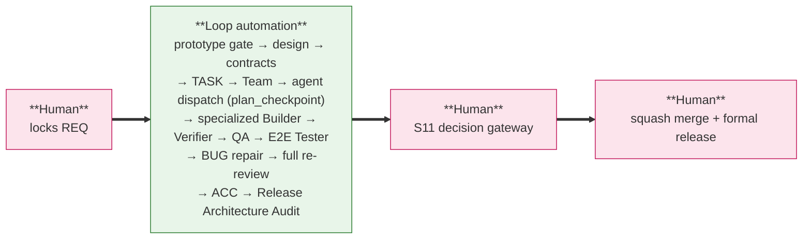
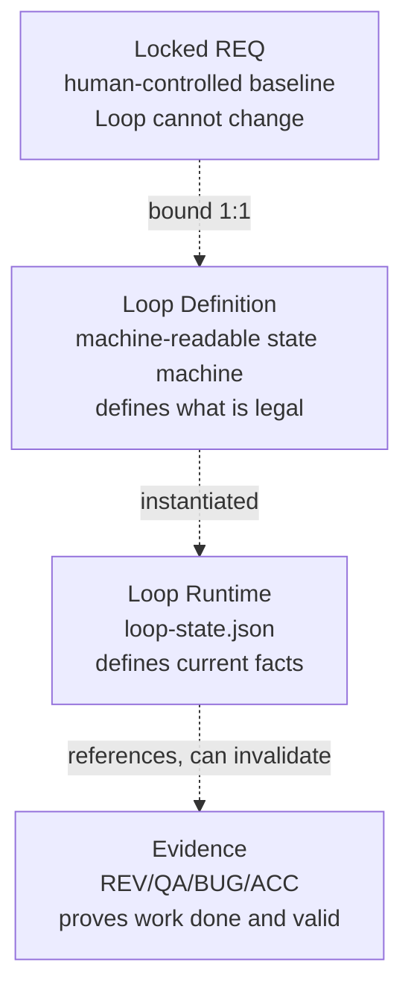
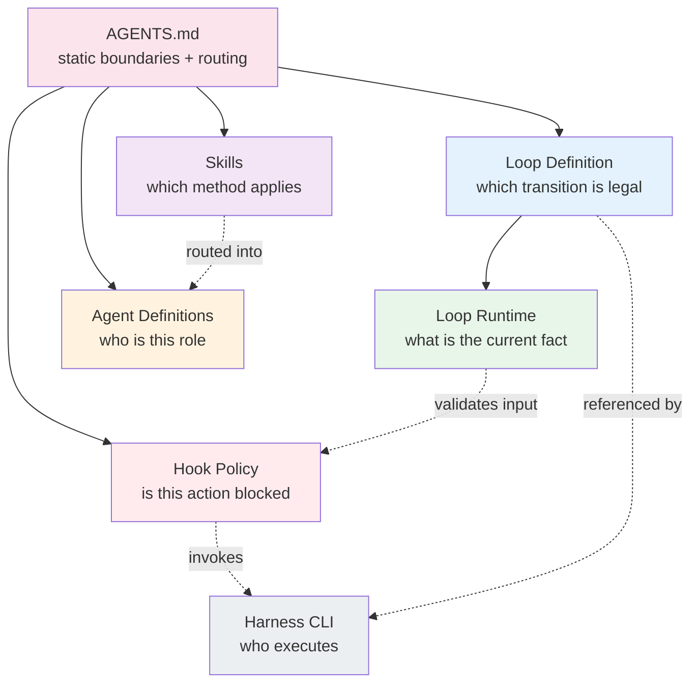
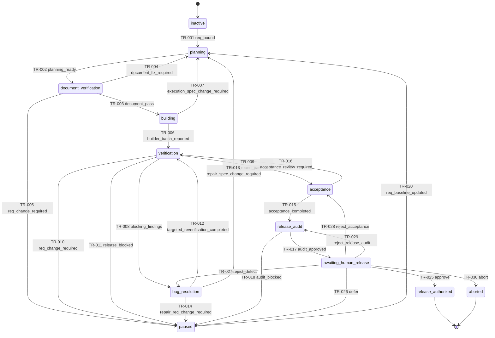
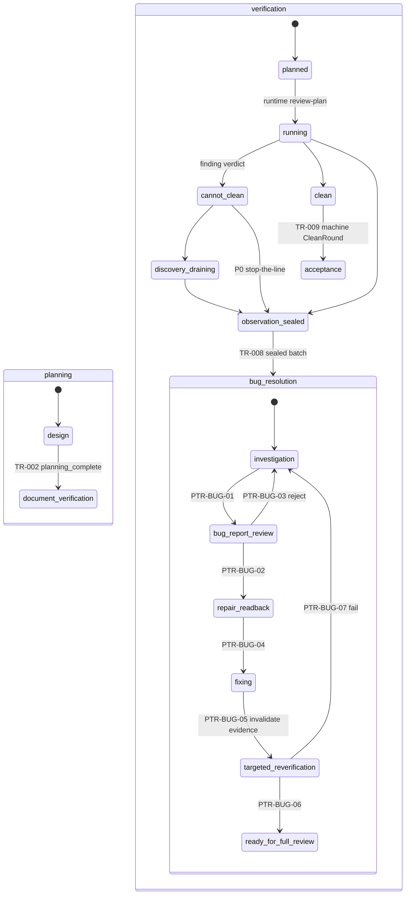
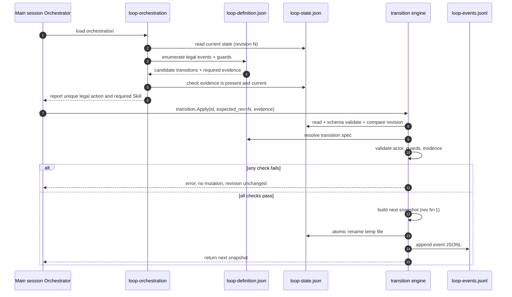

# Vibe Coding Loop Engineering Template

This repository is a reusable Claude Code documentation and Harness template.
Project-instance files are created in the target repository.

REQ-002 is a self-evolution: this Loop Engineering method is used to refactor
the documentation and Harness that the method itself runs on.

---

## 1. What Is A Loop

A **Loop** binds exactly one human-locked REQ and drives it, as a state machine,
from the locked requirement to the human release handoff. It slices the path
into a finite set of machine-checkable states. Every state admits only the
transitions the Loop Definition allows; every transition requires evidence;
every evidence can be invalidated. Human-only boundaries are blocked by Hook;
recoverable process gaps are surfaced as Hook warnings with recovery steps.

The goal of Loop Engineering is not to let the model work without constraint. It
is to let Claude Code, inside one human-locked requirement scope, continuously
complete development, verification, repair and re-review under a state machine,
document specifications, professional methods and automatic gates — and finally
**stop at the human release gate**. `awaiting_human_release` is a non-terminal
human decision gateway; an explicit approval reaches the `release_authorized`
terminal, while `aborted` is the separate terminal/blocked outcome.

A Loop never modifies the REQ, never squash-merges, and never formally releases.
This is the first principle of the design.

### Control model: humans hold both ends, the Loop automates the middle

The whole loop has one simple control shape:



Humans decide, and only humans decide:

- REQ lock and any REQ change
- squash merge to `master/main` and formal release

The Loop may never automatically create or lock a requirement baseline, change
REQ goal, scope, priority or acceptance criteria, or publish to `master/main`.

### Three-layer architecture (REQ-003)

The framework is built as three nested layers, with a support plane underneath:

```text
Layer 3  Event Control + Guard    docs/hook-policy.json + Claude Code Hooks + Runtime Milestone
Layer 2  Wake-up Recovery         .claude/loop.md (consumed by Claude /loop)
Layer 1  Main-session Driver      AGENTS.md + docs/agent-protocol.md
```

Layer 1 is the driver and runs the entire middle on its own. Layer 2 is a
scheduled fallback. Layer 3 is the active event control plane: lifecycle Hooks
reconcile the Runtime, reuse the `status/next` projection, persist the
Milestone, emit positive `LOOP RECOVERY` guidance, run delegation preflight,
and direct same-teammate/worktree recovery; guard decisions still enforce
deterministic boundaries. **Layer 2 is a fallback wake-up; Layer 3 is the
event-driven controller, and neither is a second lifecycle.**

### Engineering Loop binding is independent of Claude `/loop`

REQ-003 decouples the two lifetimes:

- **Engineering Loop binding** is a Harness operation:

  ```bash
  loop-harness req bind --approved-by <human identity>
  ```

  `--req` is optional: with exactly one bindable REQ (`req list` shows the
  pool) it is auto-discovered. It archives the inactive bootstrap runtime,
  creates the Runtime Bookmark (machine cursor `planning/design`) at revision
  `0` with an empty active journal, and records `event=req_bound` in the
  binding receipt together with the source runtime hashes. It does not start
  any schedule.

- **Claude `/loop`** is a Claude Code built-in scheduler that delivers the
  project's `.claude/loop.md` Wake-up Prompt on a cadence. It does not bind
  a REQ and does not authorize release. The independent REQ binding is
  sufficient for engineering execution, so no separate `/goal` is required.

The user may bind a REQ and never run `/loop`; the main session still drives
via Layer 1. The user may also run `/loop` against an inactive Runtime; it
surfaces `NO_BOUND_REQ` and stops.

The full automated middle segment is:

```text
human locks REQ
-> loop-harness req bind
-> UI Design Package Gate (if UI impact)
-> design and contracts
-> TASK decomposition
-> Agent Team creation
-> agent dispatch (plan_checkpoint)
-> specialized Builder development
-> Delivery Verifier + QA + E2E Tester
-> finding investigation and canonical BUG reports
-> BUG repair and targeted re-verification
-> complete re-review round (clean round)
-> ACC
-> Release Architecture Audit
-> stop at human release gate
```

After binding, normal S0→S11 continuation is Hook-driven. The Agent does not
need to call `loop-harness status`/`next` on every turn: the Hook packet and
Runtime Milestone carry the canonical cursor. Manual CLI is reserved for
initialization/binding, integrity reconcile, rollback/rollover, and the release
Gateway.

---

## 2. Four Core Abstractions

These four must not be confused. Each has one single source of truth, one owner,
and one mutability rule.

| Abstraction | Single source | What it answers | Mutability | Who can change it |
|:---|:---|:---|:---|:---|
| **Locked REQ** | `docs/requirements/REQ-xxx.md` | what is required | only via human change control | **human only** |
| **Loop Definition** | `docs/loop-definition.json` | which transition is legal in the current state | versioned design doc | design phase (human) |
| **Loop Runtime** | `.claude/loop-state.json` | current facts + resumable Milestone | CAS `revision + 1`; lifecycle transitions use the Transition Engine and Milestone refresh uses the Runtime Store | **single Runtime control plane** |
| **Evidence** | `docs/reports/**/*.{md,json}` | that something was done and is still valid | can be marked invalid by impact-analysis | the activated Agent that owns it |

Chat, `project.yaml`, project-map, TASK bodies and REQ Todo blocks are **not**
runtime authorities. They are human summaries.



---

## 3. Layered Authority Sources

The second principle is single source of truth plus progressive disclosure.
Each layer answers exactly one question and does not cross its boundary.

| Layer | File | Answers | Runtime authority |
|:---|:---|:---|:---|
| Static constitution | root `AGENTS.md` | project boundaries and where to route | entry router |
| State machine | `docs/loop-definition.json` | which transition is legal | **legality** |
| Current runtime | `.claude/loop-state.json` | what the current facts are | **current state** |
| Methodology + practices | `.claude/skills/` | which method applies to an event | advisory |
| Agent definitions | `.claude/agents/` | who a role is and its maximum capability | boundary |
| Hook policy | `docs/hook-policy.json` | whether an action is blocked | **enforcement** |
| Loop Controller / Milestone | Hook events + `milestone` field in `.claude/loop-state.json` | where the Agent is and what it should do next | **recovery guidance** |
| Harness CLI | `cmd/loop-harness` | who executes validation, transition, audit | **mechanism** |

A Skill is advisory, not authoritative. A Skill may instruct an Agent to request
a transition; it may not declare that the transition occurred. Only the
Orchestrator plus the runtime transition engine can do that.



---

## 4. Component Constitution

Where §3 maps each layer to its source of truth, this table fixes each
component's **reason for existence**. One component owns exactly one concern;
no concern is split across components, and no component absorbs another's
concern.

| Component | Owns | Does not own |
|:---|:---|:---|
| **Documents** (REQ, design, contracts, tasks, reports) | what to do | how to transition, who does it |
| **Loop Definition** | which path is allowed | current facts, methodology |
| **Loop Runtime** | where we are now | what is allowed, methodology |
| **Methodology + Best-practice Skills** | how to do it well | state authority, role identity |
| **Agent Definition** | who does it (identity, tools, permissions) | per-instance scope, methodology |
| **Task Prompt** | what to do this specific time | role doctrine, methodology |
| **Hooks** | trigger recovery guidance and enforce which boundaries cannot be crossed | full engineering methodology |
| **Human** | requirements and release decisions | mid-loop engineering |

Two consequences worth stating explicitly, because they explain the shape of
every other section:

- **Hooks carry scheduling guidance, not the full methodology.** A lifecycle
  Hook event triggers the Controller and emits the current stage, one Next
  action, the `agent-protocol.md` anchor, the Manual reference, and blockers.
  The detailed procedure still belongs in the stage protocol and Skill. This
  keeps Hook useful after compact without creating a second state machine.
- **Skills do not own role identity.** `builder`, `verifier`, `qa` are not
  Skills. A role is assembled from one Agent Definition plus the smallest
  applicable Skill set; it is not a Skill.

---

## 5. Loop State Machine

The Loop Definition defines 12 top-level states, 30 top-level transitions, and 5
global transitions. The main flow is a single one-way trunk; every side branch
is a correction loop that never bypasses the trunk.



Main trunk:

```text
inactive
-> planning
-> document_verification
-> building
-> verification
-> acceptance
-> release_audit
-> awaiting_human_release
-> release_authorized
```

Correction loops:

```text
document_verification -> planning.design
building              -> planning.design
bug_resolution        -> planning.design
verification          -> bug_resolution -> verification.planned
acceptance            -> verification.planned
```

Any state can pause (GTR-001). Runtime integrity failure always pauses
(GTR-005). Pause exits are: `human_resume_approved` (TR-019),
`req_baseline_updated` (TR-020, generation + 1 and invalidate all downstream
evidence), or `human_abort_approved` (TR-021).

---

## 6. Three Phase Machines

Three top-level states are complex enough to own a constrained sub-machine:
`planning`, `verification`, and `bug_resolution`. The top-level state answers
"which engineering stage must resume"; the phase answers "which guarded step is
active inside that stage"; Agent / TASK / BUG lifecycles independently answer
"what may this specific entity do now".



The UI Design Package Gate is sequenced by design, not by accident: the final
HTML prototype, user story, and user flow must be reviewed and locked **after
the REQ is locked and before the development contract is locked**, because
FE/BE/SYNC contracts link to the locked package. Skipping the gate when UI
impact is `changed` is forbidden by INV-004.

The verification machine is a ReviewPlan status projection (L3-S7): `planned`
waits for a registered ReviewPlan with an exactly-partitioned required Claim
set; `running` consumes static DV/QA Claims first, then behavior E2E; a finding
flips the round to `cannot_clean` but ordinary safe discovery continues
(`discovery_draining`); only a P0 finding seals the ObservationBatch
immediately. The exit transitions are machine-guarded: TR-008 consumes the
sealed batch (exact Finding set), TR-009 recomputes the CleanRound over the
exact Claim set.

Targeted re-verification never creates a clean round. It only permits returning
to `verification.planned`, where a complete review round — a fresh ReviewPlan
with every required Claim consumed — must run again.

---

## 7. Progressive Disclosure

The main session keeps only four items resident. Everything else loads on
demand, driven by the current event and state.

Resident context:

- `AGENTS.md`
- `loop-definition.json`
- `loop-state.json`
- the `loop-orchestration` Skill

On-demand Methodology Skills route by state and event:

| State / phase | Primary Methodology |
|:---|:---|
| `inactive`, startup, recovery, `paused` | `loop-orchestration` |
| `planning.*` | `specification-planning` |
| `document_verification` | `document-verification` |
| Agent `spawned` through `activated` | `agent-dispatch` |
| `building` after activation | none; TASK plus selected Best Practices |
| team creation, reuse, reconstruction | `team-planning` |
| `verification.planned` | `loop-orchestration` (ReviewPlan authoring) |
| `verification.running` / `cannot_clean` / `discovery_draining` | `team-planning` (Claim-bound reviewer dispatch; see `loop-harness s7 status`) |
| `bug_resolution.*` | `bug-resolution` |
| any committed change requiring evidence recalculation | `impact-analysis` |
| `verification.clean` / `verification.observation_sealed` | `acceptance-and-handoff` (TR-009) / `bug-resolution` (TR-008) |
| `acceptance`, `release_audit` | `acceptance-and-handoff` |

Routing order:

```text
current runtime state and phase
-> pending legal event
-> one primary Methodology Skill
-> Agent Definition kind
-> task artifact and risk tags
-> smallest applicable Best-practice set
-> agent dispatch when a subagent is involved
```

Forbidden Skill designs: a role-as-Skill (`builder`, `verifier`, `qa`); a Skill
that owns a second state machine; one Skill per tiny transition; one giant Skill
covering planning, building, review, BUG and release; Best Practices loaded
globally without applicability.

---

## 8. Call Chain: One Transition

The Orchestrator never declares a state transition directly. Every advance goes
through `transition.Apply`, which is the only writer of `loop-state.json`, and
only via compare-and-swap on `revision`.



Key invariants:

- The snapshot is committed before the journal append. The one recoverable
  window is closed by `runtime reconcile` at startup using `last_transition`.
- Any failed check produces no mutation; the state is unchanged and a rejected
  event is recorded.
- A stale writer reloads and recomputes; it never merges or overwrites runtime.

---

## 9. Agent Activation (three dispatch modes)

Dispatch defaults to `plan_checkpoint` continuous execution: the Worker sends
one structured PLAN_REPORT (`skills/agent-dispatch/SKILL.md` has the complete
file example) and continues immediately — the PostToolUse(SendMessage)
observer chains reading → activated → working automatically, and Main stays
silent when aligned (CORRECTION only on semantic drift). The two-round
read-back → approval → activation flow below is the `plan_approval_required`
exception for genuinely high-risk or irreversible work; `one_shot` covers
idempotent single actions. Once the main session delegates an assignment, the
Driver's next work is that Agent's plan checkpoint (or approval chain); it
must not complete the delegated responsibility itself unless the assignment is
revoked or reassigned.

```mermaid
sequenceDiagram
    autonumber
    participant Main as Main session
    participant Cli as loop-harness team launch
    participant Agent as subagent
    participant RT as loop-state.json
    participant Hook as PreToolUse Hook
    participant Out as report
    Main->>Cli: team launch --manifest
    Cli-->>Main: one readback_request envelope per assignment
    rect rgb(255, 243, 224)
        Note over Agent: plan_approval_required only: phase one read-only
        Main->>Agent: send readback_request with fingerprinted paths
        Agent->>Agent: read TASK -> CONTRACTS -> REQ -> DESIGN -> RULES
        Agent-->>Main: readback_response (ready / conflict / missing)
        Agent->>Hook: any Write attempt
        Hook->>RT: Agent state != activated
        Hook-->>Agent: warn + recovery instructions
    end
    Main->>Main: compare readback against current document versions
    alt ready and fingerprints match
        Main->>RT: agent-event understanding_approved (CAS rev+1)
        Main->>Agent: send activation envelope
        Main->>RT: agent-event activation_sent (CAS rev+1; runtime verifies approved_readback_sha256)
    else conflict or missing
        Main->>Agent: understanding_rejected -> back to reading
    end
    rect rgb(232, 245, 233)
        Note over Agent: Phase two: bounded write (in the assignment worktree)
        Main->>RT: agent-event work_started
        Agent->>Out: write assigned output
        Agent->>Hook: PreToolUse Write
        Hook->>RT: Agent=working AND path in scope AND fingerprint matches
        Hook-->>Agent: allow
        Agent-->>Main: completion_report
    end
    Main->>RT: runtime task-complete (one atomic Builder Result: envelope + Agent reported + TASK review + evidence)
    Main->>Hook: SubagentStop -> Inspect (scope/locked/merge-tree/required checks) -> non-squash merge -> verified checkpoint (or `runtime task-integrate` explicitly when the payload cannot identify the assignment)
    Main->>RT: the stage's own gate evaluates the batch (S6: TR-006 / TR-007)
```

The effective activation scope is the intersection of six conditions:

```text
Agent Definition maximum
AND team-manifest single responsibility
AND TASK allowed paths
AND activation envelope allowed paths
AND current runtime lifecycle
AND Hook policy
```

Anything outside the intersection is out of scope and must be corrected before
the assignment is considered valid. An activation is invalidated by a document
fingerprint change, a task or responsibility replacement, a baseline generation
change, an explicit revoke, a pause, or a scope-expansion request.

The Hook in this chain observes the boundary (may this Agent write this path
now?) and emits either a human-only block or a recoverable warning. On
lifecycle events it also re-seats the Agent at the current Milestone and points
to the exact protocol/manual anchors. It does not encode the complete
methodology that defines how the work should be done; that remains in the
stage protocol and Skill loaded by the Agent Definition.

---

## 10. Verification: Conformance, Quality, Runtime

Inside `verification`, three orthogonal questions are answered by separate
workgroups running from separate manifests. None substitutes for another, and a
clean round requires all three to PASS in the same review round.

| Team | Question | Examples of dimensions |
|:---|:---|:---|
| **Delivery Verifier** | does the implementation conform to the specification? | REQ coverage, contract implementation, TASK completion, module function, front-back-external integration, state and exception, regression |
| **QA** | does the engineering quality meet the bar? | code quality, architecture and reuse, hardcoding, unit tests, integration tests, security, performance, reliability |
| **E2E Tester** | does the product work in a real browser from the user's point of view? | user flows, Playwright specs, screenshots/traces, console errors, network failures, request/response mismatch |

The number of Agents per team is not fixed. The `team-planning` Skill computes
it from module boundaries, contract surface, risk tags, migration impact,
concurrency, security and BUG history, and emits a team manifest with single-
responsibility assignments.

A clean round requires all four conditions together:

```text
all required Delivery Verifier dimensions == PASS
AND all required QA dimensions == PASS
AND all required E2E Tester dimensions == PASS
AND all blocking BUGs are closed
AND no referenced evidence is invalidated
```

All of this must hold for one same review round. Targeted re-verification, no
matter how many dimensions it covers, can never satisfy the clean-round gate;
it only authorizes returning to `verification.planned` to run a complete round.

---

## 11. Document Graph

Top-down:

```text
locked REQ
-> design and UI design package
-> FE/BE/SYNC contracts
-> TASK
-> implementation
-> Delivery Verifier, QA, and E2E Browser evidence
-> BUG/fix/review rounds
-> ACC
-> release architecture audit
-> human release approval
```

Bottom-up, every TASK or BUG manifest must link back through every applicable
layer. Documents are tracked by `path + logical version + SHA-256 + baseline
generation`. A transition that consumes a document recomputes its hash and
rejects or pauses if it changed without a recorded change event.

Evidence validity:

| Status | Meaning |
|:---|:---|
| `valid` | usable by the current baseline and round |
| `invalid` | affected by a later change and unusable |
| `superseded` | replaced by newer valid evidence, retained for audit |

Invalid evidence is never made valid again; replacement evidence receives a new
ID. A clean round cannot reference invalidated evidence.

---

## 12. Loop Boundary

Engineering Loop binding (`loop-harness req bind`) starts only for one human-
locked REQ and is independent of Claude `/loop`. The Harness may automate
engineering and release preparation, but it cannot change the REQ or execute
squash merge, publication, deployment, or formal release.

Claude `/loop` only delivers the Wake-up Prompt at `.claude/loop.md`. It does
not bind a REQ or authorize release. The independent `req bind` operation is
sufficient for engineering execution, so no separate `/goal` is required.

### Starting a REQ after a terminal Runtime

`release_authorized` and `aborted` are terminal Loop states. `awaiting_human_release`
is a non-terminal human gateway and cannot be rolled over while its decision is
pending. None of these states is made reusable by editing
`.claude/loop-state.json`. When a human has completed the release decision and
wants to begin a new REQ, they first run:

```bash
.claude/bin/loop-harness runtime rollover \
  --approved-by <human identity> \
  --approval-evidence <human-decision-id> \
  --root .
```

The command requires the named valid `human_decision` evidence to have been
produced by the specified identity and scoped to
`runtime_rollover:<runtime_id>@<revision>` for the current terminal Runtime.
Create that evidence with `runtime evidence add --scope-ref
runtime_rollover:current`; the harness resolves the token to the revision
committed by the evidence write, so the subsequent rollover has an exact
authorization target.
It archives the eligible terminal state and its
journal under `.claude/runtime-archive/`, then creates a new empty inactive
Runtime and journal. A durable pending marker recovers an interrupted rollover
before any later runtime operation. Only this clean Runtime may be bound to the
next locked REQ. `init` is bootstrap-only and refuses to overwrite existing
runtime files; rerun it if its own bootstrap marker remains after interruption.

### Any finding means the REQ is not yet done

There is no "REQ complete with known minor issues" middle state. Either a clean
round passes, or any blocking Delivery Verifier, QA, or E2E Browser finding
forces S8 finding investigation through `bug_resolution` (TR-008). The finding
is reproduced, root cause is investigated, a canonical BUG is written and
accepted, a Builder reads the BUG plus the original specification chain, the fix
is dispatched (plan_checkpoint), the **original finding responsibility** re-verifies,
affected historical PASS evidence is invalidated, and a complete Delivery,
QA, and E2E Browser round runs again. Local re-verification alone never ends
the Loop.

Forbidden outcomes:

- `loop_modify_locked_req`
- `write_before_agent_activation`
- `write_outside_allowed_paths`
- `lock_unverified_execution_batch`
- `create_acc_without_clean_round`
- `run_release_audit_without_acc`
- `automated_squash_merge`
- `automated_formal_release`

### Mixed Hook modes

Human-only hard blocks:

- Loop modifying a locked REQ
- automated squash merge or formal release

Warn-and-self-correct (recoverable process completeness):

- unactivated Agent or out-of-scope write attempt
- acceptance or release preparation before a clean round
- closing a TASK without required critical evidence
- a Skill that should be loaded is missing
- document links or versions are stale
- Agent Team responsibilities are incomplete
- a BUG lacks root cause or reproduction evidence
- Verifier or QA lacks valid evidence
- impact analysis was not run after a repair
- an Agent exits without a report

---

## 13. Authority

| Concern | Source |
|:---|:---|
| static project boundaries | root `AGENTS.md` |
| project configuration | `project.yaml` |
| human project/stage summary | `project-map.md` |
| Loop states and guards | `loop-definition.json` |
| current Loop state | `.claude/loop-state.json` |
| methods and best practices | `.claude/skills/` |
| role definitions | `.claude/agents/` |
| permissions and Hook decisions | `hook-policy.json` |
| specifications and evidence | requirements, design, contracts, tasks, reports, release audits |

`project.yaml`, project-map, TASK files, and chat are not runtime authorities.

---

## 14. Directory Map

| Directory | Purpose |
|:---|:---|
| `requirements/` | requirement baselines |
| `design/` | architecture, UI, state, data, and Loop contracts |
| `contracts/` | FE/BE/SYNC execution contracts |
| `tasks/` | executable assignments |
| `reports/` | BUG, delivery, QA, and acceptance evidence |
| `release_audits/` | release architecture audits |
| `rules/` | stable project policies |
| `.claude/skills/` | Methodology and Best-practice Skills |
| `.claude/agents/` | Agent Definitions |
| `.claude/loop-state.json` | current Loop runtime authority |
| `.claude/loop-events.jsonl` | append-only audit journal |
| `cmd/loop-harness` | Go Harness CLI |
| `internal/` | Harness implementation packages |

Human onboarding is in root `prelude.md`. Machine-checkable authorities are
`docs/loop-definition.json`, `docs/hook-policy.json`, and the schemas embedded
in the Harness. Reusable methods and best practices live in the Skill catalog.

---

## 15. Bootstrap

1. Copy `AGENTS-template.md` to `AGENTS.md`.
2. Copy `project-map-template.md` to `project-map.md`.
3. Fill stable project configuration in `project.yaml`.
4. Build the Harness with `make build`.
5. Run `loop-harness doctor --root .`.
6. Register Hooks only after validation passes.

---

## 16. Verify

```bash
make verify          # test + test-race + doctor + validate + build
.claude/bin/loop-harness doctor --root .
.claude/bin/loop-harness validate --all --root .
```

### Runtime and transitions

The Orchestrator advances the Loop exclusively through the runtime transition
mechanism; `.claude/loop-state.json` is never edited by hand.

```bash
# Recover/replay the snapshot from the journal head at startup.
.claude/bin/loop-harness runtime reconcile --root .

# Human-authorized handoff after release_authorized or aborted.
# awaiting_human_release must receive an explicit S11 decision first.
# This archives the old Runtime; it is not a Loop transition.
.claude/bin/loop-harness runtime rollover --approved-by <identity> --approval-evidence <human-decision-id> --root .

# Record exactly one current S11 human decision; this is also the legacy
# awaiting_human_release migration entrypoint. No target state is accepted.
.claude/bin/loop-harness runtime human-decision \
  --disposition <approve|defer|reject_defect|reject_acceptance|reject_release_audit|abort> \
  --expected-revision N --actor <user|orchestrator> \
  --decision-evidence <human-decision-reference>
# reject_defect additionally requires --finding-evidence <finding-reference>.

# Apply one legal transition via compare-and-swap on revision.
.claude/bin/loop-harness runtime transition \
  --id TR-xxx --expected-revision N --actor orchestrator \
  --evidence <slot>=<reference>
```

For a transition with `required_evidence`, repeat `--evidence` once per slot.
The left side is the requirement slot from the Manual, while the right side
is the ID or repository-relative path of a currently valid registered
evidence artifact; a `*_record` slot is not itself an evidence kind to
register. For example, TR-006 can be recovered with:

```bash
.claude/bin/loop-harness runtime transition \
  --id TR-006 --expected-revision N --actor orchestrator \
  --evidence builder_report_record=<builder-report-id-or-path>
```

If a binding is missing, retry with the command shape shown in the error and
run `loop-harness explain TR-006` (replace the ID as needed) to see each slot's
accepted registered kinds and current candidate evidence. Do not register the
`*_record` slot name; use one of the accepted persisted kinds shown by the
Manual or explain command.

Other runtime verbs: `register-workgroup`, `agent-event`, `task-complete`
(canonical Builder Result registration — one command replaces the
`agent-event completion_reported` + `evidence add` dual write),
`task-integrate` (explicit worktree integration: Inspect → non-squash
merge → verified checkpoint, identical to the SubagentStop path),
`bug-event`, `evidence`, `transition`, `change`, and `human-decision`.
Run `loop-harness runtime` with no subcommand for the full list.
