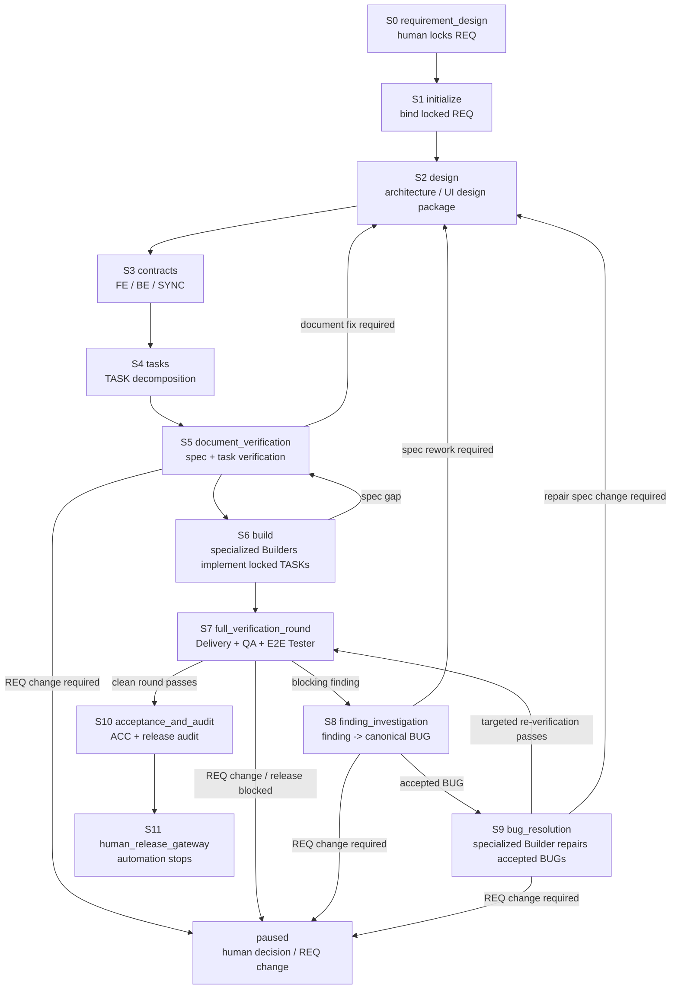

# Agent Protocol — Main Spine

> Authoritative Main Spine. The Main-session Driver (Layer 1) reads the
> current stage's section here on every turn. Each stage has a stable anchor
> (`#s0` through `#s11`) so `AGENTS.md` and Harness `next` output can link to
> it. Runtime authority for current facts lives in `.claude/loop-state.json`;
> legal transitions live in `docs/loop-definition.json`.

## How to read this file

1. A `SessionStart` or lifecycle Hook `systemMessage` is the first recovery
   packet. It contains the current Stage, the single Next action, the ordered
   read list, and stable links to this file and the Harness Manual. Treat it as
   a scheduling instruction, not as an audit notice.
2. Follow the packet's `Read in order` list: the project entry document
   (`AGENTS.md`), Runtime/Milestone, this current stage anchor, the bound REQ,
   and the one primary Skill. After compaction, do not reconstruct the stage
   from conversation memory.
3. If the packet says `blocked` or the Runtime is unclear, read
   `.claude/bin/loop-harness.md`. A Quality Gate that is merely `not_ready`
   returns safety `allow`; use its Recovery Packet to produce the listed
   missing work. Use the CLI only for initialization/binding, Runtime reconcile
   after an integrity failure, rollback/rollover, a human Gateway, or
   diagnostics (`loop-harness ready` for the live gate checklist); normal
   continuation uses the Hook packet and Milestone. Never use `ready` (or
   any CLI) to hand-push a Transition.
4. Each section has the same shape:
   - `purpose`: why this stage exists
   - `inputs`: what to read before acting
   - `inputs_from`: which upstream stages produce the inputs (explicit data-flow chain)
   - `actions`: ordered work to perform
   - `done_when`: predicates that prove the stage is complete
   - `next`: the default next stage on success
   - `failure_route`: where to go when something is wrong
   - `human_gateway`: conditions that may surface a Gateway
   - `primary_skill`: the main Methodology Skill for this stage

5. Stage advance is allowed only when every `done_when` predicate is true.
   When a predicate is false, produce the most-forward missing deliverable or
   evidence; the next `PreToolUse` invokes the Controller to re-evaluate and,
   if satisfied, auto-advance at most one allowlisted Transition. Do not wait
   for or manually invoke a transition.

## Event-driven recovery contract

The lifecycle is one continuous journey for one bound REQ. Hook events are
re-entry points into that journey:

| Event | Controller responsibility | Agent responsibility |
|:---|:---|:---|
| `SessionStart` | Reconcile Runtime, refresh `milestone`, emit the full current guidance and ordered read list | Read in the listed order and drive the single `Next` action; no normal CLI call |
| `PreCompact` | Persist the latest resumable checkpoint and emit the compact handoff | Leave the next session a recoverable Runtime; the next `SessionStart` re-seats it |
| `SubagentStart` | Ask single subagent vs Agent Team, predefined role template, worktree isolation, team name and activation readiness | Answer the preflight, use the approved template/team/worktree, then obey readback/activation |
| `SubagentStop` | Require a completion/blocker report and emit the worktree-to-develop integration checklist | Report, inspect/check/merge the worktree into the current development branch, record `completion_ack` |
| `TeammateIdle` | Re-announce the assignment and direct the same teammate to resume or report a blocker | Re-wake the same teammate; do not spawn a replacement; acknowledge its report before rescheduling |
| `PreToolUse` `Task|Agent` | Emit delegation preflight as positive scheduling guidance, then run the same control cycle | Use Agent Teams, predefined templates, and worktree isolation where appropriate; missing activation or team metadata does not itself block the tool |
| `PreToolUse` safety decision | Emit Quality Gate status, any committed Transition, the final safety decision, and a Recovery Packet | Produce listed missing work when `not_ready`; only a locked-artifact write or squash-merge attempt is hard-blocked |

A Hook is a natural-event trigger and does not itself mutate lifecycle state. It
invokes the Controller, which reads the authoritative Runtime, evaluates the
current Quality Gate, and, when that gate is satisfied, commits at most one
allowlisted Transition through `transition.Apply` using compare-and-swap. The
Controller then refreshes the Milestone and emits the final safety decision plus
a Recovery Packet. The Milestone is a projection of Runtime—not a second state
machine—and `docs/loop-definition.json` plus the Transition Engine remain the
legal lifecycle authority.

On the happy path, the Agent produces the missing deliverable or evidence and
lets the next `PreToolUse` control cycle discover it and auto-advance; the Agent
must not manually call `loop-harness` to advance stages. CLI use is reserved for
initialization/binding, reconcile, rollback/rollover, human Gateway actions, and
optional diagnostics (`ready`). A Quality Gate result of `not_ready` returns safety `allow`, so the original tool
proceeds, and its Recovery Packet lists the missing items. Only locked-artifact
writes and squash-merge attempts receive a hard safety `block`.

There is no separate PostCompact event in the shipped Hook registration.
Therefore `PreCompact` saves the checkpoint and the next `SessionStart`
performs recovery. This pair is the compact recovery protocol.

## Stage list

| ID | Stage | Primary skill | Anchor |
|:---|:---|:---|:---|
| S0 | requirement_design | — | `#s0` |
| S1 | initialize | `loop-orchestration` | `#s1` |
| S2 | design | `specification-planning` | `#s2` |
| S3 | contracts | `specification-planning` | `#s3` |
| S4 | tasks | `specification-planning` | `#s4` |
| S5 | document_verification | `document-verification` | `#s5` |
| S6 | build | (TASK plus selected Best Practices) | `#s6` |
| S7 | full_verification_round | `team-planning` then Best Practices | `#s7` |
| S8 | finding_investigation | `bug-resolution` | `#s8` |
| S9 | bug_resolution | `bug-resolution` | `#s9` |
| S10 | acceptance_and_audit | `acceptance-and-handoff` | `#s10` |
| S11 | human_release_gateway | `acceptance-and-handoff` | `#s11` |

## Stage Flow

The Main Spine is a one-way delivery trunk with explicit correction loops.
S6 and S9 both use specialized Builder capability (`frontend-builder`,
`backend-builder`, or `test-builder`), but they are different stages with
different inputs: S6 builds locked TASKs; S9 repairs accepted BUGs.



## Non-negotiable invariants

These hold across every stage:

1. Chat is not a baseline; decisions land in versioned documents.
2. Engineering Loop binding is independent of Claude `/loop`. Binding requires
   one human-locked REQ; `/loop` only delivers the Wake-up Prompt.
3. UI-impacting work requires module-organized prototypes (HTML + `stories.md`
   + `flows.md` under `docs/design/prototypes/<module>/`) before S3 contract
   lock (see S2). The current implementation IS the baseline; no separate
   capture is required.
4. Subagents are read-only until phase-one read-back is approved and phase
   two is activated.
5. Delegated work stays with the assigned subagent until read-back is
   approved and phase two is activated, or until the assignment is explicitly
   revoked/reassigned. The main session does not self-execute that
   responsibility while phase one is pending.
6. Blocking findings enter S8 finding investigation before S9 repair.
   Targeted re-verification never produces a clean round; only a same-round
   complete Delivery + QA + E2E Browser pass does.
7. On the normal path, the Agent produces the missing deliverable or evidence;
   the next `PreToolUse` invokes the Controller, which may commit at most one
   allowlisted Transition through the Harness transition engine. The Agent
   never edits `.claude/loop-state.json` or manually invokes transition CLI for
   ordinary stage advancement.
8. Squash merge, publication, deployment, and formal release always require
   human approval.

---

## S0 — requirement_design {#s0}

- **purpose**: produce one human-locked REQ baseline.
- **inputs**: user intent, project facts (`docs/project-map.md`), applicable rules.
- **inputs_from**: [] (human input + existing project baselines; this is the entry stage)
- **actions**:
  1. draft the REQ (value, scope, flows, acceptance criteria)
  2. record unknowns, dependencies, and out-of-scope items
  3. determine UI impact (`none` / `changed`)
  4. obtain human lock and a lock record (date, identity, version)
- **done_when**:
  - REQ file exists at `docs/requirements/REQ-<id>.md` with `status: locked`
  - lock record is present
  - SHA-256 of the locked file is computable
- **next**: S1
- **failure_route**: stay in S0 until locked; if locked but flawed, human amendment only.
- **human_gateway**: any REQ change after lock requires `req_amendment`.
- **primary_skill**: — (human-driven; the main session assists)

## S1 — initialize {#s1}

- **purpose**: bind one human-locked REQ to a fresh Runtime Bookmark.
- **inputs**: locked REQ, healthy Loop Definition / Hook Policy / Runtime schema, inactive Runtime with no other bound REQ.
- **inputs_from**: [S0 (human-locked REQ + lock record + SHA-256)]
- **actions**:
  1. run `loop-harness doctor --root .` and `loop-harness validate --all --root .`
  2. run `loop-harness req bind --req <path> --approved-by <human identity>`
  3. verify the Runtime shows Main Spine `S1`, machine `planning/design`, baseline generation 1, and the bound REQ fingerprint
- **done_when**:
  - Runtime `bound_req.path` matches the locked REQ file
  - SHA-256 in Runtime matches the file on disk
  - Main Spine cursor = S1
  - journal contains `req_bound`
- **next**: S2. After binding records the required Runtime facts, the next `PreToolUse` reflects the Controller-established `planning.design` cursor; no manual transition CLI is needed.
- **failure_route**: if doctor/validate fail, fix Loop Definition / Hook Policy / schema first; if a REQ is already bound, surface `req_amendment` or abort.
- **human_gateway**: binding cannot proceed without a human-locked REQ and a human identity approver.
- **primary_skill**: `loop-orchestration`

## S2 — design {#s2}

- **purpose**: produce the architecture decisions and, when UI impact is `changed`, the module prototype set (HTML + `stories.md` + `flows.md`).
- **inputs**: locked REQ, existing architecture, existing module prototypes (if any), applicable design rules.
- **inputs_from**: [S0 (locked REQ), S1 (Runtime Bookmark + baseline generation 1)]
- **actions**:
  1. draft or update `docs/design/architecture/ARCHITECTURE-<id>.md`
  2. if UI impact = `changed`: update the affected module's `stories.md`, `flows.md`, and page HTML files at `docs/design/prototypes/<module>/` to reflect the REQ target. The current implementation IS the baseline; no separate capture is required.
  3. record decisions that the contracts will need (state, data, integration, migration)
- **done_when**:
  - architecture document covers every decision the contract stage needs
  - if UI impact = `changed`: the module prototype set (`index.html` + `stories.md` + `flows.md` + page HTML files) exists at `docs/design/prototypes/<module>/` with the 4-field header on every HTML file, `stories.md` carries ≥1 `S-NNN` entry citing its `REQ-id`, and `flows.md` carries ≥1 `F-NNN` entry citing its `REQ-id` (per `docs/rules/ui-prototype.md` §5/§6/§7)
- **next**: S3. Produce any missing architecture/prototype deliverable and qualified design evidence; the next `PreToolUse` lets the Controller evaluate the gate and auto-commit `PTR-PLAN-01` when satisfied.
- **failure_route**: if a design decision changes REQ semantics, surface `req_amendment`; otherwise iterate the design document.
- **human_gateway**: only `req_amendment` or `unrecoverable_business_decision`.
- **primary_skill**: `specification-planning`

## S3 — contracts {#s3}

- **purpose**: write the FE / BE / SYNC development contracts that bound Builder work.
- **inputs**: locked REQ, architecture, module prototypes (if applicable), naming and API rules.
- **inputs_from**: [S0 (locked REQ), S2 (architecture + module prototype set)]
- **actions**:
  1. draft `docs/contracts/CONTRACTS-<id>.md` (index)
  2. draft `BE-<id>.md`, `FE-<id>.md` (if UI), `SYNC-<id>.md`
  3. ensure contracts jointly cover every REQ acceptance criterion
  4. add bottom-up references and a coverage matrix
- **done_when**:
  - the contract set covers the entire REQ
  - every contract has stability metadata (status, version, owner)
  - UI-impacting contracts reference the module prototype set by directory path + fingerprint of the current contents
- **next**: S4. Produce any missing contract deliverable or qualified contract evidence; the next `PreToolUse` lets the Controller evaluate the gate and auto-commit `PTR-PLAN-02` when satisfied.
- **failure_route**: if a contract reveals a REQ gap, return to S2 (architecture) or surface `req_amendment`; if a UI contract is drafted before the module prototype set exists, produce the prototype set first — Quality Gate stays `not_ready` until prototype evidence exists (prototype is not a Hook deny/warn).
- **human_gateway**: only `req_amendment`.
- **primary_skill**: `specification-planning`

## S4 — tasks {#s4}

- **purpose**: split the contract set into single-responsibility TASKs with bidirectional links.
- **inputs**: contracts, REQ, applicable rules.
- **inputs_from**: [S3 (FE/BE/SYNC contracts), S0 (REQ acceptance criteria)]
- **actions**:
  1. derive one TASK per single-responsibility work package
  2. give each TASK: read order, prospective write paths, closing contract, dependencies
  3. verify the dependency DAG is acyclic and that every contract clause traces to at least one TASK
- **done_when**:
  - every contract clause has TASK coverage
  - every TASK has a verifiable Closing Contract
  - write-path overlaps have explicit sequential ownership
- **next**: S5. Produce any missing TASK/DAG deliverable or qualified task evidence; the next `PreToolUse` lets the Controller evaluate the gate and auto-commit `TR-002` when satisfied.
- **failure_route**: if a TASK reveals a contract gap, return to S3.
- **human_gateway**: none for ordinary work.
- **primary_skill**: `specification-planning`

## S5 — document_verification {#s5}

- **purpose**: independent Document Verifier pass over the entire spec chain before any Builder activation.
- **inputs**: locked REQ, architecture, contracts, candidate TASK batch.
- **inputs_from**: [S2 (architecture + optional final UI design package), S3 (FE/BE/SYNC contracts), S4 (candidate TASK batch + DAG), S0 (locked REQ baseline)]
- **actions** (sub-phases, see table below for full mapping):
  1. **S5.1 workgroup_setup** — spawn Document Verifier Team with `DV-SPEC-CONSISTENCY` + `DV-TASK-EXECUTABILITY` responsibilities (+ risk-triggered ones)
  2. **S5.2 spec_consistency_review** — `DV-SPEC-CONSISTENCY` responsibility: phase-one read-only + phase-two activated review of REQ↔design↔contracts consistency
  3. **S5.3 task_executability_review** — `DV-TASK-EXECUTABILITY` responsibility: phase-one read-only + phase-two activated review of TASK coverage, links, scope, Closing Contracts
  4. **S5.4 rework_loop** — if any finding: main session repairs S2/S3/S4 artifacts, rerun only the affected responsibility with fresh fingerprints
  5. **S5.5 atomic_lock** — on PASS, atomically lock contracts + TASKs at their exact fingerprints
- **sub-phases** (workflow-level):

  | Sub-phase | Role | Parallel? | Done when |
  |:---|:---|:---|:---|
  | S5.1 workgroup_setup | main session (via `team-planning`) | sequential entry | Document Verifier Team validated; two assignments ready for activation |
  | S5.2 spec_consistency_review | Document Verifier (DV-SPEC-CONSISTENCY) | **parallel with S5.3** | REQ/design/contracts/UI consistency: every acceptance criterion mappable to a contract clause; cross-document references resolve at matching fingerprints |
  | S5.3 task_executability_review | Document Verifier (DV-TASK-EXECUTABILITY) | **parallel with S5.2** | Every contract clause covered by ≥1 TASK; every TASK has verifiable Closing Contract; DAG acyclic; write-path overlaps have explicit sequential ownership |
  | S5.4 rework_loop | main session (repairs) + affected DV responsibility (rerun) | triggered by finding | All findings addressed; affected responsibilities re-run with fresh fingerprints; no open finding remains |
  | S5.5 atomic_lock | Controller via Transition Engine | sequential exit | Both independent current PASS records and exact fingerprints are available; the next `PreToolUse` auto-commits `TR-003`, whose actions atomically lock the contract + TASK batch; machine checks (`loop-harness validate --all`, `loop-harness doctor`) pass |

  Sub-phase invariants:

  - S5.2 and S5.3 run **in parallel** (two independent responsibilities); S5.4 may be entered as soon as either returns a finding.
  - S5.4 does **not** re-open settled design decisions — it applies corrections only to the flagged contract/TASK/design clause and re-runs the affected responsibility (compare S9 rework discipline).
  - S5.5 is the only legal point at which contracts and TASKs transition from `*-draft` to `locked`; this is the spec chain's baseline-generation boundary for S6 onward.

- **done_when**:
  - both mandatory responsibilities (S5.2 + S5.3) PASS
  - no open finding
  - machine checks pass (`loop-harness validate --all`, `loop-harness doctor`)
  - execution batch is atomically locked (S5.5 complete)
- **next**: S6. Produce any missing independent review or machine-check evidence; the next `PreToolUse` lets the Controller evaluate the document gate and auto-commit `TR-003` when satisfied, including its atomic-lock actions.
- **failure_route**: if a finding reveals a REQ-level ambiguity, surface `req_amendment`; otherwise rework S2/S3/S4 and rerun the affected responsibility (S5.4 loop).
- **human_gateway**: only `req_amendment`.
- **primary_skill**: `document-verification`

## S6 — build {#s6}

- **purpose**: implement, unit-test, integrate, and report.
- **inputs**: locked spec chain, agent definitions, applicable Best Practices.
- **inputs_from**: [S5 (atomically locked spec chain: REQ + architecture + contracts + TASKs at exact fingerprints), S0 (locked REQ unchanged)]
- **actions**:
  1. plan a Builder workgroup from mandatory plus risk-triggered single responsibilities (via `team-planning`); select `frontend-builder`, `backend-builder`, or `test-builder` by activated write ownership
  2. two-phase activate each assignment
  3. each specialized Builder implements its activated scope, runs owned tests, and reports actual results
  4. collect specialized Builder completion reports and evidence
- **done_when**:
  - every locked TASK has a specialized Builder completion report
  - every Closing Contract assertion has a command or fixture mapping
  - unit and integration tests pass for the implementation
- **next**: S7. Produce any missing Builder completion report, Closing Contract mapping, test evidence, or team manifest; the next `PreToolUse` lets the Controller evaluate the build gate and auto-commit `TR-006` when satisfied.
- **failure_route**: if a Builder reveals a spec gap, return to S5 (and from there to S2/S3/S4); if a Builder cannot complete its locked TASK because of an implementation blocker, record the blocker inside S6 until the TASK can be completed or a spec gap is proven. Defects discovered after Builder report enter S8 finding investigation before any S9 repair.
- **human_gateway**: only `missing_external_permission` after all other work is done.
- **primary_skill**: `team-planning` (Team setup). Once assignments are activated, each specialized Builder follows the TASK body plus risk-triggered Best Practices.

## S7 — full_verification_round {#s7}

- **purpose**: run a full same-round discovery pass over correctness, engineering quality, and real browser behavior.
- **inputs**: implementation, REQ, contracts, TASKs, Builder evidence, project rules, risk tags, runnable app/test environment.
- **inputs_from**: [S6 (implementation + Builder completion reports + unit/integration test evidence), S5 (locked spec chain for conformance check), S0 (REQ acceptance criteria)]
- **actions**:
  1. plan a Delivery Verifier Team (REQ gap, spec/TASK gap, module completeness, integration, regression as triggered)
  2. plan a QA Team (module code quality, reuse/abstraction/hardcoding, unit and integration test quality, plus risk-triggered architecture / security / performance / reliability / migration)
  3. plan an E2E Tester workgroup (`E2E-USER-FLOW`, `E2E-CONSOLE-NETWORK`, plus project-triggered browser checks); every assignment uses `e2e-tester` and must include `e2e-browser-testing` plus `playwright-e2e`; `E2E-USER-FLOW` assignments must enumerate the locked `USER-FLOW-*` files and `PATH-*` IDs they will execute
  4. two-phase activate each responsibility; the Delivery + QA + E2E responsibilities then run **in their declared order** (`verification.delivery` → `verification.qa` → `verification.e2e_browser`, per `PTR-VERIFY-01` → `PTR-VERIFY-02` → `PTR-VERIFY-03`) — each responsibility's clean round is a guard for the next, so the workgroup never overlaps same-round evidence
  5. once E2E Tester begins, it executes the user flows as written: start from the declared entry point, click through the declared controls in order, avoid direct URL jumps unless the flow declares that entry, and record visible assertions after each step
  6. reviewers produce PASS / FAIL / BLOCKED findings with fingerprints, commands, screenshots/traces where applicable, console/network observations, and validity
  7. if no blocking finding exists, run `clean-round-evaluation` for the same round
- **done_when**:
  - every mandatory Delivery Verifier responsibility has a same-round PASS
  - every triggered QA responsibility has PASS or valid N/A
  - every mandatory E2E Tester responsibility has PASS or valid N/A backed by real-browser evidence
  - every locked required `PATH-*` in `USER-FLOW-*` files referenced by UI-impacting contracts is either executed with step-level evidence or explicitly marked N/A with a valid reason
  - E2E evidence includes the executed flow file fingerprint, entry point, step-by-step observed result, screenshots/traces for material states, and console/network observations
  - all referenced evidence is current and valid
  - if the round is clean, one same-round complete Delivery + QA + E2E clean round is recorded
- **next**: S10 if clean round passes; S8 if blocking findings exist. Produce the missing current-round evidence or finding record; each next `PreToolUse` lets the Controller auto-commit at most one declared verification phase/top-level Transition, so multiple satisfied phase gates advance across multiple natural events rather than a manual CLI sequence.
- **failure_route**: any blocking finding → S8 finding investigation; incomplete/stale evidence restarts S7.
- **human_gateway**: none for ordinary work.
- **primary_skill**: `team-planning` (Team setup), then Best Practices per responsibility, then `clean-round-evaluation` for the round-level decision.

## S8 — finding_investigation {#s8}

- **purpose**: convert S7's observed findings into evidence-backed canonical BUG reports suitable for a repair Builder.
- **inputs**: S7 finding evidence, reproduction artifacts, browser traces/logs where applicable, affected spec chain, implementation.
- **inputs_from**: [S7 (blocking finding evidence), S5 (locked spec chain), S6 (current implementation)]
- **actions**:
  1. reproduce each finding or confirm deterministic evidence
  2. investigate root cause from evidence, not from guesses or only from the diff
  3. classify each finding as implementation defect, test defect, spec conflict, environment/dependency issue, duplicate, or REQ change; record one explicit disposition rather than treating all "no code change" outcomes alike
  4. group findings only when they share the same user-visible contradiction, same root cause, and compatible Closing Contract
  5. write canonical BUG reports with source finding IDs, root cause, affected clauses, repair scope, forbidden scope, before-fix evidence, and retest contract
  6. accept, finally reject, duplicate-link, or route each BUG to REQ/spec rework, using the routing rules below
- **disposition routing**:

  | S8 result | Required disposition | Next route |
  |:---|:---|:---|
  | BUG report lacks root-cause or Closing Contract evidence | reject the report, not the finding | PTR-BUG-03 back to `investigation` |
  | confirmed implementation defect | accepted canonical BUG | PTR-BUG-02 to S9 repair |
  | false positive, test-only issue, or transient environment condition; no product or specification change is needed | final rejection with no-product-change rationale | TR-022 only if the whole batch has no accepted BUG |
  | duplicate of a canonical BUG still open for repair | duplicate link to that BUG | follow the canonical BUG through S9 and TR-012; do not use TR-022 |
  | duplicate of a canonical BUG already closed, or with no remaining repair | duplicate link | TR-022 only if the whole batch has no accepted BUG |
  | design, prototype, contract, task, or other specification correction | `spec_rework_required` | TR-023 to `planning.design` |
  | locked REQ must change | `req_change_required` | TR-024 to `paused` |
- **done_when**:
  - every blocking S7 finding maps to an accepted canonical BUG, a final rejected-no-product-change disposition, a duplicate link, spec rework, or human REQ-change Gateway
  - every accepted BUG has evidence-supported root cause and a Builder-ready Closing Contract
- **next**: S9 for accepted BUG repair (via PTR-BUG-02); S7 via TR-022 only if the completed batch has no accepted BUG and every finding is final-rejected without product/specification change or duplicate-linked to a canonical BUG with no remaining repair; S2 if spec rework is required (via TR-023 `finding_spec_change_required` → `planning.design`); PAUSE if a finding requires REQ change (via TR-024 `finding_req_change_required`). Produce the missing root-cause, BUG disposition, or requested-event evidence; the next `PreToolUse` lets the Controller select and auto-commit at most one allowlisted route.
- **failure_route**: unsupported root cause stays in S8 investigation; REQ-level ambiguity surfaces `req_amendment`.
- **human_gateway**: only `req_amendment`.
- **primary_skill**: `bug-resolution`

## S9 — bug_resolution {#s9}

- **purpose**: repair accepted canonical BUGs, target-re-verify root-cause elimination, then return for a fresh complete round.
- **inputs**: accepted canonical BUG reports, original spec chain, implementation.
- **inputs_from**: [S8 (accepted canonical BUG reports), S5 (locked spec chain), S6 (current implementation)]
- **control shape**:

  ```mermaid
  flowchart TD
      FINDING["S7 blocking finding<br/>observed by Delivery / QA / E2E"]
      INVESTIGATE["S8 investigation<br/>reproduce + root cause"]
      BUG["accepted canonical BUG<br/>repair scope + Closing Contract"]
      READBACK["S9.1 Builder read-back<br/>BUG + original spec chain"]
      FIX["S9.2 Builder fixes<br/>BUG-scoped activation"]
      INVALIDATE["S9.3 invalidate affected PASS evidence"]
      TARGET["S9.4 original responsibility<br/>targeted re-verification"]
      HANDOFF["S9.5 ready_for_full_review<br/>persisted handoff checkpoint"]
      REVIEW["S7 new full review round<br/>Delivery + QA + E2E"]

      FINDING --> INVESTIGATE --> BUG --> READBACK --> FIX --> INVALIDATE --> TARGET --> HANDOFF --> REVIEW
  ```

- **actions** (sub-phases, see table below for full mapping):
  1. **S8.1 investigation** — assign single-responsibility root-cause investigation
  2. **S8.2 bug_report_review** — write the canonical BUG report; main session approves it
  3. **S9.1 repair_readback** — create or reuse a Builder; phase-one read-back of BUG + spec chain
  4. **S9.2 fixing** — phase-two activate; Builder implements fix; run scoped tests
  5. **S9.3 invalidate_evidence** — mark affected historical PASS evidence invalid
  6. **S9.4 targeted_reverification** — original finding responsibility re-verifies only that BUG
  7. **S9.5 ready_for_full_review** — persist the completed S9 handoff; no Agent performs new work here
- **sub-phases** (machine `bug_resolution.*` phases):

  | Sub-phase | Role | Entry PTR | Exit PTR | Done when |
  |:---|:---|:---|:---|:---|
  | S8.1 investigation | Investigator (single-responsibility subagent or main session) | enter bug_resolution | PTR-BUG-01 | root cause + scope + reproduction identified |
  | S8.2 bug_report_review | main session | PTR-BUG-01 | PTR-BUG-02 (approve) / PTR-BUG-03 (reject) | BUG report sufficient to direct repair |
  | S9.1 repair_readback | Builder phase one (read-only) | PTR-BUG-02 | PTR-BUG-04 | read-back approved; scope and plan confirmed |
  | S9.2 fixing | Builder phase two (bounded write) | PTR-BUG-04 | PTR-BUG-05 | fix landed; scoped unit/integration tests pass; completion_report written |
  | S9.3 invalidate_evidence | main session | PTR-BUG-05 | before targeted re-verification starts | affected historical PASS evidence marked invalid; replacement evidence has fresh IDs |
  | S9.4 targeted_reverification | original finding responsibility | PTR-BUG-05 | PTR-BUG-06 (pass) / PTR-BUG-07 (fail) | only that BUG's dimensions PASS |
  | S9.5 ready_for_full_review | Runtime handoff checkpoint | PTR-BUG-06 | TR-012 | targeted PASS is durably recorded; only a new complete S7 may follow |

  Sub-phase invariants:

  - Findings are not repair work. S8 must produce an accepted BUG with root cause and Closing Contract before any Builder repair starts.
  - The Builder activated in S9.1/S9.2 has a **BUG-scoped activation envelope**, not the original S6 Builder scope. Write paths, tools, and command classes are bounded by what the BUG fix requires.
  - S9.4 **never produces a clean round**. Targeted re-verification only proves this BUG is fixed. The S9 → S7 advance requires a fresh complete Delivery + QA + E2E round.
  - S9.3 must complete before targeted re-verification and before the S9 → S7 transition commits; otherwise the new S7 round would reference PASS evidence that the fix invalidated.
  - `ready_for_full_review` is terminal only for the nested `bug_resolution` phase machine. It is not a terminal Loop state and performs no repair work; it is the persisted, recoverable handoff that makes TR-012 the only legal S9 exit.

- **done_when**:
  - accepted BUG report exists with root cause, scope, and reproduction from S8
  - affected evidence is marked invalid; replacement evidence has fresh IDs (S9.3)
  - repair is implemented and the targeted re-verification passes (S9.1, S9.2, S9.4)
  - Runtime reaches `bug_resolution.ready_for_full_review` before TR-012 starts the new S7 round
- **next**: S7 (a brand-new complete Delivery + QA + E2E round). Produce the missing activation, repair, invalidation, or targeted re-verification evidence; each next `PreToolUse` lets the Controller auto-commit at most one declared BUG phase Transition, culminating in `TR-012` after the durable `ready_for_full_review` checkpoint.
- **failure_route**: if targeted re-verification fails, return to S8 investigation for the same BUG (PTR-BUG-07 `targeted_reverification_fail → investigation`) or a new BUG if root cause differs; if repair cannot be safely completed, pause only after every autonomous recovery path is exhausted.
- **human_gateway**: only `req_amendment`.
- **primary_skill**: `bug-resolution`

## S10 — acceptance_and_audit {#s10}

- **purpose**: assemble acceptance materials and run release architecture audit.
- **inputs**: clean round, locked REQ, all valid evidence.
- **inputs_from**: [S7 (clean round record by ID + hash), S0 (locked REQ), S5 (locked spec chain), S6+S7+S8+S9 (all valid evidence)]
- **actions**:
  1. write the ACC document (REQ coverage, evidence map, migration, rollback)
  2. run the release architecture audit (changes, risks, protected-command impact)
  3. assemble the release-ready package
- **done_when**:
  - ACC document exists and is consistent with the Runtime
  - release audit complete with no open action
  - package is release-ready
- **next**: S11. Produce the missing current ACC or release-audit evidence; the next `PreToolUse` lets the Controller auto-commit at most one allowlisted Transition (`TR-015`, then on a later event `TR-017`) when its gate is satisfied.
- **failure_route**: if a defect is found, return to S8 finding investigation; only accepted canonical BUGs proceed to S9 repair. If the issue is an incomplete build report rather than a defect, return to S6. If it is a REQ gap, surface `req_amendment`.
- **human_gateway**: only `req_amendment`.
- **primary_skill**: `acceptance-and-handoff`

## S11 — human_release_gateway {#s11}

- **purpose**: hand off the release-ready package to the human; automation stops.
- **inputs**: release-ready package, ACC, release audit.
- **inputs_from**: [S10 (release-ready package + ACC + release audit evidence)]
- **actions**:
  1. submit the Gateway package (type, completed work, single unresolved fact, impact, recommendation, resume stage)
  2. stop all autonomous advancement
- **done_when**:
  - Gateway package exists
  - Runtime is at `awaiting_human_release`
- **next**: terminal for automation. The Controller performs no automatic lifecycle advance from S11. The human decides publication, deployment, and formal release; squash merge remains prohibited. To begin a later REQ after this terminal Runtime, record valid `human_decision` evidence produced by that identity using `--scope-ref runtime_rollover:current`, then run `loop-harness runtime rollover --approved-by <identity> --approval-evidence <human-decision-id> --root .`. The scope token resolves to `runtime_rollover:<runtime_id>@<revision>` for the evidence commit. The command archives this Runtime and seeds a new inactive one. It is not a state-machine transition.
- **failure_route**: if the human rejects, return to the stage the Gateway recommends (often S10 or S9).
- **human_gateway**: this stage **is** a `release_ready` Gateway.
- **primary_skill**: `acceptance-and-handoff`

---

## Cursor mapping (Main Spine ↔ machine lifecycle/phase)

Main Spine stage is the human/agent-readable projection of the authoritative
machine lifecycle/phase cursor. The mapping is fixed by
`docs/loop-definition.json`; the Milestone, Hook Guidance, and CLI projections
must agree with the same committed Runtime revision and cannot advance
independently. Artifact inspection is only a legacy reconcile aid, not the
normal S2/S3/S4 cursor authority.

| Main Spine | Machine `lifecycle` / `phase` |
|:---|:---|
| S0 requirement_design | `inactive` (Runtime not yet bound) |
| S1 initialize | `inactive` binding operation; successful `TR-001` enters `planning.design` / S2 |
| S2 design | `planning.design` |
| S3 contracts | `planning.contracts` |
| S4 tasks | `planning.tasks` |
| S5 document_verification | `document_verification` |
| S6 build | `building` |
| S7 full_verification_round | `verification.delivery` / `verification.qa` / `verification.e2e_browser` / `verification.clean_round_evaluation` / `verification.clean_round_passed` |
| S8 finding_investigation | `bug_resolution.investigation` / `bug_resolution.bug_report_review` |
| S9 bug_resolution | `bug_resolution.repair_readback` / `bug_resolution.fixing` / `bug_resolution.targeted_reverification` / `bug_resolution.ready_for_full_review` (S9→S7 handoff checkpoint) |
| S10 acceptance_and_audit | `acceptance` / `release_audit` |
| S11 human_release_gateway | `awaiting_human_release` |

Illegal combinations return `INVALID_CURSOR_MAPPING`. Independent mutation
of any one cursor field is rejected without snapshot or journal side effect.

## Runtime projection (status / next)

The main session does not infer state from memory or normally query it with the
CLI. It receives the same Runtime projection in the Hook Recovery Packet and
Milestone. The following CLI examples show the equivalent diagnostic projection
for reconcile or human/operator use.

### `loop-harness status --root .`

```json
{
  "runtime_id": "...",
  "revision": 1,
  "bound_req": {"id": "REQ-001", "path": "...", "version": "v1.0.0", "sha256": "..."},
  "stage": "S2",
  "lifecycle": "planning",
  "phase": "design",
  "objective": "complete architecture and optional UI design package",
  "completed": [],
  "open_items": [],
  "active_work": [],
  "human_gateway": null
}
```

### `loop-harness next --root .`

```json
{
  "stage": "S2",
  "protocol_ref": "docs/agent-protocol.md#s2",
  "objective": "complete architecture decisions",
  "action": "draft and review the architecture document",
  "read": ["REQ-001", "applicable architecture sources"],
  "primary_skill": "specification-planning",
  "missing": ["architecture_record"],
  "done_when": ["architecture_record is valid"],
  "then": "recompute",
  "human_required": false
}
```

The `missing[]` field is the contract between the Harness and the Driver:
when `missing` is non-empty, the next action is "produce the first item in
`missing`", not "wait for a transition". The `primary_skill` field is the
only method-naming field; legacy `method` is rejected, and unknown Skill IDs
are rejected.

## How stage advance actually happens

- A natural Hook event, normally `PreToolUse`, invokes the Controller; the Hook
  itself does not mutate Runtime.
- The Controller reads the Runtime revision, evaluates the current gate, and,
  when satisfied, calls `transition.Apply` with compare-and-swap to commit at
  most one allowlisted Transition.
- After evaluation or commit, the Controller refreshes the Milestone projection
  and emits the final safety decision plus Recovery Packet.
- The Agent never declares a state change or edits `.claude/loop-state.json`.
  It produces the listed missing deliverable/evidence, and the next `PreToolUse`
  discovers it; ordinary stage advancement requires no manual transition CLI.
- `not_ready` leaves lifecycle unchanged and returns safety `allow` with missing
  items. Only a locked-artifact write or squash-merge attempt is hard-blocked.
- CAS rejection or an unknown gate never guesses success; the Controller emits
  recovery/reconcile guidance and waits for a later natural event.
