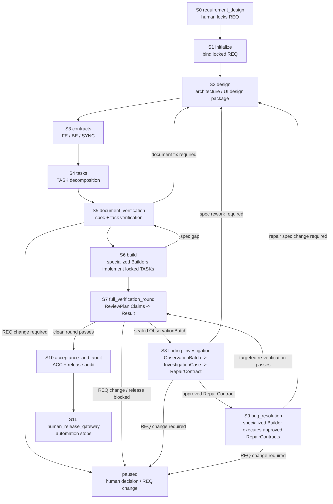

# Agent Protocol — Main Spine

> Authoritative Main Spine. The Main-session Driver (Layer 1) reads the
> current stage's section here on every turn. Each stage has a stable anchor
> (`#s0` through `#s11`) so `AGENTS.md` and Harness `next` output can link to
> it. Runtime authority for current facts lives in `.claude/loop-state.json`;
> legal transitions live in `docs/loop-definition.json`.

## How to read this file

1. A `SessionStart` or lifecycle Hook `systemMessage` is the first recovery
   packet. It contains the current Stage, the single Next action, the ordered
   read list, and stable links to this file and the Harness Manual. Treat it as
   a scheduling instruction, not as an audit notice.
2. Follow the packet's `Read in order` list: the project entry document
   (`AGENTS.md`), Runtime/Milestone, this current stage anchor, the bound REQ,
   and the one primary Skill. After compaction, do not reconstruct the stage
   from conversation memory.
3. If the packet says `blocked` or the Runtime is unclear, read
   `.claude/bin/loop-harness.md`. A Quality Gate that is merely `not_ready`
   returns safety `allow`; use its Recovery Packet to produce the listed
   missing work. Use the CLI only for initialization/binding, Runtime reconcile
   after an integrity failure, rollback/rollover, a human Gateway, or
   diagnostics (`loop-harness ready` for the live gate checklist); normal
   continuation uses the Hook packet and Milestone. Never use `ready` (or
   any CLI) to hand-push a Transition.
4. Each section has the same shape:
   - `purpose`: why this stage exists
   - `inputs`: what to read before acting
   - `inputs_from`: which upstream stages produce the inputs (explicit data-flow chain)
   - `actions`: ordered work to perform
   - `done_when`: predicates that prove the stage is complete
   - `next`: the default next stage on success
   - `failure_route`: where to go when something is wrong
   - `human_gateway`: conditions that may surface a Gateway
   - `primary_skill`: the main Methodology Skill for this stage

5. Stage advance is allowed only when every `done_when` predicate is true.
   When a predicate is false, produce the most-forward missing deliverable or
   evidence; the next `PreToolUse` invokes the Controller to re-evaluate and,
   if satisfied, auto-advance at most one allowlisted Transition. Do not wait
   for or manually invoke a transition.

> **Design-status note:** this file is the short Main-Spine index. L4 and the
> current L3 blueprints define the target dispatch/verification behavior;
> `docs/loop-definition.json`, existing CLI events, and legacy stage details
> remain compatibility implementation until the next migration pass. Do not
> infer that a target schema or Hook behavior already exists merely because it
> is described here or in a blueprint.
>
> Revision boundary: [`blueprint/L4-revision-usage.md`](../blueprint/L4-revision-usage.md)
> is authoritative. Runtime revision and object versions are generated by the
> Writer/API; the Main session follows `next` and does not calculate or carry
> revision values. Any current CLI that still requires such a flag is a
> compatibility implementation gap.

## Event-driven recovery contract

The lifecycle is one continuous journey for one bound REQ. Hook events are
re-entry points into that journey:

| Event | Controller responsibility | Agent responsibility |
|:---|:---|:---|
| `SessionStart` | Reconcile Runtime, refresh `milestone`, emit the full current guidance and ordered read list | Read in the listed order and drive the single `Next` action; no normal CLI call |
| `SessionStart` native context | Inject a bounded `additionalContext` containing source/stage/revision/next/read; retain the full packet in `systemMessage` | Use the injected checkpoint as the immediate re-entry cue; authoritative detail remains Runtime + Guidance |
| `PreCompact` | Persist the latest resumable checkpoint and emit the compact handoff | Leave the next session a recoverable Runtime; the next `SessionStart` re-seats it |
| `SubagentStart` | Resolve the Assignment, real topology, dispatch mode, and minimum context; only high-risk work enters native Plan approval | Read authoritative inputs and execute the Assignment; `plan_checkpoint` does not wait for a second approval turn |
| `PostToolUse` `SendMessage` | Capture PLAN_REPORT/BLOCKER/COMPLETION and update the Assignment checkpoint | Send PLAN_REPORT through SendMessage, not the final response; continue execution after sending |
| `PostToolUseFailure` | Record the platform-native failure as audit evidence; never pretend the event can undo the tool action | Treat it as an evidence signal; continue through the existing S7/S8 failure contract |
| `ConfigChange` | Record source/file facts for governance-asset changes as audit evidence; no policy_settings interception is claimed | Reconcile policy/runtime after a governance asset changes; do not infer that audit means approval |
| `SubagentStop` | If a Result is missing, block stop only after the official stop decision passes doctor; otherwise preserve the checkpoint and hand recovery/re-dispatch to the scheduler | Close only with a canonical Result, a valid BLOCKER, or a consumed result |
| `TeammateIdle` | Handle only the current Assignment; when official continue/block passes doctor, respond to the same teammate; otherwise preserve the checkpoint and do not simulate wake-up | Continue the current responsibility when the plan, post-plan work, or Result is missing; do not self-claim the next item |
| `Stop` | Before the Main session exits, preflight review assignments: exit 2 only for undispatched responsibility or unconsumed Results; active background Workers are not blockers, and a blocked stop must not first run a Controller cycle that may write Runtime | Follow the single next action from stderr: dispatch responsibility or consume the Result; end the turn only when no work remains to close |
| `PreToolUse` `Task|Agent` | Check Assignment, scope, dispatch mode, conflicts, and platform capacity; queue when full without cutting coverage | Use the real topology; correct dispatch when Assignment or scope is missing instead of copying the long protocol |
| `PreToolUse` safety decision | Emit Quality Gate status, any committed Transition, the final safety decision, and a Recovery Packet; MCP tools are matched by `mcp__.*`, with unknown pathless tools classified before allow | Produce listed missing work when `not_ready`; classify an unknown MCP tool before retrying it; only an allowed tool/scope may proceed |

A Hook is a natural-event trigger and does not itself mutate lifecycle state. It
invokes the Controller, which reads the authoritative Runtime, evaluates the
current Quality Gate, and, when that gate is satisfied, commits at most one
allowlisted Transition through `transition.Apply` using compare-and-swap. The
Controller then refreshes the Milestone and emits the final safety decision plus
a Recovery Packet. The Milestone is a projection of Runtime—not a second state
machine—and `docs/loop-definition.json` plus the Transition Engine remain the
legal lifecycle authority.

On the happy path, the Agent produces the missing deliverable or evidence and
lets the next `PreToolUse` control cycle discover it and auto-advance; the Agent
must not manually call `loop-harness` to advance stages. CLI use is reserved for
initialization/binding, reconcile, rollback/rollover, human Gateway actions, and
optional diagnostics (`ready`). A Quality Gate result of `not_ready` returns safety `allow`, so the original tool
proceeds, and its Recovery Packet lists the missing items. Only locked-artifact
writes and squash-merge attempts receive a hard safety `block`.

There is no separate PostCompact event in the shipped Hook registration.
Therefore `PreCompact` saves the checkpoint and the next `SessionStart`
performs recovery. This pair is the compact recovery protocol.

## Stage list

| ID | Stage | Primary skill | Anchor |
|:---|:---|:---|:---|
| S0 | requirement_design | `requirement-funnel` | `#s0` |
| S1 | initialize | `loop-orchestration` | `#s1` |
| S2 | design | `specification-planning` | `#s2` |
| S3 | contracts | `specification-planning` | `#s3` |
| S4 | tasks | `specification-planning` | `#s4` |
| S5 | document_verification | `document-verification` | `#s5` |
| S6 | build | (TASK plus selected Best Practices) | `#s6` |
| S7 | full_verification_round | `loop-orchestration` (L4 dispatch; DV/QA/E2E Skills are per-Assignment) | `#s7` |
| S8 | finding_investigation | `bug-resolution` + L4 plan_checkpoint | `#s8` |
| S9 | bug_resolution | `bug-resolution` | `#s9` |
| S10 | acceptance_and_audit | `acceptance-and-handoff` | `#s10` |
| S11 | human_release_gateway | `acceptance-and-handoff` | `#s11` |

## Stage Flow

The Main Spine is a one-way delivery trunk with explicit correction loops.
S6 and S9 both use specialized Builder capability (`frontend-builder`,
`backend-builder`, or `test-builder`), but they are different stages with
different inputs: S6 builds locked TASKs; S9 executes approved RepairContracts.



## Non-negotiable invariants

These hold across every stage:

1. Chat is not a baseline; decisions land in versioned documents.
2. Engineering Loop binding is independent of Claude `/loop`. Binding requires
   one human-locked REQ; `/loop` only delivers the Wake-up Prompt.
3. UI-impacting work requires module-organized prototypes (HTML + `stories.md`
   + `flows.md` under `docs/design/prototypes/<module>/`) before S3 contract
   lock (see S2). The current implementation IS the baseline; no separate
   capture is required.
4. Every delegated responsibility has one unique Assignment; ordinary `plan_checkpoint` work continues after PLAN_REPORT, while only high-risk work requires `plan_approval_required`.
5. The Main Agent does not execute delegated responsibilities itself and does not reply with "approved to start" to an ordinary plan; it intervenes only for plan drift, blocking, permission changes, or Result consumption. Platform session state must not be faked by labeling Runtime `active`.
6. Blocking findings enter S8 finding investigation before S9 repair. The
   authoritative handoff is `sealed ObservationBatch → InvestigationCase →
   approved RepairContract`; a canonical BUG is only a post-approval
   compatibility projection and never a prerequisite for investigation.
   Targeted re-verification never produces a clean round; only a same-round
   complete Delivery + QA + E2E Browser pass does.
7. On the normal path, the Agent produces the missing deliverable or evidence;
   the next `PreToolUse` invokes the Controller, which may commit at most one
   allowlisted Transition through the Harness transition engine. The Agent
   never edits `.claude/loop-state.json` or manually invokes transition CLI for
   ordinary stage advancement.
8. Squash merge, publication, deployment, and formal release always require
   human approval.

---

## S0 — requirement_design {#s0}

- **purpose**: produce one human-locked REQ baseline.
- **inputs**: user intent, project facts (`docs/project-map.md`), applicable rules.
- **inputs_from**: [] (human input + existing project baselines; this is the entry stage)
- **actions**:
  1. distill the user's expected outcome into §A — an agent-filtered restatement (ambiguous colloquial wording removed, implicit premises made explicit), confirmed by the human; never record raw quotes
  2. funnel through §A (why) → §B (direction & constraints) → §C (what), one layer at a time; each hand-up is a complete proposal (recommendation + rationale + rejected alternatives) with at most 3 genuine value-decision points for the human
  3. record unknowns, dependencies, and out-of-scope items (§D)
  4. determine UI impact (`none` / `changed` / `unknown`)
  5. obtain human lock and a lock record (date, identity, version)
- **done_when**:
  - REQ file exists at `docs/requirements/REQ-<id>.md` with `status: locked`
  - lock record is present
  - SHA-256 of the locked file is computable
- **next**: S1
- **failure_route**: stay in S0 until locked; if locked but flawed, human amendment only.
- **human_gateway**: any REQ change after lock requires `req_amendment`.
- **primary_skill**: requirement-funnel (the human states the expected outcome and approves layer by layer; the main session owns the design and is accountable for it)

## S1 — initialize {#s1}

- **purpose**: bind one human-locked REQ to a fresh Runtime Bookmark.
- **inputs**: locked REQ, healthy Loop Definition / Hook Policy / Runtime schema, inactive Runtime with no other bound REQ.
- **inputs_from**: [S0 (human-locked REQ + lock record + SHA-256)]
- **actions**:
  1. run `loop-harness req bind --approved-by <human identity>` — it auto-initializes a missing runtime, self-preflights, and discovers the sole bindable REQ when `--req` is omitted (`req list` shows the candidate pool; multiple candidates require an explicit `--req`). The human may equivalently tell the main session to bind, which then executes the command on their behalf — the consent gesture is the human's explicit instruction, the execution confirmation is the tool-permission prompt, and the durable binding record is the `binding_receipt` plus the archived source state/journal pair.
  2. read the confirmation output (bound id/version/sha256, cursor, baseline generation, revision `0`, and `event req_bound`) — the output is the verification; no manual state inspection is needed. The previous inactive runtime is retained under `runtime-archive/`, while the new active runtime starts with an empty journal. `doctor` remains available for deep health checks but is not a binding prerequisite.
- **done_when**:
  - Runtime `bound_req.path` matches the locked REQ file
  - SHA-256 in Runtime matches the file on disk
  - the bind confirmation output was printed (bound id/version/sha256, cursor, generation)
  - the binding receipt records `event=req_bound`, source runtime identity/revision/hashes, and the approved REQ; the archived source journal is preserved, while the new active journal is empty and the new runtime revision is `0` — the cursor advances directly to `planning.design`; a literal "S1" state is never observed (S1 is the bind action, not a residence)
- **next**: S2. After binding records the required Runtime facts, the next `PreToolUse` reflects the Controller-established `planning.design` cursor; no manual transition CLI is needed.
- **failure_route**: if doctor/validate fail, fix Loop Definition / Hook Policy / schema first; if a REQ is already bound, surface `req_amendment` or abort.
- **human_gateway**: binding cannot proceed without a human-locked REQ and a human identity approver.
- **primary_skill**: `loop-orchestration`

**Binding boundary rule:** `revision` has no global maximum and is an internal Runtime Writer commit sequence. Hooks or controller checkpoints may advance the inactive runtime before binding; TR-001 archives the complete source state/journal pair and installs a new `loop-REQ-*` runtime at revision `0` with an empty journal. The main session does not calculate or carry this number; it follows the bind receipt and returned `next`. Do not edit Runtime state by hand or reuse a pre-bind runtime snapshot after binding; the runtime identity changes at this boundary.

## S2 — design {#s2}

- **purpose**: produce the architecture decisions and, when UI impact is `changed`, the module's nine-file scenario design package (the dual-track convergence of `skills: specification-planning`).
- **inputs**: locked REQ, existing architecture, existing module packages (if any), applicable design rules (`docs/rules/scenario-model.md`).
- **inputs_from**: [S0 (locked REQ), S1 (Runtime Bookmark + baseline generation 1)]
- **actions**:
  1. draft or update `docs/design/architecture/ARCHITECTURE-<id>.md` (system track)
  2. if UI impact = `changed`: run the dual-track convergence per `skills: specification-planning` — user track first lands `stories.md`; convergence-1 fills the hand-written `cross-matrix.json` carrier (fact×FR×story cells: covering branch or no-branch reason) and produces `scenario-model.json` + `fixture-contract.json`; convergence-2 lands `flows.md`, page HTML, and `index.html`. The current implementation IS the baseline; no separate capture is required.
  3. at close: run `go run ./cmd/loop-harness scenario generate --module <module> --root .` then `scenario validate --module <module> --root .` — validate runs the full AC↔CASE bridge
  4. flip the architecture document's top `status` field to `locked` (PTR-PLAN-01 registers only locked `ARCHITECTURE-*.md`; leaving it as draft fails the gate with `document:design:locked`), then register the JSON evidence envelope described in the `specification-planning` SKILL's "Planning Evidence Envelopes" section (kind=`planning_design`, responsibility=`Architect`—the main session itself; missing evidence fails with `evidence:planning_design_record`, and an invalid envelope fails with `evidence:<id>:schema`)
  5. record decisions that the contracts will need (state, data, integration, migration)
- **done_when**:
  - architecture document covers every decision the contract stage needs
  - if UI impact = `changed`: the **nine-file package** exists at `docs/design/prototypes/<module>/` (5 hand-maintained + page HTML + 2 generated; `scenario generate` writes the two generated files — never hand-edit them) — `index.html` + page HTML files (4-field header per `docs/rules/ui-prototype.md` §5/§6/§7), `stories.md` (≥1 `S-NNN` citing its REQ-id), `flows.md` (≥1 `F-NNN` + `PATH-*`), `scenario-model.json`, `cross-matrix.json`, `fixture-contract.json`, plus the generated `cases.json` and `scenario-coverage.json`
  - `scenario generate` + `scenario validate` exit green, and the AC↔CASE bridge reports every acceptance criterion of the bound REQ reached (or carrying an endorsed N/A: an NFR id or a §A4 negative-space pointer — free text is rejected)
  - the architecture document's top `status` is `locked` and a `planning_design` evidence (responsibility=Architect, conclusion=pass) is registered
- **next**: S3. Produce any missing architecture/prototype deliverable and qualified design evidence; the next `PreToolUse` lets the Controller evaluate the gate and auto-commit `PTR-PLAN-01` when satisfied.
- **failure_route**: if a design decision changes REQ semantics, surface `req_amendment`; otherwise iterate the design document. Bridge failures are S2 gaps even when they surface at S3's gate — return here.
- **human_gateway**: `req_amendment`, `unrecoverable_business_decision`, and the ADR direction sign-off (the single S2 human gate of `skills: specification-planning`). The sign-off package = the REQ's `docs/design/decisions/ADR-<id>.md`, whose `## Depth Self-Review` and `## Endorsed N/A` sections (see `docs/design/decisions/ADR-template.md`) carry the three-role self-review conclusion and the endorsed N/A list.
- **primary_skill**: `specification-planning`

## S3 — contracts {#s3}

- **purpose**: write the FE / BE / SYNC development contracts that bound Builder work.
- **inputs**: locked REQ, architecture, module prototypes (if applicable), naming and API rules.
- **inputs_from**: [S0 (locked REQ), S2 (architecture + module prototype set)]
- **actions**:
  1. draft `docs/contracts/CONTRACTS-<id>.md` (index)
  2. draft the contracts in order `FE-<id>.md` → `BE-<id>.md` → `SYNC-<id>.md` (FE first: its API expectations feed BE and SYNC)
  3. ensure contracts jointly cover every REQ acceptance criterion
  4. add bottom-up references and a coverage matrix
  5. on finalization follow `skills: specification-planning` step 10 exactly: flip each contract's top status line (the template's `status` line) to `locked`, then run `go run ./cmd/loop-harness contracts check --root .` (the single detailed home for the machine-checked close; PTR-PLAN-02 registers only locked contracts), and register the JSON planning envelope (kind=`planning_contract`, responsibility=`Contract Planner`—see the SKILL's "Planning Evidence Envelopes" section; the gate also requires this evidence, missing `evidence:planning_contract_record`)
- **done_when**:
  - the contract set covers the entire REQ
  - every contract has stability metadata (status, version, owner)
  - UI-impacting contracts reference the module prototype set by directory path + fingerprint of the current contents
- **next**: S4. Produce any missing contract deliverable or qualified contract evidence; the next `PreToolUse` lets the Controller evaluate the gate and auto-commit `PTR-PLAN-02` when satisfied.
- **failure_route**: if a contract reveals a REQ gap, return to S2 (architecture) or surface `req_amendment`; if a UI contract is drafted before the module prototype set exists, produce the prototype set first — Quality Gate stays `not_ready` until prototype evidence exists (prototype is not a Hook deny/warn).
- **human_gateway**: only `req_amendment`.
- **primary_skill**: `specification-planning`

## S4 — tasks {#s4}

- **purpose**: split the contract set into single-responsibility TASKs with bidirectional links.
- **inputs**: contracts, REQ, applicable rules.
- **inputs_from**: [S3 (FE/BE/SYNC contracts), S0 (REQ acceptance criteria)]
- **actions**:
  1. derive one TASK per single-responsibility work package
  2. give each TASK: read order, prospective write paths, closing contract, dependencies
  3. verify the dependency DAG is acyclic and that every contract clause traces to at least one TASK
- **done_when**:
  - every contract clause has TASK coverage
  - every TASK has a verifiable Closing Contract
  - write-path overlaps have explicit sequential ownership
- **next**: S5. Produce any missing TASK/DAG deliverable or qualified task evidence — including the S4 planning envelope (kind=planning_task, responsibility=Task Planner; the SKILL's Planning Evidence Envelopes section; missing token `evidence:planning_task_record`); the next `PreToolUse` lets the Controller evaluate the gate and auto-commit `TR-002` when satisfied.
- **failure_route**: if a TASK reveals a contract gap, return to S3.
- **human_gateway**: none for ordinary work.
- **primary_skill**: `specification-planning`

## S5 — document_verification {#s5}

- **purpose**: independent Document Verifier pass over the entire spec chain before any Builder activation.
- **inputs**: locked REQ, architecture, contracts, candidate TASK batch.
- **inputs_from**: [S2 (architecture + optional final UI design package), S3 (FE/BE/SYNC contracts), S4 (candidate TASK batch + DAG), S0 (locked REQ baseline)]
- **actions** — S5 has three moves (dispatch → review → three-way closeout):

  1. **dispatch**: the main session uses `team-planning` to create two responsibility assignments—two document-verifier subagents bound to `DV-SPEC-CONSISTENCY` and `DV-TASK-EXECUTABILITY`. The manifest declares `separation_edges` (independence), and the validator rejects a shared agent. Reviewers use agent-dispatch's `plan_checkpoint` by default (PLAN_REPORT → continue immediately); only high-risk assignments use `plan_approval_required` (readback → activate the envelope).
  2. **review** (the two responsibilities run in parallel; either finding may enter step 3):
     - `DV-SPEC-CONSISTENCY`: the **first action** after activation is to copy the evidence-envelope skeleton from §0 of `docs/reports/review/REV-template.md` to `docs/reports/review/REV-{runid}-{resp}.json` (all 11 fields include completion guidance, so writing the skeleton makes the deliverable explicit). Then read TASK→contract→REQ→design bottom-up, checking acceptance↔clause mapping, cross-document reference fingerprints, contract-boundary consistency, and scenario mapping. Deep-dive on three items: AC→assert end-to-end sampling, NFR implementation tracking, and a three-way reconciliation of negative error paths (see the `document-verification` SKILL).
     - `DV-TASK-EXECUTABILITY`: likewise create the envelope skeleton first; run `loop-harness tasks check` and consume its machine-check result (coverage/DAG have already been judged by the machine; do not recalculate them). Then ask five questions—single responsibility/single window (compact is a catastrophic symptom)/semantic coherence/self-contained anchors/forward measurability—plus a half-question on batch cadence (critical path and false dependencies). **Triggered deep-dives** (data-model change → migration and compatibility-debt review; external dependency → integration resilience; critical profile → risk-validation readiness) are named by the activated envelope when conditions match; see the SKILL's Triggered Deep-Dives.
     - Write a REV report only when there is a finding (with location); a double pass produces no report.
  3. **three-way closeout** (the envelope conclusion is filled in and PreToolUse routes automatically—agents do not call transition commands):
     - two `pass` results: each envelope sets `conclusion=pass`; copy `subject_refs` manually, one by one, from `documents[]` in `.claude/loop-state.json` (there is intentionally no automatic command); register both in Runtime with `runtime evidence add` as described in REV-template §0 note 2 (an unregistered envelope is invisible to the gate) → gate (two evidence items + independence) → **TR-003 auto-commits and locks the batch**, entering S6.
     - any `fix_required`: set `conclusion=fix_required` and `requested_event=document_fix_required` → TR-004 automatically returns to planning → the main session fixes the marked document → the affected responsibility is reviewed again. **The other responsibility must re-sign with at least a new fingerprint** (any document fingerprint change invalidates both old pass envelopes because subject matching is full-set, not per responsibility; use a new ID with an incrementing `-r2` suffix, see REV-template §0 note 2) → return to step 2. TR-004's invalidation action consumes the triggered fix record.
     - `req_change_required` (REQ-level ambiguity prevents a consistent interpretation of the specification chain): TR-005 → runtime paused (`human_boundary`) for a human amendment decision or abandonment.

  Two invariants apply: a fix does not reopen an established design decision (change only the marked clause, following S9 discipline); S5's **baseline-generation lock** (TR-003 fingerprint registration) is not the file `Status` field. Contract/TASK files declare `locked`/`complete` when finalized in S3/S4 (PTR-PLAN-02/TR-002 consume the on-disk declaration); TR-003 only freezes the exact fingerprint as the S6 baseline boundary.

- **done_when**:
  - both mandatory responsibilities PASS
  - no open finding
  - machine checks pass (`loop-harness validate --all`, `loop-harness doctor`)
  - execution batch is atomically locked (TR-003 committed)
- **next**: S6. Produce any missing independent review or machine-check evidence; the next `PreToolUse` lets the Controller evaluate the document gate and auto-commit `TR-003` when satisfied, including its atomic-lock actions.
- **failure_route**: if a finding reveals a REQ-level ambiguity, surface `req_amendment`; otherwise rework S2/S3/S4 and rerun the affected responsibility (the fix loop is the `fix_required` branch in action 3).
- **human_gateway**: only `req_amendment`.
- **primary_skill**: `document-verification`

## S6 — build {#s6}

- **purpose**: implement, unit-test, integrate, and report.
- **inputs**: locked spec chain, agent definitions, applicable Best Practices.
- **inputs_from**: [S5 (atomically locked spec chain: REQ + architecture + contracts + TASKs at exact fingerprints), S0 (locked REQ unchanged)]
- **done_when** (what GATE-BUILDER-BATCH-READY actually computes, per TASK in the TR-003 registered batch):
  - one Builder Result registered via `runtime task-complete` (the single completion path — it atomically validates the completion message, derives the evidence envelope, advances Agent and TASK, and registers evidence in one Writer transaction; the committed revision is internal metadata);
  - the envelope's recorded checks are all `pass` and it declares no scope deviations;
  - a durable worktree integration checkpoint has reached `verified` (SubagentStop-driven inspect → non-squash merge → checks run);
  - **no team manifest is required at this gate** — S7 planning starts from the real integrated diff at its own entry.
- **next**: S7. Close every missing-token gap above (completion, checks, deviations, integration checkpoints); the next `PreToolUse` lets the Controller evaluate the build gate and auto-commit `TR-006` when satisfied.

### S6 operating sequence (Main session)

1. `loop-harness tasks check --root .` — batch completeness, DAG, closing contracts.
2. Author the workgroup manifest (`.claude/workgroups/<REQ>/<TASK>/manifest.json`), following `team-manifest.example.json`. Per assignment declare:
   - `write_paths` — the write-scope audit compares the real git diff against these at integration;
   - `required_checks` — commands the Integrator actually executes before `verified` (entries prefixed `locked:` declare locked-artifact paths instead);
   - `done_when` — one or more concrete closing predicates for this Assignment. They are injected into the Worker at `SubagentStart`; do not replace them with the generic phrase "register the Assignment Result";
   - `worktree_path` / `branch` / `target_branch` — see worktree discipline below;
   - `depends_on` — other assignments in the same manifest this one must wait for (workgroup-internal scheduling only; cross-workgroup waits are encoded via separation edges or left to runtime ordering);
   - `reuse_decision` — `create` for a fresh assignment, `reuse` when a prior assignment's work is being continued, `replace` when a stale assignment is being superseded;
   - `grouping_rationale` — one sentence explaining why this responsibility got its own assignment (for review and audit, not for scheduling).
3. `loop-harness runtime register-workgroup --manifest <path> --task-id <TASK> --task <task-doc>`.
4. `loop-harness team launch --manifest <path> --request-template <template>` — emits one readback request per assignment.
5. Create the worktree (worktree discipline below).
6. Dispatch the Builder (subagent or teammate).
7. Advance the 12-event lifecycle (table below).
8. On completion: `runtime task-complete` (canonical path; the legacy `agent-event completion_reported` + `runtime evidence add` dual write still works but produces a thinner envelope the gate cannot consume).
9. The Builder stop triggers `SubagentStop`: Inspect (scope audit, locked diff, merge-tree, required checks) → non-squash merge → `verified` checkpoint — or run `runtime task-integrate --assignment-id <id>` explicitly (see the integration contract). When every batch TASK is verified, the next `PreToolUse` auto-commits TR-006.

### Worktree discipline

Nobody creates the worktree for you. Before the Builder starts writing:

```bash
git worktree add .worktrees/<assignment-id> -b wt/<assignment-id> develop
```

Record the coordinates in the workgroup manifest row (`worktree_path`, `branch`, `target_branch`) or the sidecar `.claude/assignments/<assignment-id>.json`. Unregistered coordinates mean SubagentStop fails with `worktree_metadata` missing and no integration happens.

### Integration contract

`SubagentStop` fires automatically when the platform stops the subagent (`.claude/settings.json` wires it to the harness). The hook locates the assignment from the payload's `agent_id` (or `target_id`) — that is the identification contract, and a natural payload that carries neither simply falls through to generic guidance without integrating.

Whenever the automatic path does not fire or cannot identify the assignment (and for the acknowledge/cleanup follow-up after `verified`), run the integration explicitly:

```bash
.claude/bin/loop-harness runtime task-integrate --assignment-id <id>
```

It drives the identical chain (Inspect → non-squash merge → required checks → verified checkpoint; preserve on failure) and is an allowed manual invocation. Preconditions: the assignment's worktree coordinates are registered and the Builder Result is registered via `runtime task-complete`. An unknown assignment id fails with the list of currently known ids.

### Agent lifecycle event table

| Event (exact name) | Prerequisite agent state | Command |
|:--|:--|:--|
| `readback_started` | spawned | `runtime agent-event --event readback_started --message <readback_response>` |
| `readback_submitted` | reading | same command shape; message_type `readback_response` |
| `understanding_approved` (or `understanding_rejected`) | understanding_submitted | message_type `readback_response` |
| `document_conflict_reported` | understanding_submitted | route TR-007 inputs |
| `activation_sent` | understanding_approved (plan_approval_required only) | plan_approval_required: message_type `activation`; the runtime verifies `approved_readback_sha256` equals the byte hash of the registered readback file — compute it with `shasum -a 256 <readback-file>` (macOS) or `sha256sum <file>` (Linux). plan_checkpoint skips this round: the activation envelope is generated at register-workgroup time and PostToolUse(SendMessage) chains reading → working automatically |
| `work_started` | activated | message_type `work_start`; required before completion |
| `completion_reported` | working | **use `runtime task-complete` instead** |
| `completion_acknowledged` | reported | drives the ack/cleanup follow-up (also advanced by `runtime task-integrate` re-runs) |
| `work_blocked` / `blocker_resolved` / `shutdown_approved` | working / blocked / blocked | blocker lifecycle; `blocker_resolved` resumes the Agent in `working` so the same reviewer can resubmit without an orphan `work_started` gap |

### Gate missing-token legend (TR-006)

| Token | Meaning | Next action |
|:--|:--|:--|
| `evidence:completion_report` | no qualified completion envelope at all | run `runtime task-complete` for each unfinished TASK |
| `evidence:completion_report:<TASK>` | that TASK has no Builder Result | run `runtime task-complete` for it |
| `checks:<TASK>:…` | the envelope records a non-pass check | fix and re-run `runtime task-complete`; the newer envelope supersedes |
| `scope_deviations:<TASK>:…` | unapproved write-scope deviation | revise the assignment scope or fix the implementation |
| `integration_checkpoint:<TASK>` | no verified checkpoint for that TASK | run `runtime task-integrate --assignment-id <id>` for that assignment |
| `batch:execution_batch_empty` | the registered execution batch is empty | check whether TR-003 committed; `runtime reconcile` |

The Milestone recovery packet uses two projection-level tokens with the same semantics: `builder_completion_reports` ≙ the completion-token family above, `verified_integration_checkpoints` ≙ the integration-token family.

### Builder Result fields — what the Builder must fill

`runtime task-complete` expects a `completion_report` message with these required fields (JSON schema `completionReport`); `agent_id` must match the agent doing the work, `task_id` the assignment, and `requested_event` is always `completion_reported`:

| Field | Rule |
|:--|:--|
| `status` | `completed` only — `blocked`/`failed` belong on `work_blocked`, not here |
| `summary` | one sentence of what actually changed |
| `changed_paths` | real paths the diff touched (matched against `write_paths` at integration) |
| `reviewed_paths` | same, for read-only roles |
| `checks` | every owned check with `name`/`command`/`result` — a non-`pass` result blocks TR-006 |
| `scope_deviations` | paths changed outside `write_paths` (must be empty for `completed`) |
| `bug_id` / `team_id` | may be `null` — the schema accepts null; they are for repair cycles, not fresh S6 builds |
| `agent_definition_ref` | path to `.claude/agents/<role>.md` — the identity anchor, not optional content |
| `message_id` / `correlation_id` / `activation_id` | hash-chain identifiers; `activation_id` is the `act-` id issued at `activation_sent` |

The runtime reads the file at the registered `readback_ref` path, computes its byte hash with `shasum -a 256 <readback-file>` (macOS) or `sha256sum <file>` (Linux), and verifies `approved_readback_sha256` equals that value at `activation_sent` (plan_approval_required only — plan_checkpoint skips the readback/approval round entirely, see skills/agent-dispatch/SKILL.md). Compute the hash after the readback file is written and registered; do not copy a hash from an earlier draft.

`agent_id` in the SubagentStop payload is the identification contract: the hook locates the assignment by `agent_id` (or `target_id`). A Builder should stop with the same `agent_id` it was dispatched under — otherwise the integration never fires and the `task-integrate` fallback is the recovery.

- **failure_route**: if a Builder reveals a spec gap, return to S5 (and from there to S2/S3/S4) via TR-007; if a Builder cannot complete its locked TASK because of an implementation blocker, record the blocker inside S6 until the TASK can be completed or a spec gap is proven. A needed scope expansion requires a revised assignment (new manifest row); do not widen `write_paths` silently. Defects discovered after Builder report enter S8 finding investigation before any S9 repair.
- **human_gateway**: only `missing_external_permission` after all other work is done.
- **primary_skill**: `team-planning` (Team setup). Once assignments are activated, each specialized Builder follows the TASK body plus risk-triggered Best Practices.

## S7 — full_verification_round {#s7}

- **purpose**: run one full same-round verification pass over a frozen baseline, under a machine-computed exit. Design authority: `blueprint/L3-S7-verification-round.md`; dispatch mechanics: `blueprint/L4-agent-dispatch-governance.md`.
- **inputs**: S6 integrated baseline, REQ/contracts/TASKs, Builder Result, project rules, risk tags, CASE/PATH, runnable app/test environment.
- **inputs_from**: [S6 (integrated implementation + Result/check evidence), S5 (locked spec chain), S0 (REQ acceptance criteria)]
- **lenses**: one required Claim set per round, partitioned into 1..N single-lens Assignments —
  - `delivery`: traceability — every current-generation TASK appears in at least one Claim's source_refs;
  - `qa`: static engineering quality (pattern-fit, logic/boundary, maintainability oracles);
  - `e2e`: real browser behavior over the declared coverage; a cold start gets an isolated verification-artifact workspace pinned at registration.
- **actions**:
  1. plan: `loop-harness s7 draft --out plan.json`, inspect the generated `coverage_inventory` and CASE-level E2E Assignments. The draft reads current module `cases.json` and maps each required browser CASE to a Playwright spec that mentions its CASE id; a complete mapping emits `regression_available` plus SHA-pinned `e2e_assets`, while any missing CASE conservatively emits `cold_start` plus `e2e-workspace/<round>` and one behavior Assignment per CASE. Only when no readable CASE inventory exists do TODO oracles remain to be filled. Typed path evidence may be written as `path:<repo-relative>#sha256=<64-hex>` for drift detection (bare `path:` remains existence-only compatibility). Draft Claim and Assignment IDs are plan-local: copy them from the generated file/status rather than guessing names. Keep the generated DV + six QA baseline Claims unless a Planner records an explicit coverage decision; Assignments may be merged only within one lens and only when their non-overlap boundary remains truthful. When `e2e_coverage_state=not_applicable`, keep the generated explicit E2E N/A Claim with `applicability=not_applicable`, `source_refs`, and `na_rationale`; it is a plan disposition, not a dispatched E2E task. Register with `runtime review-plan --file plan.json` — the validator enforces exact-set coverage and reports the concrete gap; a consumed Result/Finding with `source_ref + affected_surface` permits one controlled revision via `runtime review-plan revise`
     `TODO(planner)` is an authoring marker, not a valid conclusion: replace it in the Claim `target`, `assertion`, `oracle`, `method`, `na_rationale` and relevant source/required-evidence fields defined by `internal/schema/assets/review-plan.schema.json`; the semantic registration gate rejects the literal marker.
  2. dispatch: scaffold each Assignment's reviewer manifest with `loop-harness s7 manifest-draft --assignment <id>` (fills the 20 required fields; replace the TODO(planner) markers, especially `agent_id` with the real platform Agent identity), then `runtime register-workgroup` per Assignment (the manifest binds the plan Assignment's exact Claim set; behavior-wave registration unlocks only after the static Claims settle). Registration rejects authoring placeholders; do not attempt to dispatch the literal `TODO(planner):agent-id-...` value.
  3. submit: each Reviewer writes one Canonical ReviewResult per `internal/schema/assets/review-result.example.json` and submits `runtime review-result submit --assignment-id <id> --result <result.json>`.
     - required schema fields: `subject_digest` — copy it from `loop-harness s7 status`; bind `verification_artifact_digest` from `loop-harness s7 workspace-digest` for cold-start E2E; P0 Findings must populate `capture_gaps` or submit rejects.
     - typed evidence refs: `console:<id>`, `network:<id>`, `path:<repo-relative>`, `runtime:<evidence-id>`, `screenshot:<id>`, `state:<id>`, `timeline:<id>`, `trace:<id>`; capture steps may bind `--finding <id>`/`--claim <id>`.
       | ref form | example | use |
       |:---|:---|:---|
       | `console:<id>` | `console:42` | browser console message captured live |
       | `network:<id>` | `network:7` | HTTP request/response pair from the capture buffer |
       | `path:<repo-relative>` | `path:docs/contracts/contracts-001.md` | repo file (append `#sha256=<64-hex>` for drift detection) |
       | `runtime:<evidence-id>` | `runtime:e-01` | evidence registered in the runtime evidence store |
       | `screenshot:<id>` / `state:<id>` / `timeline:<id>` / `trace:<id>` | `screenshot:3` | visual / persisted-state / step / trace capture from the buffer |
     - live timeline capture: record sanitized execution steps with `loop-harness capture step` while observing live (its output names the buffer path; `--captures <dir-or-file>` merges the buffer into a Finding's empty timeline at submit — reviewer-authored timelines are never rewritten; write the timeline inline instead when you compose it after the fact).
     - **Repair rounds (TR-012 re-entry)**: the round-2 `subject_digest` differs from round 1 (the frozen set now includes the repaired artifacts) — always re-copy it from `loop-harness s7 status`; reusing the previous round's digest is rejected. The TR-012 re-entry plan's `frozen_subjects` MUST include every post-repair artifact named by the current `change_impact` evidence, with the exact on-disk SHA-256. RegisterPlan performs the disk check in `internal/review/workspace.go#verifyFrozenSubjects` and the TR-012 binding check in `internal/review/repair_baseline.go`; `review-plan.schema.json` only checks field shape and SHA format.
  4. observe: `loop-harness s7 status` is the read-only board (round provenance including TR-012 S9-seed vs TR-022 no-repair re-entry, plan-local Claim focus/target/Assignment mapping, Claim dispositions, assignment consumption, findings, exit state, `round N of M`, and blocked `blocker_ref` plus the exact `blocker_resolved` recovery verb). If a `review_plan_seed_ref` exists without a registered plan, status reports a missing seed projection and the next reconcile action.
- **constraint_recovery**: a rejected plan/result is not a dead end. The diagnostic includes `code`, `missing`, `repair`, `next`, `verify`, and `ref`; execute `next`, then verify with `loop-harness s7 status`. A malformed capture buffer must be corrected and resubmitted; an ambiguous multi-Finding buffer must be split with `--finding`/`--claim`; a stale regression asset must be refreshed or the plan returned to `cold_start`.
- **budget_gate** (decision-file shape: `budget_decision_shape` below in this section): `s7 status` always prints `round N of M`. The active round may drain when `N >= M`, but no new full round opens. A failed `start_review_round` emits the human gateway; submit a JSON decision with `runtime s7-budget-decision --file <decision.json> --actor <user>`. `decision="increase_budget"` must provide `new_max_full_review_rounds > M` and atomically records the scoped `human_decision` evidence plus the new limit; the controller then retries the pending round-opening transition. `decision="return_to_governance"` records the same evidence, invalidates downstream review evidence, clears the old ReviewPlan projection, resets the round counter for the new planning generation, and routes through declared human gateway GTR-006 to planning. The decision artifact must bind the current `runtime_id`, `review_round`, `previous_max_full_review_rounds`, `reason`, and `authorized_by`; Runtime Writer handles the internal commit sequence. Runtime revision is assigned internally; an explicit `--expected-revision` remains an optional integration/recovery assertion, not an Agent-facing protocol requirement.
- **budget_decision_shape**:
  ```json
  {
    "decision": "increase_budget",
    "runtime_id": "loop-REQ-039",
    "review_round": 5,
    "previous_max_full_review_rounds": 5,
    "new_max_full_review_rounds": 8,
    "reason": "the remaining surface requires another complete review round",
    "authorized_by": "user",
    "created_at": "2026-08-25T12:00:00Z"
  }
  ```
- **reviewer write rule**: the PreToolUse hook hard-denies product/locked-spec writes during verification and names the allowed surfaces in its block reason; Reviewers never repair — a product problem is a Finding.
- **exits** (all machine/hook-driven; never hand-write an aggregate PASS, a clean_round record, or invoke a transition manually):
  1. no findings — the machine CleanRound is registered inside the final submit → TR-009 to S10
  2. findings — ordinary findings drain the remaining required Claims (a P0 seals immediately), the ObservationBatch seals with the exact Finding set → TR-008 to S8
  3. verdict `req_change_required` — the submit transaction creates the single pause checkpoint → TR-010
  4. verdict `release_blocked` — same single-checkpoint route → TR-011
- **done_when**: the round is clean (machine CleanRound registered) or the ObservationBatch is sealed; both are computed by the round consumer inside the final `review-result submit` and re-verified by the exit gates over the exact Claim set.
- **next**: S10 if CleanRound passes; S8 if ObservationBatch is sealed. Produce the most-forward missing Claim Result or encounter field; do not manually invoke a transition.
- **failure_route**: any blocking finding → S8 finding investigation; incomplete/stale evidence restarts S7 with a new round.
- **human_gateway**: none for ordinary work; verdict pauses (TR-010/TR-011) surface the human gateway.
- **primary_skill**: `loop-orchestration` (L4 dispatch governance lives there; focus-specific DV/QA/E2E Skills are per-Assignment dispatch facts, not the round's `primary_skill`); the round exit (CleanRound / ObservationBatch) is machine-owned.

## S8 — finding_investigation {#s8}

- **purpose**: consume S7's immutable observations, form InvestigationCases, derive an evidence-backed root cause and approve a complete RepairContract for S9. S8 does not create a canonical BUG at intake; after approval, a canonical BUG may be emitted as a compatibility projection carrying the Case/RepairContract identity and hash.
- **inputs**: sealed ObservationBatch with the exact Finding set and frozen baseline, Finding encounter/raw evidence and capture gaps, locked spec chain, implementation, tests, historical impact, and any registered original-finder or replacement-investigator route.
- **inputs_from**: [S7 (sealed ObservationBatch, Finding exact set, encounter/readiness outcome and capture gaps), S5 (locked spec chain), S6 (current implementation)]
- **actions**:
  1. validate the ObservationBatch identity, exact Finding set, content hashes, frozen baseline and minimum investigation boundary; consume S7's claim/readiness outcome instead of re-running discovery, and do not default to re-running the symptom
  2. create/revise InvestigationCases; preserve every Finding and keep grouping reversible without overwriting the source observation
  3. create a minimal competing hypothesis set and dispatch investigation Assignments by hypothesis/discriminator, not by file or symptom count
  4. prove trigger → violated invariant → faulty mechanism → propagation → symptoms, and bound blast radius and detection gap
  5. classify each Case as implementation/test/tooling/environment/spec/REQ/duplicate/no-change and define one explicit authority route
  6. approve a RepairContract only when every source Finding is explained and symptom/root/detection assertions are Builder-ready; only then may a caller optionally run `runtime investigation project` to create the canonical BUG compatibility projection
- **disposition routing**:

  | S8 result | Required disposition | Next route |
  |:---|:---|:---|
  | Case lacks causal evidence or has unexplained Findings | `investigate_more` | stay in S8; add evidence or discriminator-bound follow-up |
  | confirmed implementation/test/tooling/environment repair | `s9_repair` + approved RepairContract (`S8-REPAIR-CONTRACT-APPROVAL`) | S9 repair |
  | duplicate of an already covered Case | reversible duplicate link | follow canonical Case |
  | specification correction | `s2_spec_rework` | S2 planning (TR-023) |
  | locked REQ must change | `human_req_change` | paused / human Gateway (TR-024) |
  | evidence-backed no artifact change | `s7_no_change` | new complete S7 round via TR-022 (`findings_resolved_without_repair`) when the batch has no remaining repair |
- **done_when**:
  - every Finding maps to a Case disposition without deleting or overwriting the source observation
  - every Case routed to S9 has a supported CausalModel, blast radius, detection gap and approved RepairContract
  - no accepted repair is defined as a symptom-only patch; S9 consumes the approved RepairContract instead of re-deriving root cause
  - any canonical BUG emitted for compatibility references the approved RepairContract and is not an independent S8 authority
- **next**: after intake (`runtime investigation ingest --grouping-rationale <why>`), register each falsifiable hypothesis with the Case ID, assignment, discriminator and source Finding refs; dispatch it with `runtime investigation dispatch --case-id <case> --hypothesis-id <hyp> --agent-id <agent>`, then submit the read-only result with `runtime investigation hypothesis result ...`. The Case Writer/API generates and validates the current Case object version/hash; do not read status to calculate or copy `--expected-case-revision`, and do not manually advance a Case version. The status board's top-level `next` is the executable next action and must be followed before routing. Once every source Finding is explained by supported results, record the route with `runtime investigation route --case-id <case> --route s9_repair --reason <...> --primary-root-cause <...> --causal-model-file <json> --blast-radius-file <json> --detection-gap-file <json>`, then approve the RepairContract with `runtime investigation contract approve --case-id <case> --file <draft> --approved-by <actor> --approval-hash <sha256> --approval-evidence-id <evidence-id>`. The approval evidence binds the current Runtime/package context, draft hash, disposition and one-time decision ID; a JSON approval record carries `decision_id`, `runtime_id`, `case_id`, `contract_id`, `approval_hash` and `decision=approve_contract`, and the successful Writer transaction consumes it so it cannot be replayed. It does not include a Runtime revision suffix. `--expected-case-revision` / `--expected-case-sha256` remain optional explicit assertions for integrations or recovery, not normal Agent steps. The command advances the Runtime through `S8-REPAIR-CONTRACT-APPROVAL` to S9 and pins the Contract hash. If a legacy consumer needs a BUG-shaped view, run `runtime investigation project --bug-id <BUG-xxx>` only after approval; it validates the exact Finding set and never mutates the authority pointer. S9 consumes that contract. Specification correction routes to S2, REQ change pauses for the human Gateway, duplicate follows its canonical Case, evidence-backed no-change returns to a new complete S7 round, and `investigate_more` stays in S8. Do not ask S8 to reproduce a confirmed symptom by default.
- S8 multi-value fields `--source-finding`, `--source-boundary`, `--evidence`, `--explains`, and `--does-not-explain` may be repeated or supplied as comma-separated values in one flag; the CLI preserves the complete set and the Case validator then checks exact-set membership and duplicates. `--causal-model-file`, `--blast-radius-file`, and `--detection-gap-file` are JSON-object authoring inputs; if a file is missing or is not valid JSON, the command identifies the specific flag/path. Create or fix the file and retry; do not misclassify this error as a missing Case root-cause field.
- **failure_route**: an invalid or incomplete ObservationBatch returns to S7 for evidence completion; an unsupported root cause, unexplained Finding or incomplete contract stays in the same S8 Case; a duplicate follows its canonical Case; specification ambiguity routes to S2; REQ-level ambiguity surfaces `req_amendment`. A follow-up observation is allowed only when it is bound to a named discriminator and a safe evidence gap.
- **human_gateway**: only `req_amendment`.
- **primary_skill**: `bug-resolution` plus L4 plan_checkpoint; S8 Investigator is read-only against product/spec.

`runtime investigation status` is S8's single recovery entry point: when a Case is `contract_approved` and has no unprocessed S9 targeted failure, `next` directly gives
`runtime repair session open --root <root> --session-id <session> --created-by <agent>`, and also exposes
`repair_contract_ref`; the Agent does not need to run `contract approve` again. When `review.repair.status=blocked` and the lifecycle has returned to S8, status prioritizes S9's saved `next_action` and `repair_recovery`, so the next verb is visible whether the failure is causal reassessment or verification blocking. For a non-`blocked` failure, first read `causal_reassessment_refs[]` using that command, then register a Hypothesis with a new `assignment-*`; the same Writer transaction retires the old `review.repair` pointer, preventing a new Contract from being mistaken for the old S9 session. A `blocked` failure does not enter S8 causal investigation: first execute the `runtime repair targeted resume --actor <actor> --reason <resolution>` shown by status, then create an independent re-verification.

## S9 — bug_resolution {#s9}

- **purpose**: execute an approved RepairContract, target-re-verify root-cause elimination, invalidate affected historical PASS evidence, and return for a fresh complete S7 round. A canonical BUG is only a compatibility projection and never the repair authority.
- **inputs**: approved RepairContract and its CausalModel/InvestigationCase references, source Finding evidence needed for verification, original spec chain, implementation, and the current baseline.
- **inputs_from**: [S8 (approved RepairContract), S5 (locked spec chain), S6 (current implementation)]
- **control shape**:

  ```mermaid
  flowchart TD
      FINDING["S7 sealed ObservationBatch<br/>exact Findings + encounter"]
      INVESTIGATE["S8 InvestigationCase<br/>failure boundary + root cause"]
      CONTRACT["approved RepairContract<br/>repair scope + assertions"]
      BUG["canonical BUG<br/>legacy compatibility projection"]
      READBACK["S9.1 Builder read-back<br/>RepairContract + original spec chain"]
      FIX["S9.2 Builder fixes<br/>RepairContract-scoped plan"]
      INVALIDATE["S9.3 invalidate affected PASS evidence"]
      TARGET["S9.4 original responsibility<br/>targeted re-verification"]
      HANDOFF["S9.5 ready_for_full_review<br/>persisted handoff checkpoint"]
      REVIEW["S7 new full review round<br/>Delivery + QA + E2E"]

      FINDING --> INVESTIGATE --> CONTRACT --> READBACK --> FIX --> INVALIDATE --> TARGET --> HANDOFF --> REVIEW
      CONTRACT -.-> BUG
      BUG -.-> READBACK
  ```

- **actions** (S8 investigation and approval happen above; the legacy phase names remain only as Runtime compatibility projections):
  1. **S9.1 `repair_readback → planning → reproducing`** — create the immutable session with `runtime repair session open --session-id <session> --created-by <agent>`, then compile the bounded plan with `runtime repair plan compile --plan-id <plan> --created-by <agent>`. The plan creates one explicit `repair-assignment-<unit>` per RepairUnit and records the derived `symptom-N/root-N/gap-N` assertion map. Dispatch each Assignment with `runtime repair dispatch --assignment-id <assignment> --agent-id <agent>`; this command generates the manifest/task internally — it does not take `--manifest` — and reuses the normal Team/Task/Agent/activation CAS. Each assigned Builder must submit an immutable PlanReport with `runtime repair plan-report submit --file <report.json>`; [`docs/examples/s7-s9/repair-plan-report.json`](examples/s7-s9/repair-plan-report.json) is the copyable shape. The report must bind the current Session/Plan/Assignment, expose the assertion map, state the intended repair and include at least one `fail`/`blocked` red pre-fix check. Submit one report per Assignment; planning/reproducing is also enforced by PreToolUse: product writes are denied while plan reports are incomplete. The first-write barrier remains held until `runtime repair execution begin`. Read back the approved RepairContract, CausalModel references, scope, assertions and original spec chain. A legacy canonical BUG may be projected with `runtime investigation project`, but never authorizes repair.
  2. **S9.2 `fixing`** — after `runtime repair execution begin`, continue the already-dispatched bounded Builder(s), implement the RepairContract-scoped plan, and submit one JSON RepairResult with `runtime repair result submit --file <result.json>`; [`docs/examples/s7-s9/repair-result.json`](examples/s7-s9/repair-result.json) shows the request shape. The command and PreToolUse Hook bind the Worker to the immutable PlanReport Assignment scope; the Hook names the `repair_write_before_execution` and `repair_assignment_scope` barriers when a product write is denied. Submit one exact-unit Result per Assignment. A pass batch must contain every Assignment before impact reconciliation; any non-pass Result immediately moves the Runtime to `blocked` and exposes the recorded blocker/residual risks plus the S8 causal-reassessment route, so unrelated Assignments are not left waiting. Each Result must include before-fix red evidence and, for a passing result, non-empty all-pass checks. Every `changed_artifacts[]` row needs a path, status and content SHA; a deleted file uses the base/last-good SHA because absence from the worktree is not permission to omit its identity. A blocked/fail Result may carry `changed_artifacts: []` only when the Session has no repository diff. Include the PlanReport reference, scope deviations, migration/rollback and residual risks when applicable.
  3. **S9.3 `impact_reconciliation`** — compute the session-wide actual Changeset with `runtime repair changeset compute --session-id <session>` (the default consumes the immutable Session baseline; Git refs remain available for explicit historical comparisons), create ChangeImpact with `runtime repair impact create --file <request.json>` using [`docs/examples/s7-s9/change-impact.json`](examples/s7-s9/change-impact.json), then commit it with `runtime repair impact commit --file <change-impact.json>`; do not use a single tool call's affected-path list as the session diff. The canonical source identity is `source_case_ids[]` from the approved InvestigationCase; legacy `source_bug_ids[]` remains accepted only for compatibility projections. The commit binds the ChangeImpact to the current Runtime RepairResult and requires an exact path+SHA set; the later handoff applies the same exact-set check to Changeset.
  4. **S9.4 `targeted_reverification`** — an independent verifier creates a TargetedReverification with `runtime repair targeted create --file <request.json>` and commits it with `runtime repair targeted commit --file <reverification.json>`. Same-assignment verification is rejected; the ImpactID, RuntimeID and baseline must match the current chain; identify the authority with `case_id` (or legacy `bug_id` for a compatibility projection); assertion IDs must be unique and a PASS result cannot hide a failed assertion. Use exact Contract slots `symptom-N`, `root-N`, and `gap-N` (or the `detection-N` alias) in Contract order. A failed result is persisted with `failure_class=fail_same_cause|fail_new_cause|blocked|scope_changed|stale` and routes to the recorded recovery action; for non-`blocked` failure, the next action names `runtime investigation route --route investigate_more --reassessment-evidence <targeted-path>`, which creates a new S8 Case revision, clears the superseded Contract pointer and retires the old `review.repair` pointer so a later approved Contract can open a fresh S9 session. A `blocked` verifier first resolves the blocker, records it with `runtime repair targeted resume --actor <actor> --reason <resolution>`, and then creates and commits a new independent reverification. Targeted PASS never substitutes for the complete S7 round.
  5. **S9.5 `ready_for_full_review`** — create a complete RepairHandoff with `runtime repair handoff create --file <request.json>` using [`docs/examples/s7-s9/repair-handoff.json`](examples/s7-s9/repair-handoff.json), and commit it with `runtime repair handoff commit --file <handoff.json>`. The commit enters `verification.running`, clears stale S7/S8 projections, records a fresh implementation baseline digest, writes and registers a generated S7 ReviewPlan seed under `.claude/review/repair/s7-seeds/`, and exposes its Delivery/QA assignments for dispatch. The seed is the round's revision 1 projection; review it first, and when coverage changes refine it only through the controlled `runtime review-plan revise` path before dispatching the final Assignment set. Use `runtime repair status` after compaction to recover the exact pointer and next command.
- **sub-phases** (machine `bug_resolution.*` phases):

  | Target sub-phase (legacy Runtime name) | Role | Entry PTR | Exit PTR | Done when |
  |:---|:---|:---|:---|:---|
  | S8 investigation / Case review (Runtime phase: `investigation`) | Investigator plus Main/Architect when required | enter bug_resolution; then `runtime investigation ingest` | `S8-REPAIR-CONTRACT-APPROVAL` for Contract approval (legacy BUG PTRs are migration-only) | Case has supported causal model, explicit route and approved RepairContract; canonical BUG projection is optional |
  | S9.1 repair_readback → planning → reproducing | Repair Lead and dispatched Builders (read-only until the execution checkpoint) | `S8-REPAIR-CONTRACT-APPROVAL`; then `runtime repair session open` → `runtime repair plan compile` → `runtime repair dispatch` → PlanReport submission | `runtime repair execution begin` (legacy `PTR-BUG-09`/`PTR-BUG-10` are compatibility projections only) | every RepairAssignment has a PlanReport with a red/blocked pre-fix check; the first-write barrier remains held |
  | S9.2 fixing | dispatched Builder(s) (bounded write) | `runtime repair execution begin` | exact-unit `runtime repair result submit` (legacy `PTR-BUG-11`/`PTR-BUG-05` are compatibility projections only) | every Assignment reports the Contract-scoped result, exact changed paths and validation evidence |
  | S9.3 impact_reconciliation | Repair Lead/main session | all required RepairResults are consumed | `runtime repair impact commit` | session-wide actual Changeset and ChangeImpact are committed; affected historical PASS evidence is invalidated in the same CAS |
  | S9.4 targeted_reverification | independent verifier / original Finding responsibility | `runtime repair impact commit` | `runtime repair targeted commit` (failure is persisted with its typed recovery route) | the approved Contract's affected Findings and assertions PASS independently |
  | S9.5 ready_for_full_review | Runtime handoff checkpoint | `runtime repair targeted commit` with PASS | `runtime repair handoff commit` → `TR-012` | handoff, fresh baseline and S7 seed are durably recorded; only a new complete S7 may follow |

  Sub-phase invariants:

  - Findings are not repair work. S8 must produce an approved RepairContract with root cause, scope and assertions before any Builder repair starts; a canonical BUG may be created afterward only as a compatibility projection.
  - The Builder activated in S9.1/S9.2 has a **RepairContract-scoped activation envelope**, not the original S6 Builder scope. Write paths, tools, and command classes are bounded by the Contract; a legacy BUG ID may identify the projection but cannot widen the scope.
  - S9.4 **never produces a clean round**. Targeted re-verification only proves the approved RepairContract's affected Findings and assertions pass. The S9 → S7 advance requires a fresh complete Delivery + QA + E2E round.
  - S9.3 must complete before targeted re-verification and before the S9 → S7 transition commits; otherwise the new S7 round would reference PASS evidence that the fix invalidated.
  - `ready_for_full_review` is terminal only for the nested `bug_resolution` phase machine. It is not a terminal Loop state and performs no repair work; it is the persisted, recoverable handoff that makes TR-012 the only legal S9 exit.

- **done_when**:
  - an approved RepairContract exists with root cause, scope, causal references and symptom/root/detection assertions; any canonical BUG is a matching compatibility projection
  - affected evidence is marked invalid; replacement evidence has fresh IDs (S9.3)
  - repair is implemented and the targeted re-verification passes (S9.1, S9.2, S9.4)
  - Runtime reaches `bug_resolution.ready_for_full_review` before TR-012 starts the new S7 round
- **next**: S7 (a brand-new complete Delivery + QA + E2E round). Produce the missing read-back, repair, invalidation, or targeted assertion evidence; each next `PreToolUse` lets the Controller auto-commit at most one declared legacy-compatible phase Transition, culminating in `TR-012` after the durable `ready_for_full_review` checkpoint.
- **failure_route**: if targeted re-verification fails, the Runtime preserves the failed artifact and exposes an executable `runtime investigation route --case-id <case> --route investigate_more --reason "targeted reverification requires causal reassessment" --reassessment-evidence <targeted-path>` action for the same S8 Case. That Writer transaction creates the next Case object version, clears the superseded Contract pointer, retires the old S9 `review.repair` pointer, and preserves the original Finding exact set; only a genuinely different causal model opens a new Case. `PTR-BUG-07 targeted_reverification_fail → investigation` remains a legacy projection. A `blocked` verifier uses `runtime repair targeted resume --actor <actor> --reason <resolution>` after resolving the blocker, then submits a new independent reverification; it does not create causal evidence. If the RepairContract is incomplete or unsafe, stop S9 and route back to S8; if repair cannot be safely completed, pause only after every autonomous recovery path is exhausted.
- **human_gateway**: only `req_amendment`.
- **primary_skill**: `bug-resolution`

## S10 — acceptance_and_audit {#s10}

- **purpose**: perform an anti-shortcut acceptance and release audit: prove that the latest complete S7 round covers the declared REQ scope, actively search for counterevidence, and hand only an evidence-backed release package to S11.
- **inputs**: clean round, locked REQ, all valid evidence.
- **inputs_from**: [S7 (clean round record by ID + hash), S0 (locked REQ), S5 (locked spec chain), S6+S7+S8+S9 (all valid evidence)]
- **actions**:
  1. freeze a finite `coverage_inventory` and responsibility matrix from REQ, contracts, TASK Closing Contracts, S7 Claims, S9 ChangeImpact, changed paths and risk tags; do not reduce it to reach PASS
  2. revalidate the current S7 clean-round anchor; S9 has no S10 exit, and any post-round product change requires a fresh complete S7
  3. assemble ACC with one row per REQ acceptance criterion and Closing Contract: source, expected, oracle, current evidence, result, and negative/boundary/recovery coverage
  4. run mandatory counterevidence review; record what would falsify each conclusion, with `UNKNOWN` blocking completion
  5. check delivery, migration, deployment, rollback, operations, technical debt, and ownership
  6. run the release architecture audit across state machine, transaction/UoW, concurrency/idempotency, data/migration, call sites/topology, observability/errors, verification evidence, and docs/release scope
  7. require objective completion: coverage=100%, UNKNOWN=0, unsupported PASS=0, unowned risk=0, untracked debt=0, blocking finding=0; then assemble the S11 package
- **machine_artifact**: acceptance and release-audit evidence envelopes MUST carry `audit_manifest_path` and `audit_manifest_sha256`. The referenced JSON must satisfy `internal/schema/assets/s10-audit-manifest.schema.json`; its `coverage_inventory`, one `counterevidence` row per item, metrics, and (for `release_audit`) all eight `audit_areas` are consumed by the Quality Gate. `requirement`, `contract`, and `changed_path` are hard inventory categories and cannot be omitted to create an empty 100% denominator; use an evidence-backed `not_applicable` row when one is genuinely out of scope. Acceptance does not require `metrics.audit_area_coverage`; release-audit does. An `unknown` counterevidence row may temporarily omit `evidence_refs`, but UNKNOWN still blocks the gate and must be resolved. Copyable starting shapes are [`docs/examples/s10/acceptance-manifest.json`](examples/s10/acceptance-manifest.json) and [`docs/examples/s10/release-audit-manifest.json`](examples/s10/release-audit-manifest.json). The ACC/audit Markdown remains the human-readable report and is not parsed as a substitute.
- **manifest_validation**: before `runtime evidence add`, run `loop-harness s10 manifest validate --root <root> --file <manifest.json> --type <acceptance|release_audit>`. The default validates a passing artifact. For a deliberate routed outcome, use `--outcome review_required` (acceptance → TR-016/S7) or `--outcome blocked` (release audit → TR-018/paused); these modes still require a structurally complete, evidence-linked ledger but allow the unresolved rows that explain the route. Missing/invalid manifest references are rejected before Runtime mutation or reported as an actionable gate conflict.
- **status_probe**: when resuming or after compaction, run `loop-harness s10 status --root <root>` (or read the equivalent Hook packet). It reports acceptance/release-audit manifest state, inventory/counterevidence counts, the current S7 round, and the next legal action; it never performs a transition.
- **done_when**:
  - the finite audit universe is frozen and fully dispositioned
  - ACC and release audit have current evidence, counterevidence checks, and no unanswered items
  - release audit is complete with no blocking action and every non-blocking risk has owner/tracking/recovery data
  - package is release-ready and explicitly states that automation stops
- **next**: S11. Produce the missing current coverage/ACC/release-audit evidence; the next `PreToolUse` lets the Controller auto-commit at most one allowlisted Transition (`TR-015`, then on a later event `TR-017`) when its gate is satisfied. Do not shorten the audit universe to make the gate pass.
- **failure_route**: if a product or architecture defect is found, return through S8 root-cause investigation → S9 repair → fresh complete S7; S9 never goes directly to S10. If the issue is an incomplete build report rather than a defect, return to S6. If it is a REQ gap, surface `req_amendment`. If an audit universe item is unknown, remain in S10 and investigate it.
- **human_gateway**: only `req_amendment`.
- **primary_skill**: `acceptance-and-handoff`

## S11 — human_release_gateway {#s11}

- **purpose**: hand off the release-ready package to the human; automation stops at a non-terminal decision gateway.
- **inputs**: release-ready package, ACC, release audit.
- **inputs_from**: [S10 (release-ready package + ACC + release audit evidence)]
- **actions**:
  1. submit the Gateway package (type, completed work, single unresolved fact, impact, recommendation, resume stage)
  2. stop all autonomous advancement
- **done_when**:
  - Gateway package exists
  - Runtime is at `awaiting_human_release`
- **next**: no automatic transition. The human must submit exactly one explicit `runtime human-decision` disposition, mapped to a fixed transition: `approve` → TR-025 `release_authorized`; `defer` → TR-026 `paused` and a generated S11 pause checkpoint; `reject_defect` → TR-027 S8 investigation with `finding_record`; `reject_acceptance` → TR-028 `acceptance`; `reject_release_audit` → TR-029 `release_audit`; `abort` → TR-030 `aborted`.
- **decision_command**: `loop-harness runtime human-decision --disposition <approve|defer|reject_defect|reject_acceptance|reject_release_audit|abort> --actor <user|orchestrator> --decision-evidence <human-decision-reference>`; `reject_defect` additionally requires `--finding-evidence <finding-reference>`. `--expected-revision` is only an optional advanced integration/recovery assertion, not a normal Stage input.
- **decision_evidence_workflow**: create the decision artifact, provide the semantic disposition, current Runtime/package context and one-time decision ID, then invoke the fixed decision command. The Runtime Writer records the evidence and transition atomically (or generates the intermediate evidence); do not read `X`, calculate `X+1`, or put Runtime revision in `human_decision_scope`. `<scope>` remains the transition's semantic scope prefix (S11 uses `runtime_release`), and editing the artifact afterward requires a new evidence row.
- **failure_route**: missing disposition, actor, semantic context, decision evidence, finding evidence where required, or any arbitrary target state is rejected without state/journal mutation. A human decision never grants merge, publication, deployment, or formal release authority to the Harness.
- **human_gateway**: this stage **is** a `release_ready` Gateway; `awaiting_human_release` is not terminal and has no automatic candidate.
- **primary_skill**: `acceptance-and-handoff`

`release_authorized` is the S11 human-authorized terminal. `aborted` remains a terminal/blocked projection. Runtime rollover is permitted only from `release_authorized` or `aborted`, never from `awaiting_human_release`.

---

## Cursor mapping (Main Spine ↔ machine lifecycle/phase)

Main Spine stage is the human/agent-readable projection of the authoritative
machine lifecycle/phase cursor. The mapping is fixed by
`docs/loop-definition.json`; the Milestone, Hook Guidance, and CLI projections
must agree with the same Runtime identity/context and Writer commit state and cannot advance
independently. Artifact inspection is only a legacy reconcile aid, not the
normal S2/S3/S4 cursor authority.

| Main Spine | Machine `lifecycle` / `phase` |
|:---|:---|
| S0 requirement_design | `inactive` (Runtime not yet bound) |
| S1 initialize | `inactive` binding operation; successful `TR-001` enters `planning.design` / S2 |
| S2 design | `planning.design` |
| S3 contracts | `planning.contracts` |
| S4 tasks | `planning.tasks` |
| S5 document_verification | `document_verification` |
| S6 build | `building` |
| S7 full_verification_round | Target: `verification.plan` / `verification.assignment.result` / `verification.observation_batch.sealed` / `verification.clean_round`; current phase names remain compatibility projections |
| S8 finding_investigation | Runtime phase: `bug_resolution.investigation`; Case artifact status carries `investigating → contract_review → contract_approved → routed`; `runtime investigation status` is the operator projection |
| S9 bug_resolution | Target: RepairContract-scoped plan / fixing / targeted_reverification / ready_for_full_review; current BUG event names remain compatibility projections |
| S10 acceptance_and_audit | `acceptance` / `release_audit` |
| S11 human_release_gateway | `awaiting_human_release` (non-terminal decision gateway) |
| S11 human_authorized_terminal | `release_authorized` (terminal; human authorization recorded only) |
| S11 aborted_terminal | `aborted` (terminal/blocked) |

Illegal combinations return `INVALID_CURSOR_MAPPING`. Independent mutation
of any one cursor field is rejected without snapshot or journal side effect.

## Runtime projection (status / next)

The main session does not infer state from memory or normally query it with the
CLI. It receives the same Runtime projection in the Hook Recovery Packet and
Milestone. The following CLI examples show the equivalent diagnostic projection
for reconcile or human/operator use.

### `loop-harness status --root .`

The sample below represents a runtime after the first ordinary post-bind
transition. Immediately after `req bind`, the new active runtime is at
`revision: 0` with an empty journal; `binding_receipt.event` is `req_bound`
and the source pair is under `runtime-archive/`.

```json
{
  "runtime_id": "...",
  "revision": 1,
  "bound_req": {"id": "REQ-001", "path": "...", "version": "v1.0.0", "sha256": "..."},
  "stage": "S2",
  "lifecycle": "planning",
  "phase": "design",
  "objective": "complete architecture and optional UI design package",
  "completed": [],
  "open_items": [],
  "active_work": [],
  "human_gateway": null
}
```

### `loop-harness next --root .`

```json
{
  "stage": "S2",
  "protocol_ref": "docs/agent-protocol.md#s2",
  "objective": "complete architecture decisions",
  "action": "draft and review the architecture document",
  "read": ["REQ-001", "applicable architecture sources"],
  "primary_skill": "specification-planning",
  "missing": ["architecture_record"],
  "done_when": ["architecture_record is valid"],
  "then": "recompute",
  "human_required": false
}
```

The `missing[]` field is the contract between the Harness and the Driver:
when `missing` is non-empty, the next action is "produce the first item in
`missing`", not "wait for a transition". The `primary_skill` field is the
only method-naming field; legacy `method` is rejected, and unknown Skill IDs
are rejected.

## How stage advance actually happens

- A natural Hook event, normally `PreToolUse`, invokes the Controller; the Hook
  itself does not mutate Runtime.
- The Controller evaluates the current gate and, when satisfied, calls
  `transition.Apply`; the Writer reads the current Runtime under its lock and
  commits at most one allowlisted Transition. An explicit revision assertion
  is optional integration/recovery behavior, not a Controller or Agent step.
- After evaluation or commit, the Controller refreshes the Milestone projection
  and emits the final safety decision plus Recovery Packet.
- The Agent never declares a state change or edits `.claude/loop-state.json`.
  It produces the listed missing deliverable/evidence, and the next `PreToolUse`
  discovers it; ordinary stage advancement requires no manual transition CLI.
- `not_ready` leaves lifecycle unchanged and returns safety `allow` with missing
  items. Only a locked-artifact write or squash-merge attempt is hard-blocked.
- CAS rejection or an unknown gate never guesses success; the Controller emits
  recovery/reconcile guidance and waits for a later natural event.
