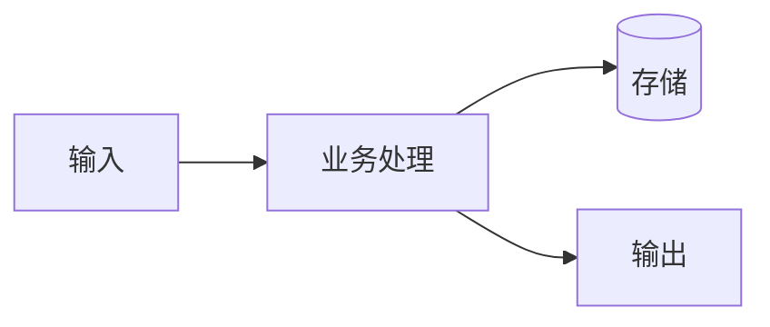

# 数据流：{流程名称}

> 状态：draft / locked  
> 关联需求：`docs/requirements/REQ-{id}.md`  
> Owner：{Architect}  
> 日期：YYYY-MM-DD

## 1. 目标

{该数据流描述什么业务过程？}

## 2. 数据流图

## 3. 数据清单

| 数据 | 分类 | 来源 | 去向 | 是否敏感 | 保留期限 |
|:---|:---|:---|:---|:---|:---|
| {字段/对象} | {业务/审计/敏感} | {来源} | {去向} | 是/否 | {期限} |

## 4. 安全要求

| 环节 | 要求 | 验证方式 |
|:---|:---|:---|
| 传输 | TLS/mTLS | {验证} |
| 存储 | 加密/脱敏 | {验证} |
| 日志 | 脱敏 | {验证} |

## 5. 异常路径

| 异常 | 行为 | 补偿 | 告警 |
|:---|:---|:---|:---|
| {异常} | {行为} | {补偿} | {告警} |

