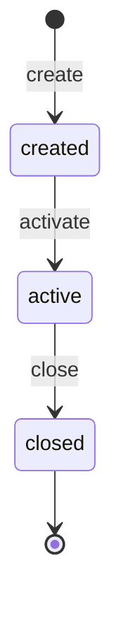

# 状态机：{实体名称}

> 状态：draft / reviewed / locked  
> 版本：v0.1.0  
> Owner：{Architect}  
> 关联需求：`docs/requirements/REQ-{id}.md`  
> 日期：YYYY-MM-DD

## 1. 状态图

## 2. 状态定义

| 状态 | 含义 | 进入条件 | 退出条件 | 停留时限 | 自动行为 |
|:---|:---|:---|:---|:---|:---|
| created | {含义} | {条件} | {条件} | {时限} | {行为} |

## 3. 转换事件

| 当前状态 | 事件 | 下一状态 | 校验条件 | 副作用 | 权限 | 并发控制 |
|:---|:---|:---|:---|:---|:---|:---|
| created | entity.activate | active | {条件} | {副作用} | {权限} | {锁策略} |

## 4. 非法转换处理

| 场景 | 响应 | 日志 | 告警 |
|:---|:---|:---|:---|
| 未定义转换 | 拒绝 / 忽略 / 告警 | {字段} | 是/否 |

## 5. 并发控制

| 场景 | 机制 | 超时 | 重试 |
|:---|:---|:---|:---|
| {场景} | 乐观锁/悲观锁/分布式锁 | {超时} | {策略} |

## 6. 超时和补偿

| 状态 | 超时 | 自动事件 | 补偿动作 |
|:---|:---|:---|:---|
| {状态} | {时长} | {事件} | {动作} |

## 7. 审计日志

| 字段 | 是否必填 | 说明 |
|:---|:---|:---|
| entity_id | 是 | 实体 ID |
| old_state | 是 | 旧状态 |
| new_state | 是 | 新状态 |
| event | 是 | 事件 |
| actor | 是 | 操作人 |
| request_id | 是 | 请求 ID |

## 8. 测试矩阵

| 用例 | 当前状态 | 事件 | 条件 | 预期 |
|:---|:---|:---|:---|:---|
| ST-001 | created | entity.activate | 合法 | active |

## 9. 锁定记录

| 日期 | 操作 | 操作人 | 说明 |
|:---|:---|:---|:---|
| | locked | | |

