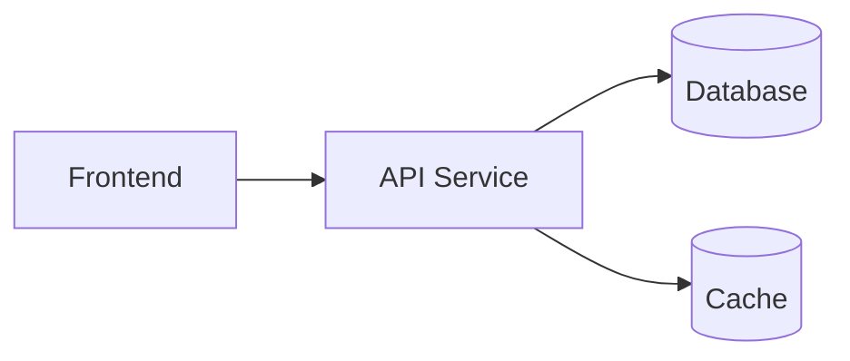

# 架构文档：{项目名称}

> 状态：draft / reviewed / locked
> （定稿时翻 locked——PTR-PLAN-01 只登记 locked 的架构文档；机器登记只认 locked，reviewed 仅人审中间态）  
> 版本：v0.1.0  
> Architect：{Architect}  
> 日期：YYYY-MM-DD  
> 关联需求：`docs/requirements/REQ-{id}.md`

> 前置条件：关联需求必须已 `locked`。本文件描述预期架构和技术取舍，不用于复述脚手架现状。

## 1. 架构目标

| 目标 | 说明 | 验证方式 |
|:---|:---|:---|
| {目标} | {说明} | {验证方式} |

## 2. 系统上下文

```mermaid
flowchart LR
    user[用户] --> system[{系统}]
    system --> ext[外部系统]
```

## 3. 容器视图



## 4. 模块职责

| 模块 | 职责 | 输入 | 输出 | 排除范围 |
|:---|:---|:---|:---|:---|
| {模块} | {职责} | {输入} | {输出} | {不负责} |

## 5. 数据流

| 数据 | 路径 | 存储位置 | 安全要求 |
|:---|:---|:---|:---|
| {数据} | {路径} | {位置} | {要求} |

## 6. 状态机

| 实体 | 状态机文档 | 说明 |
|:---|:---|:---|
| {实体} | `docs/design/state/{entity}.md` | {说明} |

## 7. 数据模型

见 `docs/design/data-model/model.md`。

## 8. 接口契约

| 契约 | 文档 | 消费方 |
|:---|:---|:---|
| SYNC-001 | `docs/contracts/SYNC-001.md` | FE-001 |

## 9. 安全设计

| 层面 | 设计 | 验证方式 |
|:---|:---|:---|
| 认证 | {设计} | {验证} |
| 授权 | {设计} | {验证} |
| 审计 | {设计} | {验证} |

## 10. 性能基线

| 指标 | 目标 | 告警阈值 |
|:---|:---|:---|
| P99 延迟 | {目标} | {阈值} |
| 错误率 | {目标} | {阈值} |

## 11. 部署和回滚

| 环境 | 部署方式 | 晋升门禁 | 回滚方式 |
|:---|:---|:---|:---|
| staging | {方式} | {门禁} | {回滚} |
| production | {方式} | {门禁} | {回滚} |

## 12. 锁定记录

| 日期 | 操作 | 操作人 | 说明 |
|:---|:---|:---|:---|
| | locked | | |
