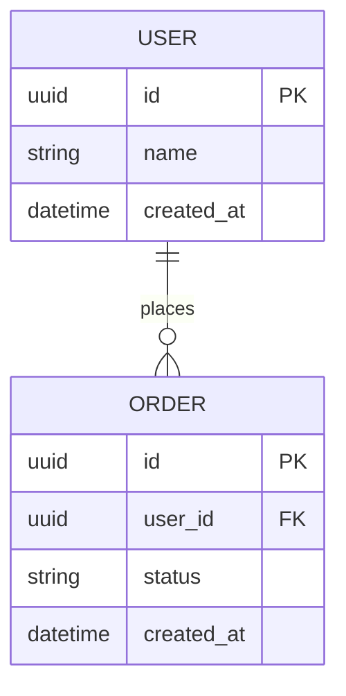

# 数据模型：{项目名称}

> 状态：draft / locked  
> 版本：v0.1.0  
> Owner：{Architect / DBA}  
> 日期：YYYY-MM-DD

## 1. ER 图

## 2. 实体说明

| 实体 | 说明 | 状态机 | Owner |
|:---|:---|:---|:---|
| {实体} | {说明} | `docs/design/state/{entity}.md` | {Owner} |

## 3. 字段定义

### {table_name}

| 字段 | 类型 | 必填 | 默认值 | 约束 | 说明 |
|:---|:---|:---|:---|:---|:---|
| id | uuid | 是 | generated | PK | 主键 |

## 4. 索引

| 表 | 索引 | 字段 | 类型 | 目的 |
|:---|:---|:---|:---|:---|
| {table} | {index} | {fields} | unique/btree/hash | {目的} |

## 5. 迁移策略

| 变更 | 是否兼容 | 迁移步骤 | 回滚策略 |
|:---|:---|:---|:---|
| {变更} | 是/否 | {步骤} | {策略} |

